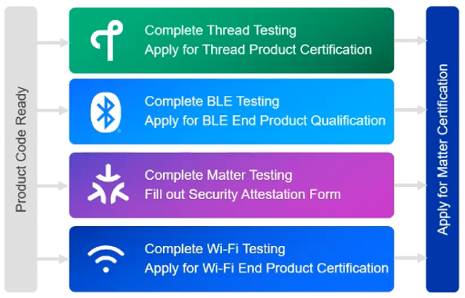
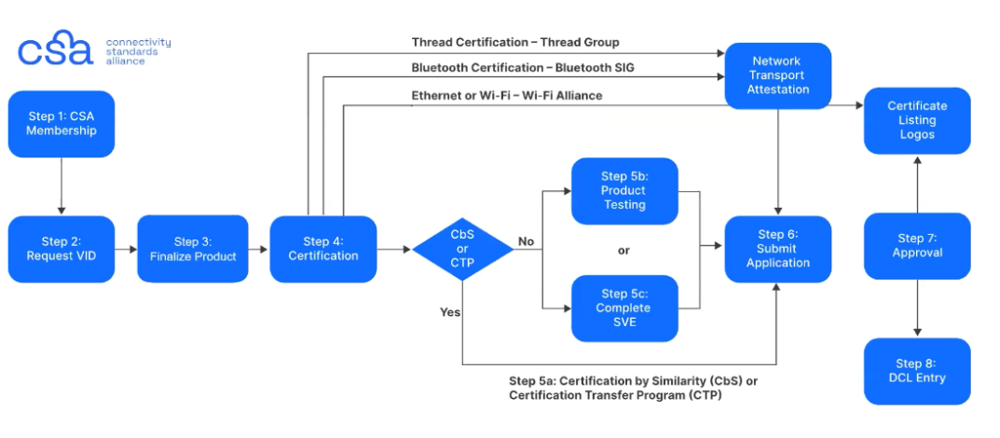

# Matter Certification

## Why Certify

Matter Certification is required for all Matter devices. Unlike other networking protocols, non-certified Matter devices are prevented from commissioning into Matter networks. Matter's secure design requires that every joining device proves they are Matter Certified. This is part of the commissioning process called Device Attestation. Refer to [**Device Attestation**](./CPMS_ATTESTATION.md) for more information on how the various Matter Certificates and Credentials are used in the Matter Commissioning Process.

## Matter Certification Paths

There are two different types of products that can apply for Matter Certification:

**Matter Hardware Certification**

This group of certification is for embedded devices and end products, like a Matter Light or Matter Switch, that include both the software and hardware together. Typically, this is the main type of Matter Certification.

**Matter Software Component Certification**

This group of certification is for Matter Software Components, like App-based devices or a Matter Controller, where the Matter Software Component runs on a CSA Supported Operating Environment.

## Matter Testing Options

**Authorized Test Lab (ATL)**: This is the most common testing option where you can choose a CSA approved test house to perform Matter Certification Testing ([https://csa-iot.org/certification/testing-providers/](https://csa-iot.org/certification/testing-providers/)).

**Specification Validation Event (SVE)**: The CSA will host certification events where Matter Products can be tested. If a Matter product successfully completes the full phase testing series, then this product will be deemed eligible for certification and will not require additional testing.

## Possible Matter Certification Paths

**Certification by Testing a Single Product**: This is full testing at an ATL or SVE and is intended for newly designed products.

**Product Family Certification**: This certification is intended to certify variants of the same product. This path requires the first "parent" product to be fully tested either at an ATL/SVE, and then the other "family" products are certified without need for testing.

**Certification by similarity (CbS)**: This certification is intended for a very similar product that has already been certified by either standard or product family certification. If a Matter product qualifies for CbS, you can get your new product certified without additional testing. The CSA certification team will need to determine if this is an applicable route.

**Certification Transfer Program (CTP)**: This certification is for re-labeling a product manufacturer by another member. This requires an Associate CSA membership level and to partner with an Alliance Participant or Promoter member.

## Matter Certification Flow

1. **Become a CSA Member**.

    There are different tiers of CSA memberships that offer your company varying levels of access and benefits. The minimum membership tier required to get certified is Adopter level. More information on various membership levels can be found on the CSA website, [Become a Member | The Future of IOT - CSA-IOT](https://csa-iot.org/become-member/).

2. **Request a Vendor ID From the Alliance Certification Team**.

    Once you are a member, you will need to request a Vendor ID. Once issued, the Vendor ID will be listed in the Manufacturer code database in the CSA which is updated monthly. For certification, you will also need to decide on a Product ID (PID) to make up your own unique 16-bit number to identify your distinct Matter products. You may have as many PIDs as you want, but each has to have its own unique certification ID. For development purposes, Silicon Labs provides 'test' VID and PID for our Sample Applications.

3. **Finalize Product, Select a Network Transport, and Develop Your Product**.

    You need to determine what Network Transport Layers you will be using. Typically this is a choice between Wi-Fi and OpenThread. In this stage, it is a good idea to pre-test your products before sending out for certification testing.

4. **Obtain Transport Layer Certification from the Relevant Standards Organization**.

     You are required to have proof that your device passes all relevant Networking Protocol Certifications before officially applying for Matter Certification. The CSA will accept certification by inheritance if it is applicable to your device.

     1. OpenThread Certification (Thread 1.3.0 or later): OpenThread certification is done through the Thread Group ([https://www.threadgroup.org/thread-group](https://www.threadgroup.org/thread-group)). Certification by inheritance is available for certain Silicon Labs SoC devices if using the Certified Thread Component Libraries ([https://community.silabs.com/s/article/Thread-Certification-Overview?language=en_US](https://community.silabs.com/s/article/Thread-Certification-Overview?language=en_US)). If the Matter Product is using Host/RCP architecture, it will need to go through OpenThread Certification on its own.

     2. BLE Certification (LE v4.0 or Later): BLE Certification is done through Bluetooth SIG ([https://www.bluetooth.com/develop-with-bluetooth/join/](https://www.bluetooth.com/develop-with-bluetooth/join/)). Certification by inheritance can be available in certain cases if the design and functionality is unaltered from the certified QDID. If you are able to inherit our End Product / Subsystem results, you can skip Bluetooth testing.

     3. Wi-Fi Certification processes (Wi-Fi 4 /802.11n or later). Wi-Fi certification is done through the Wi-Fi Alliance ([https://www.wi-fi.org/membership](https://www.wi-fi.org/membership)).

     4. Ethernet Transport Protocol: This certification can be received by showing evidence of successfully passing self-defined / self-testing of IEEE PMA.

5. **Test your Product**.

    As mentioned above, there are a few certification paths to take:

     1. **CTP / CbS Program**. You are not required to do additional testing and can move forward to step 6.

     2. **Select a CSA Authorized Test Provider for Matter testing and submit your product for testing**. After testing is completed, the test provider will issue a final test report to you and the CSA.

     3. **Complete SVE Testing**

6. **Submit Certification Application via the Certification Web Tool**.

    You need to create a Certification Tool Account ([https://csa-iot.org/certification/tools/certification-tool/](https://csa-iot.org/certification/tools/certification-tool/)) to submit your Matter Certification Application.

    In this application, you will need to determine the Matter Certification Device type and specify if the Matter product is a Software Component or Hardware Solution. Specifically, you will need to select all applicable Matter Device Types that your Matter product implements. More information on Matter Device Types can be found in the Matter Device Library Specification: ([https://csa-iot.org/developer-resource/specifications-download-request/](https://csa-iot.org/developer-resource/specifications-download-request/)). You will also need to provide the PID/VID of the Matter product to be Certified. You will need to submit the following documents:

     1. PICS: Protocol Implementation Conformance Statement document used in product certification. This can be generated by the CSA PICS Tool, which can be found at [PICS Tool | Connectivity Standards Alliance - CSA-IOT](https://csa-iot.org/certification/tools/pics-tool/).

     2. Declaration of Conformity

     3. Network Transport Attestation (CSA Attestation of Network Transport Protocol Conformance / Certification Form): Proof of Certification for any underlying platforms / protocols used in your Matter Application, i.e. OpenThread Certification, BLE Certification, and/or Wi-Fi Certification. This is detailed in Step 4 above.

     4. CSA Security Attestation

7. **Application review by the CSA**.

    The CSA will go through paperwork and ensure that all data is included and properly completed and compliant with the Matter Certification Process. Upon Application Approval, you will receive the following documents:

     1. Certificate of Compliance

     2. Public listing of certified products on the CSA website

     3. Matter Certified Logos are now authorized to be used with your certified Matter product

     4. Certification Declaration (CD) Blob File

8. **Certified Product Record Added to the Distributed Compliance Ledger**.

    More information on the DCL can be found in the next section, [**Distributed Compliance Ledger**](./DCL.md).

## CSA Memberships

The minimum membership level required for Matter Certification is the Adopter level. For more information on CSA Memberships, see [https://csa-iot.org/become-member/](https://csa-iot.org/become-member/).
