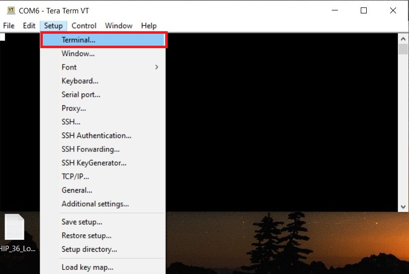
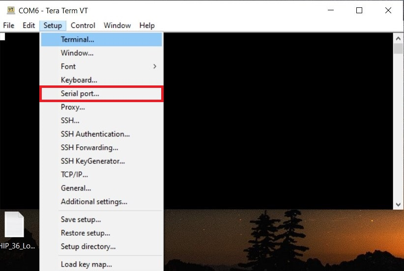
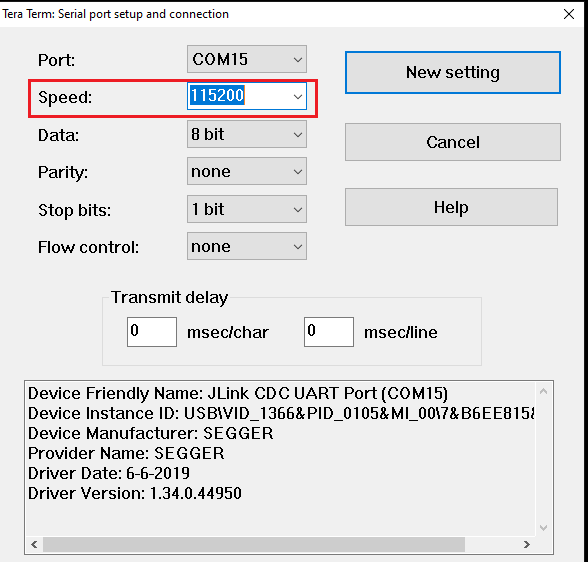
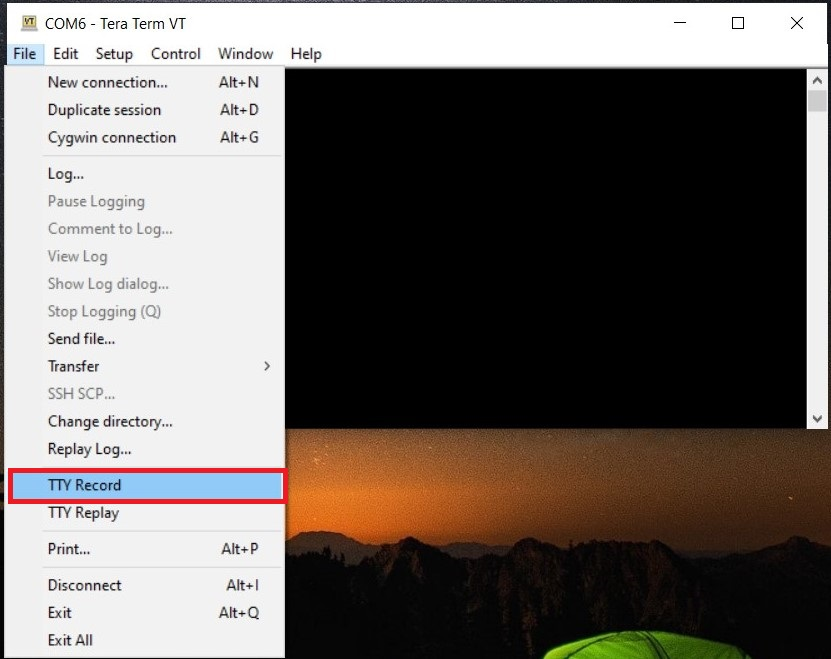
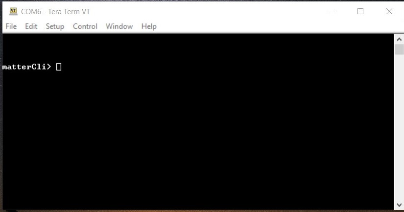
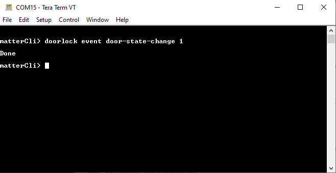

# Serial Port Communication on Silicon Labs Platform
  The matter-shell exposes the configuration and the management APIs via matter command line interface (matter CLI). This interface can be used to change the state of the device.

## Hardware Requirement
- To run matter shell on Silicon Labs Platform, refer [Hardware Requirements](../general/HARDWARE_REQUIREMENTS.md)

## Software Requirement
- To run matter shell on Silicon Labs Platform, refer [Software Requirments](../general/SOFTWARE_REQUIREMENTS.md)

## Execution of Matter Shell on Silicon Labs Platform

1. [Download and Install Tera Term](https://osdn.net/projects/ttssh2/releases/) in order to run matter shell.
   
2. In matter directory build matter shell application using build flag **chip_build_libshell=true** to enable matter shell
```
For WF200:- 
./scripts/examples/gn_silabs_example.sh examples/lock-app/silabs/ out/wf200_lock BRD41xxx chip_build_libshell=true --wifi wf200

For RS9116:-
./scripts/examples/gn_silabs_example.sh examples/lock-app/silabs/ out/rs911x_lock BRD41xxx disable_lcd=true use_external_flash=false chip_build_libshell=true chip_enable_ble_rs911x=true --wifi rs9116
```

3. Connect Matter Device to the machine.

4. Flash the Builded binary to the board by following, [Flashing the Silabs Device](../general/FLASH_SILABS_DEVICE.md) document.

5. After successful flashing commission the device , refer [Commission Matter Platform](../wifi/RUN_DEMO.md#demo-execution---commissioning-a-wi-fi-device-using-chip-tool-for-linux)

6. Open Tera Term and under New Connection, under Serial Port, select JLink port and click **OK**.

    

7. Click on Setup from Menu bar and change the value to 115200 under Speed category, then click on New setting.

    

8. Inside **Terminal** Set the below values and click **OK**.
  - Terminal Size : 80 * 24
  - New-Line
    - Receive : CR+LF
    - Transmit : CR+LF
    
    

9. Click on File from Menu bar again, select **Serial Port** option.
    
    

10. Increase the speed to **115200** and click on **New setting**.
    
    

11. Click on File from Menu bar, select TTY Record. Create any empty file with extension " .tty " and click on save.
    
    

12. After creating tty file just click on **Enter** button from Keyboard then it will show you **matterCli** terminal.
    
    

13. Send any command through **matterCli** terminal, from the below list of commands:

    1. doorlock event door-state-change "DoorState"
       - Door State List
          - DoorOpen = 0
          - DoorClosed = 1
          - DoorJammed = 2
          - DoorForcedOpen = 3
          - DoorUnspecifiedError = 4
          - DoorAjar = 5
    2. doorlock event lock-alarm "AlarmCode"
       - Alarm Code List
          - LockJammed = 0
          - LockFactoryReset = 1
          - LockRadioPowerCycle = 3
          - WrongCodeEntryLimit = 4
          - FrontEsceutcheonRemoved = 5
          - DoorForcedOpen = 6
          - DoorAjar = 7
          - ForcedUser = 8
    3. onboardingcodes ble, command will show QR Code.

For Example:-
      


14. After changing DoorState and AlarmCode in **matterCli**, run below commands using chip-tool in raspberry pi to verify the event.
  - To Read Door State
  
    ./chip-tool doorlock read-event door-state-change "node_id" "endpoint"
  
  - To Read Alarm Code
  
    ./chip-tool doorlock read-event door-lock-alarm "node_id" "endpoint"

  **Note**: Type **help** in matterCli terminal for more information about supported features.