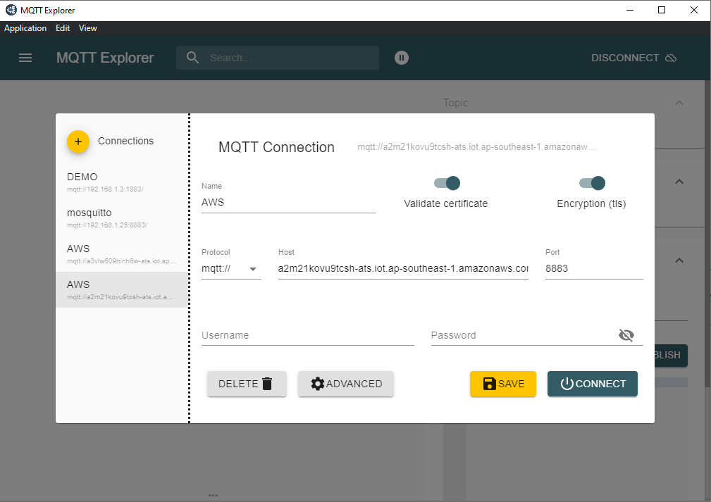

# Set Up MQTT Explorer
    Download and install the MQTT Explorer from https://mqtt-explorer.com/
    Setting up MQTT Explorer for testing.
 
 
## Connecting to MQTT Server
### Connecting to AWS 
   - Host : Your Host name (examples: a2m21kovu9tcsh-ats.iot.ap-southeast-1.amazonaws.com)
   - Port : 8883
   - Make sure you enable `Validate Certificate and Encryption`
   - Click on the `Advanced Settings` 
  
 

 - Add application specific topics as shown below
       - For Lighting app, topic to be added (light/*)
       - For onoff plug app, topic to be added (light/*)
       - For Lock app, topic to be added (lock/*)
  - MQTT Client ID depends on the certificate set that you will use.
  - Add the Certificate, following step 7 in [AWS installation](./AWS_CONFIGURATION_REGISTRATION.md)

 

  - Once the above steps are done, try connecting to AWS.
 
 
  
### Connecting to Mosquitto Connection
   - Host : Your Mosquitto ip address
   - Port : 8883
   - Make sure you enable Validate Certificate and Encryption
   - Click on the `Advanced Settings` 
 
 
 
  - Add application specific topics as shown below
       - For Lighting app, topic to be added (light/*)
       - For onoff plug app, topic to be added (light/*)
       - For Lock app, topic to be added (lock/*)
  - MQTT Client ID depends on the certificate set that you will use.
  - Add the Certificate, following step 5 in [openssl certificate create](./OPENSSL_CERTIFICATE_CREATION.md)

 