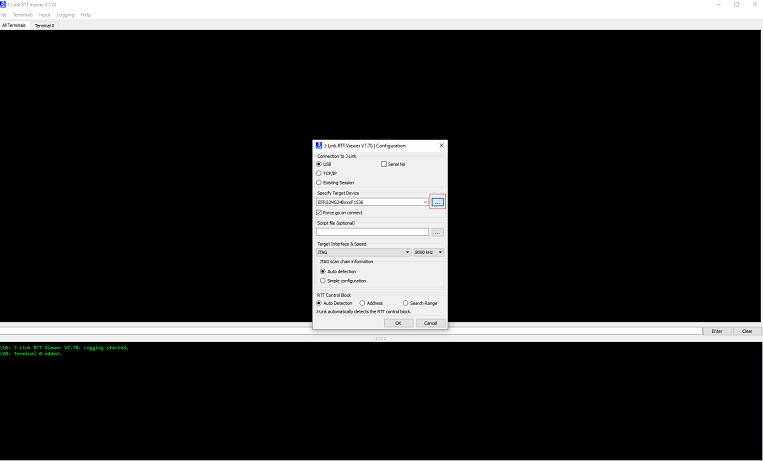
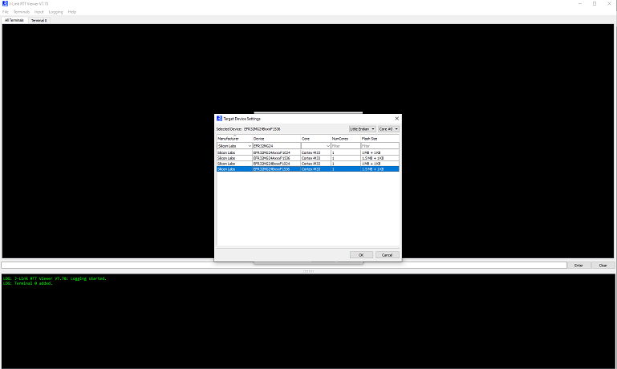

# Getting Started with EFR32 Host in NCP Mode
This page describes how to get started with developing an application on EFR32 host in Network Co-Processor (NCP) mode, where the application runs on the EFR32 host and the connectivity stack runs on the Wi-Fi chipset.

## Hardware Requirements
The following hardware devices are required for executing Matter over Wi-Fi for NCP Mode:
 - Refer, [Hardware Requirements](../general/HARDWARE_REQUIREMENTS.md#matter-over-wi-fi-accessory-device-requirements-for-ncp-mode)
 - Additional hardwares required for NCP Boards:
    - Windows/Linux/MacOS computer with a USB port
    - USB cable for connecting WSTK Board to Computer
    - Raspberry Pi with a >32 GB SD Card
    - Access Point with Internet Access
    - Interconnect board (included in the Wi-Fi kits)
    - SPI Cable (included in the RS9116 kit)
    - Jumper Cables (included in the RS9116 kit)

## Software Requirements
Below are the software tools, packages and images required for executing Matter over Wi-Fi for NCP Mode:

### Software Tools Requirements
 - Simplicity Commander for flashing bootloader and binary on EFR32 Boards
 - Tera Term for flashing firmware on EFR32 NCP Boards.
 - Putty for controlling EFR32 hardware using chip-tool controller
 - Ozone Debugger for logging and debugging (Optional)
 - JLink RTT for logging only (Optional)
To install above software tools , refer [Software Installation](../general/SOFTWARE_REQUIREMENTS.md)

## Connect the Boards to a Computer
1. Mount the EFx32 radio board on the EFx32 WSTK board.
        
   

2. Connect the NCP expansion board to the EXP header on the EFx32 WSTK board.
        
   

3. Toggle the upper switch on the NCP expansion board to EXP-UART.

## Updating NCP Boards Connectivity Firmware
- We recommend to upgrade the NCP combos connectivity firmware to the latest available version when
  - first received a EFx32 evaluation kit (EVK)
  - first received a radio board,
- Download the recommended version of firmware before you start with the update process from the [Matter Artifacts page](../general/ARTIFACTS.md)

### Steps to update the firmware on NCP boards using Tera Term
- SiWx917 NCP or RS9116 EVK connectivity firmware can be upgraded using tera-term or kermit.
1. Make sure that the switches on the expansion board are towards UART side.

   

2. Refer [Updating the Firmware](https://docs.silabs.com/rs9116/wiseconnect/2.0/update-evk-firmware) 

**Note**:Instructions are the same for both SiWx917 NCP and RS9116 EVK.

3. Once firmware flashing is done make sure to make switches back to Expansion mode, while using it with the host platform.

   

### Troubleshoot NCP Firmware Update Failure
If the firmware update fails, try the following:
  - Toggle the power switch towards AEM (Advanced Energy Monitoring) on the WSTK board.
  - Perform the following steps and try the firmware update again
     - Toggle the ISP switch towards ISP on the radio board.
     - Press the RESET button on the WSTK board.
     - Toggle the ISP switch away from ISP on the radio board.
     - In the Flash section in step 5 above, click Erase chip.
     - The flash will be erased.
     - Retry the firmware upgrade.

## Building Matter Application on EFR32 device
- To build Matter Application on EFR32 device, refer [Building Procedure](./SW_SETUP.md)

## Flashing Images/Binaries on EFR32 Platform using Ozone, or Simplicity Commander

1.  Plug the WSTK and EFR into the laptop.

2.  Based on the Application being built, make sure to flash proper [bootloader](../general/ARTIFACTS.md) internal or external binaries. 

3.  Launch Ozone, or Simplicity Commander Standalone - this
    will display a GUI. 
    
    If you are using Simplicity Commander, you can follow the general instructions for flashing a Silicon Labs device.
    [Flash a Silicon Labs Device](../general/FLASH_SILABS_DEVICE.md). If you are using Ozone, you can follow the instructions below.

## Directions for Flashing using Ozone

1.  In 'New Project Wizard':

    1. Click the three-dots on the 'Device' tab and select 'Manufacturer' as
       '`Silicon Labs`'
    2. Select 'Device' as `EFR32MG24Bxxx1536`
       depending on the device you are using.
    3. Click 'OK'
    4. The 'Register set' tab will get filled automatically
    5. 'Peripherals' tab need not be changed as it is optional

2.  Click 'Next' - the window that is displayed will contain:

    - Serial Number: Read from device
    - Target Interface: JTAG
    - Speed: 4MHz
    - Host Interface: USB
    - There will be one product in the 'Emulators connected via USB' tab -
        select this and click 'Next'

3.  Click on the 'Silicon Labs device' detected, and then click 'Next'

4.  You will be asked to select the image/binary to be loaded: click the
    three-dots on that tab and navigate to '`out/rs911x_lighting/BRD41xxx`'
    through 'Browse', select the file named `chip-efr32-lighting-example.out`
    and click 'Next'. This is the image built in previous step.

    > Note that you may be using a different board like the
    > BRD4186C or BRD4187C, in which case your image will be in a directory
    > corresponding to that board identifier.

5.  Make sure the next screen has 'Initial PC' selected as 'ELF Entry Point' -
    click 'Finish'

    > Ignore Diagnostics warning about 'FreeRTOS' detected - click 'Continue'

6.  Select 'Download and Reset Program' in the dropdown next to the Power button
    on the top left of the page

    > The Silabs chip, EFR32MG24, will be erased and programmed

7.  Run the image by clicking the 'Play' button on the top left (or press the F5
    key)

    > The output of the EFR32 can be viewed on the console of the Ozone GUI

8. **[Optional]** This step is for when the device has already been flashed and
    is being used for testing/debug purposes:

    > If you are restarting the device and do not need to re-flash the EFR
    > firmware, then you can use these commands (JLinkExe & JLinRTTClient). The
    > following commands will provide you with a serial console of the EFR32

    ```shell
    $ console -e JLinkExe -device EFR32MG24Bxxx1536 -if JTAG -speed 4000 -autoconnect 1 &
    ```

    > (Put it in the background)

    ```shell
    $ sleep 3
    ```

    ```shell
    $ console -e JLinkRTTClient &
    ```

    > You may need to press <ENTER> in the JLinkExe console first

## Enabling JLink RTT Logs for EFR32 Boards
1. Open JLink RTT Viewer and click on three dots beside **Specify Target Device**

   

2. select Manufacturer as **Silicon Labs** and device section search `EFR32MG24BxxxF1536` or `EFR32MG12PxxxF1024` as per board connected to machine then click "ok" 

   

3. Select Target Interface as `JTAG` & Speed as `8000KHz`(Default) then click "ok"

4. Now the JLink-RTT is connected and will print the device logs

   

## Demo Execution - Commissioning a Wi-Fi Device using chip-tool for Linux

> Commissioning can be done using chip-tool running either on Linux or Raspberry
> Pi

1. Get the SSID and PSK of the Wi-Fi network (WPA2 - Security) you are connected
   to.
2. Run the following:

    ```shell
    $ cd $MATTER_WORKDIR/matter
    ```

    ### Commissioning Command:

    ```shell
    $ out/standalone/chip-tool pairing ble-wifi 1122 $SSID $PSK 20202021 3840
    ```

    > The node ID used here is 1122. This will be used in future commands.
    > '\$SSID' is a placeholder for your Wi-Fi SSID and '\$PSK' is a placeholder
    > for the password of your Wi-Fi network.

3. To turn **on** the LED on the EFR32MG24:

    ```shell
    $ out/standalone/chip-tool onoff on 1122 1
    ```
4. To turn **off** the LED on the EFR32MG24:

    ```shell
    $ out/standalone/chip-tool onoff off 1122 1
    ```

If there are any failures, run the following command and then re-run the
chip-tool command:

```shell
$ rm -rf /tmp/chip_*
```

If you are having difficulty getting the chip-tool to commission the device
successfully, it may be because you have more than one network interface
available to the chip-tool. The device on which you are running the chip-tool
must be on the same Wi-Fi network as your RS9116 or WF200 and there cannot be
another network interface on the device that is running the chip-tool. For
instance, if you have an Ethernet connection as well as a Wi-Fi connection, you
need to unplug the Ethernet connection and try running the chip-tool as in step
#2 above.

As the device remembers the Access Point credentials given for commissioning, if
you want to run the demo multiple times, do a factory reset by pressing the BTN0
on EFR32MG24 for about 6-7 seconds. The LED0 will flash 3 times.

The commissioning command mentioned above does the following:

- chip-tool scans BLE and locates the Silicon Labs device that uses the
specified discriminator
- Sends the Wi-Fi SSID and Passkey
- The Silicon Labs device will join the Wi-Fi network and get an IP address.
It then starts providing mDNS records on IPv4 and IPv6
- chip-tool then locates the device over Wi-Fi and establishes operational
certificates
- Future communications (tests) will then happen over Wi-Fi
