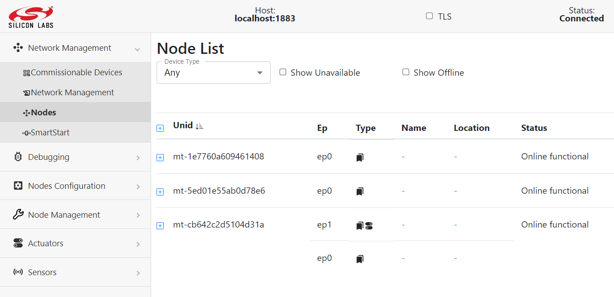
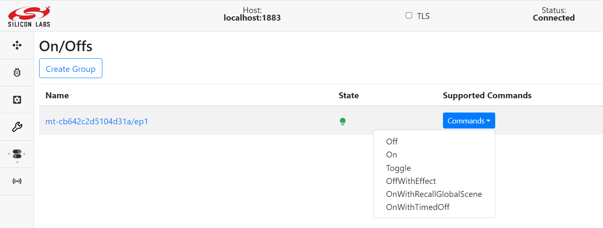

# Unify Matter PC User's Guide

The Unify Matter PC is a Unify Protocol Controller that enables interaction between
Unify network and a Matter fabric. For a more thorough description see the
[Unify Matter PC Overview](../../silabs_examples/unify-matter-pc/readme_overview.md).

This guide assumes that you have set up
Unify SDK. Read the
[Unify Host SDK's Getting Started Guide](https://siliconlabs.github.io/UnifySDK/doc/getting_started.html)
for information on how to set this up.

Once a Unify SDK is setup, the Matter PC can be started.

The following documentation assumes that you have built the Unify Matter PC
application by following the _[Build Guide](./readme_building.md)_ and have
transferred the _`unify-matter-pc`_ to your Raspberry Pi 4 (RPi4) running
the 64-bit version of Raspberry Pi OS Bullseye.


- [Unify Matter PC User's Guide](#unify-matter-pc-users-guide)
  - [Running the Matter PC](#running-the-matter-pc)
    - [Important Configuration Settings](#important-configuration-settings)
    - [Starting the Matter PC](#starting-the-matter-pc)
  - [Commissioning the UMPC to a Network](#commissioning-the-umpc-to-a-network)
    - [Using the chip-tool to Commission](#using-the-chip-tool-to-commission)
  - [Control an OnOff device](#control-an-onoff-device)
  - [Command Line Arguments](#command-line-arguments)

## Running the Matter PC

At start-up, the Matter PC needs to connect to the Matter Fabric as well as
the MQTT Broker. It is therefore critical that you have access to port 1883, the
default MQTT Broker's port, as well as a network setup that allows mDNS through.

A few important runtime configurations must be considered, along with some other
configuration options. A full list of command-line parameters is provided in the
[Command line arguments](#command-line-arguments) section.

### Important Configuration Settings

-   #### Network Interface

    Specify the network interface on which the Matter Fabric runs. In a regular
    RPi4 setup it would be `wlan0` for WiFi and `eth0` for ethernet. Specify
    this with the '`--mpc.interface`' argument, as such:

    ```bash
    uic-mpc --mpc.interface eth0
    ```

-   #### Key-Value store (KVS)

    The Matter PC uses a Key-Value store for persisting various run-time
    configurations. Make sure to have read/write access to the default path
    '`/var/lib/uic-mpc/chip_unify_mpc.kvs`' or provide the path to where writing this
    data is allowed. If this file is deleted before start-up, everything is
    reset and the MPC will not belong to any Matter Fabric until it has again
    been commissioned.

    ```bash
    uic-mpc --mpc.kvs ./mpc.kvs
    ```

-   ### Unify DataStore 

    The Matter PC uses a sql database for persisting attribute store contents.
    Make sure to have read/write access to the default path '`/var/lib/uic-mpc/mpc.db`'
    or provide a path to where writing this data is allowed. If this file is deleted 
    before start-up, all the information about previously discovered Matter device 
    during past run will be lost. However, if the KVS is not deleted MPC is still part 
    of a fabric and it will try and rediscover matter devices in the fabric.

    ```bash
    uic-mpc --mpc.datastore_file ./mpc.db
    ```
    
-   #### MQTT Host

    If you have followed the
    [Unify Host SDK's Getting Started Guide](https://siliconlabs.github.io/UnifySDK/doc/getting_started.html),
    your MQTT Broker should now be running on '`localhost`'. If you have decided
    to run the MQTT broker on a different host, you can tell the Unify Matter
    Protocol Controller to connect to a different host.

    ```bash
    uic-mpc --mqtt.host 10.0.0.42
    ```

-   #### Vendor and Product ID

    If you have access to the EAP and you want to use the Google Home App, you
    need to set a specific VID and PID for the Matter PC.

    ```bash
    uic-mpc --mpc.vendor fff1 --mpc.product 8001
    ```

### Starting the Matter PC

Once the configuration parameters are set it is time to start the UMPC
application. UMPC can be run in either standalone mode or service mode (if installed from debian package).
- Standalone
  ```bash
  uic-mpc --mpc.interface eth0 --mpc.kvs ./mpc.kvs --mqtt.host localhost --mqtt.port 1337
  ```
- Service Mode
  To run in service mode the configuration parameter are set in `/etc/uic/uic.cfg` as needed and then start `uic-mpc.service`.
  ```bash
  sudo systemctl start uic-mpc.service
  ```

## Commissioning the UMPC to a Network

To include the UMPC in the Matter network, it must first be commissioned. The
first time the UMPC starts it will automatically go into commissioning mode.
After 10 minutes the UMPC will exit commissioning mode. If the UMPC has not
been commissioned within this window, the application must be restarted to open
the commissioning window again or the window can be opened by writing
`commission` in the CLI when running the UMPC in stand-alone mode. The `commission`
commands can also be used for multi-fabric commissioning.

The Unify Matter PC uses the "On Network" commissioning method. For now,
there is no Bluetooth commissioning support.

The commissioning procedure requires use of a pairing code. This pairing code is
written to the console when running the Matter Protocol Controller. Look for something
similar to '`MT:-24J029Q00KA0648G00`', used as the pairing code in the following
example. This code can be used when commissioning with the CLI commissioning
tool `chip-tool`. 
```bash
[1659615301.367669][1967:1967] CHIP:SVR: SetupQRCode: [MT:-24J029Q00KA0648G00]
```

Another way to get the QR code is to look for an url in the console log similar
to and copy the link into a browser. Note that two codes a printed at startup
one for _Standard Comissioning flow_  and one for custom comissioning flow. 
Be sure to use the standard flow with Eco system devices. 

```bash
[1659615301.367723][1967:1967] CHIP:SVR: https://dhrishi.github.io/connectedhomeip/qrcode.html?data=MT%3A-24J029Q00KA0648G00
```

It should be noted that the commissioner **must** be on the same subnet/link-local as the
Raspberry Pi. Note that by default the UMPC binds to the eth0 interface. If
another interface is to be used, see the description of the command line
arguments for setting [Network Interface](#network-interface).

### Using the chip-tool to Commission

In the following procedure make sure to use the pairing code taken from the
console output, as described above. To commission the Matter PC with the
`chip-tool` and assign the UMPC with Node ID 1:

```bash
chip-tool pairing code 1 MT:-24J0AFN00KA0648G00
```

## Control an OnOff device

To send an OnOff cluster command to a Matter device you must first commission the Matter device to same fabric as UMPC and the device's ACL must be setup to permit UMPC to control it.
```bash
./chip-tool accesscontrol write acl '[{"fabricIndex": 1, "privilege": 5, "authMode": 2, "subjects": [<UMPC Node ID>,112233], "targets": null}]' <Matter Device Node ID> 0
```
Once commissioned to same Matter fabric, UMPC will discover it from the mDNS adversitisement and interviews its capability and publishes them into Unify network after allocating it a unique identifier within Unify network i.e. UNID.
Now, log-on to Unify Dev-GUI to view the newly discovered device under Nodes section of the GUI.

If the device supports OnOff cluster then the actuator link for the same should reflect under `Type` column for that device Node. Click on the same to open Actuator page and select the command to be sent to the Matter Device.


For more information on how to use `Dev-GUI` see the [Dev-GUI guide](https://siliconlabs.github.io/UnifySDK/applications/dev_ui/dev_gui/readme_user.html).

For more information on how to use the `chip-tool` see the
[chip-tool manual](../../docs/guides/chip_tool_guide.md) on the Matter website.

``Note: If the Matter device is thread device then Unify OTBR needs to be setup as decribed in ``[Unify Multiprotocol Setup Guide](https://siliconlabs.github.io/UnifySDK/doc/getting_started_multiprotocol_cpc.html).
  ``Run the below command to get the operationDataSet to be used in BLE-Thread commissioning:``
  ```bash
  ot-ctl dataset active -x
  ```

## Command Line Arguments

The Unify Matter PC provides the following command line arguments:

Using _--help_ displays the following text.

```text

Usage: uic-mpc [Options]

Options:
  --conf arg (=/etc/uic/uic.cfg)        Config file in YAML format. UIC_CONF
                                        env variable can be set to override the
                                        default config file path
  --help                                Print this help message and quit
  --dump-config                         Dump the current configuration in a
                                        YAML config file format that can be
                                        passed to the --conf option
  --version                             Print version information and quit
```

The following options can also be in a config file. Options and values passed on
the command line take precedence over the options and values in the config file.

```console
--log.level arg (=i)                  Log Level (d,i,w,e,c)
  --log.tag_level arg                   Tag-based log level
                                        Format: <tag>:<severity>,
                                        <tag>:<severity>, ...
  --mpc.datastore_file arg (=/var/lib/uic-mpc/mpc.db)
                                        MPC datastore database file
  --mpc.interface arg (=eth0)           Ethernet interface to use
  --mpc.kvs arg (=/var/lib/uic-mpc/chip_unify_mpc.kvs)
                                        Matter key value store path
  --mpc.strict_device_mapping arg (=0)  Only map devices we are certain
                                        conforms to specification
  --mpc.vendor arg (=65521)             16 bit Vendor ID
  --mpc.product arg (=32785)            16 bit Product ID
  --mpc.discriminator arg (=4094)       12 bit Discriminator ID
  --mpc.pin arg (=9127271)              24 bit pin
  --mpc.report_max arg (=3600)          ceiled max interval for reportables (in
                                        seconds)
  --mqtt.host arg (=localhost)          MQTT broker hostname or IP
  --mqtt.port arg (=1883)               MQTT broker port
  --mqtt.cafile arg                     Path to file containing the PEM-encoded
                                        CA certificate to connect to Mosquitto
                                        MQTT broker for TLS encryption
  --mqtt.certfile arg                   Path to file containing the PEM-encoded
                                        client certificate to connect to
                                        Mosquitto MQTT broker for TLS
                                        encryption
  --mqtt.keyfile arg                    Path to a file containing the
                                        PEM-encoded unencrypted private key for
                                        this client
  --mqtt.client_id arg (=unify-matter-pc)
                                        Set the MQTT client ID of the
                                        application.
```