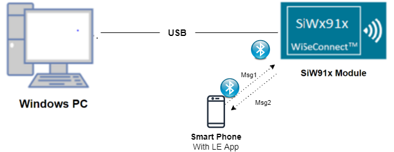
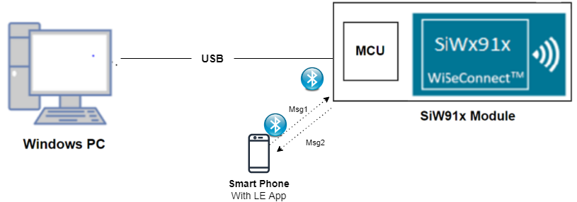
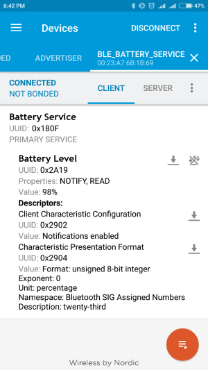

# Battery Service 

## 1. Purpose / Scope

This application demonstrates how to configure Battery Service GATT server with Battery service along with notification characteristic UUID.

## 2. Prerequisites / Setup Requirements

Before running the application, the user will need the following things to setup.

### 2.1 Hardware Requirements

- Windows PC with Host interface(UART/ SPI/ SDIO).
   - SiWx91x Wi-Fi Evaluation Kit. The SiWx91x supports multiple operating modes. See [Operating Modes]() for details.
  - **SoC Mode**: 
      - Silicon Labs [BRD4325A](https://www.silabs.com/)
  - **NCP Mode**:
      - Silicon Labs [(BRD4180A, BRD4280B)](https://www.silabs.com/);
      - Host MCU Eval Kit. This example has been tested with:
        - Silicon Labs [WSTK + EFR32MG21](https://www.silabs.com/development-tools/wireless/efr32xg21-bluetooth-starter-kit)
        - Silicon Labs [WSTK + EFM32GG11](https://www.silabs.com/development-tools/mcu/32-bit/efm32gg11-starter-kit)
        - [STM32F411 Nucleo](https://st.com/)  
- BLE peripheral device with GATT client in case of Silicon Labs module as GATT server or with GATT Battery server  in case of Silicon Labs as GATT client

#### SoC Mode : 

  
#### NCP Mode :  

	

   			
### 2.2 Software Requirements

- [WiSeConnect SDK](https://github.com/SiliconLabs/wiseconnect-wifi-bt-sdk/)
    
- Embedded Development Environment

   - For STM32, use licensed [Keil IDE](https://www.keil.com/demo/eval/arm.htm)

   - For Silicon Labs EFx32, use the latest version of [Simplicity Studio](https://www.silabs.com/developers/simplicity-studio)
   
- Download and install the Silicon Labs [EFR Connect App](https://www.silabs.com/developers/efr-connect-mobile-app) in the android smart phones for testing BLE applications. Users can also use their choice of BLE apps available in Android/iOS smart phones.

## 3. Application Build Environment

### 3.1 Host Interface

* By default, the application is configured to use the SPI bus for interfacing between Host platforms(STM32F411 Nucleo / EFR32MG21) and the SiWx91x EVK.
* This application is also configured to use the SDIO bus for interfacing between Host platforms(EFM32GG11) and the SiWx91x EVK.

### 3.2 Project Configuration

- **SoC Mode**
  - **Silicon Labs SiWx91x SoC**. Follow the [Getting Started with SiWx91x SoC](https://docs.silabs.com/) to setup the example to work with SiWx91x SoC and Simplicity Studio.
- **NCP Mode**
  - **Silicon Labs EFx32 Host**. Follow the [Getting Started with EFx32](https://docs.silabs.com/rs9116-wiseconnect/latest/wifibt-wc-getting-started-with-efx32/) to setup the example to work with EFx32 and Simplicity Studio.
  - **STM32F411 Host**. Follow the [Getting Started with STM32](https://docs.silabs.com/rs9116-wiseconnect/latest/wifibt-wc-getting-started-with-stm32/) to setup the example to work with STM32 and Keil.

### 3.3 Bare Metal/RTOS Support

This application supports bare metal and RTOS environment. By default, the application project files (Keil and Simplicity Studio) are provided with bare metal configuration. 

## 4. Application Configuration Parameters

The application can be configured to suit your requirements and development environment. Read through the following sections and make any changes needed.

**4.1** Open `rsi_ble_battery_service.c` file

**4.1.1** User must update the below parameters 

`RSI_BLE_BATTERY_SERVICE_UUID` refers to the attribute value of the newly created service.
         
         #define RSI_BLE_BATTERY_SERVICE_UUID                      0x180F

`RSI RSI_BLE_BATTERY_LEVEL_UUID` refers to the attribute type of the first attribute under this above primary service.

         #define RSI RSI_BLE_BATTERY_LEVEL_UUID                        0x2A19

`RSI_BLE_MAX_DATA_LEN` refers to the Maximum length of the attribute data.

         #define RSI_BLE_MAX_DATA_LEN                              1

`BLE_BATTERY_SERVICE` refers name of the Silicon Labs device to appear during scanning by remote devices.

         #define RSI_LOCAL_DEVICE_NAME                             "BATTERY_SERVICE"

`GATT_ROLE` refers the role of the Silicon Labs module to be selected.
If user configure `SERVER`, Silicon Labs module will act as GATT SERVER, means will add battery service profile.
If user configure `CLIENT`, Silicon Labs module will act as GATT CLIENT, means will connect to remote GATT server and get services.

         #define GATT_ROLE                                         "SERVER"

If user configure CLIENT role following macros should be configured.
`RSI_BLE_DEV_ADDR_TYPE` refers address type of the remote device to connect.

         #define RSI_BLE_DEV_ADDR_TYPE                             LE_PUBLIC_ADDRESS

Valid configurations are

         LE_RANDOM_ADDRESS
         LE_PUBLIC_ADDRESS

**Note:**
Depends on the remote device, address type will be changed.

`RSI_BLE_DEV_ADDR` refers address of the remote device to connect.
         #define RSI_BLE_DEV_ADDR                                  "00:1A:7D:DA:71:13"

`RSI_REMOTE_DEVICE_NAME` refers the name of remote device to which Silicon Labs device has to connect

         #define RSI_REMOTE_DEVICE_NAME                            "REDPINE_DEV"

**Note:**
Silicon Labs module can connect to remote device by referring either `RSI_BLE_DEV_ADDR` or `RSI_REMOTE_DEVICE_NAME` of the remote device.

Following Characteristic Presentation Format fields

         #define RSI_BLE_UINT8_FORMAT                              0x04
         #define RSI_BLE_EXPONENT                                  0x00
         #define RSI_BLE_PERCENTAGE_UNITS_UUID                     0x27AD
         #define RSI_BLE_NAME_SPACE                                0x01
         #define RSI_BLE_DESCRIPTION                               0x010B

**4.1.2** Following are the non configurable macros related to client characteristic configuration.

         #define RSI_BLE_NOTIFY_VALUE                              0x01 
         #define RSI_BLE_INDICATE_VALUE                            0x02

Following are the non-configurable macros in the application.

`RSI_BLE_CHAR_SERV_UUID` refers to the attribute type of the characteristics to be added in a service.

         #define RSI_BLE_CHAR_SERV_UUID                            0x2803

`RSI_BLE_CLIENT_CHAR_UUID` refers to the attribute type of the client characteristics descriptor to be added in a service.

         #define RSI_BLE_CLIENT_CHAR_UUID                          0x2902

`RSI_BLE_CHAR_PRESENTATION_FORMATE_UUID` refers to the attribute type of the characteristic presentation format descriptor to be added in a service.

         #define RSI_BLE_CHAR_PRESENTATION_FORMATE_UUID            0x2904

Following are the Macros for the GATT properties

         #define  RSI_BLE_ATT_PROPERTY_READ                         0x02
         #define  RSI_BLE_ATT_PROPERTY_WRITE                        0x08
         #define  RSI_BLE_ATT_PROPERTY_NOTIFY                       0x10

`BT_GLOBAL_BUFF_LEN` refers Number of bytes required by the application and the driver

         #define BT_GLOBAL_BUFF_LEN                                15000

2.	Open rsi_ble_config.h file and update/modify following macros,

         #define RSI_FEATURE_BIT_MAP                               (FEAT_ULP_GPIO_BASED_HANDSHAKE |FEATT_DEV_TO_HOST_ULP_GPIO_1)
         #define RSI_TCP_IP_BYPASS                                 RSI_DISABLE 
         #define RSI_TCP_IP_FEATURE_BIT_MAP                        TCP_IP_FEAT_DHCPV4_CLIENT 
         #define RSI_CUSTOM_FEATURE_BIT_MAP                        FEAT_CUSTOM_FEAT_EXTENTION_VALID
         #define RSI_EXT_CUSTOM_FEATURE_BIT_MAP                    (EXT_FEAT_LOW_POWER_MODE | EXT_FEAT_XTAL_CLK_ENABLE | EXT_FEAT_384K_MODE)

         #define RSI_BLE_PWR_INX                                   30 
         #define RSI_BLE_PWR_SAVE_OPTIONS                          BLE_DISABLE_DUTY_CYCLING 

**Note:**
 rsi_ble_config.h file is already set with desired configuration in respective example folders user need not change for each example.

## 5. Testing the Application

Follow the steps below for the successful execution of the application.

### 5.1 Loading the SiWx91x Firmware

Refer [Getting started with PC ](https://docs.silabs.com/rs9116/latest/wiseconnect-getting-started) to load the firmware into SiWx91x EVK. The firmware binary is located in `<SDK>/firmware/`

### 5.2 Building the Application on the Host Platform

Follow the procedure mentioned in the links provided under section **Project Configuration** to build and run the application. 

### 5.3 Common Steps

**5.3.1** Server role
1. After the program gets executed, Silicon Labs module will be in Advertising state.
2. Open a nRFConnect App and do the scan.
3. In the App, Silicon Labs module will appear with the name configured in the macro RSI_BLE_APP_SIMPLE_CHAT (Ex: "BLE_BATTERY_SERVICE") or sometimes observed as Silicon Labs device as internal name "SimpleBLEPeripheral".
4. Initiate connection from the App.
5. After successful connection, nRFConnect displays the supported services of Silicon Labs module.
6. Select the attribute service which is added RSI_BLE_BATTERY_SERVICE_UUID
(Ex: 0x180F).
7. Enable Notify for the characteristic RSI_BLE_BATTERY_LEVEL_UUID
(Ex: 0x2A19). So that GATT server Notifies when value updated in that particular attribute.
8. Silicon Labs module send the Battery Service battery level data to the attribute RSI_BLE_BATTERY_LEVEL_UUID (Ex: 0x2A19) of the remote device and will Notifies the GATT client (remote device).
9. RSI_BLE_CHAR_PRESENTATION_FORMATE_UUID will describe the value by its fields as shown in fig.
10. Please refer the given below image for Notify operation from remote device GATT client.

**5.3.2** Client role

1. Advertise a LE device which supports Battery Service.
2. After the program gets executed, Silicon Labs module will connect to that remote device based on given BD address or name
3. After successful connection Silicon Labs module will read the services from the remote GATT server.
4. If remote device support notify property Silicon Labs module will enable notify, and ready to receive notifications from remote device.
5. Whenever GATT server changes value and notifies that Silicon Labs module will receive that value.

