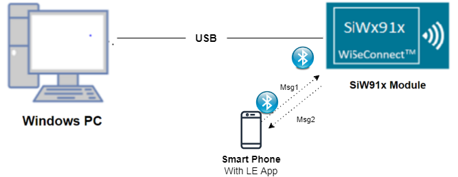
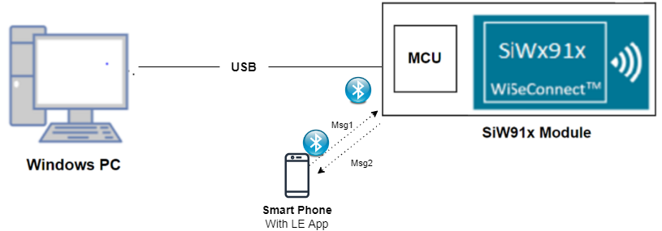
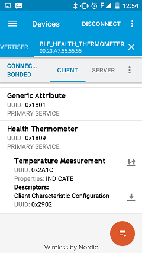
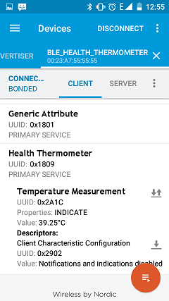

# Health Thhermometer

## 1. Purpose / Scope

This application demonstrates how to configure Health thermometer as GATT server in BLE peripheral mode and explains how to do indicate operation with GATT server from connected remote device using GATT client.

## 2. Prerequisites / Setup Requirements

Before running the application, the user will need the following things to setup.

### 2.1 Hardware Requirements

- Windows PC with Host interface(UART/ SPI/ SDIO).
   - SiWx91x Wi-Fi Evaluation Kit. The SiWx91x supports multiple operating modes. See [Operating Modes]() for details.
  - **SoC Mode**: 
      - Silicon Labs [BRD4325A](https://www.silabs.com/)
  - **NCP Mode**:
      - Silicon Labs [(BRD4180A, BRD4280B)](https://www.silabs.com/);
      - Host MCU Eval Kit. This example has been tested with:
        - Silicon Labs [WSTK + EFR32MG21](https://www.silabs.com/development-tools/wireless/efr32xg21-bluetooth-starter-kit)
        - Silicon Labs [WSTK + EFM32GG11](https://www.silabs.com/development-tools/mcu/32-bit/efm32gg11-starter-kit)
        - [STM32F411 Nucleo](https://st.com/)  
- BLE peripheral device

#### SoC Mode : 

  
#### NCP Mode :  

	

   			
### 2.2 Software Requirements

- [WiSeConnect SDK](https://github.com/SiliconLabs/wiseconnect-wifi-bt-sdk/)
    
- Embedded Development Environment

   - For STM32, use licensed [Keil IDE](https://www.keil.com/demo/eval/arm.htm)

   - For Silicon Labs EFx32, use the latest version of [Simplicity Studio](https://www.silabs.com/developers/simplicity-studio)
   
- Download and install the Silicon Labs [EFR Connect App](https://www.silabs.com/developers/efr-connect-mobile-app) in the android smart phones for testing BLE applications. Users can also use their choice of BLE apps available in Android/iOS smart phones.

## 3. Application Build Environment

### 3.1 Host Interface

* By default, the application is configured to use the SPI bus for interfacing between Host platforms(STM32F411 Nucleo / EFR32MG21) and the SiWx91x EVK.
* This application is also configured to use the SDIO bus for interfacing between Host platforms(EFM32GG11) and the SiWx91x EVK.

### 3.2 Project Configuration

- **SoC Mode**
  - **Silicon Labs SiWx91x SoC**. Follow the [Getting Started with SiWx91x SoC](https://docs.silabs.com/) to setup the example to work with SiWx91x SoC and Simplicity Studio.
- **NCP Mode**
  - **Silicon Labs EFx32 Host**. Follow the [Getting Started with EFx32](https://docs.silabs.com/rs9116-wiseconnect/latest/wifibt-wc-getting-started-with-efx32/) to setup the example to work with EFx32 and Simplicity Studio.
  - **STM32F411 Host**. Follow the [Getting Started with STM32](https://docs.silabs.com/rs9116-wiseconnect/latest/wifibt-wc-getting-started-with-stm32/) to setup the example to work with STM32 and Keil.

### 3.3 Bare Metal/RTOS Support

This application supports bare metal and RTOS environment. By default, the application project files (Keil and Simplicity Studio) are provided with bare metal configuration. 

## 4. Application Configuration Parameters

The application can be configured to suit your requirements and development environment. Read through the following sections and make any changes needed.

**4.1** Open `rsi_ble_health_thermometer.c` file

**4.1.1** User must update the below parameters 

`RSI_BLE_HEALTH_THERMOMETER_UUID` refers to the attribute value of the newly created service.

         #define RSI_BLE_HEALTH_THERMOMETER_UUID                  0x1809

`RSI_BLE_TEMPERATURE_MEASUREMENT_UUID` refers to the attribute type of the first attribute under this service (RSI_BLE_HEALTH_THERMOMETER_UUID).

         #define RSI_BLE_TEMPERATURE_MEASUREMENT_UUID             0x2A1C
`RSI_BLE_TEMPERATURE_TYPE_UUID` refers to the attribute type of the second attribute under this service (RSI_BLE_HEALTH_THERMOMETER_UUID).

         #define RSI_BLE_TEMPERATURE_TYPE_UUID                    0x2A1D 
`RSI_BLE_INTERMEDIATE_TEMPERATURE_UUID` refers to the attribute type of the second attribute under this service (RSI_BLE_HEALTH_THERMOMETER_UUID).

         #define RSI_BLE_INTERMEDIATE_TEMPERATURE_UUID            0x2A1E

`RSI_BLE_MAX_DATA_LEN` refers to the Maximum length of the attribute data.

         #define RSI_BLE_MAX_DATA_LEN                             20

`BLE_HEALTH_THERMOMETER` refers name of the Silicon Labs device to appear during scanning by remote devices.
 
         #define RSI_BLE_APP_SIMPLE_CHAT                          "BLE_THERMOMETER"

**4.1.2**Following are the non-configurable macros in the application.

`RSI_BLE_CHAR_SERV_UUID` refers to the attribute type of the characteristics to be added in a service.

         #define RSI_BLE_CHAR_SERV_UUID                           0x2803
`RSI_BLE_CLIENT_CHAR_UUID` refers to the attribute type of the client characteristics descriptor to be added in a service.

         #define RSI_BLE_CLIENT_CHAR_UUID                         0x2902

Following are the GATT properties
         #define RSI_BLE_ATT_PROPERTY_READ                        0x02
         #define RSI_BLE_ATT_PROPERTY_WRITE                       0x08
         #define RSI_BLE_ATT_PROPERTY_NOTIFY                      0x10
         #define RSI_BLE_ATT_PROPERTY_INDICATE                    0x20

`BT_GLOBAL_BUFF_LEN` refers Number of bytes required by the application and the driver
         #define BT_GLOBAL_BUFF_LEN                                15000

**4.2** Open `rsi_ble_config.c` file and update/modify following macros

        #define RSI_FEATURE_BIT_MAP                              (FEAT_ULP_GPIO_BASED_HANDSHAKE |FEATT_DEV_TO_HOST_ULP_GPIO_1)
         #define RSI_TCP_IP_BYPASS                                RSI_DISABLE 
         #define RSI_TCP_IP_FEATURE_BIT_MAP                       TCP_IP_FEAT_DHCPV4_CLIENT 
         #define RSI_CUSTOM_FEATURE_BIT_MAP                       FEAT_CUSTOM_FEAT_EXTENTION_VALID
         #define RSI_EXT_CUSTOM_FEATURE_BIT_MAP                   (EXT_FEAT_LOW_POWER_MODE | EXT_FEAT_XTAL_CLK_ENABLE | EXT_FEAT_384K_MODE)

         #define RSI_BLE_PWR_INX                                  30 
         #define RSI_BLE_PWR_SAVE_OPTIONS                         BLE_DISABLE_DUTY_CYCLING 

**Note:** `rsi_ble_config.h` file is already set with desired configuration in respective example folders user need not change for each example.

## 5. Testing the Application

Follow the steps below for the successful execution of the application.

### 5.1 Loading the SiWx91x Firmware

Refer [Getting started with PC ](https://docs.silabs.com/rs9116/latest/wiseconnect-getting-started) to load the firmware into SiWx91x EVK. The firmware binary is located in `<SDK>/firmware/`

### 5.2 Building the Application on the Host Platform

Follow the procedure mentioned in the links provided under section **Project Configuration** to build and run the application. 

### 5.3 Common Steps

1. After the program gets executed, Silicon Labs module will be in Advertising state.
2. Open a LE App in the Smartphone and do the scan.
3. In the App, Silicon Labs module device will appear with the name configured in the macro RSI_BLE_APP_SIMPLE_CHAT (Ex: "BLE_HEALTH_THERMOMETER") or sometimes observed as Silicon Labs device as internal name "SimpleBLEPeripheral".
4. Initiate connection from the App.
5. After successful connection, LE scanner displays the supported services of Silicon Labs module.
6. Select the attribute service which is added RSI_BLE_HEALTH_THERMOMETER_UUID (Ex: 0x1809).
7. Enable Indicate for the characteristic RSI_BLE_TEMPERATURE_MEASUREMENT_UUID (Ex: 0x2A1C). So that GATT server indicates when value updated in that particular attribute.
8. Silicon Labs module sends the health thermometer temperature measurement data to the attribute RSI_BLE_TEMPERATURE_MEASUREMENT_UUID (Ex: 0x2A1C) of the remote device and indicates the GATT client (remote device).
9. Please refer the given below images for indicate operation from remote device GATT client.

