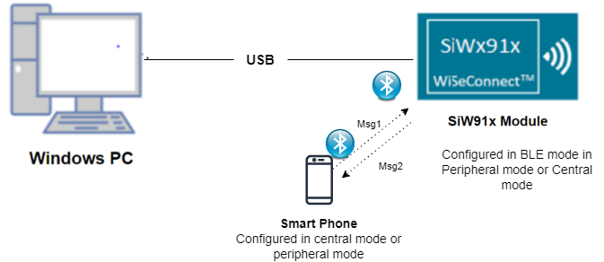
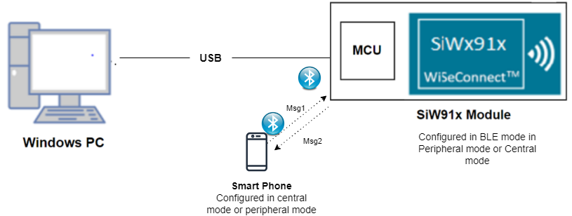

# Simple SMP

## 1. Purpose / Scope

This application demonstrates how to configure Silicon Labs device in Central mode , connect with remote slave device and how to enable SMP(Security Manager Protocol) pairing.

## 2. Prerequisites / Setup Requirements

Before running the application, the user will need the following things to setup.

### 2.1 Hardware Requirements

- Windows PC with Host interface(UART/ SPI/ SDIO).
   - SiWx91x Wi-Fi Evaluation Kit. The SiWx91x supports multiple operating modes. See [Operating Modes]() for details.
  - **SoC Mode**: 
      - Silicon Labs [BRD4325A](https://www.silabs.com/)
  - **NCP Mode**:
      - Silicon Labs [(BRD4180A, BRD4280B)](https://www.silabs.com/);
      - Host MCU Eval Kit. This example has been tested with:
        - Silicon Labs [WSTK + EFR32MG21](https://www.silabs.com/development-tools/wireless/efr32xg21-bluetooth-starter-kit)
        - Silicon Labs [WSTK + EFM32GG11](https://www.silabs.com/development-tools/mcu/32-bit/efm32gg11-starter-kit)
        - [STM32F411 Nucleo](https://st.com/)  
- BLE peripheral device

#### SoC Mode : 

  
#### NCP Mode :  

	

   			
### 2.2 Software Requirements

- [WiSeConnect SDK](https://github.com/SiliconLabs/wiseconnect-wifi-bt-sdk/)
    
- Embedded Development Environment

   - For STM32, use licensed [Keil IDE](https://www.keil.com/demo/eval/arm.htm)

   - For Silicon Labs EFx32, use the latest version of [Simplicity Studio](https://www.silabs.com/developers/simplicity-studio)
   
- Download and install the Silicon Labs [EFR Connect App](https://www.silabs.com/developers/efr-connect-mobile-app) in the android smart phones for testing BLE applications. Users can also use their choice of BLE apps available in Android/iOS smart phones.

## 3. Application Build Environment

### 3.1 Host Interface

* By default, the application is configured to use the SPI bus for interfacing between Host platforms(STM32F411 Nucleo / EFR32MG21) and the SiWx91x EVK.
* This application is also configured to use the SDIO bus for interfacing between Host platforms(EFM32GG11) and the SiWx91x EVK.

### 3.2 Project Configuration

- **SoC Mode**
  - **Silicon Labs SiWx91x SoC**. Follow the [Getting Started with SiWx91x SoC](https://docs.silabs.com/) to setup the example to work with SiWx91x SoC and Simplicity Studio.
- **NCP Mode**
  - **Silicon Labs EFx32 Host**. Follow the [Getting Started with EFx32](https://docs.silabs.com/rs9116-wiseconnect/latest/wifibt-wc-getting-started-with-efx32/) to setup the example to work with EFx32 and Simplicity Studio.
  - **STM32F411 Host**. Follow the [Getting Started with STM32](https://docs.silabs.com/rs9116-wiseconnect/latest/wifibt-wc-getting-started-with-stm32/) to setup the example to work with STM32 and Keil.
	
### 3.3 Bare Metal/RTOS Support

This application supports bare metal and RTOS environment. By default, the application project files (Keil and Simplicity Studio) are provided with bare metal configuration. 

## 4. Application Configuration Parameters

The application can be configured to suit your requirements and development environment. Read through the following sections and make any changes needed.

**4.1** Open `rsi_ble_smp.c` file

**4.1.1** User must update the below parameters 

         #define MASTER                                            1
         #define SLAVE                                             0
         #define ROLE                                              SLAVE

`RSI_BLE_LOCAL_NAME` refers the name of the Silicon Labs device to appear during scanning by remote devices.

         #define RSI_BLE_DEVICE_NAME                              "BLE_SIMPLE_SMP"

`RSI_BLE_DEV_ADDR_TYPE` refers address type of the remote device to connect.

         #define RSI_BLE_DEV_ADDR_TYPE                             LE_PUBLIC_ADDRESS

**Note:** Depending on the remote device, address type will change.

Valid configurations are

         LE_RANDOM_ADDRESS
         LE_PUBLIC_ADDRESS
`RSI_BLE_DEV_ADDR` refers address of the remote device to connect.

         #define RSI_BLE_DEV_ADDR                                  "00:1A:7D:DA:71:13" 

`RSI_REMOTE_DEVICE_NAME` refers the name of remote device to which Silicon Labs device has to connect

         #define RSI_REMOTE_DEVICE_NAME                            "REDPINE_DEV"

**Note:** Silicon Labs module can connect to remote device by referring either `RSI_BLE_DEV_ADDR` or `RSI_REMOTE_DEVICE_NAME` of the remote device.

`RSI_BLE_SMP_IO_CAPABILITY` refers IO capability.

         #define RSI_BLE_SMP_IO_CAPABILITY                         0x03
`RSI_BLE_SMP_PASSKEY` refers address type of the remote device to connect.

         #define RSI_BLE_SMP_PASSKEY                               0

**4.1.2** Following are the non-configurable macros in the application.
         #define RSI_BLE_CONN_EVENT                                0x01
         #define RSI_BLE_DISCONN_EVENT                             0x02
         #define RSI_BLE_SMP_REQ_EVENT                             0x03
         #define RSI_BLE_SMP_RESP_EVENT                            0x04
         #define RSI_BLE_SMP_PASSKEY_EVENT                         0x05
         #define RSI_BLE_SMP_FAILED_EVENT                          0x06
         #define RSI_BLE_ENCRYPT_STARTED_EVENT                     0x07

`BT_GLOBAL_BUFF_LEN` refers Number of bytes required by the application and the driver

         #define BT_GLOBAL_BUFF_LEN                                15000

**4.2**	Open rsi_ble_config.h file and update/modify following macros,

         #define CONCURRENT_MODE                                   RSI_DISABLE
         #define RSI_FEATURE_BIT_MAP                               FEAT_SECURITY_OPEN
         #define RSI_TCP_IP_BYPASS                                 RSI_DISABLE
         #define RSI_TCP_IP_FEATURE_BIT_MAP                        TCP_IP_FEAT_DHCPV4_CLIENT 
         #define RSI_CUSTOM_FEATURE_BIT_MAP                        FEAT_CUSTOM_FEAT_EXTENTION_VALID
         #define RSI_EXT_CUSTOM_FEATURE_BIT_MAP                    EXT_FEAT_384K_MODE
         #define RSI_BAND                                          RSI_BAND_2P4GHZ

         #define RSI_BLE_PWR_INX                                   30
         #define RSI_BLE_PWR_SAVE_OPTIONS                          0

**Note:** rsi_ble_config.h file is already set with desired configuration in respective example folders user need not change for each example.

## 5. Testing the Application

Follow the steps below for the successful execution of the application.

### 5.1 Loading the SiWx91x Firmware

Refer [Getting started with PC ](https://docs.silabs.com/rs9116/latest/wiseconnect-getting-started) to load the firmware into SiWx91x EVK. The firmware binary is located in `<SDK>/firmware/`

### 5.2 Building the Application on the Host Platform

Follow the procedure mentioned in the links provided under section **Project Configuration** to build and run the application. 

### 5.3 Common Steps

Following the execution process in case of Silicon Labs device as master
1. If user select the MASTER role, After the program gets executed, Silicon Labs device will be trying to connect to remote BT device, advertise the third party device.
If user select the SLAVE role, After the program gets executed, Silicon Labs device will be advertising, then connect from remote device.
2. After successful connection, flow of commands is as below:
Master device will initiate SMP pairing
Slave device give SMP response.
Both devices will exchange SMP passkey as zero
3. If SMP succeed, host receives SMP encrypt enabled event. If not success, Device sends SMP failure event to host.
4. In encryption enabled event LocalEDIV, Local Rand, LocalLTK parameters will be indicated.
5. Again, after disconnection, if Master want to connect, master ask for LE LTK Request event to slave by giving LocalEDIV and LocalRand, and if same, this example give LocalLTK with positive reply using ltk request reply command.

**Note:**
We can also send negative reply but remote device may or may not initiate pairing again.
Currently, in encryption enabled event EDIV, RAND, LTK are of local device so that if master initiate connection he will ask for LTK request by giving slave's (in this example) EDIV and RAND.

