# AWS IoT Device Shadow

## Introduction

This application demonstrates how to securely connect a Silicon Labs Si91x Wi-Fi device to AWS IoT Core to send and receive data. 
To successfully use this application, developer should be familiar with the operation of [AWS IoT Core](https://docs.aws.amazon.com/iot/latest/developerguide/what-is-aws-iot.html) and the [AWS IoT Device Shadow Service](https://docs.aws.amazon.com/iot/latest/developerguide/iot-device-shadows.html).
If you are new to AWS IoT Core, we recommend running through the [AWS IoT Core Tutorial](https://docs.aws.amazon.com/iot/latest/developerguide/iot-tutorials.html) before proceeding.
In the following text, 'AWS IoT Core' is referred to as 'AWS' for brevity.

AWS refer to a 'Device Shadow' as a persistent, virtual representation of a device that can be accessed even if the physical device is offline.
The device state is captured in its 'shadow' and is represented as a JSON document.
The physical device can send commands using the MQTT protocol to get, update and delete the state of the shadow as well as receive notifications via MQTT about changes in the state pf the shadow.

The AWS IoT Device Shadow application publishes temperature and window open/close status on the topic `$aws/things/thingname/shadow/update`.
The room temperature and the window open/close status is available on the AWS cloud.

Additionally, the application subscribes to the shadow update topics:
```sh
  $aws/things/thingName/shadow/name/shadowName/update/accepted
  $aws/things/thingName/shadow/name/shadowName/update/rejected
  $aws/things/thingName/shadow/name/shadowName/update/delta
```

## Overview of AWS SDK

AWS IoT Core is a cloud platform that connects devices across AWS cloud services. AWS IoT provides an interface that allows devices to communicate securely and reliably in bi-directional ways to AWS touch-points, even when devices are offline.

The AWS IoT Device SDK allow applications to securely connect to the AWS IoT platform.


## Setting Up
To use this application, the following hardware, software and project setup is required.

### Hardware Requirements  
  - Windows PC.
  - Wi-Fi Access point with a connection to the internet
  - SiWx91x Wi-Fi Evaluation Kit
  - **SoC Mode**: 
      - Silicon Labs [BRD4325A](https://silabs.com/)
  - **NCP Mode**:
      - Silicon Labs [(BRD4180A, BRD4280B)](https://www.silabs.com/) .
      - Host MCU Eval Kit. This example has been tested with:
        - Silicon Labs [WSTK + EFR32MG21](https://www.silabs.com/development-tools/wireless/efr32xg21-bluetooth-starter-kit)
  
#### SoC Mode : 

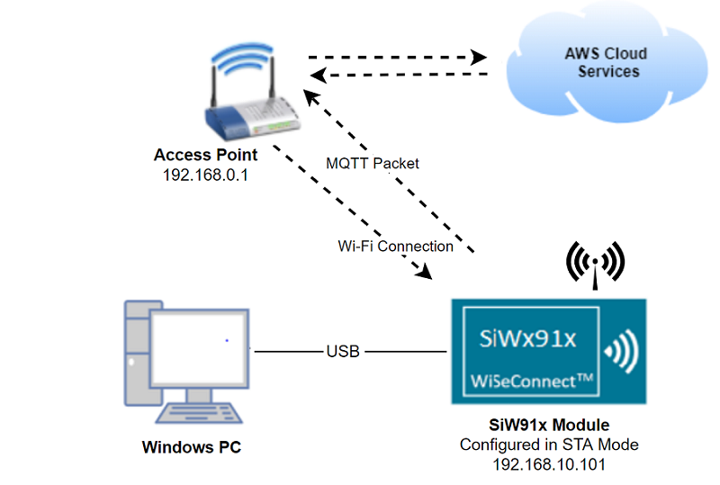
  
#### NCP Mode :  

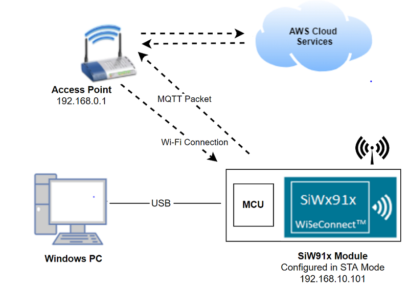

### Project Setup
- **SoC Mode**
  - **Silicon Labs SiWx91x SoC**. Follow the [Getting Started with SiWx91x SoC](https://docs.silabs.com/) to setup the example to work with SiWx91x SoC and Simplicity Studio.
- **NCP Mode**
  - **Silicon Labs EFx32 Host**. Follow the [Getting Started with EFx32](https://docs.silabs.com/rs9116-wiseconnect/latest/wifibt-wc-getting-started-with-efx32/) to setup the example to work with EFx32 and Simplicity Studio.

   
### Cloud Setup
This example requires SiWx91x Wi-Fi device to be provisioned on AWS. The application needs the device certificate and the private key. 
For brief provisioning instructions, see [AWS IoT Setup](#create-an-aws-thing) section below.


## Configuring the Application
The application can be configured to suit user requirements and development environment.
Read through the following sections and make any changes needed. 

### NCP Mode - Host Interface 

* By default, the application is configured to use the SPI bus for interfacing between Host platforms(EFR32MG21) and the SiWx91x EVK.

### Bare Metal/RTOS Support
To select a bare metal configuration, see [Selecting bare metal](#selecting-bare-metal) section below .

### Wi-Fi & Cloud Configuration
Configure the following parameters in **rsi_aws_device_shadow.c** to enable Silicon Labs Wi-Fi device to connect Wi-Fi network.

```c
#define SSID           "SILABS_AP"      // Wi-Fi Network Name
#define PSK            "1234567890"     // Wi-Fi Password
#define SECURITY_TYPE  RSI_WPA2         // Wi-Fi Security Type: RSI_OPEN / RSI_WPA / RSI_WPA2
```
    
Configure `AWS_IOT_MQTT_HOST` in the file `aws_iot_config.h` to match the endpoint for device in AWS.

```c
#define AWS_IOT_MQTT_HOST "xxxxxxxxxxxxx-ats.iot.us-east-2.amazonaws.com"
```
AWS_IOT_MQTT_HOST parameter can be found as follows:

 
 

### Power Save Configuration
Configure below parameter in `rsi_wlan_config.h` to enable power save mode

```c
#define ENABLE_POWER_SAVE 1
```

### Setting up Security Certificates
To authenticate and securely connect with AWS, Wi-Fi device requires a unique x.509 security certificate and private key, as well as a CA certificate which is used to verify the AWS server. Security credentials need to be converted into a C-array rather than [PEM format](https://en.wikipedia.org/wiki/Privacy-Enhanced_Mail) provided by AWS; they also need to be added to the project. 

The WiSeConnect SDK provides a conversion script (written in Python 3) to make the conversion straightforward. The script is provided in the SDK 'resources' directory and is called `certificate_to_array.py`.

To convert the device certificate and private key to C arrays, open a system command prompt and use the script as indicated in the following examples.

```sh
$> python3 certificate_to_array.py <input filename> <output arrayname>

For example:
$> python3 certificate_to_array.py d8f3a44d3f.cert.pem    aws_client_certificate
$> python3 certificate_to_array.py d8f3a44d3f.private.key aws_client_private_certificate
```

After running the script on the certificate and private key, two new files are created.

```sh
aws_client_certificate.pem.crt.h
aws_client_private_key.pem.key.h
```

Before proceeding, copy both of the new files to the WiSeConnect directory: `<SDK>/resources/certificates`  
Go ahead and overwrite any existing files with the same name in that directory, the originals are not needed.

The Root CA certificate used by  Wi-Fi device to verify the AWS server is already included in the WiSeConnect SDK; no additional setup is required.
For reference, Amazon uses [Starfield Technologies](https://www.starfieldtech.com/) to secure the AWS website, the WiSeConnect SDK includes the `Starfield CA Certificate`.

## Testing the Application
After making any custom configuration changes, and updating the device certificate and private key, build, download and run the application as described in the [EFx32 Getting Started](https://docs.silabs.com/rs9116-wiseconnect/latest/wifibt-wc-getting-started-with-efx32/)

### Loading the SiWx91x Firmware

Refer [Getting started with a PC](https://docs.silabs.com/rs9116/latest/wiseconnect-getting-started) to load the firmware into SiWx91x EVK. The firmware file is located in `<SDK>/firmware/`

## Creating the Project and building the Application
  
Refer [Getting started with EFX32](https://docs.silabs.com/rs9116-wiseconnect/latest/wifibt-wc-getting-started-with-efx32/), for setting up EFR & EFM host platforms

### Project Creation - SoC Mode : 

- Connect your board. The Si917 compatible SoC board is **BRD4325A**.
- Studio should detect your board. Your board will be shown here.

  

### Project Creation - NCP Mode : 

- Connect your board. The supported NCP boards are: **BRD4180A,BRD4280B**
- Studio should detect your board. Your board will be shown here.

  

### Selecting an example application and generate project - SoC Mode:

- Go to the 'EXAMPLE PROJECT & DEMOS' tab and select Wi-Fi - SoC AWS IoT Device Shadow application

  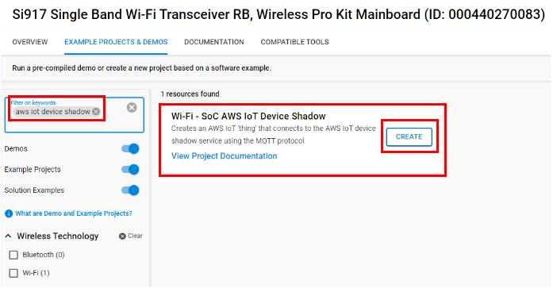
- Click 'Create'. The "New Project Wizard" window appears. Click 'Finish'

  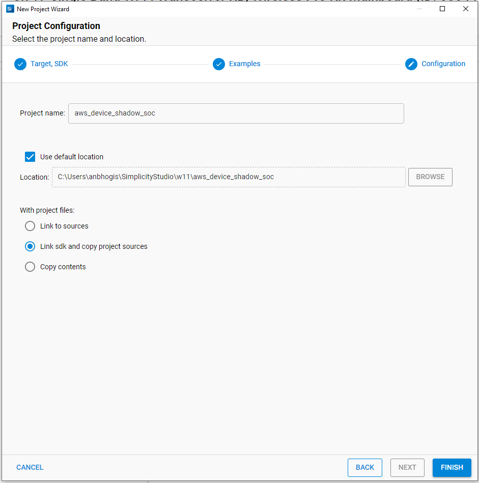

### Selecting an example application and generate project - NCP Mode:

- Go to the 'EXAMPLE PROJECT & DEMOS' tab and select Wi-Fi - NCP AWS IoT Device Shadow application

  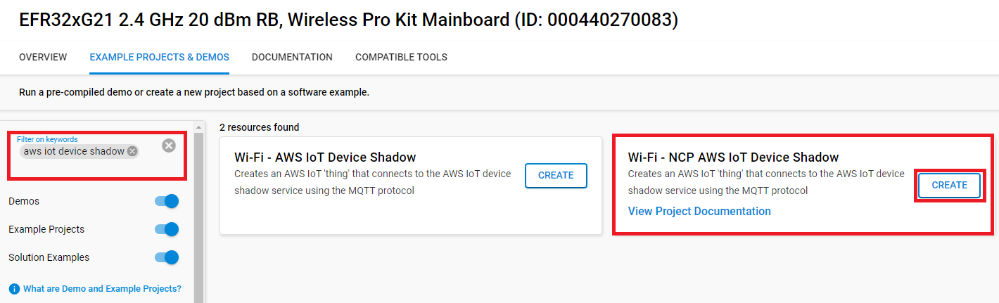
- Click 'Create'. The "New Project Wizard" window appears. Click 'Finish'

  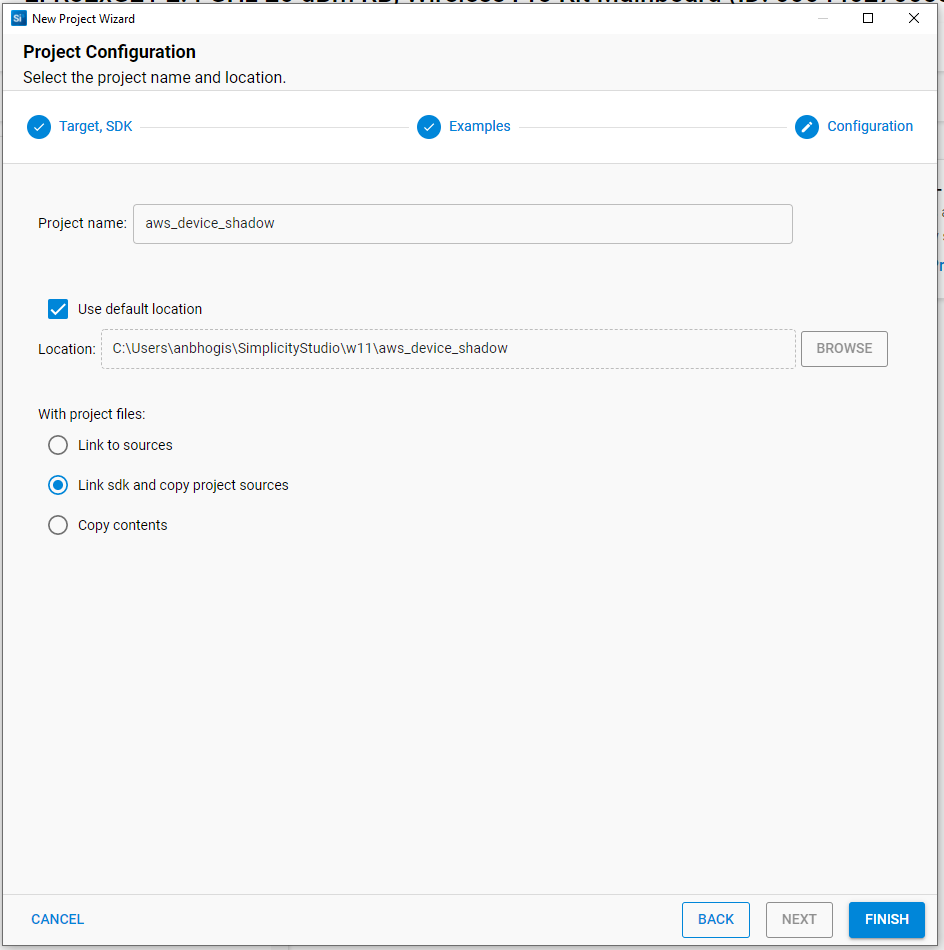

#### Build Project - SoC Mode

- Once the project is created, right click on project and go to properties → C/C++ Build → Settings → Build Steps
- Add post_build_script_SimplicityStudio.bat file path (SI917_COMBO_SDK.X.X.X.XX\utilities\isp_scripts_common_flash) in build steps settings as shown in below image.

  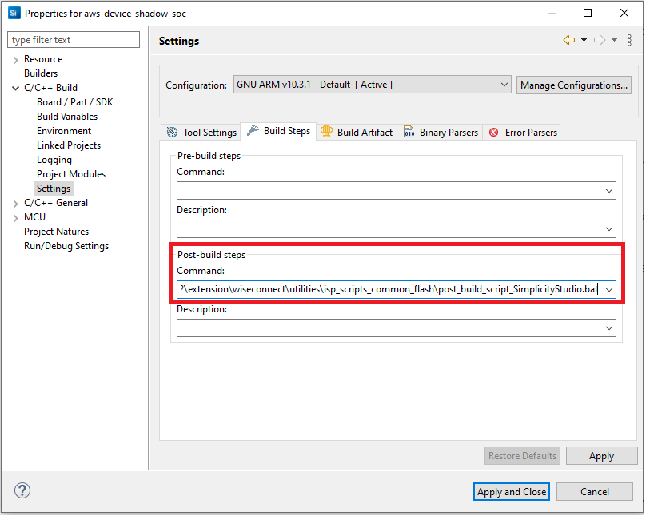
- Check for M4 projects macros in preprocessor settings(RSI_M4_INTERFACE=1)
- Check for 9117 macro in preprocessor settings(CHIP_9117=1).
- Click on the build icon (hammer) to build the project

  
- Successful build output will show as below.

  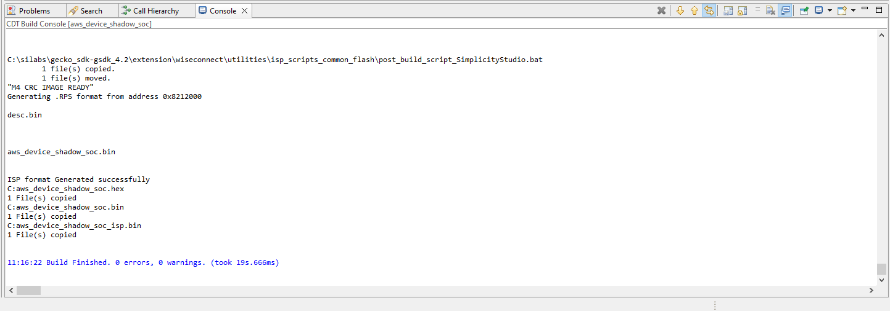

#### Build Project - NCP Mode :

- Check for 9117 macro in preprocessor settings(CHIP_9117=1).
- Click on the build icon (hammer) to build the project

  

- Successful build output will show as below.

  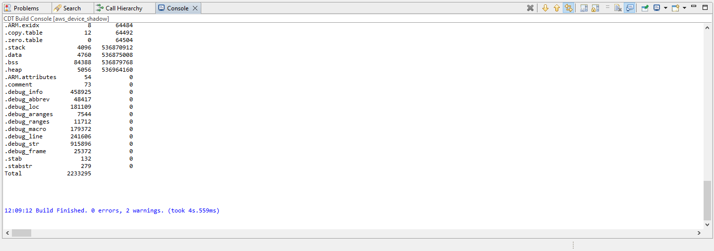

## Program the device

Once the build was successful, right click on project and click on Debug As->Silicon Labs ARM Program as shown in below image.
<br>SoC

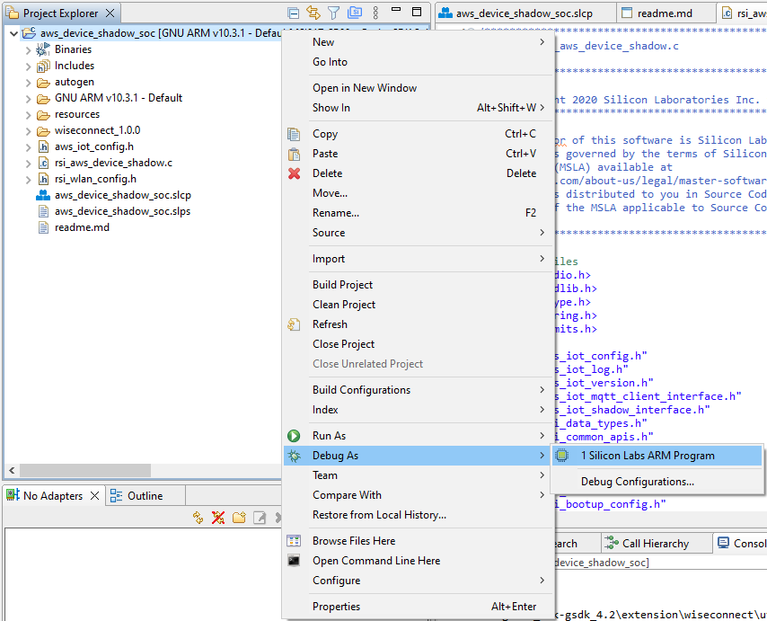

<br>NCP

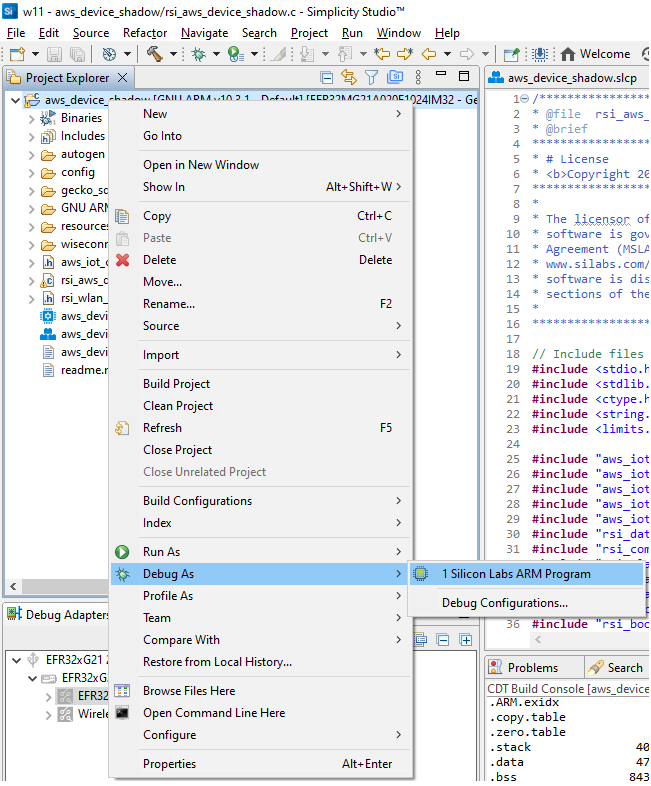

## Outputs

After successful execution, device updates written to AWS can be observed in the AWS thing shadow.

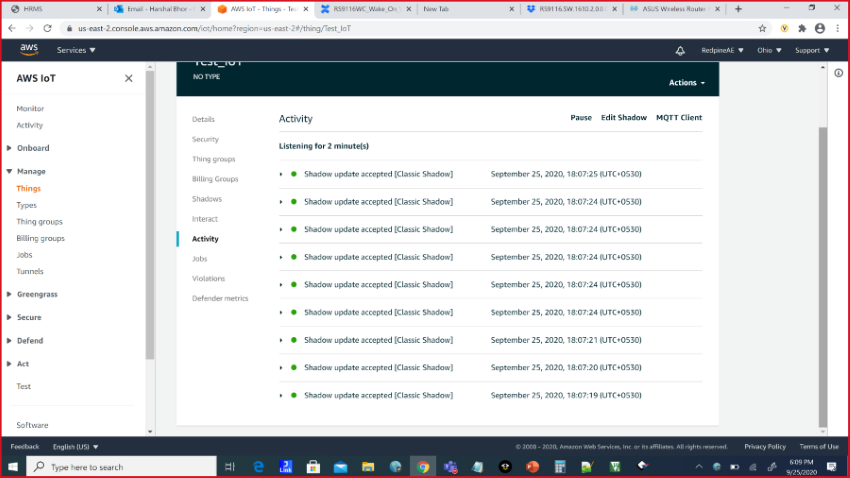

The following debug prints are displayed when the application runs successfully.
<br> SoC

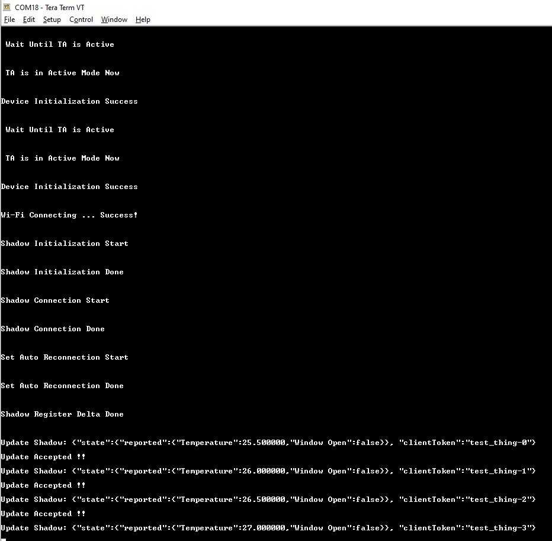

<br> NCP

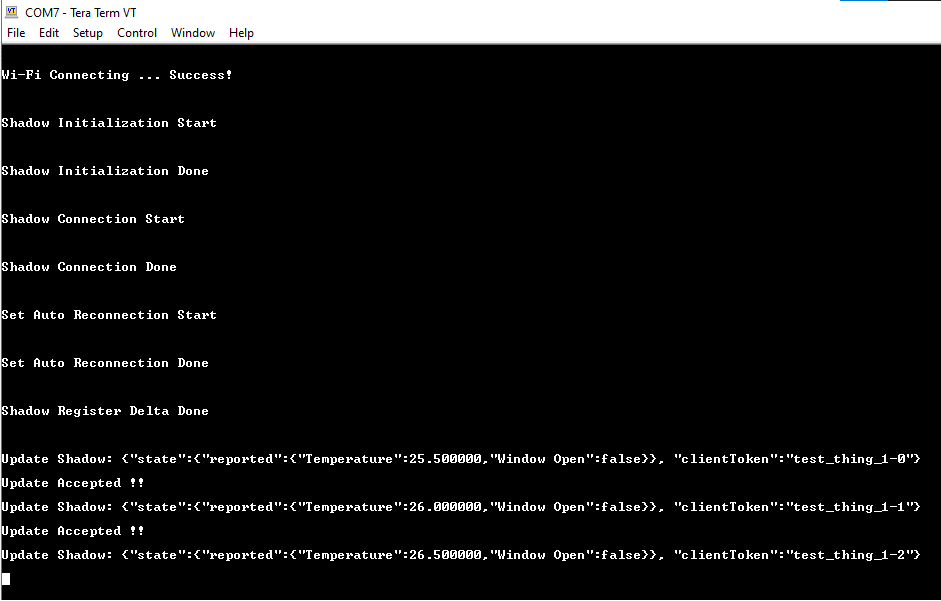


## Observing the output prints on serial terminal

### SoC Mode:
> Connect USB to UART connector Tx and GND pins to WSTK radio board.

   - Connect Tx(Pin-6) to P27 on WSTK
   - Connect GND(Pin 8 or 10) to GND on WSTK


> Prints can see as below in any Console terminal


### NCP Mode:
Prints can see as below in any Console terminal


# Selecting Bare Metal
The application has been designed to work with FreeRTOS and Bare Metal configurations. By default, the application project files (Simplicity studio) are configured with FreeRTOS enabled. The following steps demonstrate how to configure Simplicity Studio to test the application in a Bare Metal environment.

## Bare Metal with Simplicity Studio
> - Open the project in Simplicity Studio
> - Right click on the project and choose 'Properties'
> - Go to 'C/C++ Build' | 'Settings' | 'GNU ARM C Compiler' | 'Preprocessor' and remove macro 'RSI_WITH_OS=1'
> - Select 'Apply' and 'OK' to save the settings

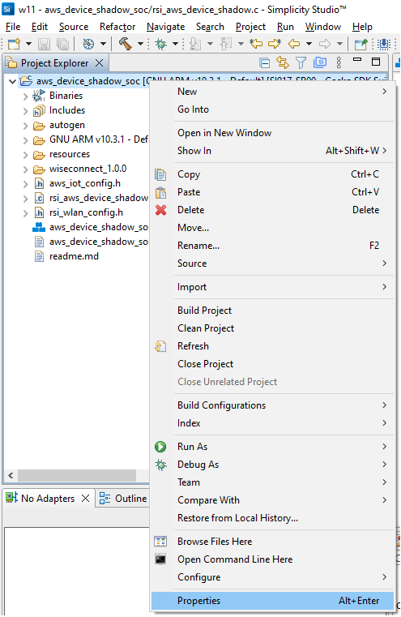 

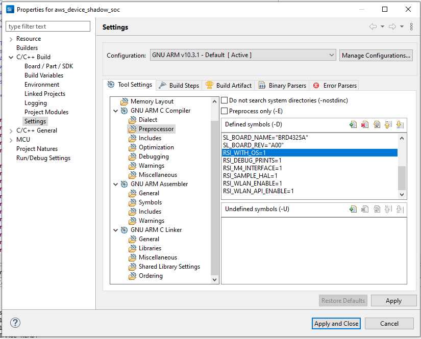

## Appendix

### Create an AWS Thing

Create a thing in the AWS IoT registry to represent your IoT Device.

* In the [AWS IoT console](https://console.aws.amazon.com/iot/home), in the navigation pane, under Manage, choose All devices, and then choose Things.


* If a **You don't have any things yet** dialog box is displayed, choose **Register a thing**. Otherwise, choose **Create**.
* Click on **Create things**.


* On the **Create things** page, choose **Create a single thing** and click next.


* On the **Specify thing properties** page, enter a name for your IoT thing (for example, **Test_IoT**), and choose **Unnamed shadow (classic)** in the Device Shadow section, then choose **Next**. You can't change the name of a thing after you create it. To change a thing's name, you must create a new thing, give it the new name, and then delete the old thing.


* During **Configure device certificate** step, choose **Auto-generate a new certificate (recommended)** option and click next.


* Choose the **Download** links to download the device certificate, private key, and root CA certificate. Root CA certificate is already present in SDK (aws_starfield_ca.pem.h), and can be directly used.
  > **Warning:** This is the only instance you can download your device certificate and private key. Make sure to save them safely. 


* To attach an existing policy choose the policy and click on create thing, if policy is not yet created Choose Create policy and fill the fields as mentioned in the following images.

choosing an existing policy
<br>


creating a policy - step 1
<br>


creating a policy - step 2 (filling the fields)
Give the **Name** to your Policy, Fill **Action** and **Resource ARN** as shown in below image, Click on **Allow** under **Effect** and click **Create**
   


* choose the created policy and click on **Create thing**

* The created thing should now be visible on the AWS console (Manage > All devices > Things)

### **Appendix**: Steps to create a policy from AWS console

* Navigate to **AWS IoT console**
* Choose **Policies** under **Secure**

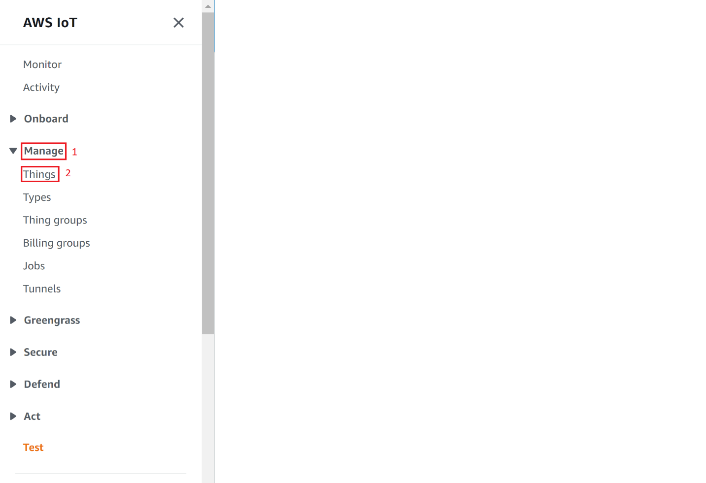 

* Click on **Create**
   


* Give the **Name** to your Policy, Fill **Action** and **Resource ARN** as shown in below image, Click on **Allow** under **Effect** and click **Create**
   
