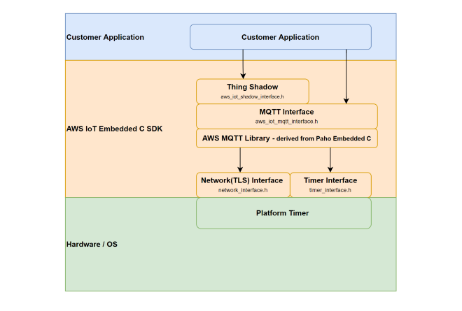

# **AWS IoT Device Shadow**

## **1 Introduction**

This application demonstrates how to securely connect the SiWx91x module to AWS IoT Core to send and receive data. 

AWS refer to a 'Device Shadow' as a persistent, virtual representation of a device that can be accessed even if the physical device is offline.
The device state is captured in its 'shadow' and is represented as a JSON document.
The physical device can send commands using the MQTT protocol to get, update, and delete the state of the shadow as well as receive notifications via MQTT about changes in the state of the shadow.

To successfully use this application, you should be familiar with the operation of [AWS IoT Core](https://docs.aws.amazon.com/iot/latest/developerguide/what-is-aws-iot.html) and the [AWS IoT Device Shadow Service](https://docs.aws.amazon.com/iot/latest/developerguide/iot-device-shadows.html).
If you are new to AWS IoT Core, it is recommended to go through the [AWS IoT Core Tutorial](https://docs.aws.amazon.com/iot/latest/developerguide/iot-tutorials.html) before proceeding.
In this readme, 'AWS IoT Core' is referred to as 'AWS' for brevity.

The AWS IoT Device Shadow application publishes the room temperature and window open/close status on the topic `$aws/things/thingname/shadow/update`.

Additionally, the application subscribes to the shadow update topics:
```sh
  $aws/things/thingName/shadow/name/shadowName/update/accepted
  $aws/things/thingName/shadow/name/shadowName/update/rejected
  $aws/things/thingName/shadow/name/shadowName/update/delta
```

### **Overview of AWS SDK**

AWS IoT Core is a cloud platform that connects devices across AWS cloud services. AWS IoT Core provides an interface that allows devices to communicate securely and reliably in bi-directional ways to AWS touch-points, even when devices are offline.

The AWS SDK allow applications to securely connect to the AWS IoT platform.



## **2 Prerequisites**

For this application, you will need the following:

### **2.1 Hardware Requirements**

- A Windows PC

- A Wireless Access Point

#### **2.1.1 SoC** 

   - Silicon Labs SiWx917 PK6030A SoC Kit which includes
      - BRD4001A/BRD4002A Wireless Starter Kit Mainboard
      - BRD4325A Radio Board
   - USB TO UART converter or TTL cable
   
#### **2.1.2 NCP**

   - Silicon Labs BRD8036A Si917 QMS SB Expansion Board
   - [Silicon Labs SLWSTK6006A EFR32xG21 Wireless Starter Kit](https://www.silabs.com/development-tools/wireless/efr32xg21-wireless-starter-kit) which includes
      - BRD4001A/BRD4002A Wireless Starter Kit Mainboard
      - BRD4180A/BRD4180B Radio Board
               
### **2.2 Software Requirements**

- Simplicity Studio IDE
   - To download and install the Simplicity Studio IDE, refer to the [Simplicity Studio IDE Set up](https://docs.silabs.com/) section in ***Getting started with SiWx91x*** guides.

- SiWx917_WiSeConnect_SDK.x.x.x.x

- Tera Term software or any other serial terminal software - for viewing application prints

- AWS account

## **3 Setup diagram**

### **3.1 SoC** 


### **3.2 NCP** 


**NOTE**: 
- The Host MCU platform (EFR32xG21) and the SiWx91x module interact with each other through the SPI interface.

## **4 Set up**

### **4.1 SoC/NCP** 

- Follow the [Hardware connections and Simplicity Studio IDE Set up](https://docs.silabs.com/) section in the respective ***Getting Started with SiWx91x*** guides to make the hardware connections and add the Gecko and SiWx91x COMBO SDKs to the Simplicity Studio IDE.

- This example requires the SiWx91x device to be provisioned on AWS for which you will need the device certificate and the private key. For brief provisioning instructions, see [AWS IoT Setup](#aws-iot-setup) section.

### **4.2 SiWx91x module's Firmware Update**

- Ensure the SiWx91x module is loaded with the latest firmware following the [SiWx91x Firmware Update](https://docs.silabs.com/rs9116/latest/wiseconnect-getting-started) section in the respective ***Getting started with SiWx91x*** guides.

## **5 Project Creation**

- To create the AWS IoT Device Shadow example project in the Simplicity Studio IDE, follow the [Creation of Project](https://docs.silabs.com/) section in the respective ***Getting started with SiWx91x*** guides. 
   - For SoC, choose the **Wi-Fi - SoC Wi-Fi - AWS IoT Device Shadow** example.
   - For NCP, choose the **Wi-Fi - NCP Wi-Fi - AWS IoT Device Shadow** example.

## **6 Application configuration**

Go through the following parameters and make configurations as per your requirements.

1. In the Project explorer pane of the IDE, expand the **aws_device_shadow** folder and open the **rsi_aws_device_shadow.c** file. Configure the following parameters based on your requirements.

   

### **Access Point and MQTT parameters**

  - Configure the following parameters in **rsi_aws_device_shadow.c** to connect the SiWx91x module to the Access Point network.

    ```c
    //! SSID of the Wi-Fi Access Point 
    #define SSID                          "SILABS_AP" 

    //! SECURITY_TYPE refers to the security mode of the Access Point to which the SiWx91x module has to connect. 
    #define SECURITY_TYPE                  RSI_WPA2      
    
    //! PSK refers to the secret key if the Access point is configured in WPA-PSK/WPA2-PSK security modes.
    #define PSK                           "1234567890"     
    
    //! Topic on which the AWS IoT application publishes the temperature data and window open/close status
    #define RSI_MQTT_TOPIC               "$aws/things/Test_IoT/shadow/update"
    ```

### **Setting up the Security Certificates**

    - To authenticate and securely connect with AWS, Wi-Fi device requires a unique x.509 security certificate/device certificate and private key, as well as a CA certificate which is used to verify the AWS server. Security credentials need to be converted into a C-array rather than [PEM format](https://en.wikipedia.org/wiki/Privacy-Enhanced_Mail) provided by the AWS. The certificates should also be loaded on to the SiWx91x module.
    - The SiWx91x SDK provides a conversion script (written in Python 3) to make the conversion straightforward. The script is provided in the SDK 'resources' directory and is called `certificate_to_array.py`.
    - The certificates downloaded as mentioned in [AWS IoT Setup](#aws-iot-setup) section must be converted to C arrays.
    - Open a system command prompt and use the script as indicated in the following examples.

      ```sh
      $> python3 certificate_to_array.py <input filename> <output arrayname>

      For example:
      $> python3 certificate_to_array.py d8f3a44d3f.pem.crt  aws_client_certificate.pem
      $> python3 certificate_to_array.py d8f3a44d3f.pem.key  aws_client_private_key.pem
      ```

    - After running the script on the certificate and private key, two new files would be generated with the following names:

      ```sh
      aws_client_certificate.pem.crt.h
      aws_client_private_key.pem.key.h
      ```

    - Copy both of the new files to the SiWx91x SDK directory: **SiWx91x SDK → resources → certificates**  
    - Overwrite the existing files with the same name in that directory, the originals are not needed.
    
    **NOTE**:
    The Root CA certificate used by the SiWx91x module to verify the AWS server is already included in the SiWx91x SDK, no additional setup is required.
    For reference, Amazon uses [Starfield Technologies](https://www.starfieldtech.com/) to secure the AWS website, the SiWx91x SDK includes the **Starfield CA Certificate**.

2. Open the **aws_iot_config.h** file. Configure the following parameters based on your requirements.
    
   

  - AWS IoT configurations
    ```c
    //! Device Shadow URL
    #define AWS_IOT_MQTT_HOST             "xxxxxxxxxxxxx-ats.iot.us-east-2.amazonaws.com"
    ```
    AWS_IOT_MQTT_HOST parameter can be found as follows:

    

    
    
    ```c
    //! The Client ID uniquely identifies the MQTT connection with the AWS IoT
    #define AWS_IOT_MQTT_CLIENT_ID           "Test_IoT"

    //! The thing name which is used to register the SiWx91x module on AWS IoT         
    #define AWS_IOT_MY_THING_NAME            "Test_IoT"  
    ```       
    **NOTE!** 
    
    AWS_IOT_MQTT_CLIENT_ID and AWS_IOT_MY_THING_NAME have to be updated as per the name of the thing created.

    

3. Open the **rsi_wlan_config.h** file. Configure below parameter to enable power save mode

   

    ```c
    //! Enable/Disable power save mode
    #define ENABLE_POWER_SAVE                    1
    ```
## **7 Setup for Serial Prints**

### **7.1 SoC** 

1. The USB to UART converter/TTL cable is required for getting application prints in case of SoC. To connect USB TO UART converter/TTL cable to EFx32, refer to the [application prints set up for SoC](https://docs.silabs.com/) in Getting Started with SiWx91x SoC guide.

2. Once done with the connections, refer to the [Tera Term Set up](https://docs.silabs.com/) section in the ***Getting Started with SiWx91x SoC*** guide.

### **7.2 NCP**

To view the application prints, refer to the [Tera Term Set up](https://docs.silabs.com/) section in the ***Getting Started with SiWx91x NCP*** guide.

## **8 Build, Flash, and Run the Application**

### **8.1 SoC**

To build, flash, and run the application project refer to the [Build and Flash the Project](https://docs.silabs.com/) section in the ***Getting Started with SiWx91x SoC*** guide.

### **8.2 NCP**

Build, flash, and run the application project. Refer to the [Build and Flash the Project](https://docs.silabs.com/) section in the ***Getting Started with SiWx91x NCP*** guide.

## **9 Application Execution Flow**

1. After the application gets executed, the SiWx91x module connects to the Access Point and gets an IP address.

2. Subsequenty, the SiWx91x module connects to the AWS and sends the temperature data and window open/close status updates to the AWS.

3. The updates can be observed in the AWS thing shadow as shown below.

    

4. Observe the application prints appear on the Tera Term Terminal and TCP communication log on iperf.

   **SoC**:

   

   **NCP**:

   

## **Appendix**

### **Bare Metal configurations**

1. By default, the application runs over FreeRTOS. To run the application with Bare metal configurations, follow the Bare Metal configuration section in the ***Getting Started with SiWx91x*** guides.

### **AWS IoT Setup**

1. Create a thing in the AWS IoT registry to represent your IoT Device in the AWS.

   - In the [AWS IoT console](https://console.aws.amazon.com/iot/home), in the navigation pane, under **Manage**, choose **All devices**, and then choose **Things**.

      

   - If a **You don't have any things yet** dialog box is displayed, choose **Register a thing**. Otherwise, choose **Create → Create things**.

      

   - On the **Create things** page, choose **Create a single thing** and click next.

      

   - On the **Specify thing properties** page, enter a name for your IoT thing (in this example, **Test_IoT**), and choose **Unnamed shadow (classic)** in the Device Shadow section, then choose **Next**. You can't change the name of a thing after you create it. To change a thing's name, you must create a new thing, give it the new name, and then delete the old thing.

      

   - During **Configure device certificate** step, choose **Auto-generate a new certificate (recommended)** option and click next.
   
      

   - Choose the **Download** links to download the device certificate, private key, and root CA certificate. Root CA certificate is already present in SDK (**aws_starfield_ca.pem.h**), and can be directly used.

      

      **NOTE!**
     This is the only instance you can download your device certificate and private key. Make sure to save them safely.

2. Attaching an existing policy/creating a new policy for your device certificate.

   a. Attaching an existing policy to your device certificate.

      - Choose the an existing policy and click on **create thing** as shown in the following image.

        

    b. Create a new policy and attach it to your device certificate.

      - Click on **Create policy**.
                    
        
                                                                              
      - Give a **Name** to your Policy, fill **Action** and **Resource ARN** as shown in below image, click **Allow** under **Effect** and then click **Create**.
              
        

2. The created thing should now be visible on the AWS console (**Manage → All devices → Things**).   


                                   


