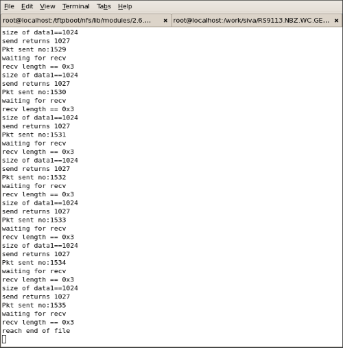
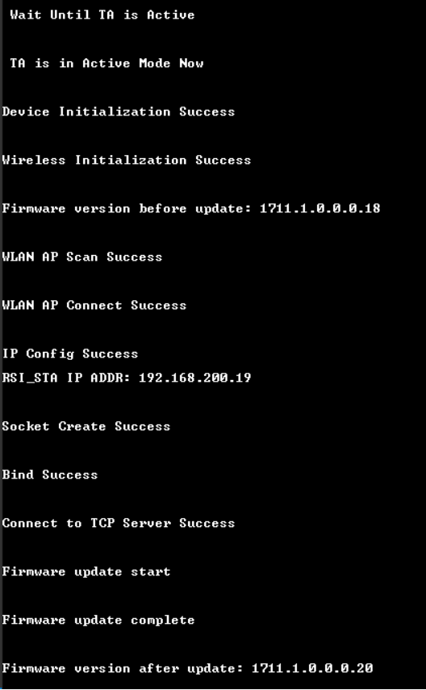
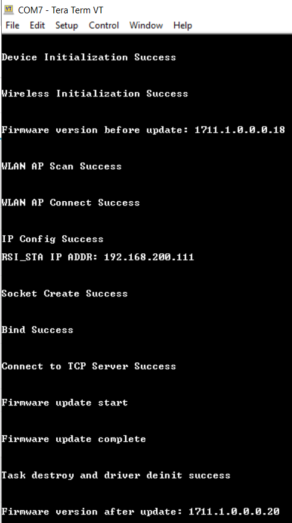

# **Firmware Update**

## **1 Introduction**

This application demonstrates the procedure to update the SiWx91x module's firmware by downloading an image from a remote TCP Server via Wi-Fi. The TCP Server may be hosted on a local PC (as demonstrated in this example), or alternately on a cloud service such as Amazon AWS or Microsoft Azure. The update process works as follows:
  - The SiWx91x module connects to a TCP Server.
  - The SiWx91x module OTA application sends a firmware file request to the TCP Server.
  - The TCP Server responds with the firmware file.
  - The OTA application programs the firmware on to the SiWx91x flash memory and reboots it.

## **2 Prerequisites** 

For this application, you will need the following:

### **2.1 Hardware Requirements**

- A Windows PC

- A Wireless Access Point

#### **2.1.1 SoC** 

   - Silicon Labs SiWx917 PK6030A SoC Kit which includes
      - BRD4001A/BRD4002A Wireless Starter Kit Mainboard
      - BRD4325A Radio Board
   - USB TO UART converter or TTL cable
   
#### **2.1.2 NCP**

   - Silicon Labs BRD8036A Si917 QMS SB Expansion Board
   - [Silicon Labs SLWSTK6006A EFR32xG21 Wireless Starter Kit](https://www.silabs.com/development-tools/wireless/efr32xg21-wireless-starter-kit) which includes
      - BRD4001A/BRD4002A Wireless Starter Kit Mainboard
      - BRD4180A/BRD4180B Radio Board

### **2.2 Software Requirements**

- Simplicity Studio IDE
   - To download and install the Simplicity Studio IDE, refer to the [Simplicity Studio IDE Set up](https://docs.silabs.com/) section in ***Getting started with SiWx91x*** guides.

- SiWx917_WiSeConnect_SDK.x.x.x.x
  
- Tera Term software or any other serial terminal software - for viewing application prints

- A Linux PC - to run the TCP server

## **3 Setup diagram**

### **3.1 SoC**


  
### **3.2 NCP**  


**NOTE**: 
- The Host MCU platform (EFR32xG21) and the SiWx91x module interact with each other through the SPI interface.

## **4 Set up**

### **4.1 SoC/NCP** 

- Follow the [Hardware connections and Simplicity Studio IDE Set up](https://docs.silabs.com/) section in the respective ***Getting Started with SiWx91x*** guides to make the hardware connections and add the Gecko and SiWx91x COMBO SDKs to the Simplicity Studio IDE.

### **4.2 SiWx91x module's Firmware Update**

- Ensure the SiWx91x module is loaded with the latest firmware following the [SiWx91x Firmware Update](https://docs.silabs.com/rs9116/latest/wiseconnect-getting-started) section in the respective ***Getting started with SiWx91x*** guides.

### **TCP Server**

- The TCP Server should be set up before executing the application. In this example, the TCP Server application **firmware_update_tcp_server_9117.c** present at ***SiWx91x SDK → examples → featured → firmware_update*** is used for running the TCP Server. 
  1. Copy the TCP server application **firmware_update_tcp_server_9117.c** to a Linux PC connected to the Wi-Fi access point.
  2. Copy the desired SiWx91x firmware **firmware.rps** to the same path where **firmware_update_tcp_server_9117.c** file is present. 
  3. Compile the application using the following command:

     > `user@linux:~$ gcc firmware_update_tcp_server_9117.c -o ota_server.bin`

  4. Run the TCP Server on desired port number (in this example, 5001) with the firmware file name specified.
     
     > `user@linux:~$ ./ota_server.bin 5001 firmware.rps`

## **5 Project Creation**

- To create the Firmware Update example project in the Simplicity Studio IDE, follow the [Creation of Project](https://docs.silabs.com/) section in the respective ***Getting started with SiWx91x*** guides. 
   - For SoC, choose the **Wi-Fi - SoC Wi-Fi - Firmware Update via TCP Server** example.
   - For NCP, choose the **Wi-Fi - NCP Wi-Fi - Firmware Update via TCP Server** example.

## **6 Application configuration**

Go through the following parameters and make configurations as per your requirements.

1. In the Project explorer pane of the IDE, expand the **firmware_update** folder and open the **rsi_firmware_update_app.c** file. Configure the following parameters based on your requirements.

   

### **Access Point parameters**

  - Configure the following parameters in **rsi_firmware_update_app.c** to connect the SiWx91x module to the Access Point network.

    ```c
    //! SSID of the Wi-Fi Access Point
    #define SSID                                 "SILABS_AP" 

    //! SECURITY_TYPE refers to the security mode of the Access Point to which the SiWx91x module has to connect.
    #define PSK                                  "1234567890" 

    //! PSK refers to the secret key if the Access point is configured in WPA-PSK/WPA2-PSK security modes.
    #define SECURITY_TYPE                          RSI_WPA2         
    ```

### **TCP Server Configuration**

  - Configure the below TCP Server related parameters

    ```c
    //! TCP Client port of the local SiWx91x TCP client
    #define DEVICE_PORT                               5001  

    //! TCP Server port of the remote TCP server
    #define SERVER_PORT                               5001 

    //! TCP Server IP address       
    #define SERVER_IP_ADDRESS                      "192.168.10.100"   
    ```

## **7 Setup for Serial Prints**

### **7.1 SoC** 

1. The USB to UART converter/TTL cable is required for getting application prints in case of SoC. To connect USB TO UART converter/TTL cable to EFx32, refer to the [application prints set up for SoC](https://docs.silabs.com/) in Getting Started with SiWx91x SoC guide.

2. Once done with the connections, refer to the [Tera Term Set up](https://docs.silabs.com/) section in the ***Getting Started with SiWx91x SoC*** guide.

### **7.2 NCP**

To view the application prints, refer to the [Tera Term Set up](https://docs.silabs.com/) section in the ***Getting Started with SiWx91x NCP*** guide.

## **8 Build, Flash, and Run the Application**

### **8.1 SoC**

To build, flash, and run the application project refer to the [Build and Flash the Project](https://docs.silabs.com/) section in the ***Getting Started with SiWx91x SoC*** guide.

### **8.2 NCP**

Build, flash, and run the application project. Refer to the [Build and Flash the Project](https://docs.silabs.com/) section in the ***Getting Started with SiWx91x NCP*** guide.

## **9 Application Execution Flow**

1. After the application gets executed, the SiWx91x module connects to the Access Point and gets an IP address. 

   **NOTE!**
    Ensure the SiWx91x module and the TCP Server are connected to the same network.

2. Subsequently, the SiWx91x module (TCP Client) gets connected to a TCP Server and requests the TCP Server for firmware file in chuncks.

3. The application requests a firmware chunk, the Server sends the chunk, the application then flashes the chunk to the SiWx91x module. The application requests the next chunk, the Server sends the chunk, and so forth until the entire transfer completes.

4. Once the TCP Server is done with transferring all the chunks, the TCP Server prints 'reach end of file'. On the other end, the application completes the firmware flashing on to the SiWx91x module.

    

5. The SiWx91x module takes a few seconds to overwrite the old firmware with the new firmware in its flash memory.

6. After the successful firmware update, the application reboots the SiWx91x module and prints the updated firmware's version.

  - **SoC**:

      
 
  - **NCP**:

      

## **Appendix**

### **Bare Metal configurations**

1. By default, the application runs over FreeRTOS. To run the application with Bare metal configurations, follow the Bare Metal configuration section in the ***Getting Started with SiWx91x*** guides.

