# **Powersave Standby Associated**

## **1 Introduction**

This application demonstrates the process for configuring the SiWx91x in power save profile mode 2, also providing the steps to configure the SiWx91x module in station mode and initiate a connection to an Access Point. When the module is in deep sleep, it wakes up in periodic intervals based on DTIM or Listen Interval.

If the UDP data transfer feature is enabled, the application then connects to a remote server to send UDP data in power save mode.

The application also enables the analysis of various power save profiles using a power analyzer during the Associated state with data transfer via UDP.

## **2 Prerequisites**
For this application, the following are required:

### **2.1 Hardware Requirements**
- A Windows PC
- A Wi-Fi Access Point
#### **2.1.1 SoC** 
   - Silicon Labs SiWx917 PK6030A SoC Kit which includes
      - BRD4001A/BRD4002A Wireless Starter Kit Mainboard
      - BRD4325A Radio Board
   - USB TO UART converter or TTL cable

#### **2.1.2 NCP**
   - Silicon Labs BRD8036A Si917 QMS SB Expansion Board
   - [Silicon Labs SLWSTK6006A EFR32xG21 Wireless Starter Kit](https://www.silabs.com/development-tools/wireless/efr32xg21-wireless-starter-kit) which includes
      - BRD4001A/BRD4002A Wireless Starter Kit Mainboard
      - BRD4180A/BRD4180B Radio Board
  - Power analyzer

### **2.2 Software Requirements**
- Simplicity Studio IDE
   - To download and install the Simplicity Studio IDE, refer the [Simplicity Studio IDE Set up]() section in ***Getting started with SiWx91x*** guides.
- SiWx917_WiSeConnect_SDK.x.x.x.x
- [Iperf application](https://iperf.fr/iperf-download.php) 
- Tera Term software or any other serial terminal software 
- Energy profiler tool for current measurement for SoC (Tool integrated in Simplicity Studio)

## **3 Setup diagram**

### **3.1 SoC** 

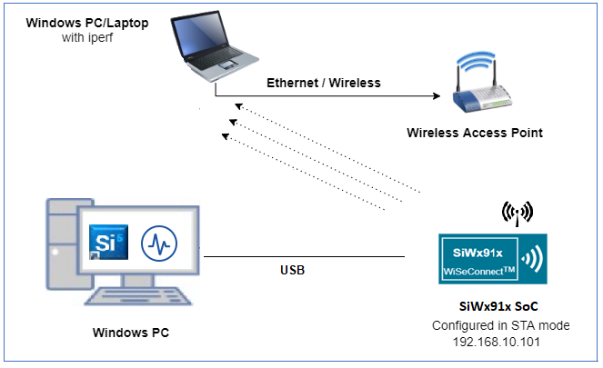

### **3.2 NCP** 

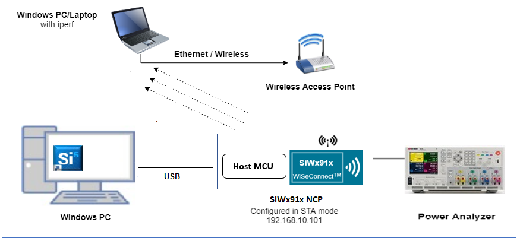

**NOTE**: 
The Host MCU platform (EFR32xG21) and the SiWx91x interact with each other through the SPI interface. 

## **4 Setup**

### **4.1 SoC/NCP** 
- Follow the [Hardware connections and Simplicity Studio IDE Setup]()  section in the respective ***Getting Started with SiWx91x*** guides to make the hardware connections and add the Gecko and SiWx91x COMBO SDKs to Simplicity Studio IDE.

### **4.2 SiWx91x module's Firmware Update**

- Ensure the SiWx91x module is loaded with the latest firmware following the [SiWx91x Firmware Update]() section in the respective ***Getting started with SiWx91x*** guides.

## **5 Project creation**

- To create the Powersave Standby Associated example project in the Simplicity Studio IDE, follow the [Creation of Project]() section in the respective ***Getting started with SiWx91x*** guides. 
   - For SoC, choose the **Wi-Fi - SoC Wi-Fi Powersave Standby Associated** example.
   - For NCP, choose the **Wi-Fi - NCP Wi-Fi Powersave Standby Associated** example.


## **6 Application configuration**

The following application parameters can be configured as per the user requirement

1. In the Project explorer pane of the IDE, expand the **powersave_standby_associated** folder and open the **rsi_wlan_connected_sleep_app.c** file. Configure the following parameters based on your requirements.

  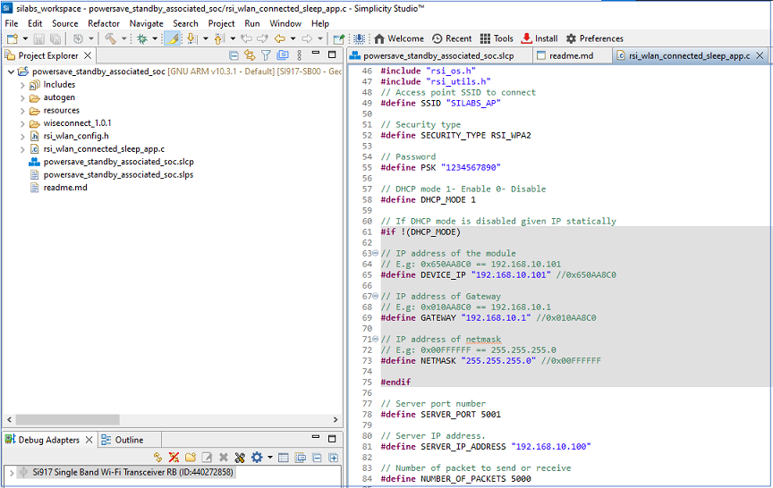

- ### **Wi-Fi Configuration**

  ```c
  //! Wi-Fi Network Name
  #define SSID                 "SILABS_AP"      

  //! Wi-Fi Password
  #define PSK                  "1234567890"     

  //! Wi-Fi Security Type: RSI_OPEN / RSI_WPA / RSI_WPA2
  #define SECURITY_TYPE        RSI_WPA2         
  ```

- ### **Remote server configuration**
  ```c
    //! The remote UDP server port number on the PC running Iperf
    #define SERVER_PORT        5001
    
    //! the remote UDP server IP address on the PC running Iperf
    #define SERVER_IP_ADDRESS  "192.168.10.100"      

    //! the number of packets sent to the remote UDP server
    #define NUMBER_OF_PACKETS  5000
  ```

- ### **For Powersave functionality with NCP expansion board**

    > **Note!** For using powersave functionality with NCP expansion board, the following macro has to be enabled:

    While using the NCP expansion board, the `EXP_BOARD=1` preprocessor symbol should be added to the list of defined symbols in the preprocessor menu of project settings.

    > - Open the project in Simplicity Studio
    > - Right click on the project and choose 'Properties'
    > - Go to 'C/C++ Build' | 'Settings' | 'GNU ARM C Compiler' | 'Preprocessor' and add the macro `EXP_BOARD=1`
    > - Select 'Apply' and 'OK' to save the settings

- ### **Enabling data transfer**
    The feature to connect to a remote UDP server is disabled by default. To enable the data transfer, `ENABLE_DATA_TRANSFER_DEMO` macro has to be added, the steps for which are as follows:

    > - Open the project in Simplicity Studio
    > - Right click on the project and choose 'Properties'
    > - Go to 'C/C++ Build' | 'Settings' | 'GNU ARM C Compiler' | 'Preprocessor' and add the macro `ENABLE_DATA_TRANSFER_DEMO=1`
    > - Select 'Apply' and 'OK' to save the settings

- ### **Listen Interval configuration**
    To be configured in **rsi_wlan_config.h** file
    ```c
    // enable listen interval
    #define RSI_JOIN_FEAT_BIT_MAP RSI_JOIN_FEAT_LISTEN_INTERVAL_VALID

    // listen interval in ms
    #define RSI_LISTEN_INTERVAL 1000
    ```

- ### **RTOS options**
  The following parameters are configured when FreeRTOS is used
  ```c
    #define RSI_WLAN_TASK_PRIORITY              1   // Should be low priority
    #define RSI_DRIVER_TASK_PRIORITY            2   // Should be highest priority 
    #define RSI_WLAN_TASK_STACK_SIZE            500   
    #define RSI_DRIVER_TASK_STACK_SIZE          500
  ```   

- ### **Major powersave options**
  The primary powersave settings are configured with `PSP_MODE` and `PSP_TYPE`. The default power save mode is set to low power mode 2 (`RSI_SLEEP_MODE_2`) with maximum power save (`RSI_MAX_PSP`) and with message based handshake as follows.

    ```c
      #define PSP_MODE                            RSI_SLEEP_MODE_2
      #define PSP_TYPE                            RSI_MAX_PSP
    ```

`PSP_MODE` refers to the power save profile mode. SiWx91x EVK supports the following power modes:

  - `RSI_ACTIVE`       : In this mode, SiWx91x is active and power save is disabled.
  - `RSI_SLEEP_MODE_1` : In this mode, SiWx91x goes to power save after association with the Access Point. In this sleep mode, SoC will never turn off, therefore no handshake is required before sending data to the SiWx91x.
  - `RSI_SLEEP_MODE_2` : In this mode, SiWx91x goes to power save after association with the Access Point. In this sleep mode, SoC will go to sleep based on GPIO hand shake or Message exchange, therefore handshake is required before sending data to the SiWx91x.
  - `RSI_SLEEP_MODE_8` : In this mode, SiWx91x goes to power save when it is not in associated state with the Access Point. In this sleep mode, SoC will go to sleep based on GPIO handshake or Message exchange, therefore handshake is required before sending the command to the SiWx91x.

---- 

**Note!**
  1. For `RSI_SLEEP_MODE_2` and `RSI_SLEEP_MODE_8` modes, GPIO or Message based handshake can be selected using `RSI_HAND_SHAKE_TYPE` macro which is defined in `rsi_wlan_config.h`.
  2. In this example, `RSI_SLEEP_MODE_2` can be verified with a Message-based handshake. To verify other power modes, change the application as well as GPIO handshake signals.

----

`PSP_TYPE` refers to power save profile type. SiWx91x supports following power save profile types:
  - `RSI_MAX_PSP` : In this mode, SiWx91x will be in Maximum power save mode. i.e device will wake up for every DTIM beacon and do data Tx and Rx.
  - `RSI_FAST_PSP` : In this mode, SiWx91x will disable power save for any Tx/Rx packet for monitor interval of time (monitor interval can be set through macro in `rsi_wlan_config.h` file, default value is 50 ms). If there is no data for monitor interval of time, then SiWx91x will again enable power save.
----

**Note!**
  1. `PSP_TYPE` is valid only when `PSP_MODE` is set to `RSI_SLEEP_MODE_1` or `RSI_SLEEP_MODE_2` mode.
----

- ### **Additional powersave options**
  Additional powersave options may be configured in **rsi_wlan_config.h**.
 
    ```c
      #define CONCURRENT_MODE                     RSI_DISABLE
      #define RSI_FEATURE_BIT_MAP                 (FEAT_SECURITY_OPEN | FEAT_AGGREGATION | FEAT_ULP_GPIO_BASED_HANDSHAKE)
      #define RSI_TCP_IP_BYPASS                   RSI_DISABLE
      #define RSI_TCP_IP_FEATURE_BIT_MAP          (TCP_IP_FEAT_EXTENSION_VALID | TCP_IP_FEAT_DHCPV4_CLIENT)
      #define RSI_CUSTOM_FEATURE_BIT_MAP          FEAT_CUSTOM_FEAT_EXTENTION_VALID
      #define RSI_EXT_CUSTOM_FEATURE_BIT_MAP      (EXT_FEAT_LOW_POWER_MODE | EXT_FEAT_XTAL_CLK_ENABLE)
      #define RSI_EXT_TCPIP_FEATURE_BITMAP        CONFIG_FEAT_EXTENTION_VALID
      #define RSI_CONFIG_FEATURE_BITMAP           RSI_FEAT_SLEEP_GPIO_SEL_BITMAP
      #define RSI_BAND                            RSI_BAND_2P4GHZ
      
      // The default configuration of low power_save_mode_2 is:
      
      #define RSI_HAND_SHAKE_TYPE                 GPIO_BASED
      #define RSI_SELECT_LP_OR_ULP_MODE           RSI_ULP_WITH_RAM_RET
      #define RSI_DTIM_ALIGNED_TYPE               0
      #define RSI_MONITOR_INTERVAL                50
    ```

The application defaults to the `RSI_SLEEP_MODE_2` configuration. Other powersave options are possible by choosing different powersave modes according to the following description.
- `RSI_HAND_SHAKE_TYPE` is used to select the hand shake type (GPIO or Message) in `RSI_SLEEP_MODE_2` and `RSI_SLEEP_MODE_8` modes.
- `RSI_SELECT_LP_OR_ULP_MODE` is used to select low power mode or ultra-low power mode. Valid configurations are 
  - `RSI_LP_MODE` - SiWx91x will be in low power mode.
  - `RSI_ULP_WITH_RAM_RET` - SiWx91x will be in Ultra low power mode and will remember the previous state after issuing the power save mode command.
  - `RSI_ULP_WITHOUT_RAM_RET` - SiWx91x will be in Ultra low power mode and it will not remember the previous state after issuing power save mode command. After wakeup, SiWx91x will give card ready indication and user has to issue commands from wireless initialization.
- `RSI_DTIM_ALIGNED_TYPE` is used to decide whether SiWx91x has to wake up at normal beacon or DTIM beacon which is just before listen interval.
  - `RSI_DTIM_ALIGNED_TYPE = 0` - SiWx91x will wake up at normal beacon which is just before listen interval.
  - `RSI_DTIM_ALIGNED_TYPE = 1` - SiWx91x will wake up at DTIM beacon which is just before listen interval.
- `RSI_MONITOR_INTERVAL` refers to the amount of time (in ms) to wait for Tx or Rx before giving power save indication to the connected Access Point. This macro is applicable only when `PSP_TYPE` selected as `RSI_FAST_PSP`

## **7 Setup for Serial Prints**

To Setup the serial prints, follow the [Setup for Serial Prints]() section in the respective ***Getting started with SiWx91x*** guides.
 
## **8 Build, Flash, and Run the Application**

To build, flash, and run the application project refer to the [Build and Flash the Project]() section in the respective ***Getting Started with SiWx91x*** guide.

## **9 Application Execution Flow**

If data transfer is disabled, UDP server need not be setup, the following steps can be skipped

If data transfer is enabled

open command prompt on the remote PC connected to the Wi-Fi access point.

Start a UDP server using the below command in command prompt.

> `C:\ iperf.exe –s -u -p <SERVER_PORT> -i 1` 

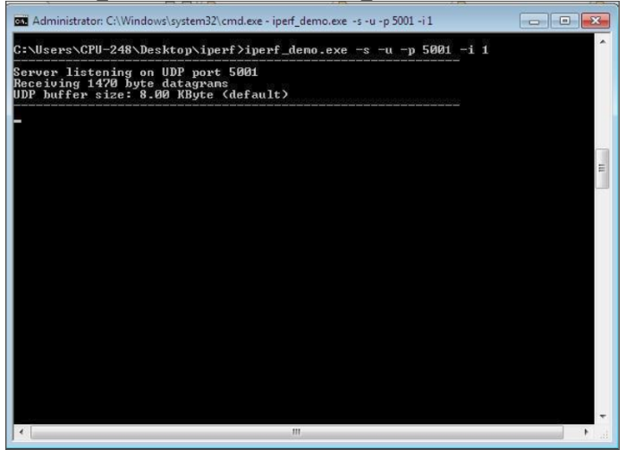

> If iperf server does not start and throws an error saying "Access Denied", run command prompt as administrator and start the server.

When the powersave application runs, SiWx91x scans and connects to the Wi-Fi access point and obtains an IP address. After successful connection, the device goes into configured power save and sends configured number of UDP packets to the remote peer which is connected to access point. The following image shows active reception of UDP data on the UDP server.
 
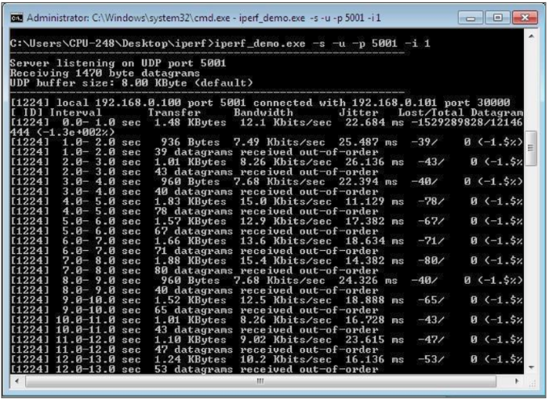

The Application Prints can be observed as follows in the serial terminal

### **SoC**

Data transfer disabled

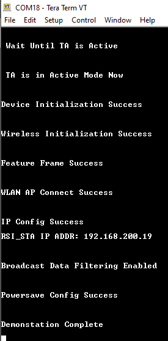

Data transfer enabled

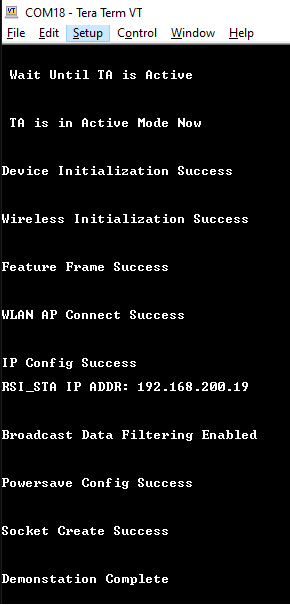


### **NCP**

Data transfer disabled

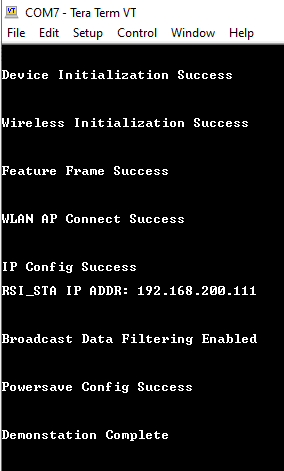

Data transfer enabled

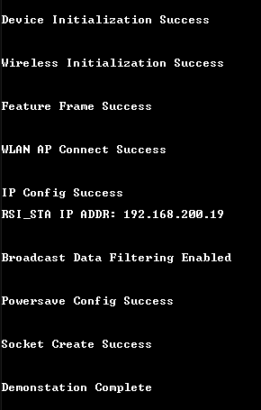

## **10 Current consumption measurement**

**NCP**

A Power meter can be used to measure the current consumption of SiWx91x NCP module 

  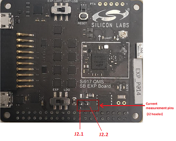

Negative probe of power meter should be connected to J2.1 pin and the positive probe should be connected to J2.2 pin

Average current consumption of SiWx91x NCP module as measured with a power-meter


**SoC**

Refer [AEM measurement](https://docs.silabs.com/) section in ***Getting Started with SiWx91x SoC*** guide for measuring current consumption of SiWx91x SoC module. 

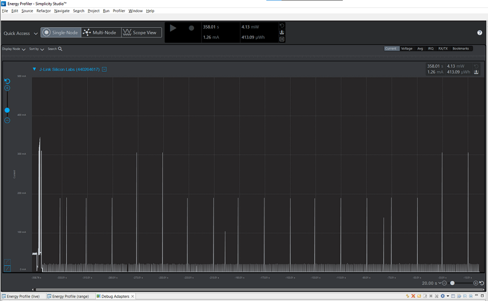
 
NOTE: The measured current may vary if the scenario is performed in open environment. AP to AP variation is also observed. 

## **Appendix**

By default, the application runs over FreeRTOS. To run the application with Bare metal configurations, follow the Bare Metal configuration section in the ***Getting Started with SiWx91x*** guides.
