# Powersave Standby Associated

## Introduction

This application demonstrates the process for configuring the SiWx91x in power save profile mode 2, also providing the steps to configure the SiWx91x EVK in station mode and initiate a connection to an Access Point. When the module is in deep sleep, it wakes up in periodic intervals based on DTIM or Listen Interval.

If the UDP data transfer feature is enabled, the application then connects to a remote server to send UDP data in power save mode.

The application also enables the analysis of various power save profiles using a power analyzer during the Associated state with data transfer via UDP.

## Setting Up 
To use this application, the following hardware, software and project setup is required.

### Hardware Requirements  
  - Windows PC.
  - Wi-Fi Access point with a connection to the internet
  - PC2 (Remote PC) with UDP server application (iperf)
  - Power analyzer
  - SiWx91x Wi-Fi Evaluation Kit
  - **SoC Mode**: 
      - Silicon Labs [BRD4325A](https://www.silabs.com/)
  - **NCP Mode**:
      - Silicon Labs [(BRD4180A, BRD4280B)](https://www.silabs.com/); **AND**
      - Host MCU Eval Kit. This example has been tested with:
        - Silicon Labs [WSTK + EFR32MG21](https://www.silabs.com/development-tools/wireless/efr32xg21-bluetooth-starter-kit) 

#### SoC Mode : 


  
#### NCP Mode :  

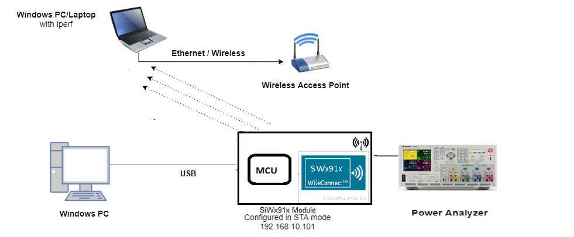

### Software Requirements
  - [Iperf Application](https://iperf.fr/iperf-download.php)
   
### Project Setup
- **SoC Mode**
  - **Silicon Labs SiWx91x SoC**. Follow the [Getting Started with SiWx91x SoC](https://docs.silabs.com/) to setup the example to work with SiWx91x SoC and Simplicity Studio.
- **NCP Mode**
  - **Silicon Labs EFx32 Host**. Follow the [Getting Started with EFx32](https://docs.silabs.com/SiWx91x-wiseconnect/latest/wifibt-wc-getting-started-with-efx32/) to setup the example to work with EFx32 and Simplicity Studio.

## Configuring the Application
The application can be configured to suit your requirements and development environment.
Read through the following sections and make any changes needed. 

### NCP Mode - Host Interface

* This application is configured to use the SPI bus for interfacing between Host platforms(EFR32MG21) and the SiWx91x EVK.
* While using the expansion board, the `EXP_BOARD=1` preprocessor symbol should be added to the list of defined symbols from the preprocessor menu of project settings.
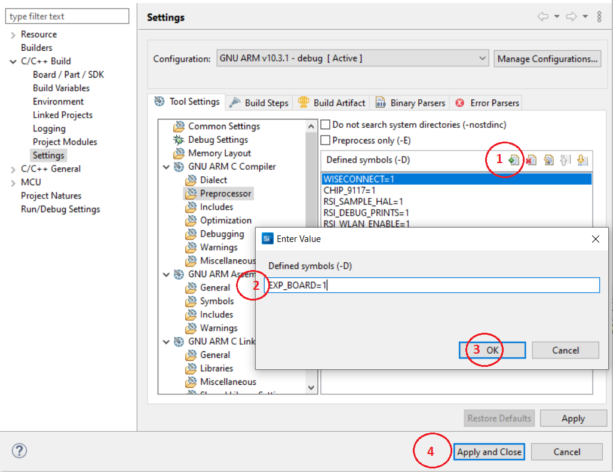

### Bare Metal/RTOS Support
To select a bare metal configuration, see [Selecting bare metal](#selecting-bare-metal).

### Wi-Fi Configuration
Configure the following parameters in **rsi_wlan_connected_sleep_app.c** to enable your Silicon Labs Wi-Fi device to connect to your Wi-Fi network.

```c
#define SSID           "SILABS_AP"      // Wi-Fi Network Name
#define PSK            "1234567890"     // Wi-Fi Password
#define SECURITY_TYPE  RSI_WPA2         // Wi-Fi Security Type: RSI_OPEN / RSI_WPA / RSI_WPA2
```

### Iperf Configuration
- `SERVER_PORT` is the remote UDP server port number on the PC running Iperf.
- `SERVER_IP_ADDRESS` is the remote UDP server IP address on the PC running Iperf. IP address should be in long format and in little endian byte order Example: To configure "192.168.10.100" as the IP address, update the macro `DEVICE_IP` as `0x640AA8C0`

```c
  #define SERVER_PORT        <remote port>
  #define SERVER_IP_ADDRESS  0x640AA8C0      // 192.168.10.100 => | 0x64 = 100 | 0x0A = 10 | 0xA8 = 168 | 0xC0 = 192 |
```
> **Note!** The feature to connect to a remote UDP server is disabled by default. To enable this feature, see [Testing Application - UDP Data Transfer](#testing-application---udp-data-transfer)
### Memory & Throughput
  - `NUMBER_OF_PACKETS` controls the number of packets sent to the remote UDP server.
  - `GLOBAL_BUFF_LEN` sets the application memory size (in bytes) used by the driver.

```c
  #define NUMBER_OF_PACKETS  <number of packets>
  #define GLOBAL_BUFF_LEN    15000
```


### RTOS Options
The following parameters are configured when FreeRTOS is used.

```c
  #define RSI_WLAN_TASK_PRIORITY        1   // Should be low priority
  #define RSI_DRIVER_TASK_PRIORITY      2   // Should be highest priority 
  #define RSI_WLAN_TASK_STACK_SIZE    500   
  #define RSI_DRIVER_TASK_STACK_SIZE  500
```   


### Major Powersave Options
The primary powersave settings are configured with `PSP_MODE` and `PSP_TYPE`. The default power save mode is set to low power mode 2 (`RSI_SLEEP_MODE_2`) with maximum power save (`RSI_MAX_PSP`) and with message based handshake as follows.

```c
  #define PSP_MODE  RSI_SLEEP_MODE_2
  #define PSP_TYPE  RSI_MAX_PSP
```

`PSP_MODE` refers to the power save profile mode. SiWx91x EVK supports the following power modes:

  - `RSI_ACTIVE` : In this mode, SiWx91x EVK is active and power save is disabled.
  - `RSI_SLEEP_MODE_1` : In this mode, SiWx91x EVK goes to power save after association with the Access Point. In this sleep mode, SoC will never turn off, therefore no handshake is required before sending data to the SiWx91x EVK.
  - `RSI_SLEEP_MODE_2` : In this mode, SiWx91x EVK goes to power save after association with the Access Point. In this sleep mode, SoC will go to sleep based on GPIO hand shake or Message exchange, therefore handshake is required before sending data to the SiWx91x EVK.
  - `RSI_SLEEP_MODE_8` : In this mode, SiWx91x EVK goes to power save when it is not in associated state with the Access Point. In this sleep mode, SoC will go to sleep based on GPIO handshake or Message exchange, therefore handshake is required before sending the command to the SiWx91x EVK.

---- 

**Note!**
  1. For `RSI_SLEEP_MODE_2` and `RSI_SLEEP_MODE_8` modes, GPIO or Message based handshake can be selected using `RSI_HAND_SHAKE_TYPE` macro which is defined in `rsi_wlan_config.h`.
  2. In this example, `RSI_SLEEP_MODE_2` can be verified with a Message-based handshake. To verify other power modes, change the application as well as GPIO handshake signals.

----

`PSP_TYPE` refers to power save profile type. SiWx91x EVK supports following power save profile types:
  - `RSI_MAX_PSP` : In this mode, SiWx91x EVK will be in Maximum power save mode. i.e device will wake up for every DTIM beacon and do data Tx and Rx.
  - `RSI_FAST_PSP` : In this mode, SiWx91x EVK will disable power save for any Tx/Rx packet for monitor interval of time (monitor interval can be set through macro in `rsi_wlan_config.h` file, default value is 50 ms). If there is no data for monitor interval of time, then SiWx91x EVK will again enable power save.
  - `RSI_UAPSD` : This `PSP_TYPE` is used to enable WMM power save.

----

**Note!**
  1. `PSP_TYPE` is valid only when `PSP_MODE` is set to `RSI_SLEEP_MODE_1` or `RSI_SLEEP_MODE_2` mode.
  2. `RSI_UAPSD` power profile type in `PSP_TYPE` is valid only when `RSI_WMM_PS_ENABLE` is enabled in `rsi_wlan_config.h` file.

----


### Additional Powersave Options
Additional powersave options may be configured in **rsi_wlan_config.h**.
 
```c
  #define CONCURRENT_MODE                     RSI_DISABLE
  #define RSI_FEATURE_BIT_MAP                 (FEAT_SECURITY_OPEN | FEAT_AGGREGATION | FEAT_ULP_GPIO_BASED_HANDSHAKE)
  #define RSI_TCP_IP_BYPASS                   RSI_DISABLE
  #define RSI_TCP_IP_FEATURE_BIT_MAP          (TCP_IP_FEAT_EXTENSION_VALID | TCP_IP_FEAT_DHCPV4_CLIENT)
  #define RSI_CUSTOM_FEATURE_BIT_MAP          FEAT_CUSTOM_FEAT_EXTENTION_VALID
  #define RSI_EXT_CUSTOM_FEATURE_BIT_MAP      (EXT_FEAT_LOW_POWER_MODE | EXT_FEAT_XTAL_CLK_ENABLE)
  #define RSI_EXT_TCPIP_FEATURE_BITMAP        CONFIG_FEAT_EXTENTION_VALID
  #define RSI_CONFIG_FEATURE_BITMAP           RSI_FEAT_SLEEP_GPIO_SEL_BITMAP
  #define RSI_BAND                            RSI_BAND_2P4GHZ
  
  The default configuration of low power_save_mode_2 is:
  
  #define RSI_HAND_SHAKE_TYPE                 GPIO_BASED
  #define RSI_SELECT_LP_OR_ULP_MODE           RSI_ULP_WITH_RAM_RET
  #define RSI_DTIM_ALIGNED_TYPE               0
  #define RSI_MONITOR_INTERVAL                50
  #define RSI_WMM_PS_ENABLE                   RSI_DISABLE
  #define RSI_WMM_PS_TYPE                     0
  #define RSI_WMM_PS_WAKE_INTERVAL            20
  #define RSI_WMM_PS_UAPSD_BITMAP             15
```

The application defaults to the `RSI_SLEEP_MODE_2` configuration. Other powersave options are possible by choosing different powersave modes according to the following description.
- `RSI_HAND_SHAKE_TYPE` is used to select the hand shake type (GPIO or Message) in `RSI_SLEEP_MODE_2` and `RSI_SLEEP_MODE_8` modes.
- `RSI_SELECT_LP_OR_ULP_MODE` is used to select low power mode or ultra-low power mode. Valid configurations are 
  - `RSI_LP_MODE` - SiWx91x will be in Ultra low power mode.
  - `RSI_ULP_WITH_RAM_RET` - SiWx91x will be in Ultra low power mode and will remember the previous state after issuing the power save mode command.
  - `RSI_ULP_WITHOUT_RAM_RET` - SiWx91x will be in Ultra low power mode and it will not remember the previous state after issuing power save mode command. After wakeup, SiWx91x will give CARD READY indication and user has to issue commands from wireless initialization.
- `RSI_DTIM_ALIGNED_TYPE` is used to decide whether SiWx91x has to wake up at normal beacon or DTIM beacon which is just before listen interval.
  - `RSI_DTIM_ALIGNED_TYPE = 0` - SiWx91x will wake up at normal beacon which is just before listen interval.
  - `RSI_DTIM_ALIGNED_TYPE = 1` - SiWx91x will wake up at DTIM beacon which is just before listen interval.
- `RSI_MONITOR_INTERVAL` refers to the amount of time (in ms) to wait for Tx or Rx before giving power save indication to the connected Access Point. This macro is applicable only when `PSP_TYPE` selected as `RSI_FAST_PSP`
- `RSI_WMM_PS_ENABLE` is used to enable or disable WMM power save.
- `RSI_WMM_PS_TYPE` is used to set Tx-based or Periodic-based WMM power save. Set `RSI_WMM_PS_TYPE = 0` for Tx based or `=1` for periodic based WMM power save.
- `RSI_WMM_PS_WAKE_INTERVAL` refers to the periodic time (in ms) in which the module has to wake up when `RSI_WMM_PS_TYPE` is selected as Periodic.
- `RSI_WMM_PS_UAPSD_BITMAP` refers to the UAPSD bitmap. If `RSI_WMM_PS_ENABLE` is enabled, then `PSP_TYPE` must be set to `RSI_UAPSD` in order to WMM power save to work.


## Testing the Application
Follow the below steps for the successful execution of the application.

### Loading the SiWx91x Firmware

Refer [Getting started with a PC](https://docs.silabs.com/rs9116/latest/wiseconnect-getting-started) to load the firmware into SiWx91x EVK. The firmware file is located in `<SDK>/connectivity_firmware/`


## Creating the Project and building the Application
  
Refer [Getting started with EFX32](https://docs.silabs.com/rs9116-wiseconnect/latest/wifibt-wc-getting-started-with-efx32/), for setting up EFR & EFM host platforms

### Project creation - SoC Mode : 
- Connect your board. The Si917 compatible SoC board is **BRD4325A**.
- Studio should detect your board. Your board will be shown here.


### Project creation - NCP Mode : 
- Connect your board. The supported NCP boards are: **BRD4180A,BRD4280B**
- Studio should detect your board. Your board will be shown here.


### Selecting an example application and generate project
- Go to the 'EXAMPLE PROJECT & DEMOS' tab and select your desired example application
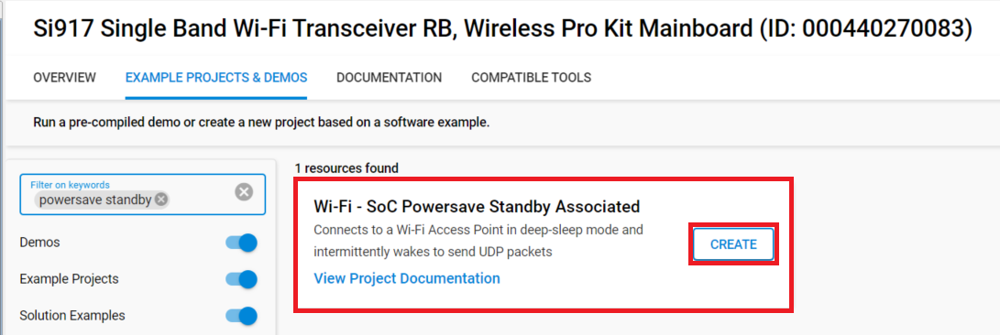
- Click 'Create'. The "New Project Wizard" window appears. Click 'Finish'
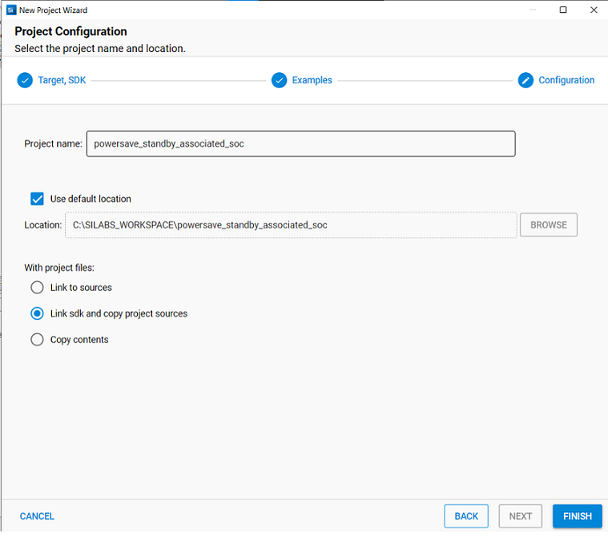

#### Build Project - SoC Mode :

- Once the project is created, right click on project and go to properties → C/C++ Build → Settings → Build Steps
- Add post_build_script_SimplicityStudio.bat file path (SI917_COMBO_SDK.X.X.X.XX\utilities\isp_scripts_common_flash) in build steps settings as shown in below image.
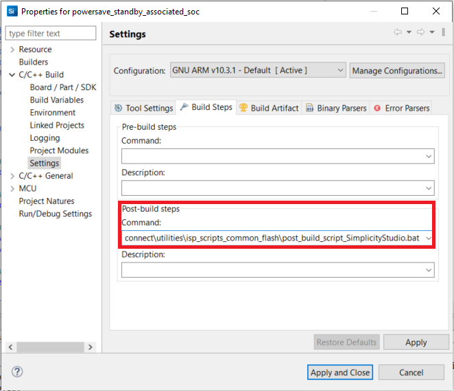
- Check for M4 projects macros in preprocessor settings(RSI_M4_INTERFACE=1)
- Check for 9117 macro in preprocessor settings(CHIP_9117=1).
- Click on the build icon (hammer) to build the project

- Successful build output will show as below.
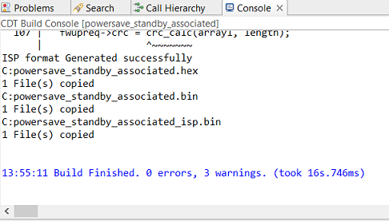

#### Build Project - NCP Mode :

- Check for 9117 macro in preprocessor settings(CHIP_9117=1).
- Click on the build icon (hammer) to build the project

- Successful build output will show as below.


## Program the device
Once the build was successful, right click on project and click on Debug As->Silicon Labs ARM Program as shown in below image.
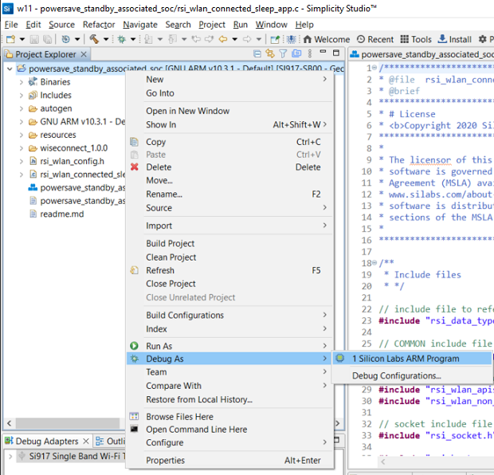
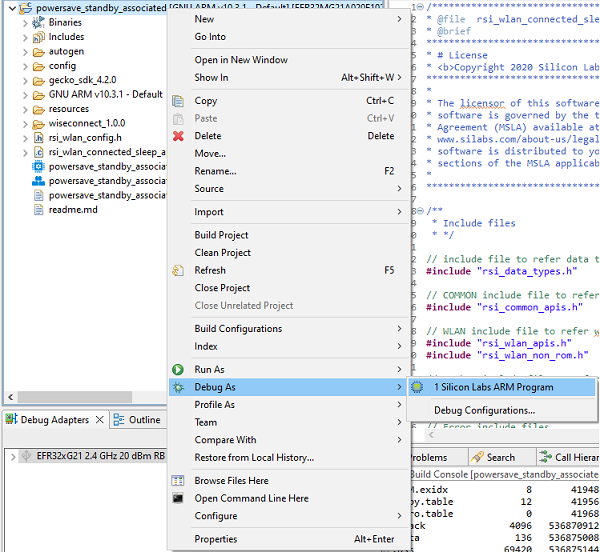

# Running the SiWx91x Application - UDP Data Transfer

To enable the feature for data transfer with remote UDP server, follow the steps given below.
> - Open the project in Simplicity Studio
> - Right click on the project and choose 'Properties'
> - Go to 'C/C++ Build' | 'Settings' | 'GNU ARM C Compiler' | 'Preprocessor' and add the macro 'ENABLE_DATA_TRANSFER_DEMO=1'
> - Select 'Apply' and 'OK' to save the settings

With the feature now enabled, open a command prompt on the remote PC connected to the Wi-Fi access point.
Start a UDP server using the below command in command prompt.

> `C:\ iperf.exe –s -u -p <SERVER_PORT> -i 1` 


> If the IPerf server does not start and gives an error in the form of "Access Denied", the user can resolve this error by running the command prompt as an administrator.

When the powersave application runs, SiWx91x scans and connect to the Wi-Fi access point and obtains an IP address. After a successful connection, the device goes into configured power save and sends configured number of UDP packets to the remote peer which is connected to access point. The following image shows active reception of UDP data on the UDP server.
 


## Observing the output prints on serial terminal

### SoC Mode:
> Connect USB to UART connector Tx and GND pins to WSTK radio board.

   - Connect Tx(Pin-6) to P27 on WSTK
   - Connect GND(Pin 8 or 10) to GND on WSTK

> Prints can see as below in any Console terminal
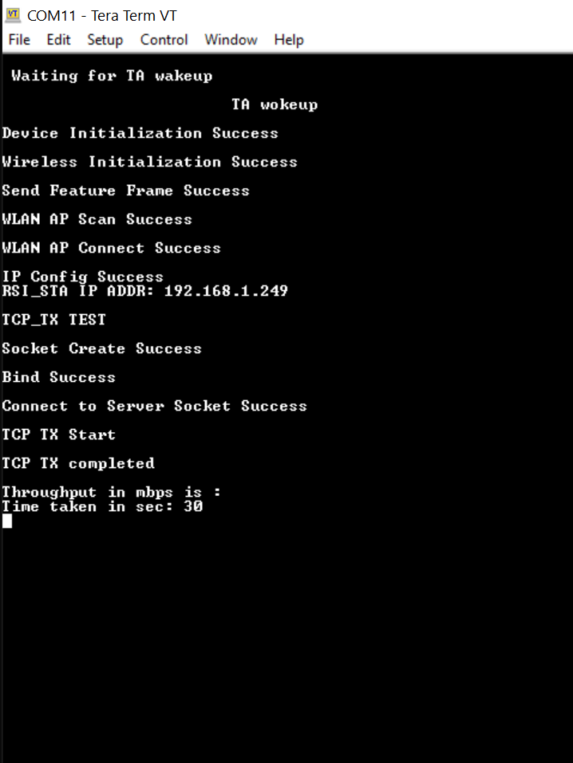
### NCP Mode:
Prints can see as below in any Console terminal


# Selecting Bare Metal
The application has been designed to work with FreeRTOS and Bare Metal configurations. By default, the application project files (Simplicity Studio) are configured with FreeRTOS enabled. The following steps demonstrate how to configure Simplicity Studio to test the application in a Bare Metal environment.

## Bare Metal with Simplicity Studio
> - Open the project in Simplicity Studio
> - Right click on the project and choose 'Properties'
> - Go to 'C/C++ Build' | 'Settings' | 'GNU ARM C Compiler' | 'Symbols' and remove macro 'RSI_WITH_OS=1'
> - Select 'Apply' and 'OK' to save the settings

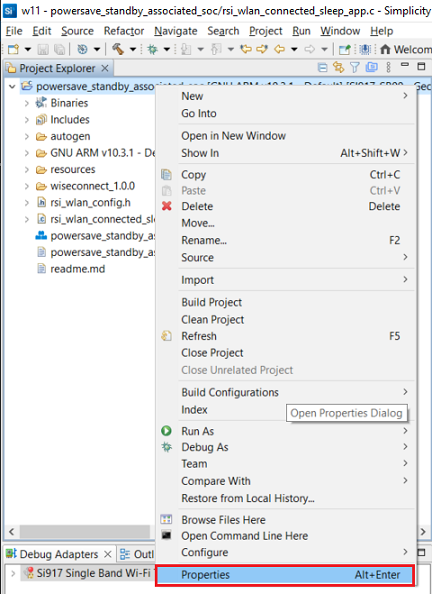 

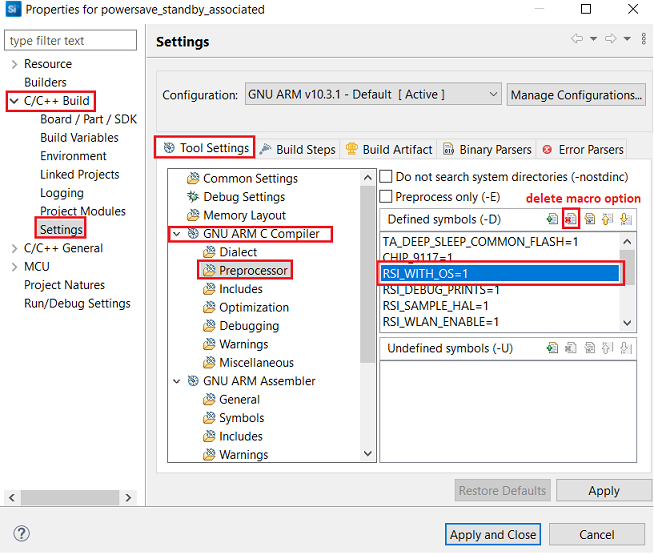
