# WLAN RF Test

## 1 Introduction
This application demonstrates how to configure the SiWx91x to transmit Wi-Fi packets at varying data rates and power levels. The application can be used to assist with regulatory certification testing. 

## 2 Setting Up
To use this application, the following hardware, software and project setup is required.

### Hardware Requirements  
- Windows PC.
-  Spectrum Analyzer and RF connector 
-  Signal Generator and RF connectors 
- SiWx91x Wi-Fi Evaluation Kit
  - **SoC Mode**: 
      - Silicon Labs [BRD4325A](https://www.silabs.com/)
  - **NCP Mode**:
      - Silicon Labs [(BRD4180A, BRD4280B)](https://www.silabs.com/)
      - Host MCU Eval Kit. This example has been tested with:
        - Silicon Labs [WSTK + EFR32MG21](https://www.silabs.com/development-tools/wireless/efr32xg21-bluetooth-starter-kit)

#### Soc Mode : 

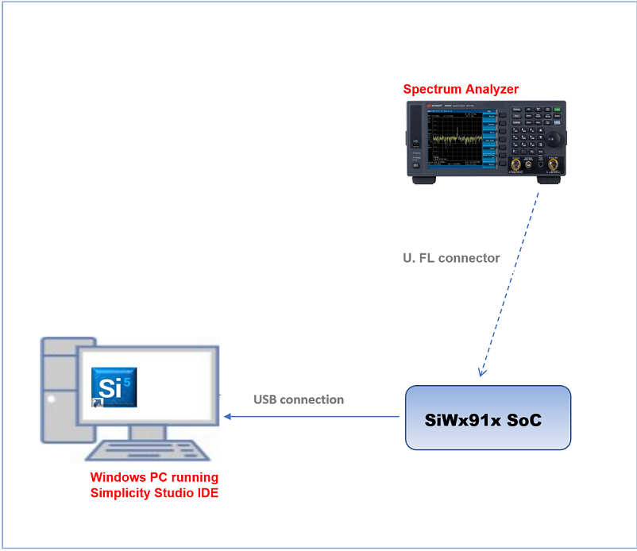

Follow the  Follow the [Getting Started with SiWx91x SoC](https://docs.silabs.com/) to setup the example to work with SiWx91x SoC and Simplicity Studio.
  
#### NCP Mode :  

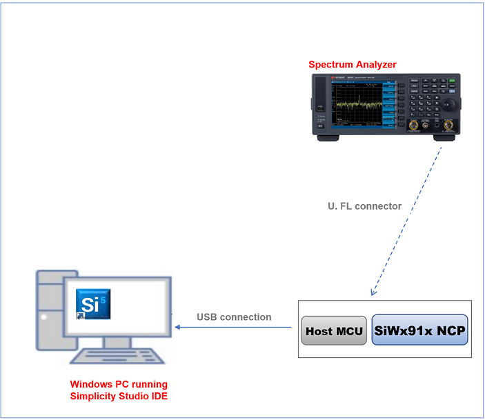

Follow the [Getting Started with EFx32](https://docs.silabs.com/rs9116-wiseconnect/latest/wifibt-wc-getting-started-with-efx32/) to setup the example to work with EFx32 and Simplicity Studio.

**NOTE:** 
By default, The radio is mapped to internal antenna path. To perform RF measurements, the signal path has to be shifted towards the U.FL port. 
To change the signal path, the following hardware changes are required (for both SoC and NCP modes) - 
1) Unmount C24 
2) Mount R22 

This hardware change is required only for the Transmit Performance and Regulatory Testing example. While testing the other applications, the hardware changes have to be reverted (Mount C24 and Unmount R22) for the board to function normally.

SoC

  

NCP

  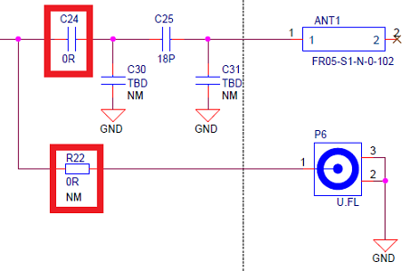

**NOTE**: 
- The Host MCU platform (EFR32MG21) and the SiWx91x interact with each other through the SPI interface. 
- The Host MCU platform (EFM32GG11) and the SiWx91x interact with each other through the SDIO interface.

## 3 Creating the project

### 3.1 Board detection

### 3.1.1 SoC mode
1. In the Simplicity Studio IDE, 
    - The 917 SoC board will be detected under **Debug Adapters** pane as shown below.

      ****

### 3.1.2 NCP mode

1. In the Simplicity Studio IDE, 
    - The EFR32 board will be detected under **Debug Adapters** pane as shown below.

      ****

    - The EFM32 board will be detected under **Debug Adapters** pane as shown below.

      ****

### 3.2 Creation of project

Ensure the latest Gecko SDK along with the extension Si917 COMBO SDK is added to Simplicity Studio.

1. Click on the board detected and go to **EXAMPLE PROJECTS & DEMOS** section.

   ****

2. Filter for Wi-Fi examples from the Gecko SDK added. For this, check the *Wi-Fi* checkbox under **Wireless Technology** and *Gecko SDK Suite* checkbox under **Provider**. 

3. Under provider, for SoC based example, check the *SoC* checkbox and for NCP based example, check the *NCP* checkbox.

4. Now choose Wi-Fi- NCP Transmit Performance and Regulatory Testing example for NCP mode or choose Wi-Fi- SoC Transmit Performance and Regulatory Testing example for SoC mode and click on **Create**.
  For NCP mode:

   **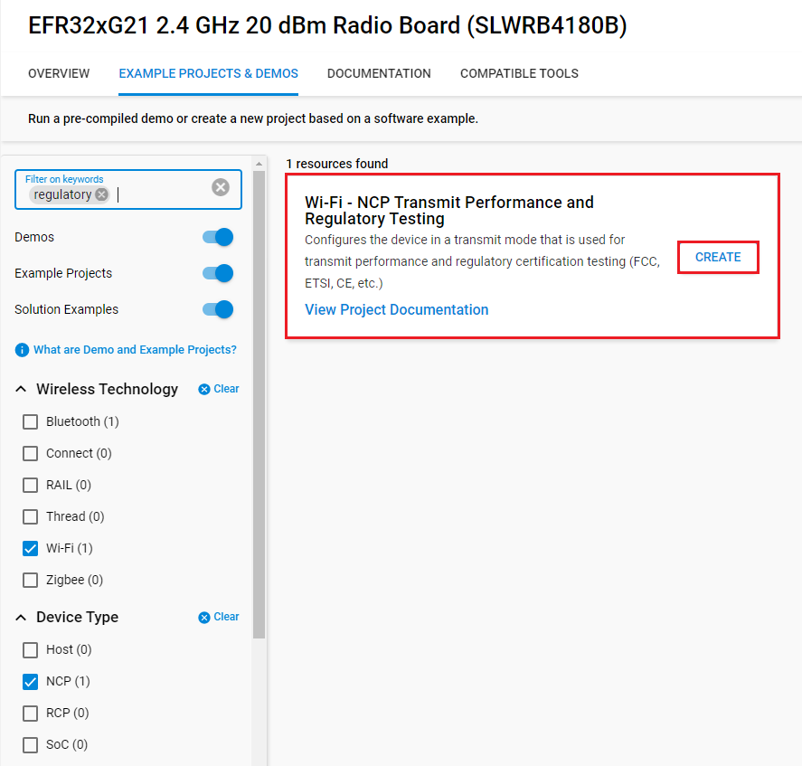**

    For SoC mode:
      
   **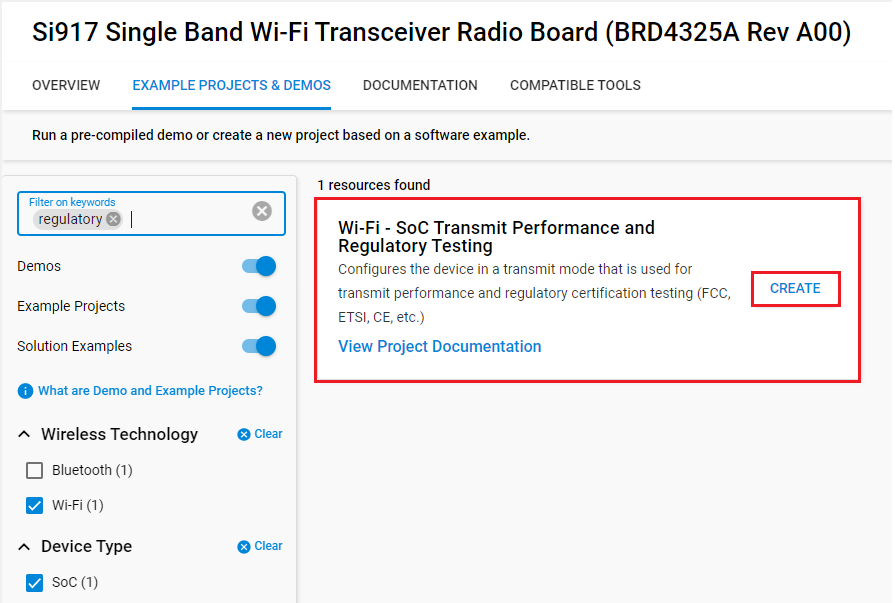**

5. Give the desired name to your project and cick on **Finish**.

   **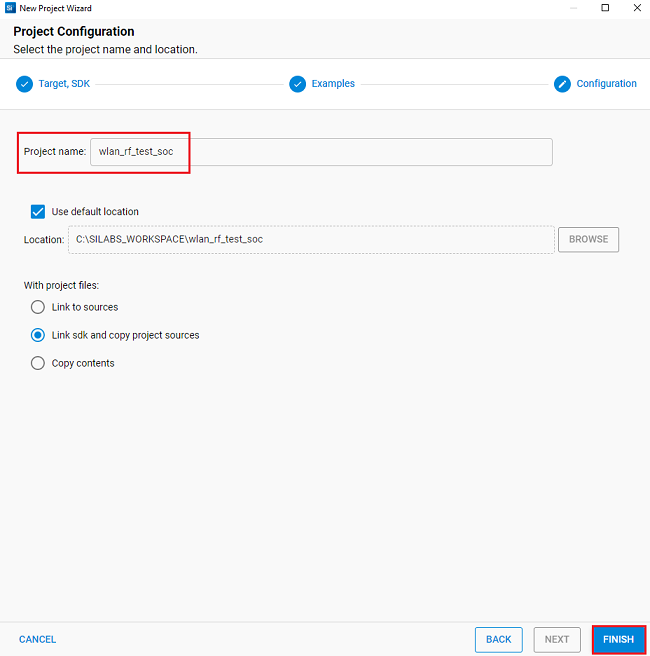**

## 4 Configuring the Application
The application can be configured to suit your requirements and development environment.
Read through the following sections and make any changes needed. 

### NCP Mode - Host Interface

* By default, the application is configured to use the SPI bus for interfacing between Host platforms(EFR32MG21) and the SiWx91x EVK.


### Bare Metal/RTOS Support
To select a bare metal configuration, see [Selecting bare metal](#7-selecting-bare-metal).

### Wi-Fi Radio Configuration
Configure the following parameters in **rsi_wlan_rf_test.c**

```c
  #define RSI_TX_TEST_POWER    4               // Tx RF power in the range [2:18] dBm
  #define RSI_TX_TEST_RATE     RSI_RATE_1      // WLAN data rate, see sapi/include/rsi_wlan_apis.h for details
  #define RSI_TX_TEST_LENGTH   30              // Tx packet length in the range [24:1500] bytes in burst mode, 
                                               //                               [24:260 ] bytes in continuous mode
  #define RSI_TX_TEST_MODE     RSI_BURST_MODE  // Selects burst mode or continuous mode
  #define RSI_TX_TEST_CHANNEL  1               // Channel number in 2.4 or 5 GHz
  #define RSI_ANTENNA          1               // 0 = RF_OUT2, 1 = RF_OUT1
  #define RSI_ANTENNA_GAIN_2G  0               // Gain in 2.4 GHz band in the range [0:10]
  #define RSI_ANTENNA_GAIN_5G  0               // Gain in 5 GHz band in the range [0:10]
  #define RSI_TX_TEST_NUM_PKTS  0               // To configure number of packets to be sent.
                                                // If the macro is set as n, then n number of packets will be 
                                                // sent on-air, after that transmission will be stopped.
                                                // If this macro is set as 0 then packets will be sent 
                                                // continuously until user stops the transmission.
```

## 5 Building and Testing the Application

Follow the below steps for the successful execution of the application.

### 5.1 Loading the SiWx91x Firmware

Refer [Getting started with a PC](https://docs.silabs.com/rs9116/latest/wiseconnect-getting-started) to load the firmware into SiWx91x EVK. The firmware file is located in `<SDK>/firmware/`

### 5.2 Building the Project
#### 5.2.1 Building the Project - SoC Mode

- Once the project is created, right click on project and go to properties → C/C++ Build → Settings → Build Steps.

- Add **post_build_script_SimplicityStudio.bat** file path present at SI917_COMBO_SDK.X.X.X.XX → utilities → isp_scripts_common_flash in build steps settings as shown in below image.

  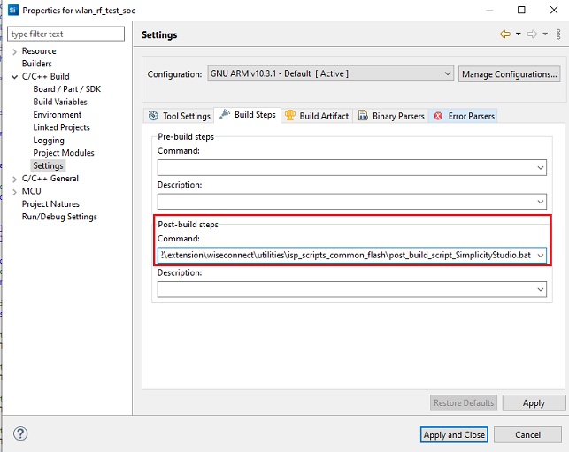

- Go to properties → C/C++ Build → Settings → Tool Settings → GNU ARM C Compiler → Preprocessor → Defined symbols (-D) and check for M4 projects macro (RSI_M4_INTERFACE=1) and 9117 macro (CHIP_9117=1). If not present, add the macros and click **Apply and Close**.
  
  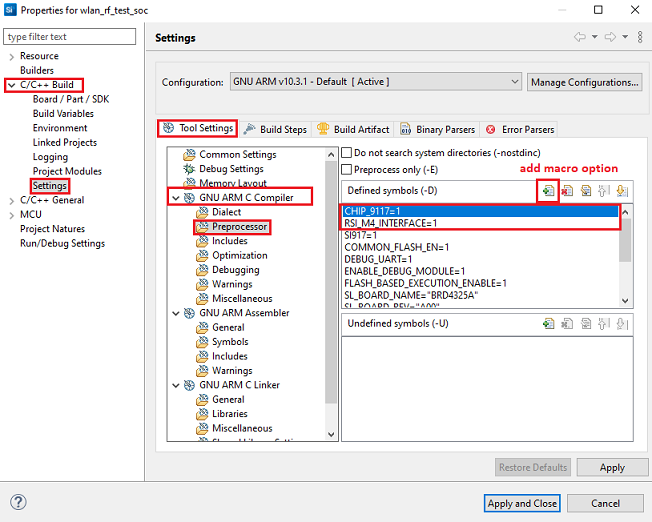

- Click on the build icon (hammer) or right click on project name and choose **Build Project** to build the project.

  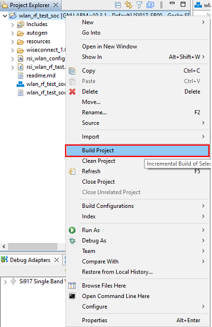

- Make sure the build returns 0 Errors and 0 Warnings.
  

#### 5.2.2 Build the Project - NCP Mode

- Check for CHIP_9117 macro in preprocessor settings as mentioned below.
   - Right click on project name.
   - Go to properties → C/C++ Build → Settings → Tool Settings → GNU ARM C Compiler → Preprocessor → Defined symbols (-D).
   - If CHIP_9117 macro is not present, add it by clicking on add macro option.
   - Click on **Apply and Close**.

     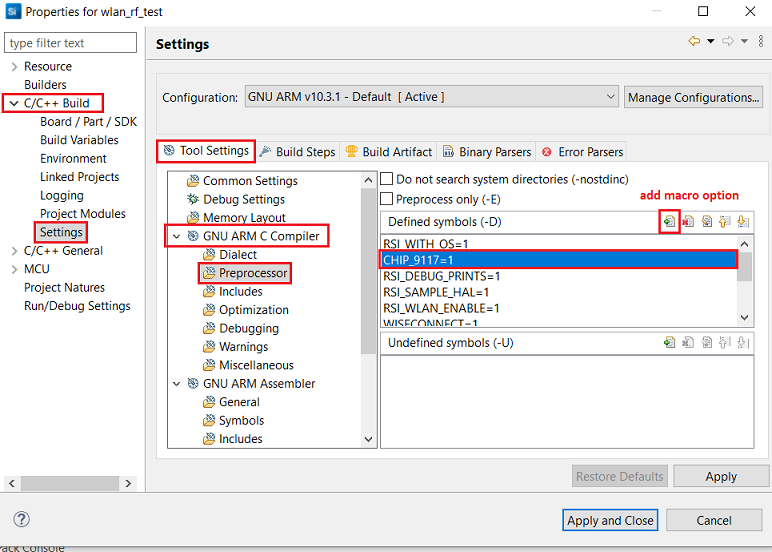

- Click on the build icon (hammer) or right click on project name and choose **Build Project** to build the project.

  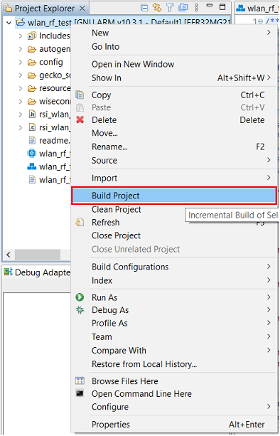

- Make sure the build returns 0 Errors and 0 Warnings.

### 5.3 Set up for application prints

Before setting up Tera Term, do the following for SoC mode.

**SoC mode**: 
You can use either of the below USB to UART converters for application prints.
1. Set up using USB to UART converter board.

  - Connect Tx (Pin-6) to P27 on WSTK
  - Connect GND (Pin 8 or 10) to GND on WSTK

    

2. Set up using USB to UART converter cable.

  - Connect RX (Pin 5) of TTL convertor to P27 on WSTK
  - Connect GND (Pin1) of TTL convertor to GND on WSTK

    

**Tera term set up - for NCP and SoC modes**

1. Open the Tera Term tool. 
   - For SoC mode, choose the serial port to which USB to UART converter is connected and click on **OK**. 

     ****

   - For NCP mode, choose the J-Link port and click on **OK**.

     ****

2. Navigate to the Setup → Serial port and update the baud rate to **115200** and click on **OK**.

    ****

    ****

The serial port is now connected. 

### 5.4 Execute the application

1. Once the build was successful, right click on project and select Debug As → Silicon Labs ARM Program to program the device as shown in below image.

   **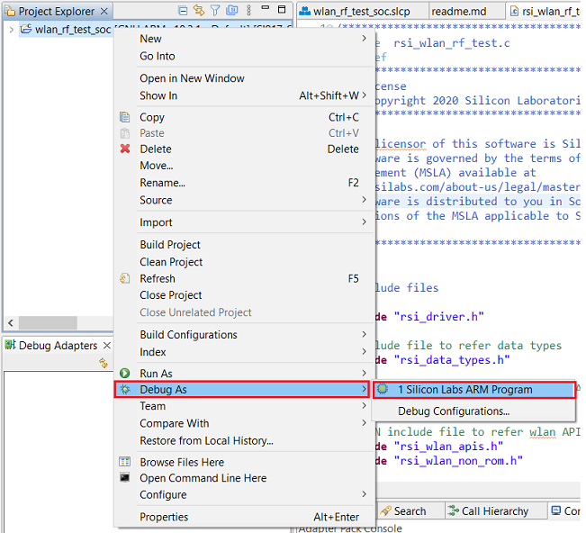**

2. As soon as the debug process is completed, the application control branches to the main().

3. Click on the **Resume** icon in the Simplicity Studio IDE toolbar to run the application.

   ****

## 6 Run the Application

When the application runs, the SiWx91x starts transmitting using the configuration settings. A power meter or spectrum analyzer may be used to monitor the RF output power and spectrum.

The following readme provides example spectrums when the SiWx91x is configured to transmit with the settings shown.

## Transmit Spectrum Example 
```c
  #define RSI_TX_TEST_POWER    127                     
  #define RSI_TX_TEST_RATE     6                     
  #define RSI_TX_TEST_LENGTH   100                   
  #define RSI_TX_TEST_MODE     RSI_CONTINUOUS_MODE   
  #define RSI_TX_TEST_CHANNEL  6                     
```

The below result is for PER Mode with Channel '6' with 6 Mbps data rate and max 127 power index, in Continuous mode, OFDM modulation technique.

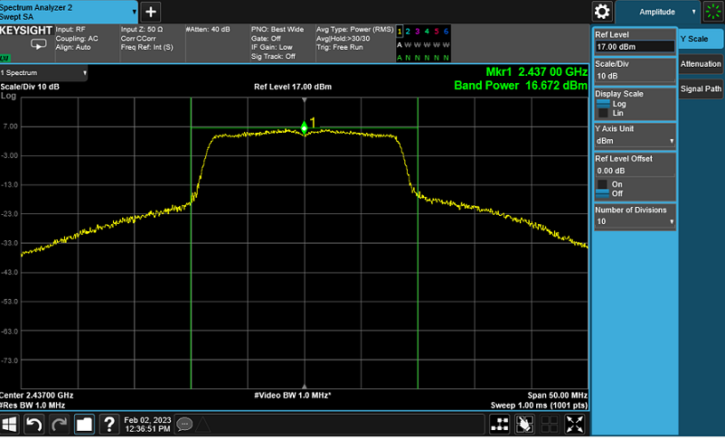

```c
  #define RSI_TX_TEST_POWER    127                     
  #define RSI_TX_TEST_RATE     6                     
  #define RSI_TX_TEST_LENGTH   1000                  
  #define RSI_TX_TEST_MODE     RSI_BURST_MODE        
  #define RSI_TX_TEST_CHANNEL  6                     
```

The below result is for PER Mode with Channel '6' with 6 Mbps data rate and max 127 power index, in Burst mode, OFDM modulation technique.


### Application Prints

#### SoC mode

  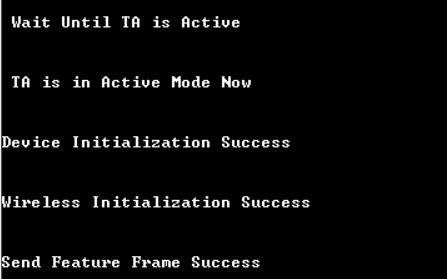

#### NCP mode

  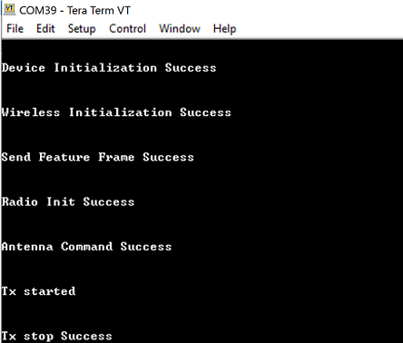


## 7 Selecting Bare Metal
The application has been designed to work with FreeRTOS and Bare Metal configurations. By default, the application project files (Simplicity studio) are configured with FreeRTOS enabled. The following steps demonstrate how to configure Simplicity Studio to test the application in a Bare Metal environment.

## Bare Metal with Simplicity Studio
> - Open the project in Simplicity Studio
> - Right click on the project and choose 'Properties'
> - Go to 'C/C++ Build' | 'Settings' | 'GNU ARM C Compiler' | 'Preprocessor' and remove macro 'RSI_WITH_OS=1'
> - Select 'Apply' and 'OK' to save the settings

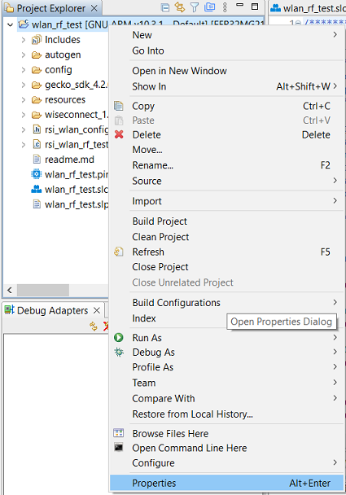 

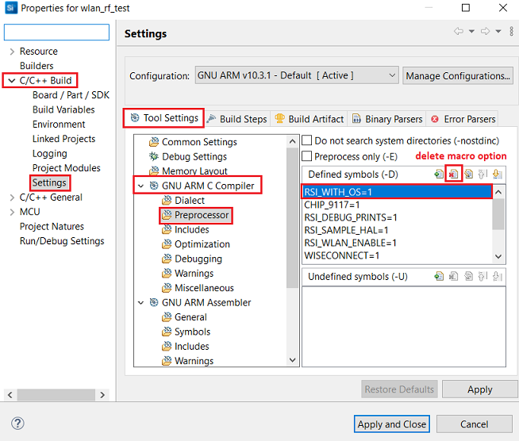
