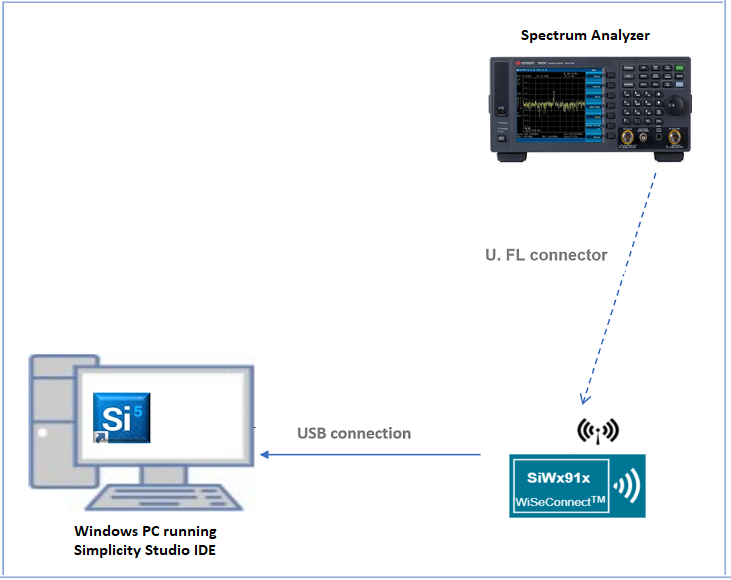
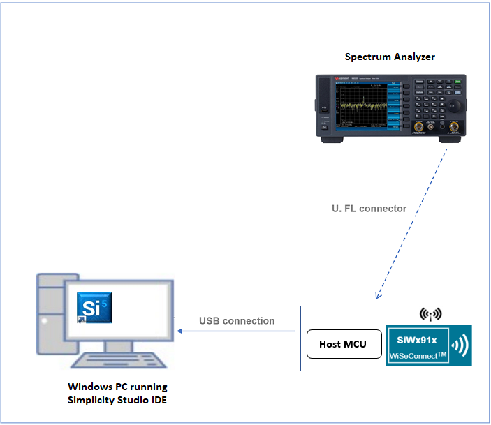
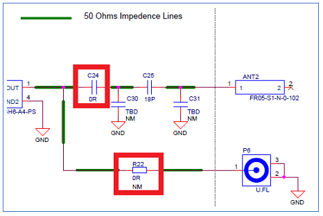
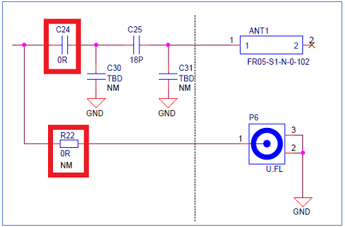
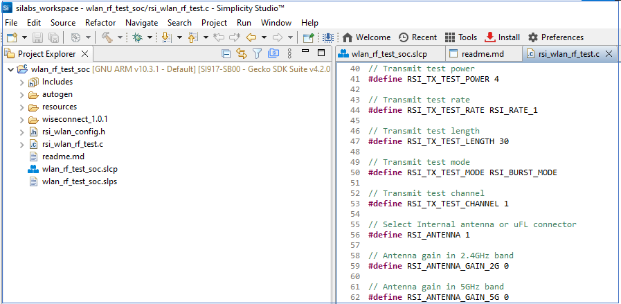
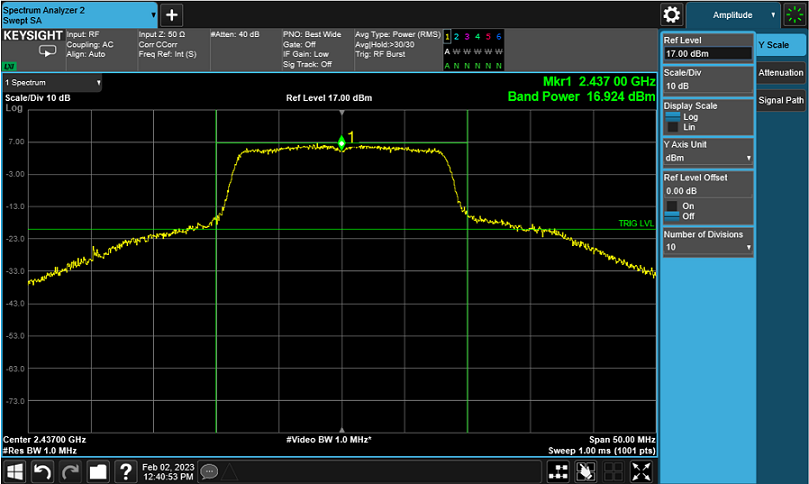
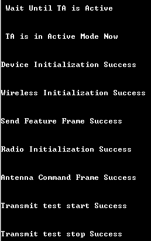
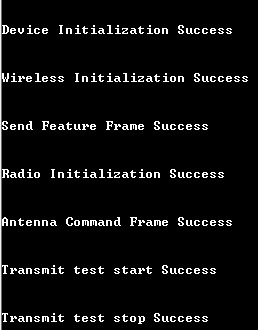

# **WLAN RF Test**

## **1 Introduction**
This application demonstrates how to configure the SiWx91x to transmit Wi-Fi packets at varying data rates and power levels. The application can be used to assist with regulatory certification testing. 

## **2 Prerequisites**
For this application, the following are required:

### **2.1 Hardware Requirements**  
- A Windows PC
- Spectrum Analyzer and RF connectors 
- Signal Generator and RF connectors 
#### **2.1.1 SoC** 
   - Silicon Labs SiWx917 PK6030A SoC Kit which includes
      - BRD4001A/BRD4002A Wireless Starter Kit Mainboard
      - BRD4325A Radio Board
   - USB TO UART converter or TTL cable
#### **2.1.2 NCP**
   - Silicon Labs PCB8036A Si917 QMS SB Expansion Board
   - [Silicon Labs SLWSTK6006A EFR32xG21 Wireless Starter Kit](https://www.silabs.com/development-tools/wireless/efr32xg21-wireless-starter-kit) which includes
      - BRD4001A/BRD4002A Wireless Starter Kit Mainboard
      - BRD4180A/BRD4180B Radio Board

### **2.2 Software Requirements**
- Simplicity Studio IDE
   - To download and install the Simplicity Studio IDE, refer the [Simplicity Studio IDE Set up]() section in ***Getting started with SiWx91x*** guides.
- SiWx917_WiSeConnect_SDK.x.x.x.x
- Tera Term software or any other serial terminal software 

## **3 Set up diagram**

### **3.1 SoC** 



### **3.2 NCP** 



**NOTE**: 
The Host MCU platform (EFR32xG21) and the SiWx91x interact with each other through the SPI interface. 

## **4 Set up**

### **4.1 SoC/NCP** 
- Follow the [Hardware connections and Simplicity Studio IDE Set up]()  section in the respective ***Getting Started with SiWx91x*** guides to make the hardware connections and add the Gecko and SiWx91x COMBO SDKs to Simplicity Studio IDE.
### **4.2 SiWx91x module's Firmware Update**
- Ensure the SiWx91x module is loaded with the latest firmware following the [SiWx91x Firmware Update]() section in the respective ***Getting started with SiWx91x*** guides.

## **5 Hardware changes for RF measurements**

By default, The radio is mapped to internal antenna path. To perform RF measurements, the signal path has to be shifted towards the U.FL port. 
To change the signal path, the following hardware changes are required (for both SoC and NCP modes) - 
1) Unmount C24 
2) Mount R22 

This hardware change is required only for the Transmit Performance and Regulatory Testing example. While testing the other applications, the hardware changes have to be reverted (Mount C24 and Unmount R22) for the board to function normally.

SoC

  

NCP

  

## **6 Project creation**

To create the example project in the Simplicity Studio IDE, follow the [Creation of Project]() section in the respective ***Getting started with SiWx91x*** guides. 
   - For SoC, choose the **Wi-Fi - SoC Transmit Performance and Regulatory Testing** example.
   - For NCP, choose the **Wi-Fi - NCP Transmit Performance and Regulatory Testing** example.

## **7 Application configuration**

The following application parameters can be configured as per the user requirement

In the Project explorer pane of the IDE, expand the **wlan_rf_test** folder and open the **rsi_wlan_rf_test.c** file. Configure the following parameters based on your requirements.

  

- ### Wi-Fi Radio Configuration

    ```c
      //! Tx RF power in the range of 2dBm to 18dBm
      #define RSI_TX_TEST_POWER     4               
      
      //! WLAN data rate, see sapi/include/rsi_wlan_apis.h for details
      #define RSI_TX_TEST_RATE      RSI_RATE_1      

      //! Tx packet length in the range of 24  bytes to 1500 bytes in burst mode and 24 bytes to 260 bytes in continuous mode
      #define RSI_TX_TEST_LENGTH    30              
      
      //! Selects burst mode or continuous mode
      #define RSI_TX_TEST_MODE      RSI_BURST_MODE  
      
      //! Channel number
      #define RSI_TX_TEST_CHANNEL   1               
      
      //! 0 = RF_OUT2, 1 = RF_OUT1
      #define RSI_ANTENNA           1               
      
      //! Gain in 2.4 GHz band in the range of 0 to 10
      #define RSI_ANTENNA_GAIN_2G   0               
      
      //! Gain in 5 GHz band in the range of 0 to 10
      #define RSI_ANTENNA_GAIN_5G   0               
      
      // To configure number of packets to be sent.
      // If the macro is set as n, then n number of packets will be sent on-air, after which transmission is stopped.
      // If this macro is set as 0 then packets will be sent continuously until the user stops transmission.
      #define RSI_TX_TEST_NUM_PKTS  0               
    ```

## **8 Setup for Serial Prints**

To Setup the serial prints, follow the [Setup for Serial Prints]() section in the respective ***Getting started with SiWx91x*** guides.
 
## **9 Build, Flash, and Run the Application**

To build, flash, and run the application project refer to the [Build and Flash the Project]() section in the respective ***Getting Started with SiWx91x*** guide.

## **10 Application Execution Flow**

When the application runs, the SiWx91x module starts transmitting using the configuration settings. A spectrum analyzer may be used to monitor the RF output power and spectrum.

## Transmit Spectrum Example 
```c
  #define RSI_TX_TEST_POWER    127                     
  #define RSI_TX_TEST_RATE     6                     
  #define RSI_TX_TEST_LENGTH   100                   
  #define RSI_TX_TEST_MODE     RSI_CONTINUOUS_MODE   
  #define RSI_TX_TEST_CHANNEL  6                     
```

The below result is for PER Mode with Channel '6' with 6 Mbps data rate and max 127 power index, in Continuous mode, OFDM modulation technique.


```c
  #define RSI_TX_TEST_POWER    127                     
  #define RSI_TX_TEST_RATE     6                     
  #define RSI_TX_TEST_LENGTH   1000                  
  #define RSI_TX_TEST_MODE     RSI_BURST_MODE        
  #define RSI_TX_TEST_CHANNEL  6                     
```

The below result is for PER Mode with Channel '6' with 6 Mbps data rate and max 127 power index, in Burst mode, OFDM modulation technique.



The application prints can be observed as follows:

**SoC:**

  

**NCP:**

  

## **Appendix**

By default, the application runs over FreeRTOS. To run the application with Bare metal configurations, follow the Bare Metal configuration section in the ***Getting Started with SiWx91x*** guides.
