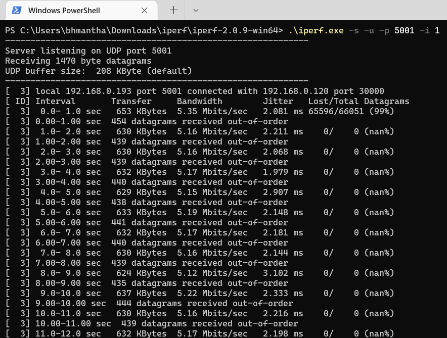
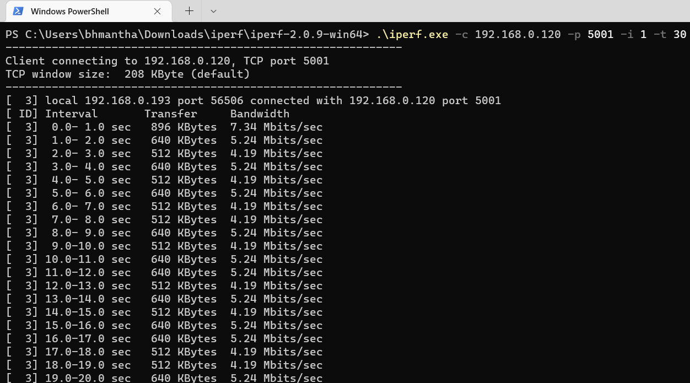

# **WLAN Throughput**

## **1 Introduction**

This application demonstrates the procedure to measure WLAN UDP/TCP/SSL throughput by configuring the SiWx91x module in Client/Server role.
In this application, the SiWx91x module connects to a Wi-Fi access point, obtains an IP address, connects to the Iperf Server/Client or python based SSL scripts running on a remote PC and measures Tx/Rx throughput transmitted/received from the remote PC.

## **2 Prerequisites** 

For this application, you will need the following:

### **2.1 Hardware Requirements**

- A Windows PC

- A Wireless Access Point

#### **2.1.1 SoC** 

   - Silicon Labs SiWx917 PK6030A SoC Kit which includes
      - BRD4001A/BRD4002A Wireless Starter Kit Mainboard
      - BRD4325A Radio Board
   - USB TO UART converter or TTL cable
   
#### **2.1.2 NCP**

   - Silicon Labs BRD8036A Si917 QMS SB Expansion Board
   - [Silicon Labs SLWSTK6006A EFR32xG21 Wireless Starter Kit](https://www.silabs.com/development-tools/wireless/efr32xg21-wireless-starter-kit) which includes
      - BRD4001A/BRD4002A Wireless Starter Kit Mainboard
      - BRD4180A/BRD4180B Radio Board

### **2.2 Software Requirements**

- Simplicity Studio IDE
   - To download and install the Simplicity Studio IDE, refer to the [Simplicity Studio IDE Set up](https://docs.silabs.com/) section in ***Getting started with SiWx91x*** guides.

- SiWx917_WiSeConnect_SDK.x.x.x.x
  
- Tera Term software or any other serial terminal software - for viewing application prints

- [Iperf application](https://iperf.fr/iperf-download.php) - to run TCP/UDP Client/Server

## **3 Setup diagram**

### **3.1 SoC** 


  
### **3.2 NCP**  


**NOTE**: 
- The Host MCU platform (EFR32xG21) and the SiWx91x module interact with each other through the SPI interface.

## **4 Set up**

### **4.1 SoC/NCP** 

- Follow the [Hardware connections and Simplicity Studio IDE Set up](https://docs.silabs.com/) section in the respective ***Getting Started with SiWx91x*** guides to make the hardware connections and add the Gecko and SiWx91x COMBO SDKs to the Simplicity Studio IDE.

### **4.2 SiWx91x module's Firmware Update**

- Ensure the SiWx91x module is loaded with the latest firmware following the [SiWx91x Firmware Update](https://docs.silabs.com/rs9116/latest/wiseconnect-getting-started) section in the respective ***Getting started with SiWx91x*** guides.

## **5 Project Creation**

- To create the Throughput example project in the Simplicity Studio IDE, follow the [Creation of Project](https://docs.silabs.com/) section in the respective ***Getting started with SiWx91x*** guides. 
   - For SoC, choose the **Wi-Fi - SoC Wi-Fi - Throughput Test** example.
   - For NCP, choose the **Wi-Fi - NCP Wi-Fi - Throughput Test** example.

## **6 Application configuration**

Go through the following parameters and make configurations as per your requirements.

1. In the Project explorer pane of the IDE, expand the **wlan_throughput** folder and open the **rsi_throughput_app.c** file. Configure the following parameters based on your requirements.

    

### **Access Point parameters**
  
  - Configure the following parameters in **rsi_throughput_app.c** to connect the SiWx91x module to the Access Point network.

    ```c
    //! SSID of the Wi-Fi Access Point
    #define SSID                           "SILABS_AP" 
    
    //! SECURITY_TYPE refers to the security mode of the Access Point to which the SiWx91x module has to connect.
    #define SECURITY_TYPE                  RSI_WPA2 

    //! PSK refers to the secret key if the Access point is configured in WPA-PSK/WPA2-PSK security modes.     
    #define PSK                            "1234567890" 
    ```  
               
### **Client/Server IP Settings**
 
  - Configure the Server/device port and IP addresses.

     ```c
     //! Local port number on the SiWx91x module
     #define PORT_NUM                       <local_port>
     
     //! Remote server port number
     #define SERVER_PORT                    <remote_port>
     
     //! Remote server IP address  
     #define SERVER_IP_ADDRESS             "192.168.0.100"    
     ```

### **Throughput Measurement Types**

  - The application can be configured to measure throughput using UDP, TCP, or SSL.

    ```c
    //! SiWx91x transmits packets to remote TCP Client
    #define TCP_TX                                0
  	
    //! SiWx91x receives packets from remote TCP Server
    #define TCP_RX                                 1			

     //! SiWx91x transmits packets to remote UDP client
     #define UDP_TX                                 2	

    //! SiWx91x receives packets from remote UDP server
    #define UDP_RX                                 3

    //! SiWx91x transmits packets to remote SSL client
    #define SSL_TX                                 4

    //! SiWx91x receives packets from remote SSL server			
    #define SSL_RX                                 5			

    //! The application can be configured to measure throughput using UDP, TCP or SSL/TLS via the THROUGHPUT_TYPE macro.
    #define THROUGHPUT_TYPE                      TCP_TX     
    ```

**SiWx91x is a TCP Client (sends TCP packets to a remote server)**:

  

**SiWx91x is a TCP Server (receives TCP packets from a remote client)**:


**SiWx91x is a UDP Client (sends UDP packets to a remote server)**:


**SiWx91x is a UDP Server (receives UDP packets from a remote client)**:


**SiWx91x is a SSL Client (sends SSL packets to a remote server)**:


**SiWx91x is a SSL Server (receives SSL packets from a remote client)**:


### **Throughput Options**

Various options are available to customize throughput measurements. Some options apply only for specific throughput types as described in the following sections.

### **Discrete Interval Measurements (applicable for UDP Rx and SSL Tx)**

- The maximum number of packets to be received or transmitted.
  ```c
  #define MAX_TX_PKTS                            10000
  ```
The default value of *MAX_TX_PKTS* is 10000. To measure throughput for higher intervals, make the following changes:
- *UDP Rx*: Increase the value of *MAX_TX_PKTS* and provide a higher interval in the corresponding iperf command
- *SSL Tx*: Increase the value of *MAX_TX_PKTS* and update the equivalent value in *SSL_Server_throughput_d.py* located in the release directory **SiWx91x SDK → resources → scripts**.

### **Discrete Interval Measurements (applicable for UDP Tx/TCP Tx/TCP Rx/SSL Rx)**

- The average time for measuring the throughput.

  ```c
  #define THROUGHPUT_AVG_TIME                    30000   
  ```
- *TCP Rx*: Configure the interval desired using the corresponding iperf command
- *SSL Rx*: Increase the packet count in *SSL_tx_throughput.py* located in the release directory **SiWx91x SDK → resources → scripts**.

### **Continous Throughput Measurements**

- Configure the following parameter for continuous throughput measurement.

  ```c
  #define CONTINUOUS_THROUGHPUT                    0
  ```

**CONTINUOUS_THROUGHPUT = 0** (default value)
- Throughput is calculated only once for interval of 
  - *THROUGHPUT_AVG_TIME* in case of UDP TX/TCP TX 
  - *MAX_TX_PKTS* in case of UDP RX/SSL TX  
- The time interval is provided by the server in case of TCP RX.
- Default packet count is provided in server *SSL_tx_throughput.py* in case of *SSL RX*.

**CONTINUOUS_THROUGHPUT = 1**
- The application measures throughput continuously for every interval of *THROUGHPUT_AVG_TIME* regardless of *THROUGHPUT_TYPE*, when provided with the following configuration. 
  - UDP Rx/TCP Rx : Configure high interval greater than *THROUGHPUT_AVG_TIME*.
  - SSL Rx/SSL Tx : Increase packet count to the maximum in the scripts *SSL_tx_throughput.py* and *SSL_Server_throughput_d.py*.

**Note!**

If **CONTINUOUS_THROUGHPUT = 1**, ensure that the SiWx91x Client/Server runs with an interval greater than *THROUGHPUT_AVG_TIME*.

## **7 Setup for Serial Prints**

### **7.1 SoC** 

1. The USB to UART converter/TTL cable is required for getting application prints in case of SoC. To connect USB TO UART converter/TTL cable to EFx32, refer to the [application prints set up for SoC](https://docs.silabs.com/) in Getting Started with SiWx91x SoC guide.

2. Once done with the connections, refer to the [Tera Term Set up](https://docs.silabs.com/) section in the ***Getting Started with SiWx91x SoC*** guide.

### **7.2 NCP**

To view the application prints, refer to the [Tera Term Set up](https://docs.silabs.com/) section in the ***Getting Started with SiWx91x NCP*** guide.

## **8 Build, Flash, and Run the Application**

### **8.1 SoC**

To build, flash, and run the application project refer to the [Build and Flash the Project](https://docs.silabs.com/) section in the ***Getting Started with SiWx91x SoC*** guide.

### **8.2 NCP**

Build, flash, and run the application project. Refer to the [Build and Flash the Project](https://docs.silabs.com/) section in the ***Getting Started with SiWx91x NCP*** guide.

## **9 Application Execution Flow**

1. After the application gets executed, the SiWx91x module connects to the Access Point and gets an IP address. 

2. **Throughput test**:
There are two 'ends' involved when measuring throughput, data is sent between the Client end and the Server end. Depending on the configuration selected, the SiWx91x module may be the Client or the Server. In general, it is advisable to start the server before the Client since the client will immediately begin to try to connect to the Server to send data. 

   **NOTE!**

   By default, the Iperf protocol sends data from the Client to the Server to measure throughput.

3. The following describe how to run the throughput application for various configurations. 

  - **UDP Tx Throughput**:
    To measure UDP Tx throughput, configure the SiWx91x module as a UDP Client and start a UDP Server on the remote PC using Iperf. The Iperf command to start the UDP Server on the PC is: 

    > `C:\> iperf.exe -s -u -p <SERVER_PORT> -i 1`
    > 
    > For example,
    >
    > `C:\> iperf.exe -s -u -p 5001 -i 1`

    

  - **UDP Rx Throughput**:
    To measure UDP Rx throughput, configure the SiWx91x module as a UDP Server and start a UDP Client on the remote PC using Iperf. The Iperf command to start the UDP Client is: 
	
    > `C:\> iperf.exe -c <Module_IP> -u -p <Module_Port> -i 1 -b <Bandwidth> -t <time interval in seconds>`
    >
    > For example ...
    >
    > `C:\> iperf.exe -c 192.168.0.100 -u -p 5001 -i 1 -b 50M -t 30`  

    

  - **TCP Tx Throughput**:
    To measure TCP Tx throughput, configure the SiWx91x module as a TCP Client and start a TCP Server on the remote PC using Iperf. The Iperf command to start the TCP Server is: 
		
    > `C:\> iperf.exe -s -p <SERVER_PORT> -i 1`
    >
    > For example ...
    >
    > `C:\> iperf.exe -s -p 5001 -i 1`

    

  - **TCP Rx Throughput**:
    To measure TCP Rx throughput, configure the SiWx91x module as TCP server and start a TCP client on the remote PC. The Iperf command to start the TCP Client is: 

    > `C:\> iperf.exe -c <Module_IP> -p <module_PORT> -i 1 -t <time interval in sec>`
    >
    > For example ...
    >
    > `C:\> iperf.exe -c 192.168.0.100 -p 5001 -i 1 -t 30`  

    

  - **SSL Tx Throughput**:
    To measure SSL Tx throughput, configure the SiWx91x module as an SSL Client and start an SSL Server on the remote PC as described below:
      - Copy the *SSL_Server_throughput_d.py* script from the release **SiWx91x SDK → resources → scripts** directory to the **SiWx91x SDK → resources → certificates** directory.
      - Open a command prompt and cd to the folder **SiWx91x SDK → resources → certificates**, then run the following command:

         `C:\> python SSL_Server_throughput_d.py`

         
         
      **Note!**

      The *SSL_Server_throughput_d.py* script works only with Python version 2.

  - **SSL Rx Throughput**:
    To measure SSL RX throughput, configure the SiWx91x module as an SSL Server and open an SSL Client on the remote PC as described below:
      - Copy the *SSL_tx_throughput.py* script from the release **SiWx91x SDK → resources → scripts** directory to the **SiWx91x SDK → resources → certificates**.
      - Open a command prompt and cd to the folder **SiWx91x SDK → resources → certificates**, then run the following command:
                    
         `C:\> python SSL_tx_throughput.py`
          
         
         
      **Note!**

      The *SSL_tx_throughput.py* script works only with Python version 2.
      
4. While the SiWx91x module is transmitting/receiving the data, application prints the throughput numbers in serial console. For example, the following prints appear for UDP Tx configuration.

  - **SoC**:
      - Application prints in case of SoC.

        

  - **NCP**:
      - Application prints in case of NCP.

        

**Note!**

In this release, due to a low SPI frequency configured for the EFR32, WLAN throughput is lower than the maximum achievable throughput. This will be addressed in the next release.

## **Appendix**

### **Bare Metal configurations**

1. By default, the application runs over FreeRTOS. To run the application with Bare metal configurations, follow the Bare Metal configuration section in the ***Getting Started with SiWx91x*** guides.
