# AWS Combo Peripheral

## Introduction

This application demonstrates how to configure SiWx91x as an IoT devices and securely connect to AWS IoT Core to subscribe and publish on a topic. The message that is published to AWS IoT Core is received from I2C Slave device (here EEPROM) thourgh I2C communication.

This application uses AWS MQTT library.
 
In this application, SiWx91x EVK is configured as Wi-Fi station and connects to an Access Point which has an internet access. After successful Wi-Fi connection, application connects to AWS Core and subscribes to a topic. Publishes a message on subscribed topic and application waits to receive the data published on subscribed topic from the cloud.

This example contains 3 tasks;
   - PWM
   - GPIO Interrupts
   - I2C
   - AWS MQTT

**1.PWM**
   - PWM task will initiate once the push button BTN1 on WSTK interrupt occurs
   - The Motor Control PWM (MCPWM) controller is used to generate a periodic pulse waveform, which is useful in motor control and power control applications 
   - The MCPWM controller acts as a timer to count up to a period count value,the time period and the duty cycle of the pulses are both programmable
   - This application uses the MCPWM driver to create 4 independent PWMs (running at the same frequency),square wave will be generated on 
  PWM_1L,PWM_1H,PWM_2L,PWM_2H

**2.I2C**
   - I2C task will initiate once the wireless initialization is done in AWS MQTT task. AWS MQTT task will be in wait state til the I2C communication is over.
   - I2C instance will be configured in master mode. The SCL and SDA lines of master controller are connected to EEPROM's SCL and SDA pins
   - EEPROM is slave device. EEPROM used here is EEPROM Serial 512-Kb I2C (CAT24C512)
   - From master the slave address is sent after START on bus and waits till it gets the ACK respose from the slave
   - The write data to EEPROM memory is based on its page write sequence
   - I2C can be configured with following features
   - I2C standard compliant bus interface with open-drain pins
   - Configurable as Master or Slave
   - Four speed modes: Standard Mode (100 kbps), Fast Mode (400 kbps), Fast Mode Plus (1Mbps) and High-Speed Mode (3.4 Mbps)
	- 7 or 10-bit addressing and combined format transfers

**3.AWS MQTT**
   - AWS MQTT task does the wireless initialization & waits for the I2C task to get the buffer message from I2C Slave Device.
   - The buffer message will be published to the topic as defined.

**Application Flow**
   
   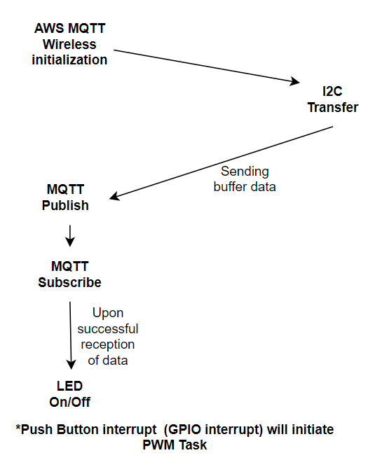

## Overview of AWS SDK

AWS IoT Core is a cloud platform which connects devices across AWS cloud services. AWS IoT provides a interface which allows the devices to communicate securely and reliably in bi-directional ways to the AWS touch-points, even when the devices are offline.

The AWS IoT Device SDK allow applications to securely connect to the AWS IoT platform.

   

## Setting Up

Before running the application, set up the following:

### Hardware Requirements 
   - A Windows PC.
   - Wireless Access point
   - SiWx91x Wi-Fi Evaluation Kit
         - **SoC Mode**: 
            - Silicon Labs [BRD4325A](https://www.silabs.com/)
   - EEPROM device

#### SoC Mode : 

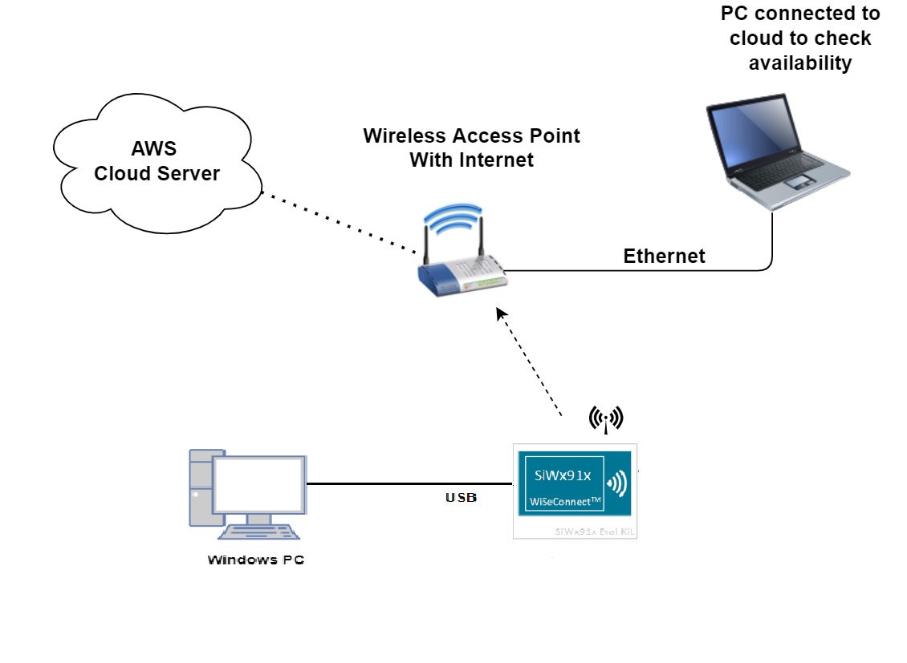

### Software Requirements
   - Si91x SDK
   - Embedded Development Environment
      - For Silicon Labs Si91x, use the latest version of Simplicity Studio (refer **"Download and Install Simplicity Studio"** section in **getting-started-with-siwx917-soc** guide at **release_package/docs/index.html**)

### Project Setup
- **SoC Mode**
   - **Silicon Labs SiWx91x SoC**. Follow the [Getting Started with SiWx91x SoC](https://docs.silabs.com/) to setup the example to work with SiWx91x SoC and Simplicity Studio.
  - **Silicon Labs Si91x** refer **"Download SDKs"**, **"Add SDK to Simplicity Studio"**, **"Connect SiWx917"**, **"Open Example Project in Simplicity Studio"** section in **getting-started-with-siwx917-soc** guide at **release_package/docs/index.html** to work with Si91x and Simplicity Studio

## Pin Configuration
**I2C0**

| PIN | GPIO PIN | Description |
| --- | --- | --- |
| SCL | ULP_GPIO_11 [EXP_HEADER-5] | Connect to EEPROM SCL pin |
| SDA | ULP_GPIO_10 [EXP_HEADER-3] | Connect to EEPROM SDA pin |

**PWM**

| PIN | GPIO PIN | Connector |
| --- | --- | --- |
| PWM_1L | GPIO_64(ULP_GPIO_0) | EXP_HEADER-9  |
| PWM_1H | GPIO_7              | P37           |
| PWM_2L | GPIO_8              | EXP_HEADER-14 |
| PWM_2H | GPIO_9              | EXP_HEADER-12 |

**GPIO Interrupt**

| GPIO PIN | Connector |
| --- | --- | 
| GPIO_11 | P15 |

## Configuring the Application
The application can be configured to suit user requirements and development environment.
Read through the following sections and make any changes needed.

### Wi-Fi Configuration
Configure the following parameters in **aws_combo_peripheral.c** to enable your Silicon Labs Wi-Fi device to connect to your Wi-Fi network.

```c
#define SSID           "SILABS_AP"      // Wi-Fi Network Name
#define PSK            "1234567890"     // Wi-Fi Password
#define SECURITY_TYPE  RSI_WPA2         // Wi-Fi Security Type: RSI_OPEN / RSI_WPA / RSI_WPA2
#define CHANNEL_NO     0                // Wi-Fi channel if the softAP is used (0 = auto select)
```
    


DHCP_MODE refers whether IP address configured through DHCP or STATIC

```c
#define DHCP_MODE                        1
```

RSI_MQTT_TOPIC refres to the topic to which the device subscribes and publishes

```c
#define RSI_MQTT_TOPIC          "$aws/things/thingsName/shadow/update"  //thingsName: This should be renamed with user's created Things name//
```

> Note:
> To configure, STA IP address through DHCP then set DHCP_MODE to "1" and skip configuring the following DEVICE_IP, GATEWAY and NETMASK macros.
> (Or)
> To configure, STA IP address through STATIC then set DHCP_MODE macro to "0" and configure following DEVICE_IP, GATEWAY and NETMASK macros.

```c
#define DEVICE_IP                        "192.168.10.10"
```

```c
#define GATEWAY                          "192.168.10.1"
```

```c
#define NETMASK                          "255.255.255.0"
```
### Power Save Configuration
Configure below parameter in **rsi_wlan_config.h** to enable power save mode
   - By default, the application is configured without power save.
  
```c
#define ENABLE_POWER_SAVE              0
```

   - If user wants to run the application in power save, modify the below macro.

```c
#define ENABLE_POWER_SAVE              1
```

### Configure below parameters in **aws_iot_config.h** file in apps/inc folder

   ```C
   #define AWS_IOT_MQTT_PORT          "8883"                               //default port for MQTT

   #define AWS_IOT_MQTT_CLIENT_ID     "Test_IoT"                           // MQTT client ID should be unique for every device and this is "Things name" which is created by user

   #define AWS_IOT_MQTT_HOST "xxxxxxxxxxxxx-ats.iot.us-east-2.amazonaws.com"
   ```

- AWS_IOT_MQTT_HOST parameter can be found as follows:

 
 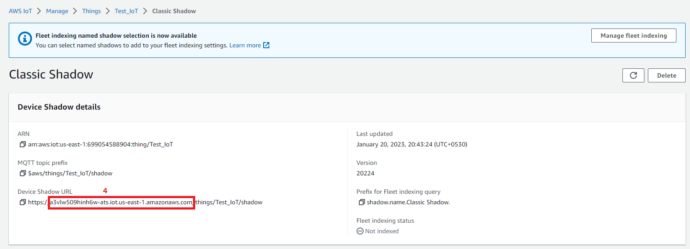


 
### Setting up Security Certificates

- To authenticate and securely connect with AWS, your Wi-Fi device requires a unique x.509 security certificate and private key, as well as a CA certificate which is used to verify the AWS server. Security credentials need to be converted into a C-array rather than [PEM format](https://en.wikipedia.org/wiki/Privacy-Enhanced_Mail) provided by AWS; they also need to be added to your project. 

- The WiSeConnect SDK provides a conversion script (written in Python 3) to make the conversion straightforward. The script is provided in the SDK 'resources' directory and is called [certificate_to_array.py](https://github.com/SiliconLabs/wiseconnect-wifi-bt-sdk/tree/master/resources/certificates/).


- To convert the device certificate and private key to C arrays, open a system command prompt and use the script as indicated in the following examples. 
- After running the script on the certificate and private key, two new files are created.
- certificate_to_array.py can be found in <SDK>resources/certificates path

```sh
$> python3 certificate_to_array.py <input filename> <output arrayname>

For example:
$> python3 certificate_to_array.py d8f3a44d3f.cert.pem    aws_client_certificate
$> python3 certificate_to_array.py d8f3a44d3f.private.key aws_client_private_key
```

- Below are the two new files which gets created after running the script.

```sh
aws_client_certificate.pem.crt.h
aws_client_private_key.pem.key.h
```

Before proceeding, copy both of the new files to the WiSeConnect directory: `<SDK>/resources/certificates`   
Go ahead and overwrite any existing files with the same name in that directory, the originals are not needed.

The Root CA certificate used by your Wi-Fi device to verify the AWS server is already included in the WiSeConnect SDK; no additional setup is required.
For reference, Amazon uses [Starfield Technologies](https://www.starfieldtech.com/) to secure the AWS website, the WiSeConnect SDK includes the [Starfield CA Certificate](https://github.com/SiliconLabs/wiseconnect-wifi-bt-sdk/tree/master/resources/certificates/aws_starfield_ca.pem.h).

> NOTE :
> For AWS connectivity, StarField Root CA Class 2 certificate has the highest authority being at the top of the signing hierarchy.
> 
> The StarField Root CA Class 2 certificate is an expected/required certificate which usually comes pre-installed in the operating systems and it plays a key part in certificate chain verification when a device is performing TLS authentication with the IoT endpoint.
> 
> On SiWx91x device, we do not maintain root CA trust repository due to memory constraints, so it is mandatory to load StarField Root CA Class 2 certificate for successful mutual authentication to AWS server.
> 
> The certificate chain sent by AWS server is as below:
> id-at-commonName=Amazon,id-at-organizationalUnitName=Server CA 1B,id-at-organizationName=Amazon,id-at-countryName=US
> id-at-commonName=Amazon Root CA 1,id-at-organizationName=Amazon,id-at-countryName=US
> id-at-commonName=Starfield Services Root Certificate Authority ,id-at-organizationName=Starfield Technologies, Inc.,id-at-localityName=Scottsdale,id-at-  stateOrProvinceName=Arizona,id-at-countryName=US)
> 
> On SiWx91x to authenticate the AWS server, firstly Root CA is validated (validate the Root CA received with the Root CA loaded on the device). Once the Root CA is validation is successful , other certificates sent from the AWS server are validated.
> SiWx91x don't authenticate to AWS server if intermediate CA certificates are loaded instead of StarField Root CA Class 2 certificate and would result in Handshake error.
> StarField Root CA Class 2 certificate is at https://certs.secureserver.net/repository/sf-class2-root.crt
> 
> Reference links :
> https://aws.amazon.com/blogs/security/how-to-prepare-for-aws-move-to-its-own-certificate-authority/

## Testing the Application

Follow the below steps for the successful execution of the application.

### Loading the SiWx91x Firmware

Refer [Getting Started with SiWx917 in SoC Mode] located in `<SDK>/extension/wiseconnect/docs/index` to load the firmware into SiWx91x Radio Board. The firmware file is located in `<SDK>/extension/wiseconnect/connectivity_firmware/`

### Project Creation - SoC Mode : 

- Connect your board. The Si917 compatible SoC board is **BRD4325A**.
- Studio should detect your board. Your board will be shown here.

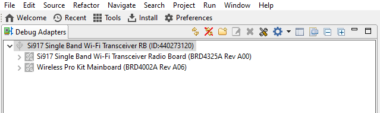

### Selecting an example application and generate project

- Go to the 'EXAMPLE PROJECT & DEMOS' tab and click on aws_peripheral example application as shown below.

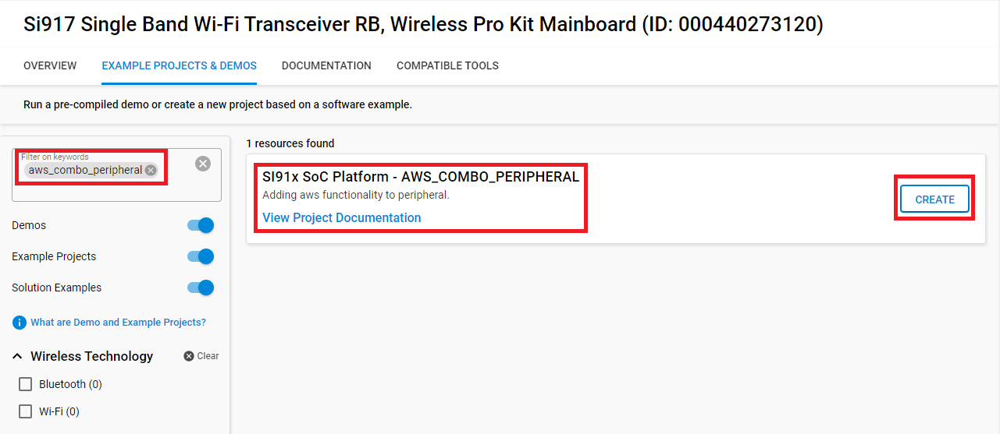

- Click 'Create'. The "New Project Wizard" window appears. Click 'Finish'

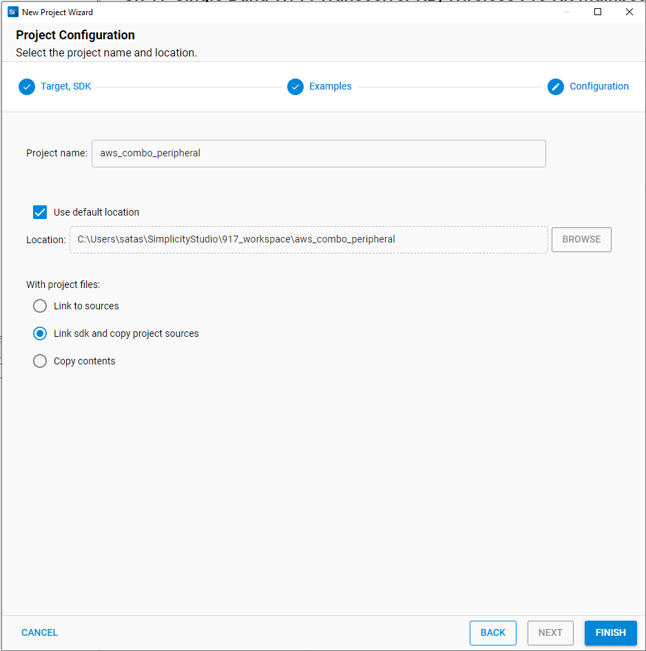

#### Build Project - SoC Mode

- Once the project is created, right click on project and go to properties → C/C++ Build → Settings → Build Steps
- Add post_build_script_SimplicityStudio.bat file path (SI917_COMBO_SDK.X.X.X.XX\utilities\isp_scripts_common_flash) in build steps settings as shown in below image.

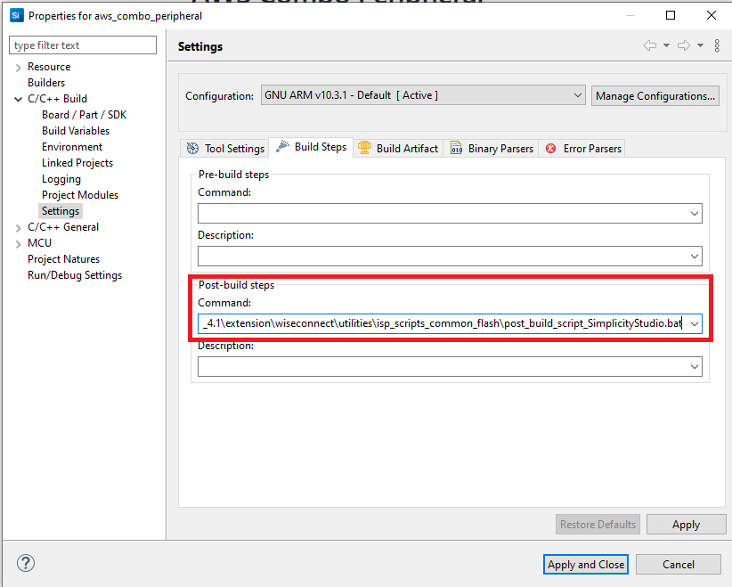

- Check for M4 projects macros in preprocessor settings(RSI_M4_INTERFACE=1)
- Check for 9117 macro in preprocessor settings(CHIP_9117=1).
- Click on the build icon (hammer) to build the project

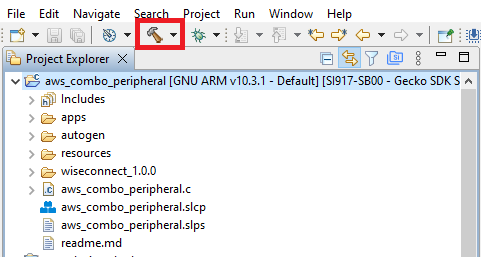

- Successful build output will show as below.


## Program the device

   - To program the device ,refer **"Burn M4 Binary"** section in **getting-started-with-siwx917-soc** guide at **release_package/docs/index.html** to work with Si91x and Simplicity Studio

   - Once the build was successfull, right click on project and click on Debug As->Silicon Labs ARM Program as shown in below image.

   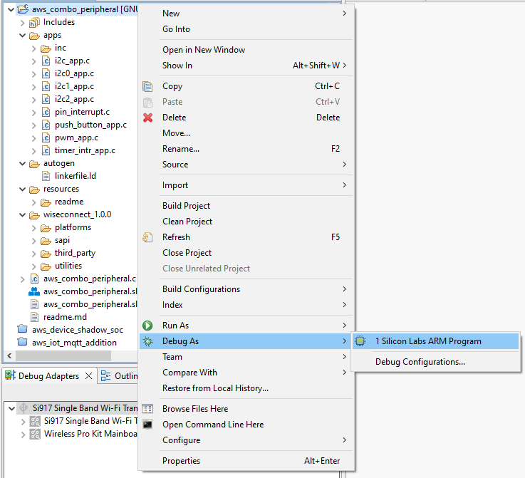

## Running the SiWx91x Application

- Configure the Access point with Internet connection in OPEN/WPA-PSK/WPA2-PSK mode to connect module in STA mode.

- Configure the application with the configurations mentioned in **Section 4** for the AWS IoT Thing created.
[ Refer to Appendix on how to create a Thing ]

- Application will Subscribe to the RSI_MQTT_TOPIC and Publishes message "AWS_LED_TOGGLE" which is received from I2C SLave device to the same topic.

  It receives the publish message sent, as it has subscribed to the same topic.

  Upon receiving the Publish message it processes the message "AWS_LED_TOGGLE" and toggles LED.

- You should be able to see the LED turning ON/OFF on the board

## Observing the output prints on serial terminal

### SoC Mode:
> Connect USB to UART connector Tx and GND pins to WSTK radio board.

   - Connect Tx(Pin-6) to P27 on WSTK
   - Connect GND(Pin 8 or 10) to GND on WSTK

## Expected Results 
**I2C**

   - Will get "I2C Transfer success" print on console when I2C instance data transfers is success
   - Add read_buff to the watch window to check data
   - Both write and read 16 bits of data should be same 
 
**PWM**
 
   - Check PWM output on PWM GPIOs by connecting logic analyser

**AWS MQTT**

   - The read_buff data is being published to AWS IoT Thing.

> Prints can be seen as below in the console

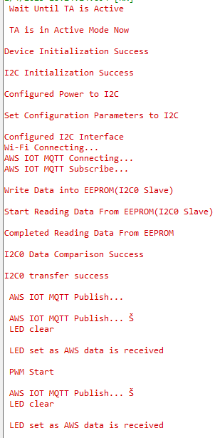

## Appendix

### Create an AWS Thing

Create a thing in the AWS IoT registry to represent your IoT Device.

* In the [AWS IoT console](https://console.aws.amazon.com/iot/home), in the navigation pane, under Manage, choose All devices, and then choose Things.


* If a **You don't have any things yet** dialog box is displayed, choose **Register a thing**. Otherwise, choose **Create**.
* Click on **Create things**.


* On the **Create things** page, choose **Create a single thing** and click next.


* On the **Specify thing properties** page, enter a name for your IoT thing (for example, **Test_IoT**), and choose **Unnamed shadow (classic)** in the Device Shadow section, then choose **Next**. You can't change the name of a thing after you create it. To change a thing's name, you must create a new thing, give it the new name, and then delete the old thing.


* During **Configure device certificate** step, choose **Auto-generate a new certificate (recommended)** option and click next.


* In **Attach Policies to Certificate - optional** page, click on  **Create thing** button.

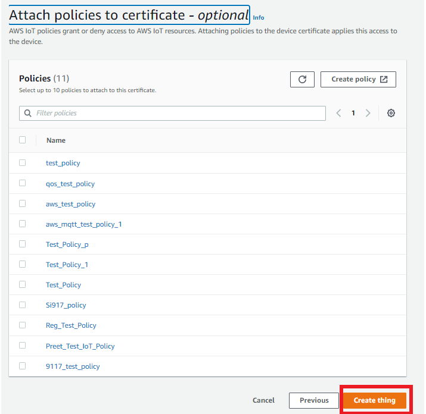

* Choose the **Download** links to download the device certificate, private key, and root CA certificate. Root CA certificate is already present in SDK (aws_starfield_ca.pem.h), and can be directly used.

- Recommended: To Download these files in *SDK*\resources\certificates path.

  > **Warning:** This is the only instance you can download your device certificate and private key. Make sure to save them safely. 


* To attach an existing policy choose the policy and click on create thing, if policy is not yet created Choose Create policy and fill the fields as mentioned in the following images.

choosing an existing policy

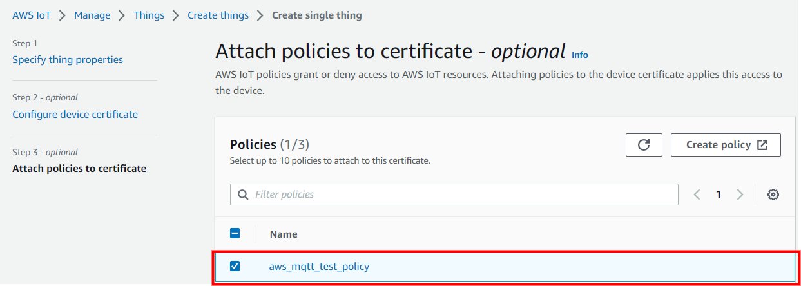

creating a policy - step 1


creating a policy - step 2 (filling the fields)
Give the **Name** to your Policy, Fill **Action** and **Resource ARN** as shown in below image, Click on **Allow** under **Effect** and click **Create**
   


* choose the created policy and click on **Create thing**

* The created thing should now be visible on the AWS console (Manage > All devices > Things)

### **Appendix**: Steps to create a policy from AWS console

* Navigate to **AWS IoT console**
* Choose **Policies** under **Secure**

 

* Click on **Create**
   
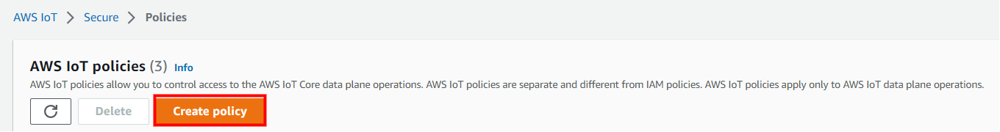

* Give the **Name** to your Policy, Fill **Action** and **Resource ARN** as shown in below image, Click on **Allow** under **Effect** and click **Create**
   

