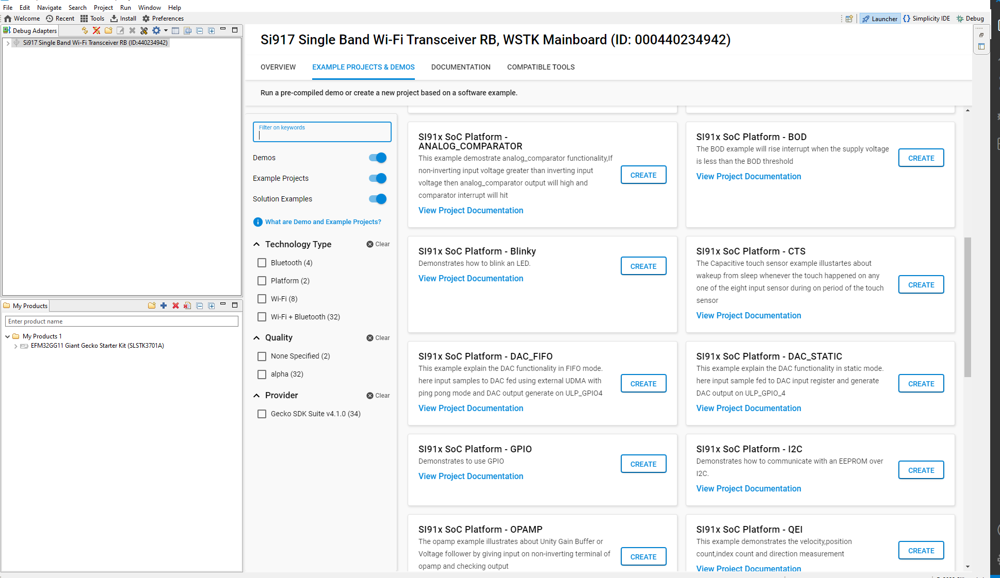

# BOD[Brown Out Detection]

## Introduction 
- This application demonstrates how to set up and use the BOD. In this application we can configure the threshold value of BOD.
- In this application we can configure the BOD in Auto mode or Manual mode.


## Setting Up 
 - To use this application following Hardware, Software and the Project Setup is required.

### Hardware Requirements	
  - Windows PC 
  - Silicon Labs Si917 Evaluation Kit [WSTK + BRD4325A]
 


### Software Requirements
  - Si91x SDK
  - Embedded Development Environment
    - For Silicon Labs Si91x, use the latest version of Simplicity Studio (refer **"Download and Install Simplicity Studio"** section in **getting-started-with-siwx917-soc** guide at **release_package/docs/index.html**)
 
## Project Setup
- **Silicon Labs Si91x** refer **"Download SDK"** section in **getting-started-with-siwx917-soc** guide at **release_package/docs/index.html** to work with Si91x and Simplicity Studio.
 
## Loading Application on Simplicity Studio
1. With the product Si917 selected, navigate to the example projects by clicking on Example Projects & Demos 
in simplicity studio and click on to BOD Example application as shown below.



## Configuration and Steps for Execution

- Configure the following macros in bod.c file and update/modify following macros if required.
```C
#define AUTOMATIC
//#define MANUAL
#define MANUAL_MODE                   0
#define AUTOMATIC_MODE                1
#define BOD_THRESHOLD                 3.35
```   
- Note -> At a time only one MACRO should be enable for AUTOMATIC or MANUAL. 
## Build 
1. Compile the application in Simplicity Studio using build icon. 


## Device Programming
- To program the device ,refer **"Burn M4 Binary"** section in **getting-started-with-siwx917-soc** guide at **release_package/docs/index.html** to work with Si91x and Simplicity Studio.

## Executing the Application
1. Compile and run the application. 
2. When the application runs,It reads the volatage of BOD.


## Expected Results 
 - If user decreases the voltage less than the threshold voltage then BOD interrupt occurs.
 - Will get "Your Vbatt status is less than the threshold voltage i.e%fV " print on console.