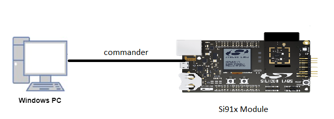
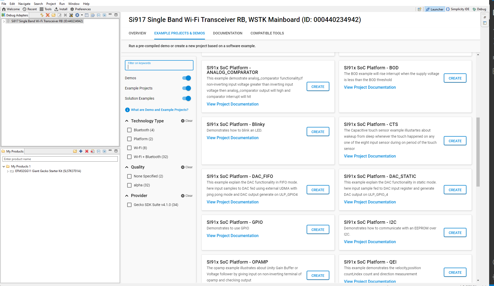

# DAC-Static [Digital To Analog Converter]

## Introduction 
- This example explains the DAC functionality in static mode.
- Here the input sample is fed to the DAC input register and the DAC output will be generated on ULP_GPIO_4.

  - DAC operation mode		: Static mode
  - DAC output GPIO			: ULP_GPIO4 
  - Reference LDO voltage	: 2.8V(Max output voltage of DAC is 2.8V)
  
## Setting Up 
 - To use this application following Hardware, Software and the Project Setup is required.

### Hardware Requirements	
  - Windows PC 
  - Silicon Labs Si917 Evaluation Kit [WSTK + BRD4325A]
 

### Software Requirements
  - Si91x SDK
  - Embedded Development Environment
    - For Silicon Labs Si91x, use the latest version of Simplicity Studio (refer **"Download and Install Simplicity Studio"** section in **getting-started-with-siwx917-soc** guide at **release_package/docs/index.html**)
 
## Project Setup
- **Silicon Labs Si91x** refer **"Download SDK"** section in **getting-started-with-siwx917-soc** guide at **release_package/docs/index.html** to work with Si91x and Simplicity Studio.
 
## Loading Application on Simplicity Studio
1. With the product Si917 selected, navigate to the example projects by clicking on Example Projects & Demos 
in simplicity studio and click on to DAC_STATIC Example application as shown below.

  
## Build 
1. Compile the application in Simplicity Studio using build icon. 

## Device Programming
- To program the device ,refer **"Burn M4 Binary"** section in **getting-started-with-siwx917-soc** guide at **release_package/docs/index.html** to work with Si91x and Simplicity Studio.

## Pin Configuration
|GPIO pin  | Description|
|--- | --- | 
|ULP_GPIO_4 [EXP_HEADER-11] |DAC output pin|

## Executing the Application
1. Compile and run the application. 

## Expected Results 
 - Observe the output on the ULP_GPIO_4 pin by using a Logic analyzer or voltmeter.
 - The output should be a square wave with voltage up to 2.25V then DAC output is proper and the test case is passed.
  - Output voltage Calculation		=>	((Input sample / 2^10) * Vref value)
  - Example				=>	((0x33A / 1024) * 2.8) = 2.25V