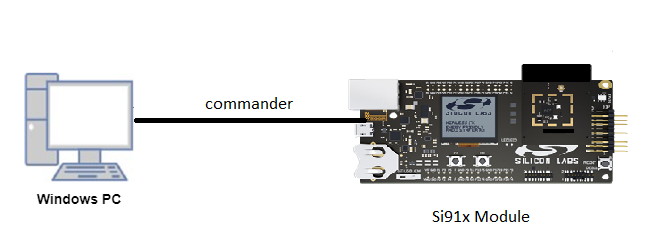

# I2C

## Introduction 
- This application demonstrates the I2C will be configured in master mode. The SCL and SDA lines of master controller are connected to EEPROM's SCL and SDA pins
  - EEPROM is slave device
  - From master the slave address is sent after START on bus and waits till it gets the ACK respose from the slave
  - The write data to EEPROM memory is based on its page write sequence
  - I2C can be configured with following features
    - I2C standard compliant bus interface with open-drain pins
	- Configurable as Master or Slave
	- Four speed modes: Standard Mode (100 kbps), Fast Mode (400 kbps), Fast Mode Plus (1Mbps) and High-Speed Mode (3.4 Mbps)
	- 7 or 10-bit addressing and combined format transfers
	- Support for Clock synchronization and Bus Clear


## Setting Up 
 - To use this application following Hardware, Software and the Project Setup is required

### Hardware Requirements 	
  - Windows PC 
  - Silicon Labs [Si917 Evaluation Kit WSTK + BRD4325A]
 


### Software Requirements
  - Si91x SDK
  - Embedded Development Environment
    - For Silicon Labs Si91x, use the latest version of Simplicity Studio (refer **"Download and Install Simplicity Studio"** section in **getting-started-with-siwx917-soc** guide at **release_package/docs/index.html**)
 
## Project Setup
- **Silicon Labs Si91x** refer **"Download SDKs"**, **"Add SDK to Simplicity Studio"**, **"Connect SiWx917"**, **"Open Example Project in Simplicity Studio"** section in **getting-started-with-siwx917-soc** guide at **release_package/docs/index.html** to work with Si91x and Simplicity Studio

## Configuration and Steps for Execution

- Configure the following parameters in i2c.c file and update/modify following macros if required
   ```C
   #define SIZE_BUFFERS            // Number of data to be sent by UART
   #define EEPROM_I2C_ADDR         // 24LC128 EEPROM I2C address         
   #define EEPROM_MAX_ADDR         // Max memory locations available     
   #define EEPROM_MAX_WRITE        // Max bytes to write in one step     
   #define A_WR                    // Master will write to the I2C       
   #define A_RD                    // Master will read from the I2C 
   #define TX_LEN                  // Transmitter length
   #define RX_LEN                  // Receiver length
   ```   

## Pin Configuration
| PIN | ULP GPIO PIN | Description |
| --- | --- | --- |
| SCL | ULP_GPIO_5 [EXP_HEADER-13] | Connect to EEPROM SCL pin |
| SDA | ULP_GPIO_4 [EXP_HEADER-11] | Connect to EEPROM SDA pin |


## Build 
1. Compile the application in Simplicity Studio using build icon 


## Device Programming
- To program the device ,refer **"Burn M4 Binary"** section in **getting-started-with-siwx917-soc** guide at **release_package/docs/index.html** to work with Si91x and Simplicity Studio

## Executing the Application
1. When the application runs, the maximum size will be 16 bytes for the single write and read operations
2. After completion of write operation application reads the data from the required offset based on random read sequence of the slave device

## Expected Results 
 - Will get "Test Case Pass" print on console
 - Both write and read 16 bits of data should be same
 - Add rd_buf (read buffer) to watch window for checking data