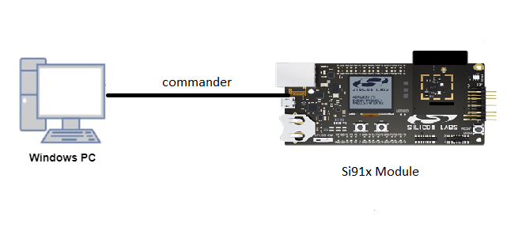
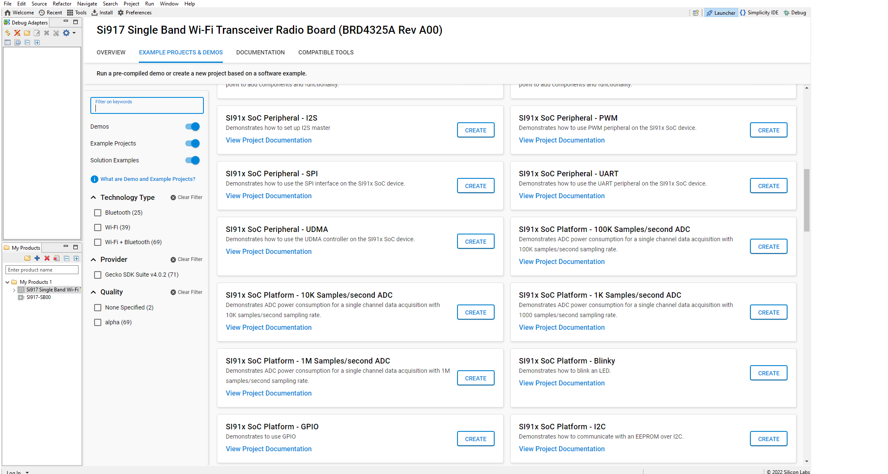

# I2S

## Introduction 

- This application I2S will be configured in master mode.Here we will connect TX pin to RX pin in loopback mode.
- Master transmits data on TX pin using DMA and receives same data on RX pin using DMA. 
- I2S supports with a Programmable Audio data resolutions of 12, 16, 20,24 and 32 bits
- Supported audio sampling rates are 8, 11.025, 16, 22.05, 24, 32, 44.1, 48, 88.2, 96 and 192 kHz

## Setting Up 
- To use this application, following Hardware, Software and the project setup is required

### Hardware Requirements
  - Windows PC 
  - Silicon Labs [Si917 Evaluation Kit WSTK + BRD4325A](https://link)
  


### Software Requirements
  - Si91x SDK
  - Embedded Development Environment
    - For Silicon Labs Si91x, use the latest version of Simplicity Studio (refer **"Download and Install Simplicity Studio"** section in **getting-started-with-siwx917-soc** guide at **release_package/docs/index.html**)
 
## Project Setup
- **Silicon Labs Si91x** refer **"Download SDK"** section in **getting-started-with-siwx917-soc** guide at **release_package/docs/index.html** to work with Si91x and Simplicity Studio

## Configuration and Steps for Execution
- Configure the following parameters in i2s_master.c file and update/modify following macros if required
   ```C
   #define BUFFER_SIZE               // Number of data
   #define SOC_PLL_REF_FREQUENCY     // PLL input REFERENCE clock 
   #define PS4_SOC_FREQ              // PLL out clock
   #define DATA_RESOLUTION           // This macro is used for Data Resolution(Frame length)
   #define DATA_SIZE                 // This macro is used for Data length(Bits)
   #define SAMPLING_RATE             // This macro is used for Sampling frequency(KHz) 
   ``` 
   
## Loading Application on Simplicity Studio
1. With the product Si917 selected, navigate to the example projects by clicking on Example Projects & Demos 
in simplicity studio and click on to I2S Example application as shown below.



## Build and run
1. Compile the application in Simplicity Studio using build icon


## Device Programming
- To program the device ,refer **"Burn M4 Binary"** section in **getting-started-with-siwx917-soc** guide at **release_package/docs/index.html** to work with Si91x and Simplicity Studio

## Pin Configuration
|GPIO pin | Description|
|--- | ---|
|SCLK (GPIO_25 [EXP_HEADER-15])|Connect to oscilloscope to check the I2S frequency|
|WSCLK(GPIO_26 [EXP_HEADER-16])|Connect to logic analyser to check the sampling frquency|
|DOUT (GPIO_28 [EXP_HEADER-8]) <-> DIN(GPIO_27 [EXP_HEADER-10])|TX and RX pin loopback connection|

## Executing the Application
1. Compile and run the application 
2. Connect GPIO_28 <-> GPIO_27 loopback.

Note : By default I2S_LOOP_BACK macro is enabled in preprocessor settings , it is used when I2S is configured in loopback mode.
       To configure I2S in standalone Master or Slave mode , disable I2S_LOOP_BACK macro in preprocessor settings.
 
## Expected Results 
 - Will get "Test Case Pass" print on console when tx and rx data both are matching  
 - Add rx_buf to watch window for checking data
