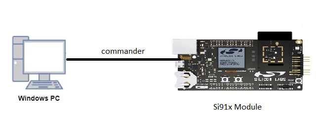

# PWM

## Introduction 

- The Motor Control PWM (MCPWM) controller is used to generate a periodic pulse waveform, which is useful in motor control and power control applications 
- The MCPWM controller acts as a timer to count up to a period count value,the time period and the duty cycle of the pulses are both programmable
- This application uses the MCPWM driver to create 2 independent PWMs (running at the same frequency),square wave will be generated on channel 0 output PWM_1L 
  and channel 1 output PWM_2L 


## Setting Up 
- To use this application, following Hardware, Software and the project setup is required

### Hardware Requirements
  - Windows PC 
  - Silicon Labs [Si917 Evaluation Kit WSTK + BRD4325A]
  


### Software Requirements
  - Si91x SDK
  - Embedded Development Environment
    - For Silicon Labs Si91x, use the latest version of Simplicity Studio (refer **"Download and Install Simplicity Studio"** section in **getting-started-with-siwx917-soc** guide at **release_package/docs/index.html**)
  
## Project Setup
- **Silicon Labs Si91x** refer **"Download SDKs"**, **"Add SDK to Simplicity Studio"**, **"Connect SiWx917"**, **"Open Example Project in Simplicity Studio"** section in **getting-started-with-siwx917-soc** guide at **release_package/docs/index.html** to work with Si91x and Simplicity Studio

## Configuration and Steps for Execution
- Configure the following parameters in pwm.c file and update/modify following macros if required
   ```C
   #define MCPWM_RATE      // 10 ms Tick rate
   #define TICKS           // 1 ms Tick rate  
   #define MCPWM_IRQHandler IRQ048_Handler
   ``` 


## Build 
1. Compile the application in Simplicity Studio using build icon


## Device Programming
- To program the device ,refer **"Burn M4 Binary"** section in **getting-started-with-siwx917-soc** guide at **release_package/docs/index.html** to work with Si91x and Simplicity Studio


## Pin Configuration
|GPIO pin | Description|
|--- | ---|
|GPIO_64(ULP_GPIO_0) [EXP_HEADER-9]|PWM 1L output|
|GPIO_8 [EXP_HEADER-14]            |PWM 2L output|

## Executing the Application
 - Compile and run the application ,Connect the external Tri LED/logic analyzer to the PWM 1L(GPIO_64 /ULP_GPIO_0) and 2L (GPIO_8). 

## Expected Results 
 - PWM 1L and 2L GPIOs should be toggled 
 - Check outputs on PWM GPIO pins using logic analyser
