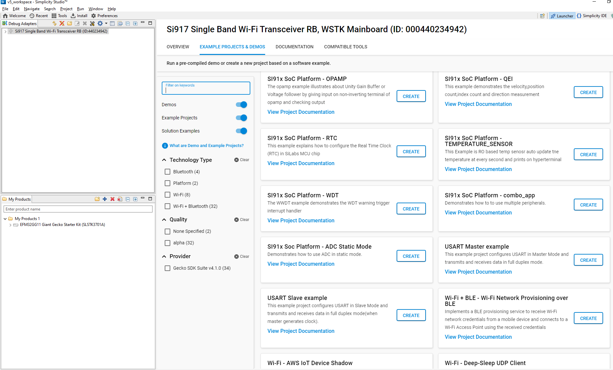

# QEI [Quadrature Encoder Interface]

## Introduction 
- QEI example demonstrates the velocity,position count,index count and direction measurement using QEI module.
- The following configurations are used in this application.
  - QEI_STIMULUS_PHA	: GPIO_7
  - QEI_STIMULUS_PHB	: GPIO_8
  - QEI_STIMULUS_IDX	: GPIO_9
  

## Setting Up 
 - To use this application following Hardware, Software and the Project Setup is required.

### Hardware Requirements	
  - Windows PC 
  - Silicon Labs Si917 Evaluation Kit [WSTK + BRD4325A]
 

### Software Requirements
  - Si91x SDK
  - Embedded Development Environment
    - For Silicon Labs Si91x, use the latest version of Simplicity Studio (refer **"Download and Install Simplicity Studio"** section in **getting-started-with-siwx917-soc** guide at **release_package/docs/index.html**)
 
## Project Setup
- **Silicon Labs Si91x** refer **"Download SDK"** section in **getting-started-with-siwx917-soc** guide at **release_package/docs/index.html** to work with Si91x and Simplicity Studio.
 
## Loading Application on Simplicity Studio
1. With the product Si917 selected, navigate to the example projects by clicking on Example Projects & Demos 
in simplicity studio and click on to qei Example application as shown below.

  
## Build 
1. Compile the application in Simplicity Studio using build icon. 

## Device Programming
- To program the device ,refer **"Burn M4 Binary"** section in **getting-started-with-siwx917-soc** guide at **release_package/docs/index.html** to work with Si91x and Simplicity Studio.

## Pin Configuration
|GPIO pin  | Description|
|--- | --- | 
|GPIO_7  (P37)           |Phase A Signal|
|GPIO_8  [EXP_HEADER-14] |Phase B Signal|
|GPIO_9  [EXP_HEADER-12] |Index Signal  |
|GPIO_69 [EXP_HEADER-13] |Phase A Signal|
|GPIO_74 [EXP_HEADER-3]  |Phase B Signal|
|GPIO_68 [EXP_HEADER-11] |Index Signal  |

## Executing the Application
1. Compile and run the application. 
  - Connect GPIO_7 to GPIO_69. This is phase A signal
  - Connect GPIO_8 to GPIO_74. This is phase B signal
  - Connect GPIO_9 to GPIO_68. This is index signal
  

## Expected Results 
 - Will get "QEI_Velocity = 0x%X\r\n" print on hyperterminal or any serial terminal, it's around 0xF9 value then qei output is proper and the test case is passed.