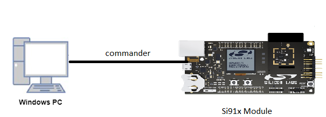

# UART_Deepsleep_Wakeup_Without_Retention

## Introduction 
- This application demonstrates How UART is configured to send/receive data in loopbback and to enter deepsleep without retention and to wakeup with different configured wakeup sources.
- In this example MCU[M4] and TA both enter deep sleep and wakeup without retention based on wakeup sources.
- This application is configured with following configs
  - Tx and Rx enabled
  - Asynchronous mode
  - 8 Bit data transfer
  - No Parity
  - No Auto Flow control
  - Baud Rates - 115200
  
## Setting Up 
- To use this application following Hardware, Software and Project Setup is required

### Hardware Requirements
  - Windows PC 
  - Silicon Labs [Si917 Evaluation Kit WSTK + BRD4325A]
  


### Software Requirements
  - Si91x SDK
  - Embedded Development Environment
    - For Silicon Labs Si91x, use the latest version of Simplicity Studio (refer **"Download and Install Simplicity Studio"** section in **getting-started-with-siwx917-soc** guide at **release_package/docs/index.html**)
   

## Project Setup
- **Silicon Labs Si91x** refer **"Download SDK"** section in **getting-started-with-siwx917-soc** guide at **release_package/docs/index.html** to work with Si91x and Simplicity Studio

## Pin Configuration
|GPIO pin  | Description|
|--- | --- |
|GPIO_30 [EXP_HEADER-4]|USART0_TX_PIN |
|GPIO_29 [EXP_HEADER-6]|USART0_RX_PIN |

## Configuration and Steps for Execution

- Configure the following parameters in **uart_exp.c** file and update/modify following macros if required. 
   ```C
   #define BUFFER_SIZE  // Number of data to be sent by UART
   #define BAUD_VALUE   // Number of bits transmitted per second
   ``` 

- Configure the following parameters in **uart_ds_wakeup_wo_ret.c** file and update/modify following macros if required. 
   ```C
   #define SSID       // Wi-Fi Network Name
  ``` 

## Loading Application on Simplicity Studio
1. With the product Si917 selected, navigate to the example projects by clicking on Example Projects & Demos 
   in simplicity studio and click on to UART Example application as shown below.


## Build
1. Compile the application in Simplicity Studio using build icon


## Program the device
- To program the device ,refer **"Burn M4 Binary"** section in **getting-started-with-siwx917-soc** guide at **release_package/docs/index.html** to work with Si91x and Simplicity Studio


## Wakeup Source Configuration
- ALARM_CONFIG        -- Enable this macro in Preprocessor settings to set Alarm as a wakeup source 
- SEC_BASED_WKP 	  -- Enable this macro in Preprocessor settings to set RTC seconds as a wakeup source 
- DS_BASED_WKP        -- Enable this macro in Preprocessor settings to set Deepsleep timer as a wakeup source 
- UULP_GPIO_BASED_WKP -- Enable this macro in Preprocessor settings to set UULP GPIO as wakeup source. Press the BTN1 on WSTK/WPK board to wakeup the M4.

## Executing the Application
1. When the application runs,It sends and receives data in loopback mode
2. Connect TX Pin GPIO_30 to RX Pin GPIO_29 for Loop back

## Expected Results 
-  Observe "Test Case Pass" print on console 
 - MCU and TA enters deepsleep and wakeup based on above configured wakeup source without retention
 - This Application runs in loop with below tasks
    - Peripheral initialization 
    - Wireless Initialization
	- Deepsleep
	- Wakeup 
 