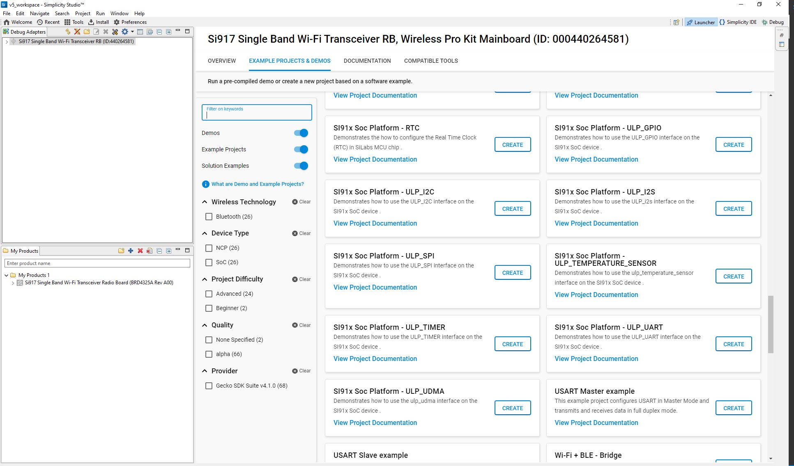

# ULP_GPIO

## Introduction 
 - This application demonstrate the toggling of ULP_GPIO pin in MCU PS_2 state.
 - ULP Domain is used to control the ULP GPIO's(ULP_GPIO_n; n=0 to 11)

## Setting Up 
- To use this application following Hardware, Software and the Project Setup is required

### Hardware Requirements	
  - Windows PC 
  - Silicon Labs Si917 Evaluation Kit [WSTK + BRD4325A]
  

  
### Software Requirements
  - Si91x SDK
  - Embedded Development Environment
    - For Silicon Labs Si91x, use the latest version of Simplicity Studio (refer **"Download and Install Simplicity Studio"** section in **getting-started-with-siwx917-soc** guide at **release_package/docs/index.html**)
 
## Project Setup
- **Silicon Labs Si91x** refer **"Download SDK"** section in **getting-started-with-siwx917-soc** guide at **release_package/docs/index.html** to work with Si91x and Simplicity Studio

## Configuration and Steps for Execution

- Configure the following parameters in ulp_gpio.c (examples/si91x_soc/peripheral/ulp_gpio/) file and update/modify following macros if required

   ```c
   #define ULP_GPIO_PIN  // To enable ULP GPIO pin
   #define PORT 0        // Port selection
   #define PIN  6       // Pin number to connect ( P36 on WSTK board)
   ```

## Loading Application on Simplicity Studio
1. With the product Si917 selected, navigate to the example projects by clicking on Example Projects & Demos 
  in simplicity studio and click on to ULP_GPIO Example application as shown below. 
  
 

## Build 
1. Compile the application in Simplicity Studio using build icon.


## Device Programming
- To program the device ,refer **"Burn M4 Binary"** section in **getting-started-with-siwx917-soc** guide at **release_package/docs/index.html** to work with Si91x and Simplicity Studio

## Executing the Application
1. Compile and run the application 
2. Use logic analyzer to see toggle on selected gpio pin

## Expected Results 
 - GPIO should be continously toggled ,connect logic analyzer to observe the toggle state

## Note
 - This applicatin is executed from RAM.
 - In this application while changing the MCU mode from PS4 to PS2, M4 flash will be turned off.
 - The debug feature of Simplicity Studio will not work after M4 flash is turned off.
## Expected Scenario:
 - After Flashing ULP examples as M4 flash will be turned off,flash erase does not work.
 - To Erase the chip follow the below procedure
   - Turn ON ISP switch and press the reset button → Turn OFF ISP Switch → Now perform Chip erase 
      through commander.