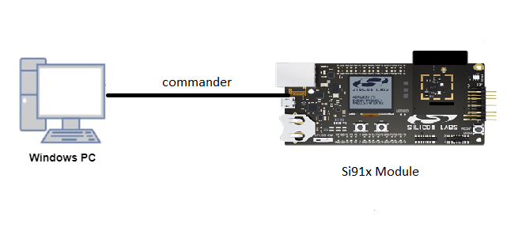

# ULP_I2S

## Introduction 

- This application demonstrates ULP_I2S will be configured in PS2 state and master mode.Here we will connect TX pin to RX pin in loopback mode
Master transmits data on TX pin using DMA and receives same data on RX pin using DMA
The data received should match with the transmitted data
- I2S supports with a Programmable Audio data resolutions of 12, 16, 20 and 24 bits
- Supported audio sampling rates are 8, 11.025, 16, 22.05, 24, 32, 44.1, 48, 88.2, 96 and 192 kHz

## Setting Up 
- To use this application, following Hardware, Software and the project setup is required

### Hardware Requirements
  - Windows PC 
  - Silicon Labs Si917 Evaluation Kit [WSTK + BRD4325A]
  


### Software Requirements
  - Si91x SDK
  - Embedded Development Environment
    - For Silicon Labs Si91x, use the latest version of Simplicity Studio (refer **"Download and Install Simplicity Studio"** section in **getting-started-with-siwx917-soc** guide at **release_package/docs/index.html**)
 
## Project Setup
- **Silicon Labs Si91x** refer **"Download SDK"** section in **getting-started-with-siwx917-soc** guide at **release_package/docs/index.html** to work with Si91x and Simplicity Studio

## Configuration and Steps for Execution
- Configure the following parameters in ulp_i2s.c file and update/modify following macros if required
   ```C
   #define BUFFER_SIZE             // Number of data
   #define SOC_PLL_REF_FREQUENCY   // PLL input REFERENCE clock 
   #define PS4_SOC_FREQ            // PLL out clock
   #define DATA_RESOLUTION           // This macro is used for Data Resolution(Frame length)
   #define DATA_SIZE                 // This macro is used for Data length(Bits)
   #define SAMPLING_RATE             // This macro is used for Sampling frequency(KHz)   
   ``` 
   
## Loading Application on Simplicity Studio
1. With the product Si917 selected, navigate to the example projects by clicking on Example Projects & Demos 
in simplicity studio and click on to ULP_I2S Example application as shown below.


## Build and run
1. Compile the application in Simplicity Studio using build icon


## Device Programming
- To program the device ,refer **"Burn M4 Binary"** section in **getting-started-with-siwx917-soc** guide at **release_package/docs/index.html** to work with Si91x and Simplicity Studio

## Pin Configuration
|GPIO pin | Description|
|--- | ---|
|SCLK (ULP_GPIO_3)                |Connect to oscilloscope to check the I2S frequency|
|WSCLK(ULP_GPIO_4 [EXP_HEADER-11])|Connect to logic analyser to check the sampling frquency|
|DOUT (ULP_GPIO_5 [EXP_HEADER-13]) <-> DIN(ULP_GPIO_6 [P36])|TX and RX pin loopback connection|

## Executing the Application
1. Compile and run the application 
2. Connect ULP_GPIO_5 <-> ULP_GPIO_6 loopback.
 
## Expected Results 
 - Will get "Test Case Pass" print on console when tx and rx data both are matching  

## Note
 - This applicatin is executed from RAM.
 - In this application while changing the MCU mode from PS4 to PS2, M4 flash will be turned off.
 - The debug feature of Simplicity Studio will not work after M4 flash is turned off.
 - To check **Prints** for ULP Peripheral examples, connect the USB to TTL uart connector's RX_pin, 
    to the **EXP_HEADER-7** of the WPK[BRD4002A]/WSTK[BRD4001A] Base Board.

## Expected Scenario:
 - After Flashing ULP examples as M4 flash will be turned off,flash erase does not work.
 - To Erase the chip follow the below procedure
   - Turn ON ISP switch and press the reset button → Turn OFF ISP Switch → Now perform Chip erase 
      through commander.