# **AWS IoT Device Shadow with M4 powersave**

## **1 Introduction**

This application demonstrates how to securely connect a Silicon Labs Si91x Wi-Fi device to AWS IoT Core to send and receive data. 
To successfully use this application, developer should be familiar with the operation of [AWS IoT Core](https://docs.aws.amazon.com/iot/latest/developerguide/what-is-aws-iot.html) and the [AWS IoT Device Shadow Service](https://docs.aws.amazon.com/iot/latest/developerguide/iot-device-shadows.html).
If you are new to AWS IoT Core, we recommend running through the [AWS IoT Core Tutorial](https://docs.aws.amazon.com/iot/latest/developerguide/iot-tutorials.html) before proceeding.
In the following text, 'AWS IoT Core' is referred to as 'AWS' for brevity.

AWS refer to a 'Device Shadow' as a persistent, virtual representation of a device that can be accessed even if the physical device is offline.
The device state is captured in its 'shadow' and is represented as a JSON document.
The physical device can send commands using the MQTT protocol to get, update and delete the state of the shadow as well as receive notifications via MQTT about changes in the state pf the shadow.

The AWS IoT Device Shadow application publishes temperature and window open/close status on the topic `$aws/things/thingname/shadow/update`.
The room temperature and the window open/close status is available on the AWS cloud. Once publish done, device will go to sleep and wake up for periodic interval.

Additionally, the application subscribes to the shadow update topics:
```sh
  $aws/things/thingName/shadow/name/shadowName/update/accepted
  $aws/things/thingName/shadow/name/shadowName/update/rejected
  $aws/things/thingName/shadow/name/shadowName/update/delta
```

## **2 Overview of AWS SDK**

AWS IoT Core is a cloud platform that connects devices across AWS cloud services. AWS IoT provides an interface that allows devices to communicate securely and reliably in bi-directional ways to AWS touch-points, even when devices are offline.

The AWS IoT Device SDK allow applications to securely connect to the AWS IoT platform.

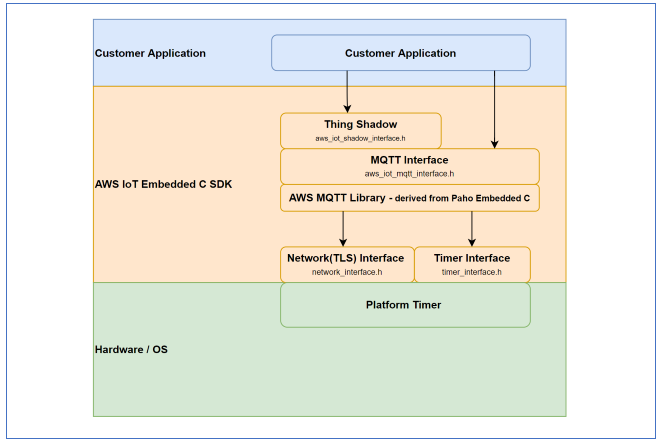

## **3 Prerequisites**
For running the application, you will need the following:
### **3.1 Hardware Requirements**
- A Windows PC
- A wireless access point with internet connectivity
- Silicon Labs SiWx917 PK6030A SoC Kit which includes
  - BRD4001A/BRD4002A Wireless Starter Kit Mainboard
  - BRD4325A Radio Board
- USB TO UART converter or TTL cable
### **3.2 Software Requirements**
- Simplicity Studio IDE
   - To download and install the Simplicity Studio IDE, refer to the [Simplicity Studio IDE Set up]() section in ***Getting started with SiWx91x*** guide.
- SiWx917_WiSeConnect_SDK.x.x.x.x
- Tera Term software or any other serial terminal software - for viewing application prints
- Energy Profiler tool (Integrated in Simplicity Studio IDE)

## **4 Setup diagram**

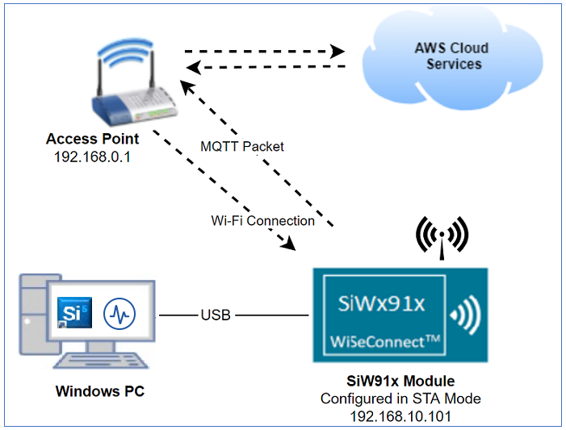

## **5 Setup** 
- Follow the [Hardware connections and Simplicity Studio IDE Set up]()  section in the ***Getting Started with SiWx91x SoC*** guide to make the hardware connections and add the Gecko and SiWx91x COMBO SDK to Simplicity Studio IDE.

- Ensure that SiWx91x module is loaded with the latest firmware following the [SiWx91x Firmware Update]() section in the ***Getting started with SiWx91x SoC*** guide.


## **6 Project Creation**
  
To create the project in the Simplicity Studio IDE, follow the [Creation of Project]() section in the ***Getting started with SiWx91x SoC*** guide, choose the **AWS IoT Device Shadow with M4 Powersave** example.
   
## **7 Cloud Setup**
This example requires SiWx91x Wi-Fi device to be provisioned on AWS. The application needs the device certificate and the private key. 
For brief provisioning instructions, see [AWS IoT Setup](#create-an-aws-thing) section below.


## **8 Application configuration**
Read through the following sections and make any changes needed. 
  
1. In the Project explorer pane of the IDE, expand the **aws_device_shadow_m4_powersave_soc** folder and open the **rsi_aws_device_shadow_ps.c** file. Configure the following parameters based on your requirements.

   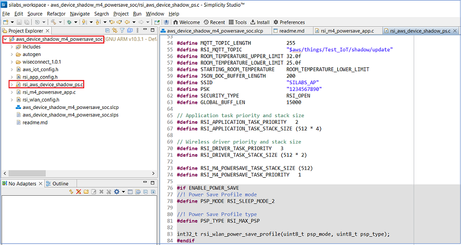
   
- ### **Wi-Fi & Cloud Configuration**

    ```c
    //! Wi-Fi Network Name
    #define SSID                             "SILABS_AP"      

    //! Wi-Fi Password
    #define PSK                              "1234567890"   

    //! Wi-Fi Security Type: RSI_OPEN / RSI_WPA / RSI_WPA2
    #define SECURITY_TYPE                    RSI_WPA2         

    //! MQTT Topic name, Test_IoT in the macro should be replaced by the name of the thing created by user
    #define RSI_MQTT_TOPIC                   "$aws/things/Test_IoT/shadow/update"
    ```

2. Configure `ALARM_PERIODIC_TIME` in the file **rsi_app_config.h file** .
    ```c
    //! periodic alarm configuration in SEC
    #define ALARM_PERIODIC_TIME              5     
    ```

2. Open the **aws_iot_config.h** file. Configure the following parameters based on your requirements.
    
    AWS IoT configurations
    ```c
    //! Device Shadow URL
    #define AWS_IOT_MQTT_HOST                "xxxxxxxxxxxxx-ats.iot.us-east-2.amazonaws.com"
    ```
    AWS_IOT_MQTT_HOST parameter can be found as follows:

    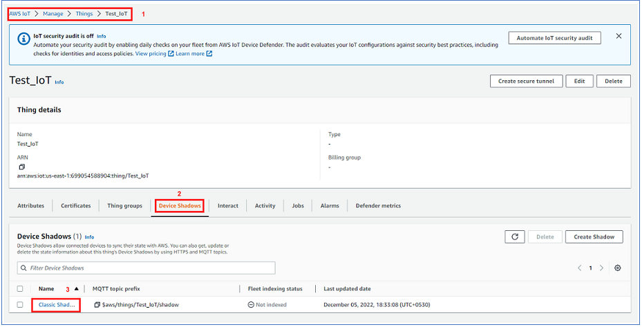

    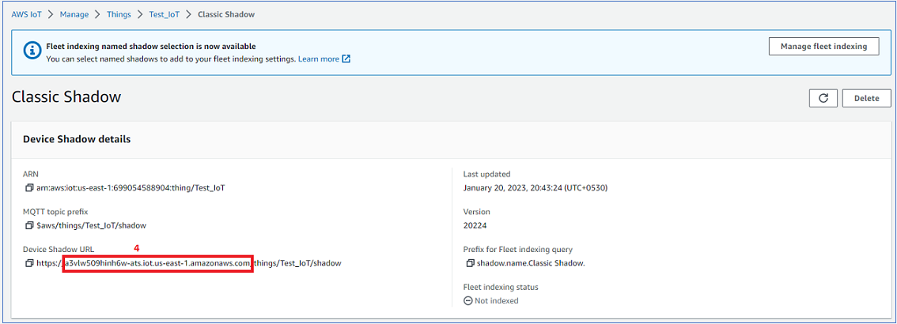
    
    ```c
    //! The Client ID uniquely identifies the MQTT connection with the AWS IoT
    #define AWS_IOT_MQTT_CLIENT_ID           "Test_IoT"

    //! The thing name which is used to register the SiWx91x module on AWS IoT         
    #define AWS_IOT_MY_THING_NAME            "Test_IoT"  
    ```       
    AWS_IOT_MQTT_CLIENT_ID and AWS_IOT_MY_THING_NAME have to be updated as per the name of the thing created

    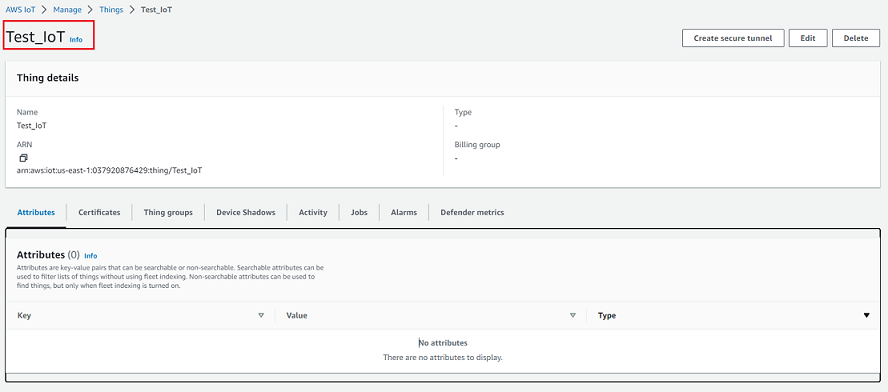

3. Open the **rsi_wlan_config.h** file. Configure below parameter to enable power save mode

    ```c
    //! Enable/Disable power save mode
    #define ENABLE_POWER_SAVE                    1
    ```
### **Setting up Security Certificates**
To authenticate and securely connect with AWS, Wi-Fi device requires a unique x.509 security certificate and private key, as well as a CA certificate which is used to verify the AWS server. Security credentials need to be converted into a C-array rather than [PEM format](https://en.wikipedia.org/wiki/Privacy-Enhanced_Mail) provided by AWS; they also need to be added to the project. 

The WiSeConnect SDK provides a conversion script (written in Python 3) to make the conversion straightforward. The script is provided in the SDK 'resources' directory and is called `certificate_to_array.py`.

To convert the device certificate and private key to C arrays, open a system command prompt and use the script as indicated in the following examples.

```sh
$> python3 certificate_to_array.py <input filename> <output arrayname>

For example:
$> python3 certificate_to_array.py d8f3a44d3f.pem.crt    aws_client_certificate.pem
$> python3 certificate_to_array.py d8f3a44d3f.pem.key    aws_client_private_key.pem
```

After running the script on the certificate and private key, two new files are created.

```sh
aws_client_certificate.pem.crt.h
aws_client_private_key.pem.key.h
```

Before proceeding, copy both of the new files to the WiSeConnect directory: `<SDK>/resources/certificates`  
Go ahead and overwrite any existing files with the same name in that directory, the originals are not needed.

The Root CA certificate used by  Wi-Fi device to verify the AWS server is already included in the WiSeConnect SDK; no additional setup is required.
For reference, Amazon uses [Starfield Technologies](https://www.starfieldtech.com/) to secure the AWS website, the WiSeConnect SDK includes the `Starfield CA Certificate`.

## **9 Setup for Serial Prints**

To Setup the serial prints, follow the [Setup for Serial Prints]() section in the ***Getting started with SiWx91x SoC*** guide.
  
## **10 Build, Flash, and Run the Application**

To build, flash, and run the application project refer to the [Build and Flash the Project]() section in the ***Getting Started with SiWx91x SoC*** guide.

## **11 Application execution flow**

1. After the application gets executed, the SiWx91x module connects to the Access Point and gets an IP address.

2. Subsequenty, the SiWx91x module connects to the AWS and sends the temperature data and window open/close status updates to the AWS.

3. If power save is enabled, TA enters low power save (RSI_SLEEP_MODE_2) after getting IP address and M4 enters sleep as per the configured alarm time after AWS shadow state update.

4. After configured alarm time, M4 wakes up and AWS device shadow state update process repeats. 

5. The following debug prints are displayed when the application runs successfully.

Without powersave

  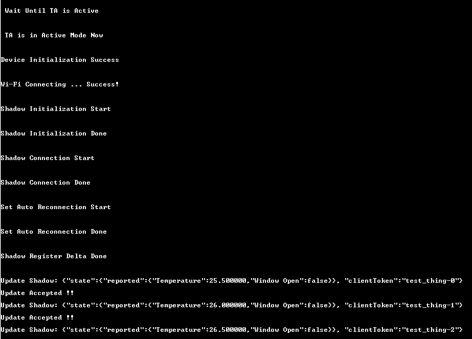

With powersave

  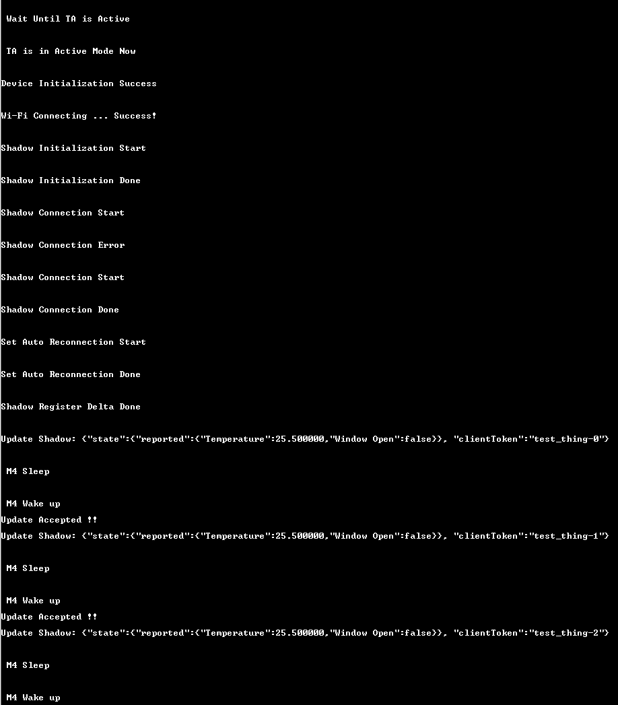


## **Appendix**

### **Create an AWS Thing**

Create a thing in the AWS IoT registry to represent your IoT Device.

* In the [AWS IoT console](https://console.aws.amazon.com/iot/home), in the navigation pane, under Manage, choose All devices, and then choose Things.

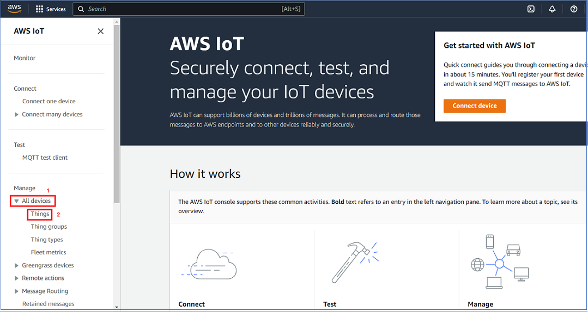

* If a **You don't have any things yet** dialog box is displayed, choose **Register a thing**. Otherwise, choose **Create**.
* Click on **Create things**.

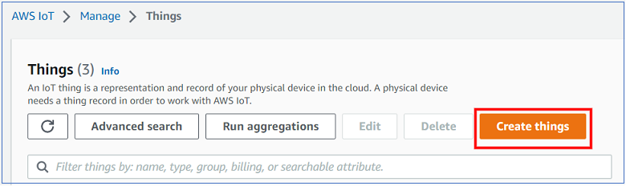

* On the **Create things** page, choose **Create a single thing** and click next.

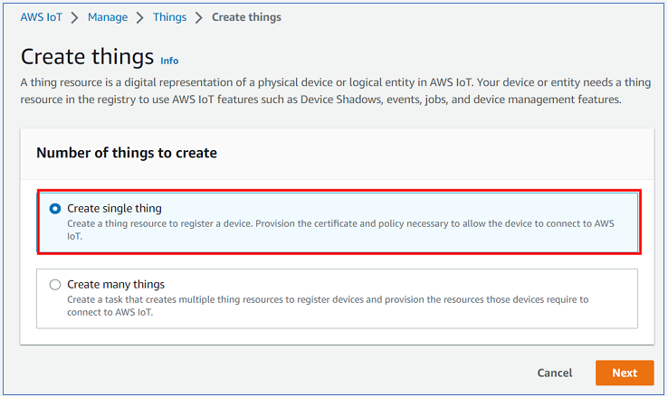

* On the **Specify thing properties** page, enter a name for your IoT thing (for example, **Test_IoT**), and choose **Unnamed shadow (classic)** in the Device Shadow section, then choose **Next**. You can't change the name of a thing after you create it. To change a thing's name, you must create a new thing, give it the new name, and then delete the old thing.

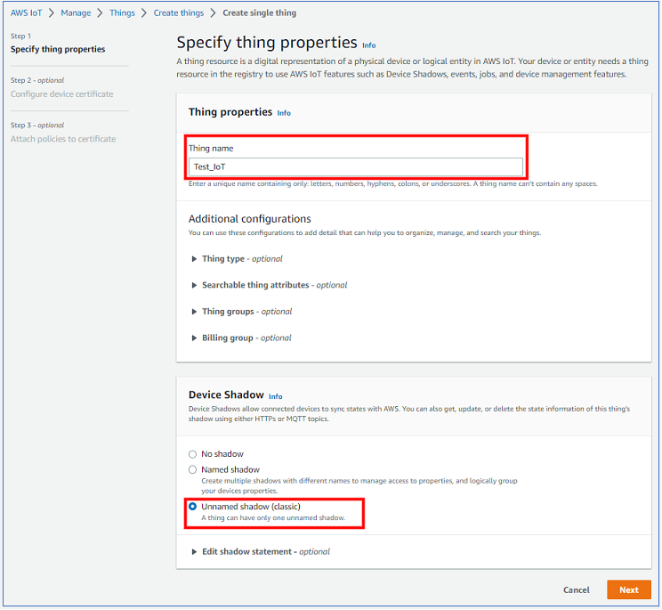

* During **Configure device certificate** step, choose **Auto-generate a new certificate (recommended)** option and click next.

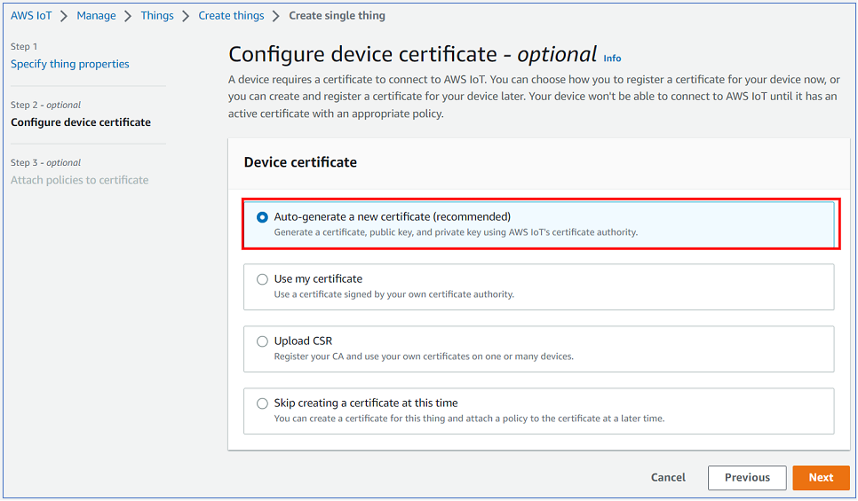

* Choose the **Download** links to download the device certificate, private key, and root CA certificate. Root CA certificate is already present in SDK (aws_starfield_ca.pem.h), and can be directly used.
  > **Warning:** This is the only instance you can download your device certificate and private key. Make sure to save them safely. 

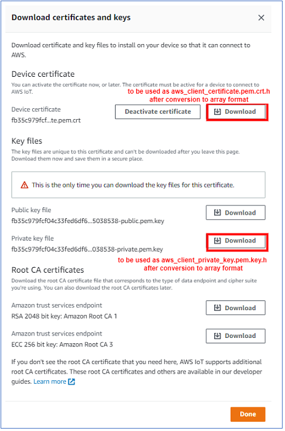

* To attach an existing policy choose the policy and click on create thing, if policy is not yet created Choose Create policy and fill the fields as mentioned in the following images.

choosing an existing policy

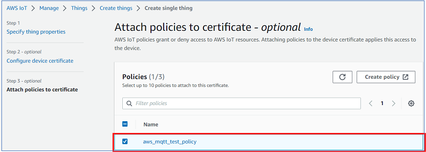

creating a policy - step 1

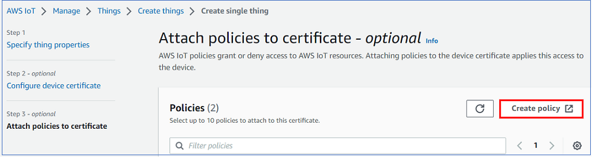

creating a policy - step 2 (filling the fields)
Give the **Name** to your Policy, Fill **Action** and **Resource ARN** as shown in below image, Click on **Allow** under **Effect** and click **Create**
   
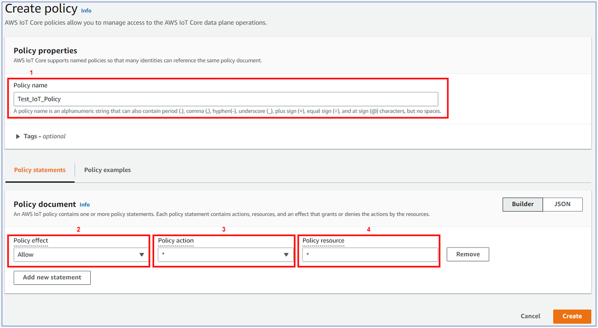


* choose the created policy and click on **Create thing**

* The created thing should now be visible on the AWS console (Manage > All devices > Things)

### **Appendix**: Steps to create a policy from AWS console

* Navigate to **AWS IoT console**
* Choose **Policies** under **Secure**

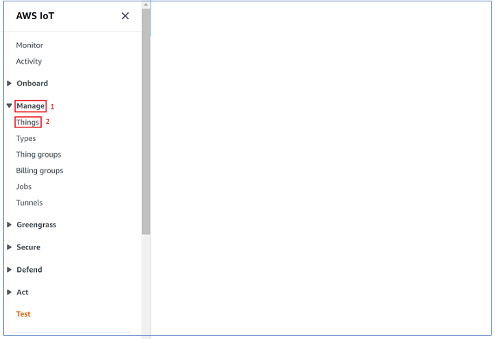 

* Click on **Create**
   
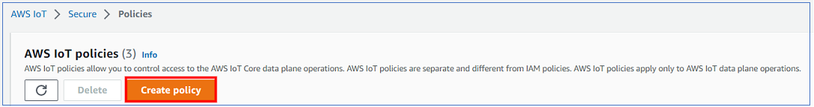

* Give the **Name** to your Policy, Fill **Action** and **Resource ARN** as shown in below image, Click on **Allow** under **Effect** and click **Create**
   


### **Current consumption measurement for SiWx91x**
Refer [AEM measurement]() section in ***Getting Started with SiWx91x SoC*** guide for measuring current consumption of SiWx91x module. 


### **Bare metal configuration**
By default, the application runs over FreeRTOS. To run the application with Bare metal configuration, follow the Bare Metal configuration section in the ***Getting Started with SiWx91x SoC*** guide.


