# M4 Firmware Update

## Introduction

This application demonstrates how to update the SiWx91x M4 image via Wi-Fi by downloading an image from a remote TCP server. The TCP server may be hosted on a local PC (as demonstrated in this example), or alternately on a cloud service such as Amazon AWS or Microsoft Azure. The update process works as follows:
  - The SiWx91x connects via Wi-Fi as a TCP client to a TCP update server
  - The SiWx91x OTA application sends a firmware file request to the server
  - The server responds with the firmware file
  - The OTA application programs the m4 firmware into the SiWx91x flash memory and reboots

## Setting Up 
To use this application, the following hardware, software and project setup is required.

### Hardware Requirements	
  - Windows PC.
  - Wi-Fi Access point with a connection to the internet
  - Linux PC or Cygwin on Windows (to build and run the TCP server source provided)
  - SiWx91x Wi-Fi Evaluation Kit. The SiWx91x supports multiple operating modes. See [Operating Modes]() for details.
  - **SoC Mode**: 
      - Silicon Labs [WSTK + BRD4325A](https://www.silabs.com/development-tools/wireless/wi-fi/rs9116x-sb-evk-development-kit)
 
 
#### SoC Mode : 

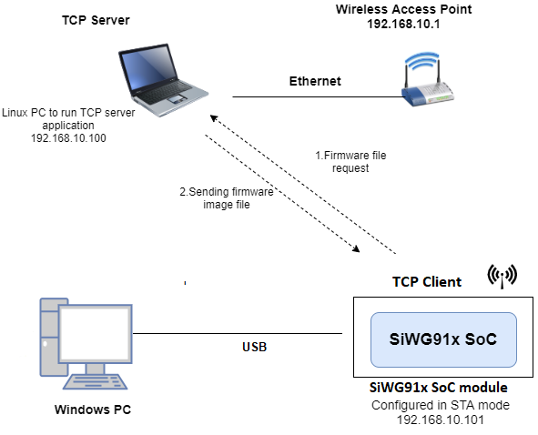
  
### Project Setup
- **SoC Mode**
  - **Silicon Labs SiWx91x SoC**. Follow the [Getting Started with SiWx91x SoC](https://docs.silabs.com/) to setup the example to work with SiWx91x SoC and Simplicity Studio.

## Configuring the Application
The application can be configured to suit your requirements and development environment.
Read through the following sections and make any changes needed. 
	 
### Bare Metal/RTOS Support
To select a bare metal configuration, see [Selecting bare metal](#selecting-bare-metal).

### Wi-Fi Configuration
Configure the following parameters in **rsi_firmware_update_app.c** to enable your Silicon Labs Wi-Fi device to connect to your Wi-Fi network.

```c
#define SSID           "SILABS_AP"      // Wi-Fi Network Name
#define PSK            "1234567890"     // Wi-Fi Password
#define SECURITY_TYPE  RSI_WPA2         // Wi-Fi Security Type: RSI_OPEN / RSI_WPA / RSI_WPA2
```

### TCP Configuration

```c
#define DEVICE_PORT        5001        // TCP client port of the local SiWx91x TCP client
#define SERVER_PORT        5001        // TCP server port of the remote TCP server
#define SERVER_IP_ADDRESS  0x6400A8C0  // Server IP address in little endian byte order: 
                                       //   192.168.0.100 -> 0x64=100, 0x00=0, 0xA8=168, 0xC0=192
```

# Testing Firmware Udpates
Before a test of the firwmare update application can be performed, the TCP server first needs to be setup and started.

## Build and run the TCP Server
  1. Copy the TCP server application **firmware_update_tcp_server_9117.c** provided with the application source to a Linux PC connected to the Wi-Fi access point. 
  2. Compile the application
> `user@linux:~$ gcc firmware_update_tcp_server_9117.c` -o ota_server.bin
  3. Run the application providing the TCP port number (specified in the application) together with the firmware file and path
> `user@linux:~$ ./ota_server.bin 5001 firmware.bin`

... where **firmware.bin** is the m4 firmware image to be sent to SiWx91x.

### Project Creation - SoC Mode : 

- Connect your board. The Si917 compatible SoC board is **BRD4325A**.
- Studio should detect your board. Your board will be shown here.

 **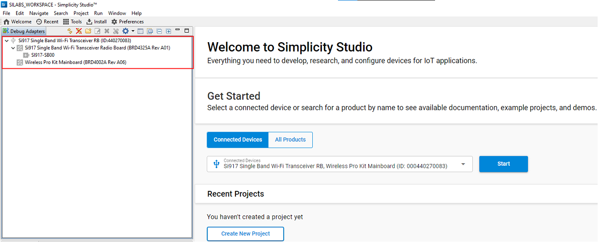**

### Selecting an example application and generate project

 SoC
- Go to the 'EXAMPLE PROJECT & DEMOS' tab and select the Wi-Fi - SoC Firmware Update via TCP Server application

  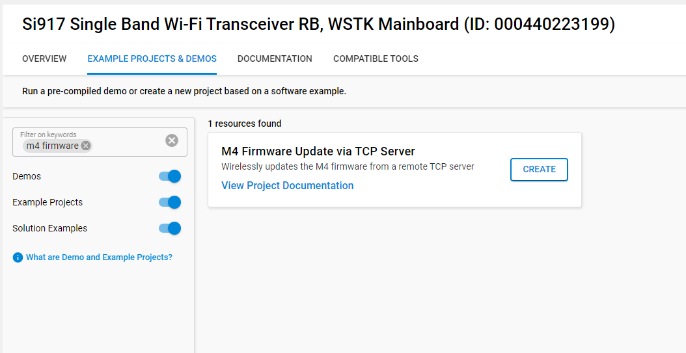
- Click 'Create'. The "New Project Wizard" window appears. Click 'Finish'

  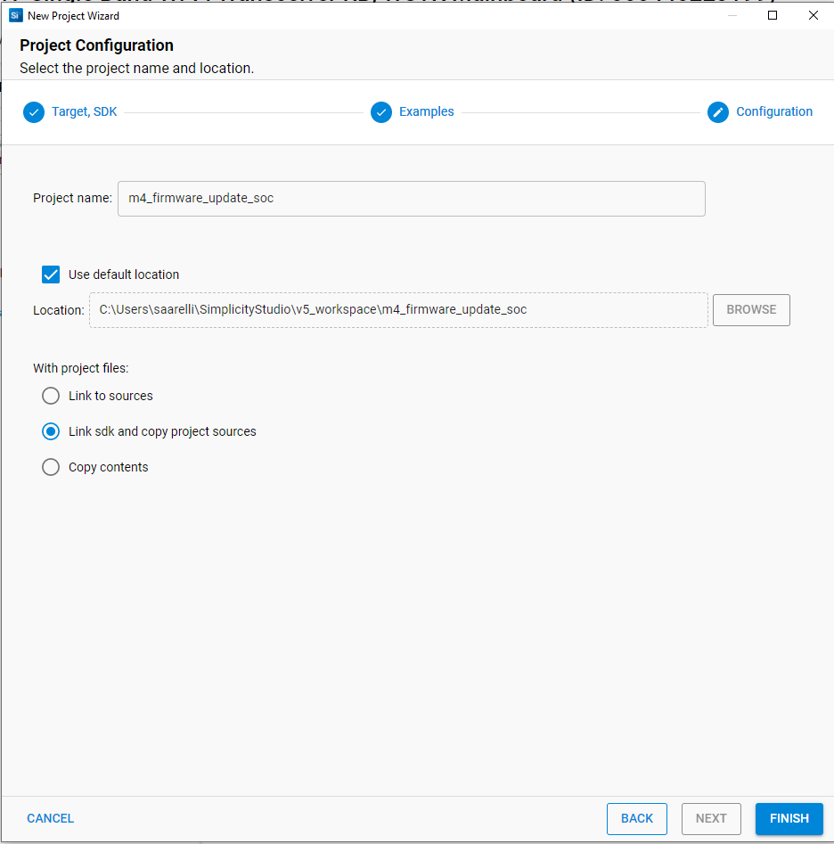

#### Build Project - SoC Mode

- Once the project is created, right click on project and go to properties ? C/C++ Build ? Settings ? Build Steps
- Add post_build_script_SimplicityStudio.bat file path (SI917_COMBO_SDK.X.X.X.XX\utilities\isp_scripts_common_flash) in build steps settings as shown in below image.

  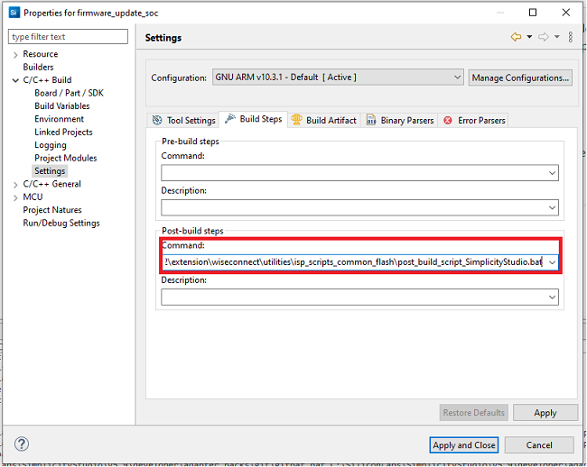
- Go to properties → C/C++ Build → Settings → Tool Settings → GNU ARM C Compiler → Preprocessor → Defined symbols (-D) and check for M4 projects macro (RSI_M4_INTERFACE=1) and 9117 macro (CHIP_9117=1). If not present, add the macros and click **Apply and Close**.
  
  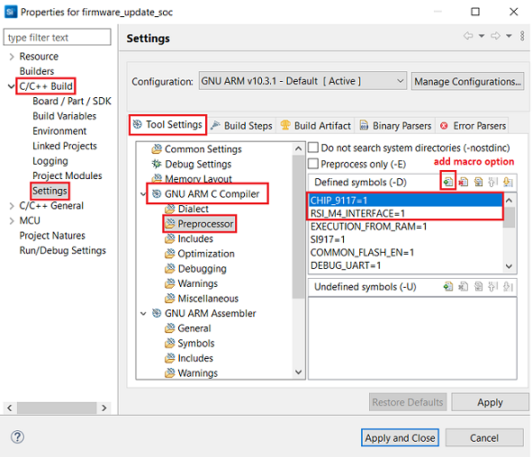
- Click on the build icon (hammer) or right click on project name and choose **Build Project** to build the project.

  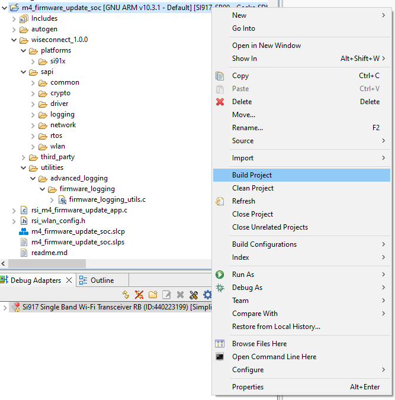
- Successful build output will show as below.

  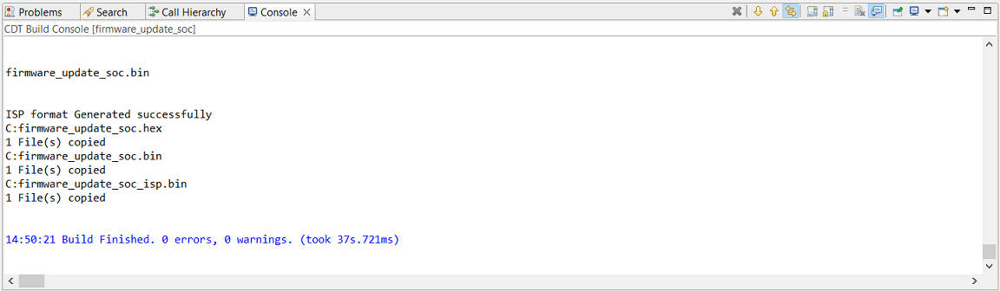

## Program the device

Once the build was successful, right click on project and click on Debug As->Silicon Labs ARM Program as shown in below image.
SoC

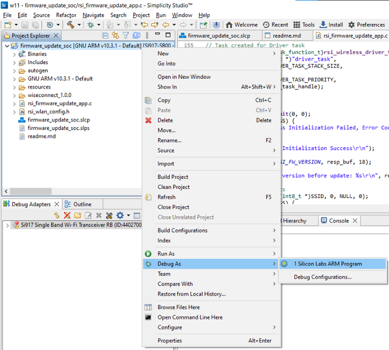

When the application runs and connects to the TCP server, the m4 firmware image transfer occurs in chunks. The app requests a firmware chunk, the server sends the chunk, the app requests the next chunk, the server sends the chunk, and so forth until the entire transfer completes. As the transfer proceeds, progress is printed to the serial console. On completion, the console prints 'reach end of file'.


When the firmware update completes, the SiWx91x MCU should be rebooted after which it may take a few minutes to overwrite the old m4 firmware with the new m4 firmware in flash memory.

Application prints
SoC

  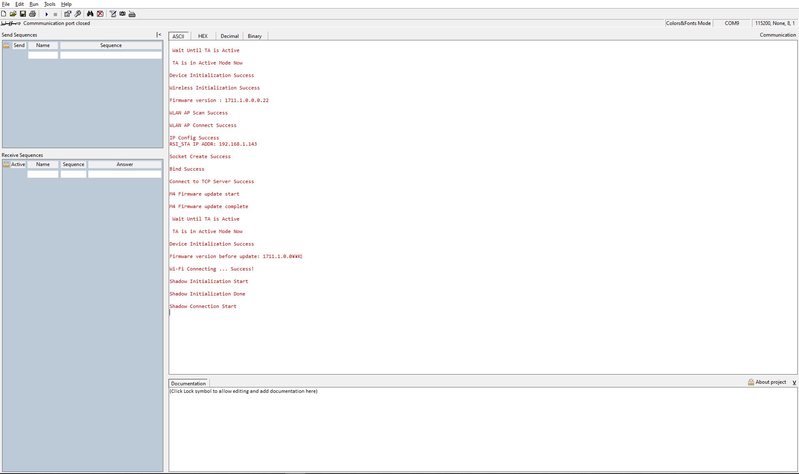

## Observing the output prints on serial terminal

**SoC mode**: 
You can use either of the below USB to UART converters for application prints.
1. Set up using USB to UART converter board.

  - Connect Tx (Pin-6) to P27 on WSTK
  - Connect GND (Pin 8 or 10) to GND on WSTK

    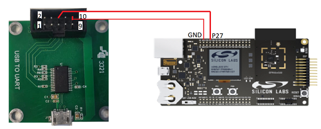

**Docklight set up - for SoC mode**

1. Open the Docklight tool. 
   - For SoC mode, choose the serial port to which USB to UART converter is connected and click on **OK**. 

2. Navigate to the Setup → Serial port and update the baud rate to **115200** and click on **OK**.

The serial port is now connected. 

# Selecting Bare Metal
The application has been designed to work with FreeRTOS and Bare Metal configurations. By default, the application project files (Keil and Simplicity studio) are configured with FreeRTOS enabled. The following steps demonstrate how to configure Simplicity Studio and Keil to test the application in a Bare Metal environment.

## Bare Metal with Simplicity Studio
> - Open the project in Simplicity Studio
> - Right click on the project and choose 'Properties'
> - Go to 'C/C++ Build' | 'Settings' | 'GNU ARM C Compiler' | 'Preprocessor' and remove macro 'RSI_WITH_OS=1'
> - Select 'Apply' and 'OK' to save the settings

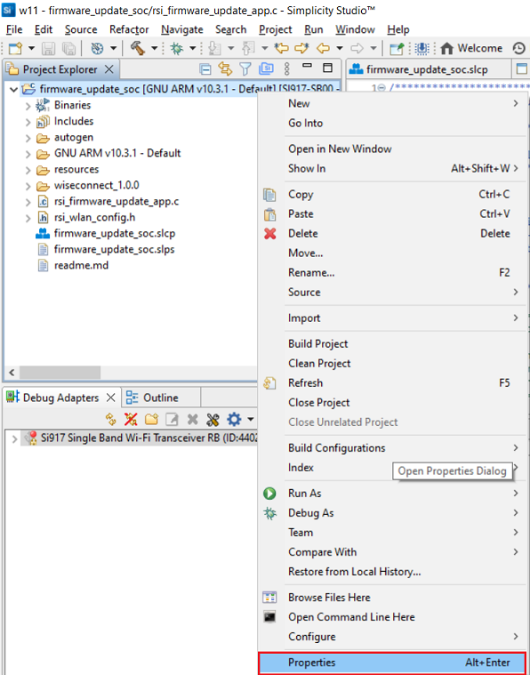 

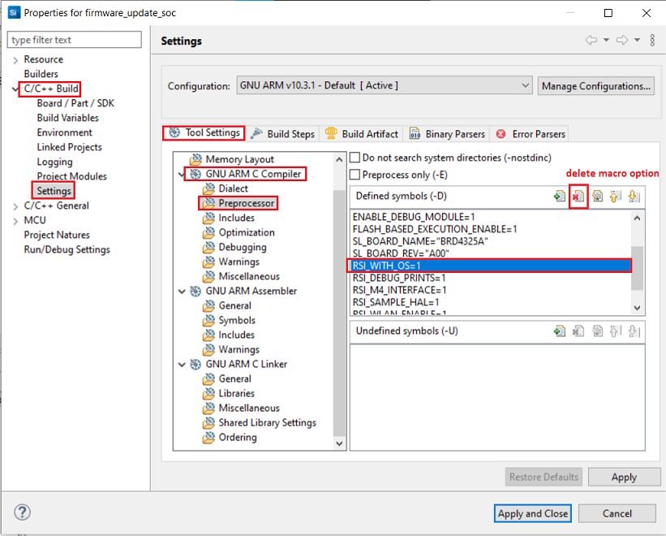
