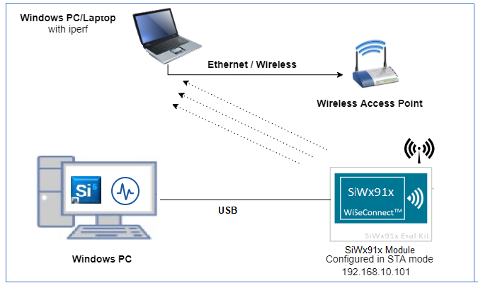
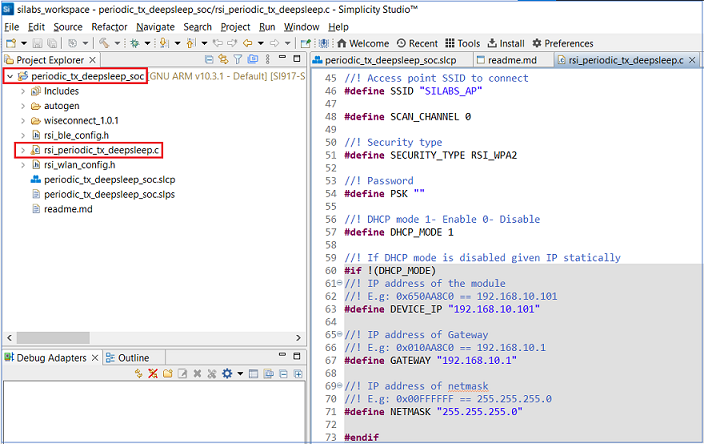
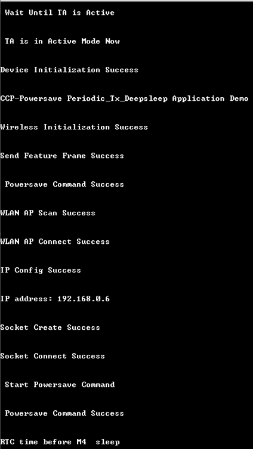
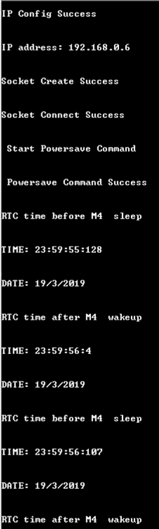
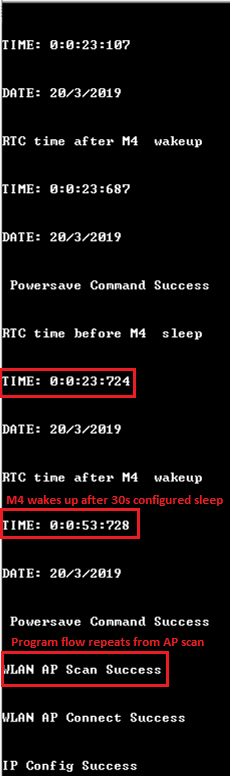

# **Periodic Tx Deepsleep**

## **1 Introduction**

This application demonstrates: 
* The process of configuring SiWx91x (TA and M4) in deepsleep with RAM retention and having TCP client socket in open state
* How to enable M4 wake up then send data to TA
* How TA wakes up, processes the packet and enters back to sleep
* How to enable M4 periodic sleep wakeup mechanism
* How to enable M4 to wake TA from sleep to process the TCP packet and enter sleep

## **2 Prerequisites**
For running the application, you will need the following:
### **2.1 Hardware Requirements**
- A Windows PC
- A wireless access point
- Silicon Labs SiWx917 PK6030A SoC Kit which includes
  - BRD4001A/BRD4002A Wireless Starter Kit Mainboard
  - BRD4325A Radio Board
- USB TO UART converter or TTL cable
### **2.2 Software Requirements**
- Simplicity Studio IDE
   - To download and install the Simplicity Studio IDE, refer to the [Simplicity Studio IDE Set up]() section in ***Getting started with SiWx91x SoC*** guide.
- SiWx917_WiSeConnect_SDK.x.x.x.x
- [TCP/UDP peer application - Hercules](https://www.hw-group.com/software/hercules-setup-utility)
- Tera Term software or any other serial terminal software - for viewing application prints
- Energy Profiler tool (Integrated in Simplicity Studio IDE)

## **3 Set up diagram**



## **4 Set up** 
- Follow the [Hardware connections and Simplicity Studio IDE Set up]()  section in the ***Getting Started with SiWx91x SoC*** guide to make the hardware connections and add the Gecko and SiWx91x COMBO SDK to Simplicity Studio IDE.
- Ensure that SiWx91x module is loaded with the latest firmware following the [SiWx91x Firmware Update]() section in the ***Getting started with SiWx91x SoC*** guide.

## **5 Creation of Project**

To create the project in the Simplicity Studio IDE, follow the [Creation of Project]() section in the ***Getting started with SiWx91x SoC*** guide, choose the **Wi-Fi - SoC Periodic Tx Deep Sleep** example.
   

## **6 Application configuration**
Read through the following sections and make any changes needed. 
  
In the Project explorer pane of the IDE, expand the **periodic_tx_deepsleep_soc** folder and open the **rsi_periodic_tx_deepsleep.c** file. Configure the following parameters based on your requirements.

   

- ### **Wi-Fi Configuration**
    ```c
    //! Wi-Fi Network Name
    #define SSID                           "SILABS_AP"      

    //! Wi-Fi Password
    #define PSK                            "1234567890"     

    //! Wi-Fi Security Type: RSI_OPEN / RSI_WPA / RSI_WPA2
    #define SECURITY_TYPE                  RSI_WPA2         
    ```

- ### **Hercules Setup  Configuration** 
    ```c
      //! The remote TCP server port number on the PC running Hercules Setup
      #define SERVER_PORT                  5001

      //! The remote TCP server IP address on the PC running Hercules Setup
      #define SERVER_IP_ADDRESS            "192.168.10.100"
  
      //! Number of packets to be transmitted can also be configured
      #define NUMBER_OF_PACKETS            44
    ```

- ### **M4 Alarm time configuration**
```c
#define SLEEP_ALARM_PERIODIC_TIME          300
#define ACTIVE_ALARM_PERIODIC_TIME         300
```

- ### **Major Powersave Options**
The primary powersave settings are configured with `PSP_MODE` and `PSP_TYPE`. The default power save mode is set to low power mode 2 (`RSI_SLEEP_MODE_2`) with maximum power save (`RSI_MAX_PSP`) and with M4 based handshake as follows.

```c
  #define PSP_MODE                         RSI_SLEEP_MODE_2
  #define PSP_TYPE                         RSI_MAX_PSP
```

`PSP_MODE` refers to the power save profile mode. SiWx91x EVK supports the following power modes:

  - `RSI_ACTIVE` : In this mode, SiWx91x EVK is active and power save is disabled.
  - `RSI_SLEEP_MODE_1` : In this mode, SiWx91x EVK goes to power save after association with the Access Point. In this sleep mode, SoC will never turn off, therefore no handshake is required before sending data to the SiWx91x EVK.
  - `RSI_SLEEP_MODE_2` : In this mode, SiWx91x EVK goes to power save after association with the Access Point. In this sleep mode, SoC will go to sleep based on GPIO hand shake or Message exchange or M4 based handshake, therefore handshake is required before sending data to the SiWx91x EVK.
  - `RSI_SLEEP_MODE_8` : In this mode, SiWx91x EVK goes to power save when it is not in associated state with the Access Point. In this sleep mode, SoC will go to sleep based on GPIO handshake or Message exchange or M4 based handshake, therefore handshake is required before sending the command to the SiWx91x EVK.

---- 

**Note!**
  1. For `RSI_SLEEP_MODE_2` and `RSI_SLEEP_MODE_8` modes, GPIO or Message or M4 based handshake can be selected using `RSI_HAND_SHAKE_TYPE` macro which is defined in `rsi_wlan_config.h`.
  2. In this example, `RSI_SLEEP_MODE_2` can be verified with a M4-based handshake. 

----

`PSP_TYPE` refers to power save profile type. SiWx91x EVK supports following power save profile types:
  - `RSI_MAX_PSP` : In this mode, SiWx91x EVK will be in Maximum power save mode. i.e device will wake up for every DTIM beacon and do data Tx and Rx.
  - `RSI_FAST_PSP` : In this mode, SiWx91x EVK will disable power save for any Tx/Rx packet for monitor interval of time (monitor interval can be set through macro in `rsi_wlan_config.h` file, default value is 50 ms). If there is no data for monitor interval of time, then SiWx91x EVK will again enable power save.
----

**Note!**
  1. `PSP_TYPE` is valid only when `PSP_MODE` is set to `RSI_ACTIVE` or `RSI_SLEEP_MODE_2` or `RSI_SLEEP_MODE_8` mode.
----

## **7 Setup for Serial Prints**

To Setup the serial prints, follow the [Setup for Serial Prints]() section in the ***Getting started with SiWx91x SoC*** guides.
  
## **8 Build, Flash, and Run the Application**

To build, flash, and run the application project refer to the [Build and Flash the Project]() section in the ***Getting Started with SiWx91x SoC*** guide.

## **9 Execution Flow**

- Application demonstrates 
  - Power Consumption of Silabs device in deep sleep mode having TCP server socket in open state
  - M4 wakes up with alarm configured time and sends packet to TA
  - TA wakes up with packet from M4 then process packet after which both TA and M4 enter deepsleep.

- Before running the application on SiWx91x, set up the TCP server on remote PC. 
  - Open the TCP Server tab in Hercules application
  - Enter the server port number as configured in SERVER_PORT in the application and click on listen on Hercules application.
    
    

- As the application runs on SiWx91x, it connects to the TCP server socket on remote PC. 

-  After establishment of TCP connection, "Client connected" message is seen in Client connection status.
 
    

- Application prints can observed as follows

  

  

  


## **10 Application flow**
* As the periodic tx deepsleep application runs, SiWx91x scans and connects to the Wi-Fi access point and obtains an IP address. 
* After a successful connection, TA goes into configured power save and sends data to TCP Server every 50msec, after all packets (when number of packets transmitted = NO_OF_PACKETS) are transmitted, M4 is triggered to sleep. 
* TA is triggered to sleep with power mode 8 with ram retention, followed by M4 going to sleep with ram retention with configurable alarm time. When alarm times out, M4 wakes up and in turn wakes up TA by sending packets and process repeats from AP scan.

## **Appendix**
Refer [AEM measurement]() section in ***Getting Started with SiWx91x SoC*** guide for measuring current consumption of SiWx91x module


