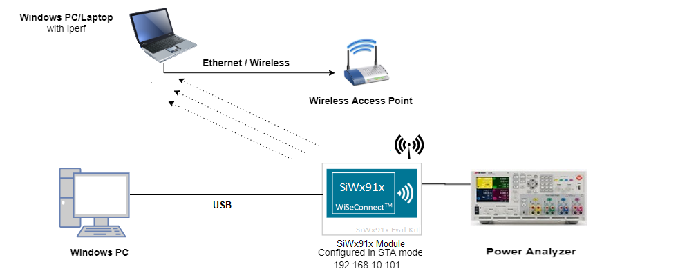
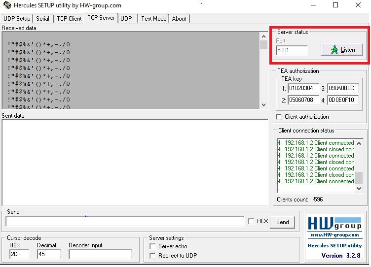
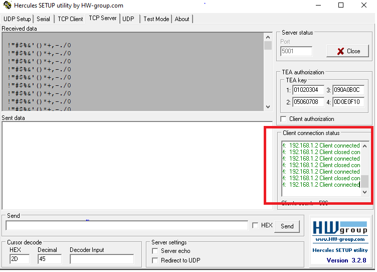

# TCP Tx with Powersave

## Introduction

This application demonstrates the process for configuring the SiWx91x powersave on periodic wakeup test application power consumption of Silicon device in Connected sleep mode having TCP server socket in open state.

The application creates TCP client socket and then connects to a remote server. After establishing socket connection, TA/NWP is configured in powersave mode, the module Send 512Kb data to TCP Server every 50msec. In this application, TA/NWP is in powersave when data transfer occurs. After completion of data transfer, M4 goes to sleep with configurable alarm time. When the alarm times out, M4 wakes up and in turn NWP/TA is woken up by packet from M4 and flow repeats.

## Setting Up 
To use this application, the following hardware, software and project setup is required.

### Hardware Requirements  
  - Windows PC.
  - Wi-Fi Access point with a connection to the internet
  - PC2 (Remote PC) with TCP server application (Hercules Setup)
  - Power analyzer
  - SiWx91x Wi-Fi Evaluation Kit
  - **SoC Mode**: 
      - Silicon Labs [BRD4325A](https://www.silabs.com/)
  
#### SoC Mode : 


  
### Software Requirements
  - [Hercules Application](https://www.hw-group.com/files/download/sw/version/hercules_3-2-8.exe)
   
### Project Setup
- **SoC Mode**
  - **Silicon Labs SiWx91x SoC**. Follow the [Getting Started with SiWx91x SoC](https://docs.silabs.com/) to setup the example to work with SiWx91x SoC and Simplicity Studio.

## Configuring the Application
The application can be configured to suit your requirements and development environment.
Read through the following sections and make any changes needed. 

### Wi-Fi Configuration
Configure the following parameters in **rsi_tcp_tx_with_powersave_on.c** to enable your Silicon Labs Wi-Fi device to connect to your Wi-Fi network.

```c
#define SSID           "SILABS_AP"      // Wi-Fi Network Name
#define PSK            "1234567890"     // Wi-Fi Password
#define SECURITY_TYPE  RSI_WPA2         // Wi-Fi Security Type: RSI_OPEN / RSI_WPA / RSI_WPA2
```

### Hercules Setup Configuration
- `SERVER_PORT` is the remote TCP server port number on the PC running Hercules Setup.
- `SERVER_IP_ADDRESS` is the remote TCP server IP address on the PC running Hercules Setup. 

```c
  #define SERVER_PORT        <remote port>
  #define SERVER_IP_ADDRESS  "192.168.10.100"
```
### Memory & Throughput
  - `GLOBAL_BUFF_LEN` sets the application memory size (in bytes) used by the driver.

```c
  #define GLOBAL_BUFF_LEN    15000
```
Number of packets to be transmitted can also be configured

```c
#define NUMBER_OF_PACKETS 44
```

### M4 Alarm time configuration
```c
#define ALARM_PERIODIC_TIME 300
```

### Major Powersave Options
The primary powersave settings are configured with `PSP_MODE` and `PSP_TYPE`. The default power save mode is set to low power mode 2 (`RSI_SLEEP_MODE_2`) with maximum power save (`RSI_MAX_PSP`) and with M4 based handshake as follows.

```c
  #define PSP_MODE  RSI_SLEEP_MODE_2
  #define PSP_TYPE  RSI_MAX_PSP
```

`PSP_MODE` refers to the power save profile mode. SiWx91x EVK supports the following power modes:

  - `RSI_ACTIVE` : In this mode, SiWx91x EVK is active and power save is disabled.
  - `RSI_SLEEP_MODE_1` : In this mode, SiWx91x EVK goes to power save after association with the Access Point. In this sleep mode, SoC will never turn off, therefore no handshake is required before sending data to the SiWx91x EVK.
  - `RSI_SLEEP_MODE_2` : In this mode, SiWx91x EVK goes to power save after association with the Access Point. In this sleep mode, SoC will go to sleep based on GPIO hand shake or Message exchange or M4 based handshake, therefore handshake is required before sending data to the SiWx91x EVK.
  - `RSI_SLEEP_MODE_8` : In this mode, SiWx91x EVK goes to power save when it is not in associated state with the Access Point. In this sleep mode, SoC will go to sleep based on GPIO handshake or Message exchange or M4 based handshake, therefore handshake is required before sending the command to the SiWx91x EVK.

---- 

**Note!**
  1. For `RSI_SLEEP_MODE_2` and `RSI_SLEEP_MODE_8` modes, GPIO or Message or M4 based handshake can be selected using `RSI_HAND_SHAKE_TYPE` macro which is defined in `rsi_wlan_config.h`.
  2. In this example, `RSI_SLEEP_MODE_2` can be verified with a M4-based handshake. 

----

`PSP_TYPE` refers to power save profile type. SiWx91x EVK supports following power save profile types:
  - `RSI_MAX_PSP` : In this mode, SiWx91x EVK will be in Maximum power save mode. i.e device will wake up for every DTIM beacon and do data Tx and Rx.
  - `RSI_FAST_PSP` : In this mode, SiWx91x EVK will disable power save for any Tx/Rx packet for monitor interval of time (monitor interval can be set through macro in `rsi_wlan_config.h` file, default value is 50 ms). If there is no data for monitor interval of time, then SiWx91x EVK will again enable power save.
  - `RSI_UAPSD` : This `PSP_TYPE` is used to enable WMM power save.

----

**Note!**
  1. `PSP_TYPE` is valid only when `PSP_MODE` is set to `RSI_SLEEP_MODE_1` or `RSI_SLEEP_MODE_2` mode.
  2. `RSI_UAPSD` power profile type in `PSP_TYPE` is valid only when `RSI_WMM_PS_ENABLE` is enabled in `rsi_wlan_config.h` file.

----


### Additional Powersave Options
Additional powersave options may be configured in **rsi_wlan_config.h**.
 
```c
  #define CONCURRENT_MODE                     RSI_DISABLE
  #define RSI_FEATURE_BIT_MAP                 (FEAT_SECURITY_OPEN | FEAT_AGGREGATION)
  #define RSI_TCP_IP_BYPASS                   RSI_DISABLE
  #define RSI_TCP_IP_FEATURE_BIT_MAP          (TCP_IP_FEAT_EXTENSION_VALID | TCP_IP_FEAT_DHCPV4_CLIENT)
  #define RSI_CUSTOM_FEATURE_BIT_MAP          FEAT_CUSTOM_FEAT_EXTENTION_VALID
  #define RSI_EXT_CUSTOM_FEATURE_BIT_MAP      (EXT_FEAT_LOW_POWER_MODE | EXT_FEAT_XTAL_CLK_ENABLE)
  #define RSI_EXT_TCPIP_FEATURE_BITMAP        CONFIG_FEAT_EXTENTION_VALID
  #define RSI_BAND                            RSI_BAND_2P4GHZ
  
  The default configuration of low power_save_mode_2 is:
  
  #define RSI_HAND_SHAKE_TYPE                 M4_BASED
  #define PLL_MODE                            0
  #define RF_TYPE                             1  
  #define WIRELESS_MODE                       12 
  #define ENABLE_PPP                          0
  #define AFE_TYPE                            1
  #define FEATURE_ENABLES                    (RSI_FEAT_FRAME_PREAMBLE_DUTY_CYCLE | RSI_FEAT_FRAME_LP_CHAIN | RSI_FEAT_FRAME_IN_PACKET_DUTY_CYCLE)
  #define BUFFER_FULL_HANDLING                0 
```

# Build Application

After making any custom configuration changes required, build, download and run the application as described in the [SoC Getting Started](https://docs.silabs.com/). 

# Testing Application 

After successful connection with access point, module starts TCP client connects to TCP Server on remote PC enter SERVER PORT and click on listen on Hercules application .



> If the TCP client connected to TCP server its shows Client connected in Client connection status.
 


As the application runs, SiWx91x scans and connects to the Wi-Fi access point and obtains an IP address, socket creation and connection takes place. 
NWP/TA is triggered to sleep with power mode 2 with ram retention, NWP/TA proceeds to transmit packets, for each packet TA is woken up by M4. In this application, NWP/TA is in powersave when data transmission occurs. After transmitting all packets, M4 goes to sleep with configurable alarm time. When the alarm times out, M4 wakes up and in turn NWP/TA is woken up by packet from M4 and flow repeats from socket creation and connection steps.