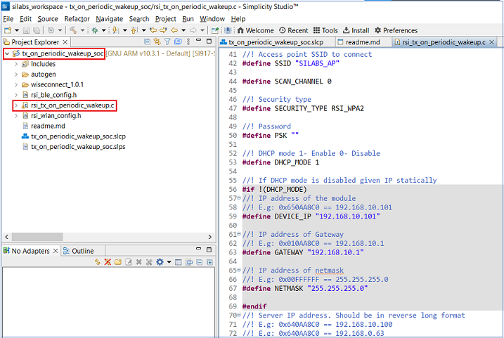
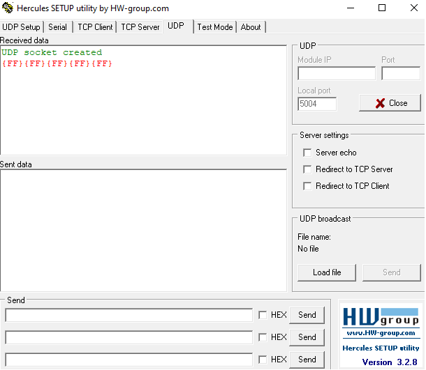
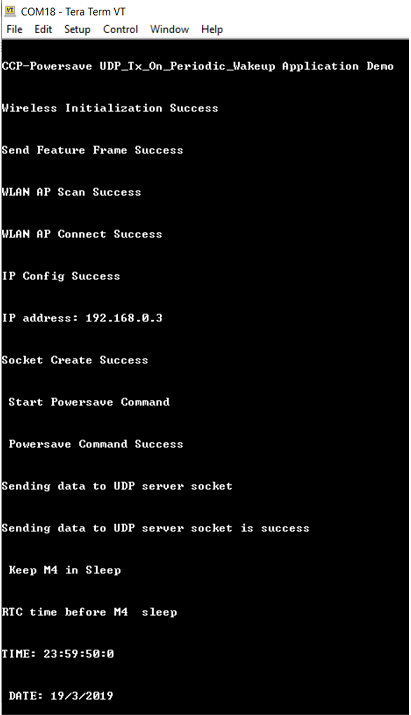
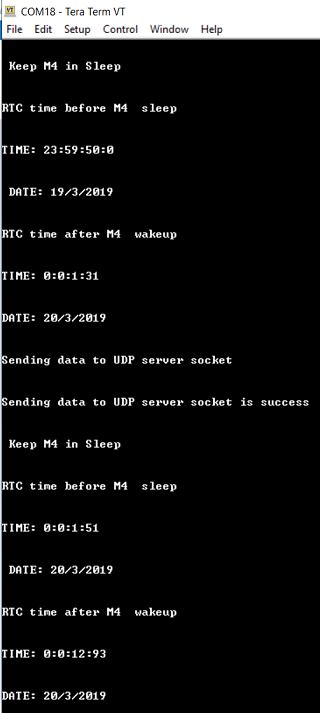

# **Tx on Periodic Wakeup**

## **1 Introduction**

This application demonstrates the process for configuring the SiWx91x periodic wakeup test application demonstrates power consumption of silicon device in Connected sleep mode having UDP server socket in open state.

The application creates UDP client socket and then connects to a remote server, NWP/TA then enters connected sleep and proceeds to send 64MB data to UDP Server. After completing data transfer, M4 goes to sleep with configurable alarm time. After the alarm times out, M4 wakes up and sends a packet to wake up NWP/TA and the data transmission repeats.

## **2 Prerequisites**
For running the application, you will need the following:
### **2.1 Hardware Requirements**
- A Windows PC
- A Wi-Fi Access Point
- Silicon Labs SiWx917 PK6030A SoC Kit which includes
  - BRD4001A/BRD4002A Wireless Starter Kit Mainboard
  - BRD4325A Radio Board
- USB TO UART converter or TTL cable
### **2.2 Software Requirements**
- Simplicity Studio IDE
   - To download and install the Simplicity Studio IDE, refer to the [Simplicity Studio IDE Set up]() section in ***Getting started with SiWx91x SoC*** guide.
- SiWx917_WiSeConnect_SDK.x.x.x.x
- [TCP/UDP peer application - Hercules](https://www.hw-group.com/software/hercules-setup-utility)
- Tera Term software or any other serial terminal software - for viewing application prints
- Energy Profiler tool (Integrated in Simplicity Studio IDE)

## **3 Set up diagram**


## **4 Set up** 
- Follow the [Hardware connections and Simplicity Studio IDE Set up]() section in the ***Getting Started with SiWx91x SoC*** guide to make the hardware connections and add the Gecko and SiWx91x COMBO SDK to Simplicity Studio IDE.
- Ensure that SiWx91x module is loaded with the latest firmware following the [SiWx91x Firmware Update]() section in the ***Getting started with SiWx91x SoC*** guide.

## **5 Creation of Project**
  
To create the project in the Simplicity Studio IDE, follow the [Creation of Project]() section in the ***Getting started with SiWx91x SoC*** guide, choose the **Wi-Fi - SoC Tx on Periodic Wakeup** example.
   
## **6 Application configuration**
Read through the following sections and make any changes needed. 
  
In the Project explorer pane of the IDE, expand the **tx_on_periodic_wakeup_soc** folder and open the **rsi_tx_on_periodic_wakeup.c** file. Configure the following parameters based on your requirements.

   

- ### **Wi-Fi Configuration**

    ```c
    //! Wi-Fi Network Name
    #define SSID           "SILABS_AP"      

    //! Wi-Fi Password
    #define PSK            "1234567890"     

    //! Wi-Fi Security Type: RSI_OPEN / RSI_WPA / RSI_WPA2
    #define SECURITY_TYPE  RSI_WPA2         
    ```

- ### **Hercules Setup Configuration**

    ```c
      //! The remote TCP server port number on the PC running Hercules Setup
      #define SERVER_PORT               5001
      
      //! The remote TCP server IP address on the PC running Hercules Setup
      #define SERVER_IP_ADDRESS         "192.168.10.100"
    
      //! Number of packets to be transmitted can also be configured
      #define NUMBER_OF_PACKETS         1
    ```

- ### **M4 Alarm time configuration**
    ```c
    #define ALARM_PERIODIC_TIME         300
    ```

- ### **Major Powersave Options**
The primary powersave settings are configured with `PSP_MODE` and `PSP_TYPE`. The default power save mode is set to low power mode 2 (`RSI_SLEEP_MODE_2`) with maximum power save (`RSI_MAX_PSP`) and with M4 based handshake as follows.

```c
  #define PSP_MODE                      RSI_SLEEP_MODE_2
  #define PSP_TYPE                      RSI_MAX_PSP
```

`PSP_MODE` refers to the power save profile mode. SiWx91x EVK supports the following power modes:

  - `RSI_ACTIVE` : In this mode, SiWx91x EVK is active and power save is disabled.
  - `RSI_SLEEP_MODE_1` : In this mode, SiWx91x EVK goes to power save after association with the Access Point. In this sleep mode, SoC will never turn off, therefore no handshake is required before sending data to the SiWx91x EVK.
  - `RSI_SLEEP_MODE_2` : In this mode, SiWx91x EVK goes to power save after association with the Access Point. In this sleep mode, SoC will go to sleep based on GPIO hand shake or Message exchange or M4 based handshake, therefore handshake is required before sending data to the SiWx91x EVK.
  - `RSI_SLEEP_MODE_8` : In this mode, SiWx91x EVK goes to power save when it is not in associated state with the Access Point. In this sleep mode, SoC will go to sleep based on GPIO handshake or Message exchange or M4 based handshake, therefore handshake is required before sending the command to the SiWx91x EVK.

---- 

**Note!**
  1. For `RSI_SLEEP_MODE_2` and `RSI_SLEEP_MODE_8` modes, GPIO or Message or M4 based handshake can be selected using `RSI_HAND_SHAKE_TYPE` macro which is defined in `rsi_wlan_config.h`.
  2. In this example, `RSI_SLEEP_MODE_2` can be verified with a M4-based handshake. 

----

`PSP_TYPE` refers to power save profile type. SiWx91x EVK supports following power save profile types:
  - `RSI_MAX_PSP` : In this mode, SiWx91x EVK will be in Maximum power save mode. i.e device will wake up for every DTIM beacon and do data Tx and Rx.
  - `RSI_FAST_PSP` : In this mode, SiWx91x EVK will disable power save for any Tx/Rx packet for monitor interval of time (monitor interval can be set through macro in `rsi_wlan_config.h` file, default value is 50 ms). If there is no data for monitor interval of time, then SiWx91x EVK will again enable power save.

----

**Note!**
- `PSP_TYPE` is valid only when `PSP_MODE` is set to `RSI_SLEEP_MODE_1` or `RSI_SLEEP_MODE_2` mode.

----

- ### **Additional Powersave Options**
Additional powersave options may be configured in **rsi_wlan_config.h**.
 
```c
  #define CONCURRENT_MODE                     RSI_DISABLE
  #define RSI_FEATURE_BIT_MAP                 (FEAT_SECURITY_OPEN)
  #define RSI_TCP_IP_BYPASS                   RSI_DISABLE
  #define RSI_TCP_IP_FEATURE_BIT_MAP          (TCP_IP_FEAT_DHCPV4_CLIENT)
  #define RSI_CUSTOM_FEATURE_BIT_MAP          FEAT_CUSTOM_FEAT_EXTENTION_VALID
  #define RSI_EXT_CUSTOM_FEATURE_BIT_MAP      0
  #define RSI_EXT_TCPIP_FEATURE_BITMAP        0
  #define RSI_BAND                            RSI_BAND_2P4GHZ
  
  The default configuration of low power_save_mode_2 is:
  
  #define RSI_HAND_SHAKE_TYPE                 M4_BASED
  #define RSI_SELECT_LP_OR_ULP_MODE           RSI_ULP_WITH_RAM_RET
  #define RSI_DTIM_ALIGNED_TYPE               0
  #define RSI_MONITOR_INTERVAL                50
  #define RSI_NUM_OF_DTIM_SKIP                0
```

The application defaults to the `RSI_SLEEP_MODE_2` configuration. 
- `RSI_SELECT_LP_OR_ULP_MODE` is used to select low power mode or ultra-low power mode. Valid configurations are 
  - `RSI_LP_MODE` - SiWx91x will be in low power mode.
  - `RSI_ULP_WITH_RAM_RET` - SiWx91x will be in Ultra low power mode and will remember the previous state after issuing the power save mode command.
  - `RSI_ULP_WITHOUT_RAM_RET` - SiWx91x will be in Ultra low power mode and it will not remember the previous state after issuing power save mode command. After wakeup, SiWx91x will give CARD READY indication and user has to issue commands from wireless initialization.
- `RSI_DTIM_ALIGNED_TYPE` is used to decide whether SiWx91x has to wake up at normal beacon or DTIM beacon which is just before listen interval.
  - `RSI_DTIM_ALIGNED_TYPE = 0` - SiWx91x will wake up at normal beacon which is just before listen interval.
  - `RSI_DTIM_ALIGNED_TYPE = 1` - SiWx91x will wake up at DTIM beacon which is just before listen interval.
- `RSI_MONITOR_INTERVAL` refers to the amount of time (in ms) to wait for Tx or Rx before giving power save indication to the connected Access Point. This macro is applicable only when `PSP_TYPE` selected as `RSI_FAST_PSP`
- `RSI_NUM_OF_DTIM_SKIP`  is used the number of DTIMs to skip during powersave.

## **7 Setup for Serial Prints**

To Setup the serial prints, follow the [Setup for Serial Prints]() section in the ***Getting started with SiWx91x SoC*** guide.
  
## **8 Build, Flash, and Run the Application**

To build, flash, and run the application project refer to the [Build and Flash the Project]() section in the ***Getting Started with SiWx91x SoC*** guide.

## **9 Execution Flow**

- Before running the application on SiWx91x, set up the UDP server on remote PC. Open the UDP tab in Hercules application and enter server port number as configured in the SERVER_PORT macro in the application and click on listen.

  

  

- Application prints can be observed as follows:

    

    

## **10 Application flow**
As the application runs, SiWx91x scans and connects to the Wi-Fi access point and obtains an IP address. After a successful connection, the module is configured with powersave mode 2 and then proceeds to send 64MB data to UDP Server running on a remote peer which is connected to access point. 

After transmission of data, M4 goes to sleep with ram retention with configurable alarm time. After alarm times out, M4 wakes up and sends a packet to wake up NWP/TA. The program flow repeats from data transmission step.

## **Appendix**
Refer [AEM measurement](https://docs.silabs.com/) section in ***Getting Started with SiWx91x SoC*** guide for measuring current consumption of SiWx91x module. 
