# TX on Periodic Wakeup

## Introduction

This application demonstrates the process for configuring the SiWx91x periodic wakeup test application demonstrates power consumption of silicon device in Connected sleep mode having UDP server socket in open state.

The application creates UDP client socket and then connects to a remote server, NWP/TA then enters connected sleep and proceeds to send 64MB data to UDP Server. After completing data transfer, M4 goes to sleep with configurable alarm time. After the alarm times out, M4 wakes up and sends a packet to wake up NWP/TA and the data transmission repeats.

## Setting Up 
To use this application, the following hardware, software and project setup is required.

### Hardware Requirements  
  - Windows PC.
  - Wi-Fi Access point with a connection to the internet
  - PC2 (Remote PC) with UDP server application (Hercules Setup)
  - Power analyzer
  - SiWx91x Wi-Fi Evaluation Kit
  - **SoC Mode**: 
      - Silicon Labs [BRD4325A](https://www.silabs.com/)
 
#### SoC Mode : 

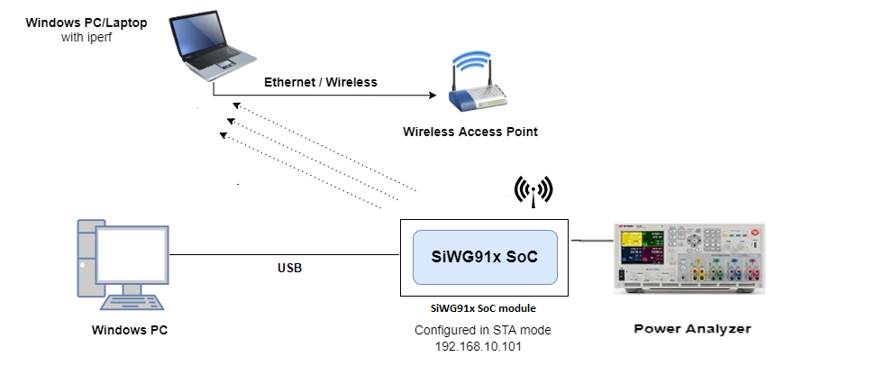

### Software Requirements
  - [Hercules Application](https://www.hw-group.com/files/download/sw/version/hercules_3-2-8.exe)
   
### Project Setup
- **SoC Mode**
  - **Silicon Labs SiWx91x SoC**. Follow the [Getting Started with SiWx91x SoC](https://docs.silabs.com/) to setup the example to work with SiWx91x SoC and Simplicity Studio.

## Configuring the Application
The application can be configured to suit your requirements and development environment.
Read through the following sections and make any changes needed. 

### Wi-Fi Configuration
Configure the following parameters in **rsi_tx_on_periodic_wakeup.c** to enable your Silicon Labs Wi-Fi device to connect to your Wi-Fi network.

```c
#define SSID           "SILABS_AP"      // Wi-Fi Network Name
#define PSK            "1234567890"     // Wi-Fi Password
#define SECURITY_TYPE  RSI_WPA2         // Wi-Fi Security Type: RSI_OPEN / RSI_WPA / RSI_WPA2
```

### Hercules Setup Configuration
- `SERVER_PORT` is the remote TCP server port number on the PC running Hercules Setup.
- `SERVER_IP_ADDRESS` is the remote TCP server IP address on the PC running Hercules Setup. 

```c
  #define SERVER_PORT        <remote port>
  #define SERVER_IP_ADDRESS  "192.168.10.100"
```
### Memory & Throughput
  - `GLOBAL_BUFF_LEN` sets the application memory size (in bytes) used by the driver.

```c
  #define GLOBAL_BUFF_LEN    15000
```
Number of packets to be transmitted can also be configured

```c
#define NUMBER_OF_PACKETS 1
```

### M4 Alarm time configuration
```c
#define ALARM_PERIODIC_TIME 1
```

### Major Powersave Options
The primary powersave settings are configured with `PSP_MODE` and `PSP_TYPE`. The default power save mode is set to low power mode 2 (`RSI_SLEEP_MODE_2`) with maximum power save (`RSI_MAX_PSP`) and with M4 based handshake as follows.

```c
  #define PSP_MODE  RSI_SLEEP_MODE_2
  #define PSP_TYPE  RSI_MAX_PSP
```

`PSP_MODE` refers to the power save profile mode. SiWx91x EVK supports the following power modes:

  - `RSI_ACTIVE` : In this mode, SiWx91x EVK is active and power save is disabled.
  - `RSI_SLEEP_MODE_1` : In this mode, SiWx91x EVK goes to power save after association with the Access Point. In this sleep mode, SoC will never turn off, therefore no handshake is required before sending data to the SiWx91x EVK.
  - `RSI_SLEEP_MODE_2` : In this mode, SiWx91x EVK goes to power save after association with the Access Point. In this sleep mode, SoC will go to sleep based on GPIO hand shake or Message exchange or M4 based handshake, therefore handshake is required before sending data to the SiWx91x EVK.
  - `RSI_SLEEP_MODE_8` : In this mode, SiWx91x EVK goes to power save when it is not in associated state with the Access Point. In this sleep mode, SoC will go to sleep based on GPIO handshake or Message exchange or M4 based handshake, therefore handshake is required before sending the command to the SiWx91x EVK.

---- 

**Note!**
  1. For `RSI_SLEEP_MODE_2` and `RSI_SLEEP_MODE_8` modes, GPIO or Message or M4 based handshake can be selected using `RSI_HAND_SHAKE_TYPE` macro which is defined in `rsi_wlan_config.h`.
  2. In this example, `RSI_SLEEP_MODE_2` can be verified with a M4-based handshake. 

----

`PSP_TYPE` refers to power save profile type. SiWx91x EVK supports following power save profile types:
  - `RSI_MAX_PSP` : In this mode, SiWx91x EVK will be in Maximum power save mode. i.e device will wake up for every DTIM beacon and do data Tx and Rx.
  - `RSI_FAST_PSP` : In this mode, SiWx91x EVK will disable power save for any Tx/Rx packet for monitor interval of time (monitor interval can be set through macro in `rsi_wlan_config.h` file, default value is 50 ms). If there is no data for monitor interval of time, then SiWx91x EVK will again enable power save.
  - `RSI_UAPSD` : This `PSP_TYPE` is used to enable WMM power save.

----

**Note!**
  1. `PSP_TYPE` is valid only when `PSP_MODE` is set to `RSI_SLEEP_MODE_1` or `RSI_SLEEP_MODE_2` mode.
  2. `RSI_UAPSD` power profile type in `PSP_TYPE` is valid only when `RSI_WMM_PS_ENABLE` is enabled in `rsi_wlan_config.h` file.

----


### Additional Powersave Options
Additional powersave options may be configured in **rsi_wlan_config.h**.
 
```c
  #define CONCURRENT_MODE                     RSI_DISABLE
  #define RSI_FEATURE_BIT_MAP                 (FEAT_SECURITY_OPEN)
  #define RSI_TCP_IP_BYPASS                   RSI_DISABLE
  #define RSI_TCP_IP_FEATURE_BIT_MAP          (TCP_IP_FEAT_DHCPV4_CLIENT)
  #define RSI_CUSTOM_FEATURE_BIT_MAP          FEAT_CUSTOM_FEAT_EXTENTION_VALID
  #define RSI_EXT_CUSTOM_FEATURE_BIT_MAP      0
  #define RSI_EXT_TCPIP_FEATURE_BITMAP        0
  #define RSI_BAND                            RSI_BAND_2P4GHZ
  
  The default configuration of low power_save_mode_2 is:
  
  #define RSI_HAND_SHAKE_TYPE                 M4_BASED
  #define RSI_SELECT_LP_OR_ULP_MODE           RSI_ULP_WITH_RAM_RET
  #define RSI_DTIM_ALIGNED_TYPE               0
  #define RSI_MONITOR_INTERVAL                50
  #define RSI_NUM_OF_DTIM_SKIP                0
  #define RSI_WMM_PS_ENABLE                   RSI_DISABLE
  #define RSI_WMM_PS_TYPE                     0
  #define RSI_WMM_PS_WAKE_INTERVAL            20
  #define RSI_WMM_PS_UAPSD_BITMAP             15
```

The application defaults to the `RSI_SLEEP_MODE_2` configuration. 
- `RSI_SELECT_LP_OR_ULP_MODE` is used to select low power mode or ultra-low power mode. Valid configurations are 
  - `RSI_LP_MODE` - SiWx91x will be in Ultra low power mode.
  - `RSI_ULP_WITH_RAM_RET` - SiWx91x will be in Ultra low power mode and will remember the previous state after issuing the power save mode command.
  - `RSI_ULP_WITHOUT_RAM_RET` - SiWx91x will be in Ultra low power mode and it will not remember the previous state after issuing power save mode command. After wakeup, SiWx91x will give CARD READY indication and user has to issue commands from wireless initialization.
- `RSI_DTIM_ALIGNED_TYPE` is used to decide whether SiWx91x has to wake up at normal beacon or DTIM beacon which is just before listen interval.
  - `RSI_DTIM_ALIGNED_TYPE = 0` - SiWx91x will wake up at normal beacon which is just before listen interval.
  - `RSI_DTIM_ALIGNED_TYPE = 1` - SiWx91x will wake up at DTIM beacon which is just before listen interval.
- `RSI_MONITOR_INTERVAL` refers to the amount of time (in ms) to wait for Tx or Rx before giving power save indication to the connected Access Point. This macro is applicable only when `PSP_TYPE` selected as `RSI_FAST_PSP`
- `RSI_NUM_OF_DTIM_SKIP`  is used the number of DTIMs to skip during powersave.
- `RSI_WMM_PS_ENABLE` is used to enable or disable WMM power save.
- `RSI_WMM_PS_TYPE` is used to set Tx-based or Periodic-based WMM power save. Set `RSI_WMM_PS_TYPE = 0` for Tx based or `=1` for periodic based WMM power save.
- `RSI_WMM_PS_WAKE_INTERVAL` refers to the periodic time (in ms) in which the module has to wake up when `RSI_WMM_PS_TYPE` is selected as Periodic.
- `RSI_WMM_PS_UAPSD_BITMAP` refers to the UAPSD bitmap. If `RSI_WMM_PS_ENABLE` is enabled, then `PSP_TYPE` must be set to `RSI_UAPSD` in order to WMM power save to work.


# Build and execute the Application

### Board detection
In the Simplicity Studio IDE, 
  - The 917 SoC board will be detected under **Debug Adapters** pane as shown below.

    **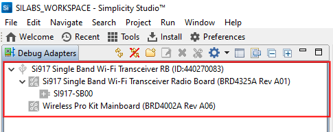**

### Creation of project

Ensure the latest Gecko SDK along with the extension Si917 COMBO SDK is added to Simplicity Studio.

1. Click on the board detected and go to **EXAMPLE PROJECTS & DEMOS** section.

   **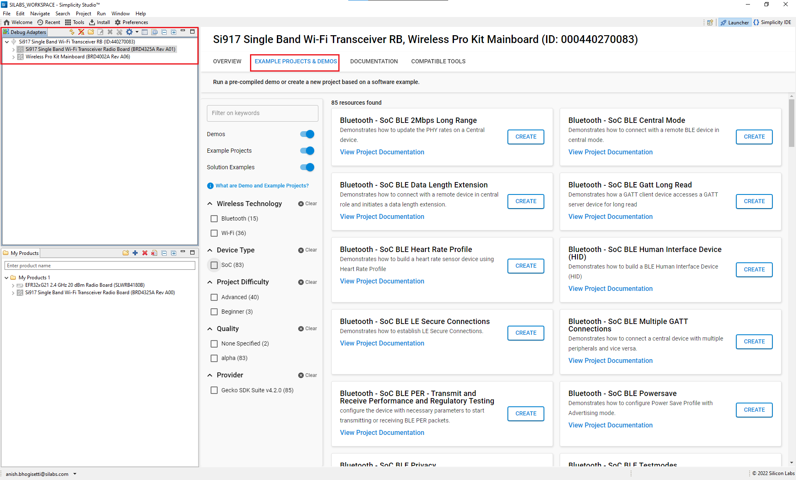**

2. Search for tx_on_periodic_wakeup and choose Wi-Fi - SoC Tx on Periodic Wakeup example and click on **Create**.  
   
   **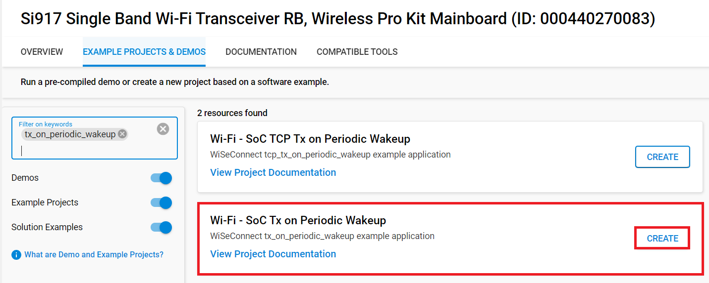**

3. Give the desired name to your project and cick on **Finish**.

   **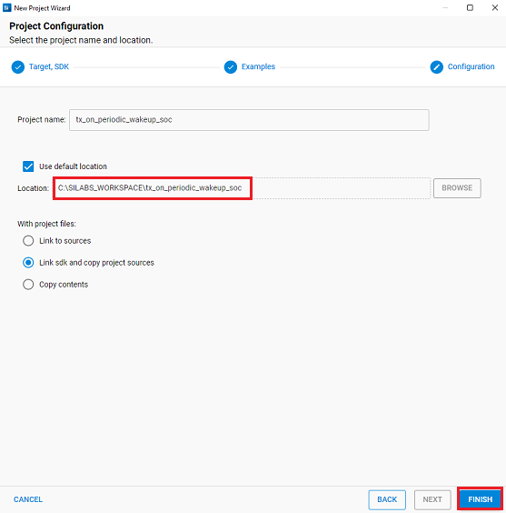** 

4. Once the project is created, right click on project and go to properties → C/C++ Build → Settings → Build Steps.

5. Add **post_build_script_SimplicityStudio.bat** file path present at SI917_COMBO_SDK.X.X.X.XX → utilities → isp_scripts_common_flash in build steps settings as shown in below image.
  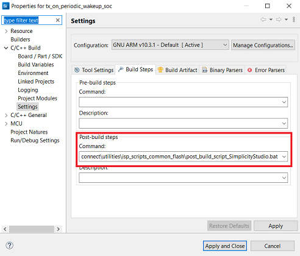

6. Click on the build icon (hammer) or right click on project name and choose **Build Project** to build the project.
  
    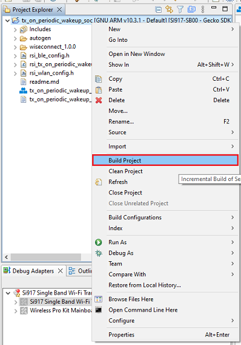

### Set up for application prints

Before setting up Tera Term, do the following:

You can use either of the below USB to UART converters for application prints.
1. Set up using USB to UART converter board.

  - Connect Tx (Pin-6) to P27 on WSTK
  - Connect GND (Pin 8 or 10) to GND on WSTK

    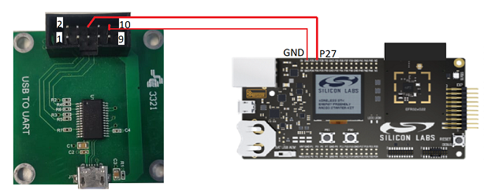

2. Set up using USB to UART converter cable.

  - Connect RX (Pin 5) of TTL convertor to P27 on WSTK
  - Connect GND (Pin1) of TTL convertor to GND on WSTK

    

**Tera term set up**

1. Open the Tera Term tool.Choose the serial port to which USB to UART converter is connected and click on **OK**. 

    ****

2. Navigate to the Setup → Serial port and update the baud rate to **115200** and click on **OK**.

    ****

    **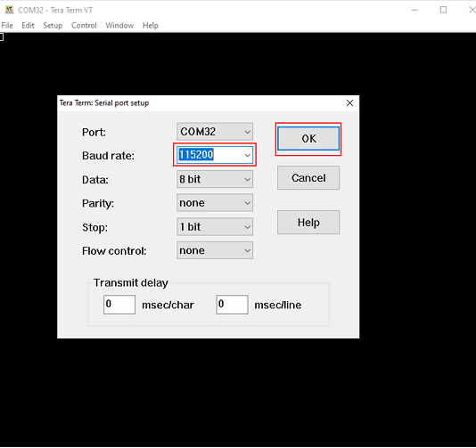**

The serial port is now connected. 

### Execute the application

1. Once the build was successful, right click on project and select Debug As → Silicon Labs ARM Program to program the device as shown in below image or Run As → Silicon Labs ARM Program can also be used to directly flash the application binary and execute the program.

   **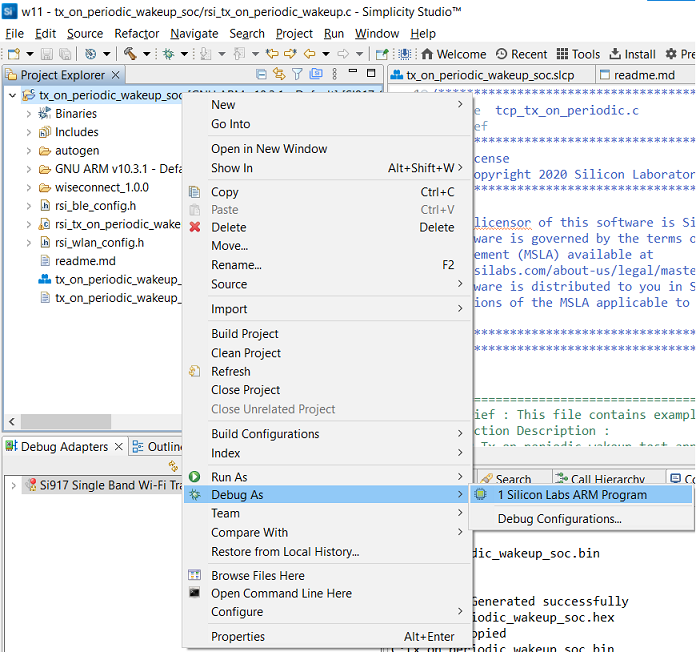**

2. As soon as the debug process is completed, the application control branches to the main().

3. Click on the **Resume** icon in the Simplicity Studio IDE toolbar to run the application.

   ****
# Testing Application 

After successful connection with access point, module starts UDP client connects to UDP Server on remote PC enter SERVER PORT and click on listen on Hercules application .

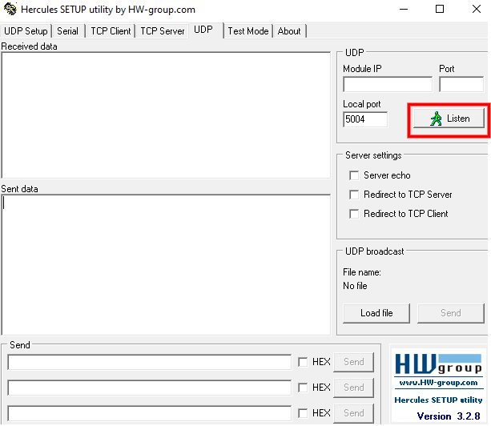

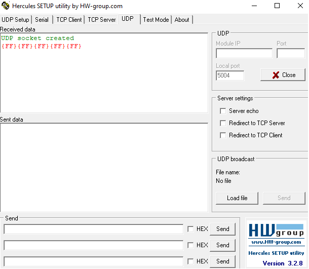

As the application runs, SiWx91x scans and connects to the Wi-Fi access point and obtains an IP address. After a successful connection, the module is configured with powersave mode 2 and then proceeds to send 64MB data to UDP Server running on a remote peer which is connected to access point. 

After transmission of data, M4 goes to sleep with ram retention with configurable alarm time. After alarm times out, M4 wakes up and sends a packet to wake up NWP/TA. The program flow repeats from data transmission step.


### Application prints
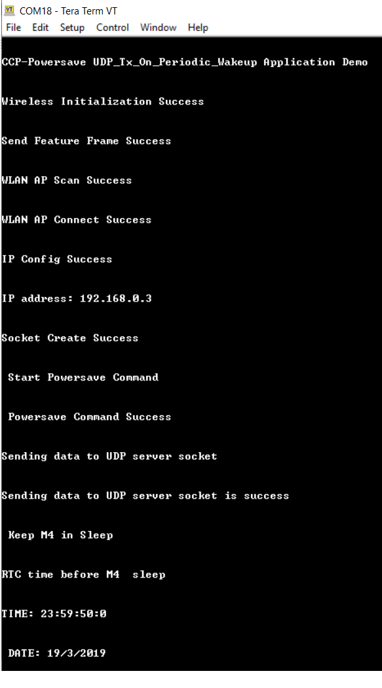
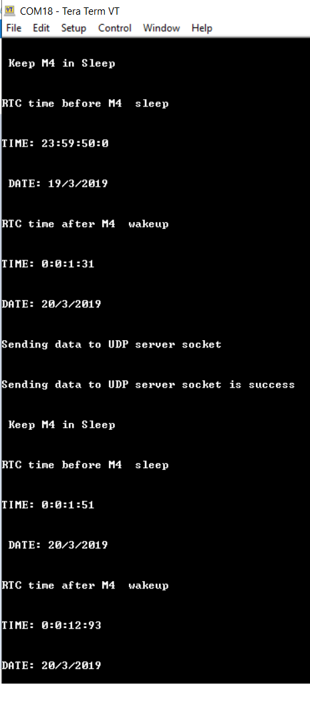