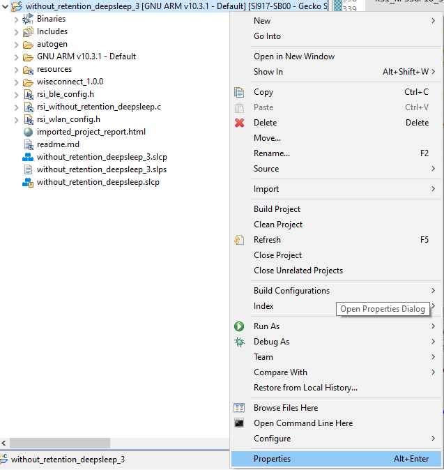
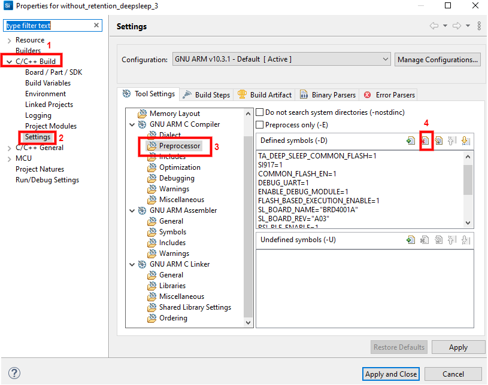
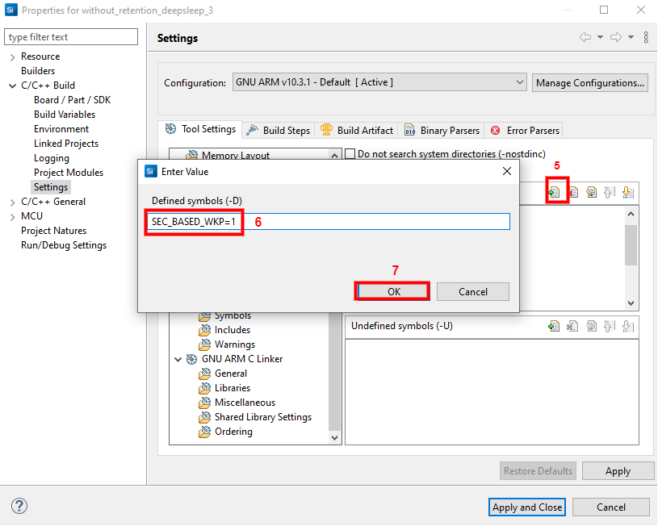

# Without Retention Deepsleep

## Introduction

This application demonstrates the process of configuring the SiWx91x in the unconnected sleep power save, the silicon labs device wakes up in periodic intervals.

The application also enables the analysis of irrespective of Scan fail/success, issue power save command for NWP/TA and then for M4.

## Setting Up 
To use this application, the following hardware, software and project setup is required.

### Hardware Requirements  
  - Windows PC.
  - Wi-Fi Access point with a connection to the internet
  - PC2 (Remote PC) with TCP server application (Hercules Setup)
  - Power analyzer
  - SiWx91x Wi-Fi Evaluation Kit
  - **SoC Mode**: 
      - Silicon Labs [BRD4325A](https://www.silabs.com/)
 
#### SoC Mode : 


  
### Software Requirements
  - [Hercules Application](https://www.hw-group.com/files/download/sw/version/hercules_3-2-8.exe)
   
### Project Setup
- **SoC Mode**
  - **Silicon Labs SiWx91x SoC**. Follow the [Getting Started with SiWx91x SoC](https://docs.silabs.com/) to setup the example to work with SiWx91x SoC and Simplicity Studio.

## Configuring the Application
The application can be configured to suit your requirements and development environment.
Read through the following sections and make any changes needed. 

### Wi-Fi Configuration
Configure the following parameters in **rsi_wlan_connected_sleep_app.c** to enable your Silicon Labs Wi-Fi device to connect to your Wi-Fi network.

```c
#define SSID           "SILABS_AP"      // Wi-Fi Network Name
#define PSK            "1234567890"     // Wi-Fi Password
#define SECURITY_TYPE  RSI_WPA2         // Wi-Fi Security Type: RSI_OPEN / RSI_WPA / RSI_WPA2
```

### Hercules Setup Configuration
- `SERVER_PORT` is the remote TCP server port number on the PC running Hercules Setup.
- `SERVER_IP_ADDRESS` is the remote TCP server IP address on the PC running Hercules Setup. 

```c
  #define SERVER_PORT        <remote port>
  #define SERVER_IP_ADDRESS  "192.168.10.100"
```
### Memory & Throughput
  - `GLOBAL_BUFF_LEN` sets the application memory size (in bytes) used by the driver.

```c
  #define GLOBAL_BUFF_LEN    15000
```

### Major Powersave Options
The primary powersave settings are configured with `PSP_MODE` and `PSP_TYPE`. The default power save mode is set to low power mode 2 (`RSI_SLEEP_MODE_2`) with maximum power save (`RSI_MAX_PSP`) and with M4 based handshake as follows.

```c
  #define PSP_MODE  RSI_SLEEP_MODE_10
  #define PSP_TYPE  RSI_MAX_PSP
```

`PSP_MODE` refers to the power save profile mode. SiWx91x EVK supports the following power modes:

  - `RSI_ACTIVE` : In this mode, SiWx91x EVK is active and power save is disabled.
  - `RSI_SLEEP_MODE_1`  : In this mode, SiWx91x EVK goes to power save after association with the Access Point. In this sleep mode, SoC will never turn off, therefore no handshake is required before sending data to the SiWx91x EVK.
  - `RSI_SLEEP_MODE_2`  : In this mode, SiWx91x EVK goes to power save after association with the Access Point. In this sleep mode, SoC will go to sleep based on GPIO hand shake or Message exchange or M4 based handshake, therefore handshake is required before sending data to the SiWx91x EVK.
  - `RSI_SLEEP_MODE_10` : In this mode, SiWx91x EVK goes to power save when it is not in associated state with the Access Point. In this sleep mode without ram retention, SoC will go to sleep based on GPIO handshake or Message exchange or M4 based handshake, therefore handshake is required before sending the command to the SiWx91x EVK.

---- 

**Note!**
  1. For `RSI_SLEEP_MODE_2` and `RSI_SLEEP_MODE_8` modes, GPIO or Message or M4 based handshake can be selected using `RSI_HAND_SHAKE_TYPE` macro which is defined in `rsi_wlan_config.h`.
  2. In this example, `RSI_SLEEP_MODE_2` can be verified with a M4-based handshake. 

----

`PSP_TYPE` refers to power save profile type. SiWx91x EVK supports following power save profile types:
  - `RSI_MAX_PSP` : In this mode, SiWx91x EVK will be in Maximum power save mode. i.e device will wake up for every DTIM beacon and do data Tx and Rx.
  - `RSI_FAST_PSP` : In this mode, SiWx91x EVK will disable power save for any Tx/Rx packet for monitor interval of time (monitor interval can be set through macro in `rsi_wlan_config.h` file, default value is 50 ms). If there is no data for monitor interval of time, then SiWx91x EVK will again enable power save.
  - `RSI_UAPSD` : This `PSP_TYPE` is used to enable WMM power save.

----

**Note!**
  1. `PSP_TYPE` is valid only when `PSP_MODE` is set to `RSI_SLEEP_MODE_1` or `RSI_SLEEP_MODE_2` mode.
  2. `RSI_UAPSD` power profile type in `PSP_TYPE` is valid only when `RSI_WMM_PS_ENABLE` is enabled in `rsi_wlan_config.h` file.

----


### Additional Powersave Options
Additional powersave options may be configured in **rsi_wlan_config.h**.
 
```c
  #define CONCURRENT_MODE                     RSI_DISABLE
  #define RSI_FEATURE_BIT_MAP                 (FEAT_SECURITY_OPEN)
  #define RSI_TCP_IP_BYPASS                   RSI_DISABLE
  #define RSI_TCP_IP_FEATURE_BIT_MAP          (TCP_IP_FEAT_DHCPV4_CLIENT)
  #define RSI_CUSTOM_FEATURE_BIT_MAP          0
  #define RSI_EXT_CUSTOM_FEATURE_BIT_MAP      0
  #define RSI_EXT_TCPIP_FEATURE_BITMAP        0
  #define RSI_BAND                            RSI_BAND_2P4GHZ
  
  The default configuration of low power_save_mode_2 is:
  
  #define RSI_HAND_SHAKE_TYPE                 M4_BASED
  #define RSI_SELECT_LP_OR_ULP_MODE           RSI_ULP_WITHOUT_RAM_RET
  #define RSI_DTIM_ALIGNED_TYPE               0
  #define RSI_MONITOR_INTERVAL                50
  #define RSI_NUM_OF_DTIM_SKIP                0
  #define RSI_WMM_PS_ENABLE                   RSI_DISABLE
  #define RSI_WMM_PS_TYPE                     0
  #define RSI_WMM_PS_WAKE_INTERVAL            20
  #define RSI_WMM_PS_UAPSD_BITMAP             15
```

The application defaults to the `RSI_SLEEP_MODE_10` configuration. 
- `RSI_SELECT_LP_OR_ULP_MODE` is used to select low power mode or ultra-low power mode. Valid configurations are 
  - `RSI_LP_MODE` - SiWx91x will be in Ultra low power mode.
  - `RSI_ULP_WITH_RAM_RET` - SiWx91x will be in Ultra low power mode and will remember the previous state after issuing the power save mode command.
  - `RSI_ULP_WITHOUT_RAM_RET` - SiWx91x will be in Ultra low power mode and it will not remember the previous state after issuing power save mode command. After wakeup, SiWx91x will give CARD READY indication and user has to issue commands from wireless initialization.
- `RSI_DTIM_ALIGNED_TYPE` is used to decide whether SiWx91x has to wake up at normal beacon or DTIM beacon which is just before listen interval.
  - `RSI_DTIM_ALIGNED_TYPE = 0` - SiWx91x will wake up at normal beacon which is just before listen interval.
  - `RSI_DTIM_ALIGNED_TYPE = 1` - SiWx91x will wake up at DTIM beacon which is just before listen interval.
- `RSI_MONITOR_INTERVAL` refers to the amount of time (in ms) to wait for Tx or Rx before giving power save indication to the connected Access Point. This macro is applicable only when `PSP_TYPE` selected as `RSI_FAST_PSP`
- `RSI_NUM_OF_DTIM_SKIP`  is used the number of DTIMs to skip during powersave.
- `RSI_WMM_PS_ENABLE` is used to enable or disable WMM power save.
- `RSI_WMM_PS_TYPE` is used to set Tx-based or Periodic-based WMM power save. Set `RSI_WMM_PS_TYPE = 0` for Tx based or `=1` for periodic based WMM power save.
- `RSI_WMM_PS_WAKE_INTERVAL` refers to the periodic time (in ms) in which the module has to wake up when `RSI_WMM_PS_TYPE` is selected as Periodic.
- `RSI_WMM_PS_UAPSD_BITMAP` refers to the UAPSD bitmap. If `RSI_WMM_PS_ENABLE` is enabled, then `PSP_TYPE` must be set to `RSI_UAPSD` in order to WMM power save to work.

### Configuring the wake up sources

The application can be evaluated with 4 wake up sources by adding/removing the following pre-processor macros:

```
ALARM_CONFIG           
DS_BASED_WKP          
SEC_BASED_WKP         
UULP_GPIO_BASED_WKP   
```

- The sleep period of M4 while using ```ALARM_CONFIG``` can be configured by adjusting the value of ```ALARM_PERIODIC_TIME``` macro.<br>
- The sleep period of M4 while using ```DS_BASED_WKP``` can be configured by adjusting the value of ```DS_TIMER_DURATION``` macro (in microseconds).<br>
- The sleep period of M4 while using ```SEC_BASED_WKP``` is 1 second.<br>
- The sleep period of M4 while using ```UULP_GPIO_BASED_WKP``` depends on when the GPIO interrupt arises, the interrupt is mapped to UULP GPIO 2, UULP GPIO 2 terminates at BTN1 on the Wireless STK/ Wireless Pro Kit Mainboard. When BTN1 on Wireless STK/ Wireless Pro Kit Mainboard is pressed, the interrupt arises and M4 goes to sleep, when button is released, M4 wakes up.
For, M4 to wake up upon pressing the BTN1, modify the following ```RSI_NPSSGPIO_SetPolarity(NPSS_GPIO_2, NPSS_GPIO_INTR_HIGH);``` function call to ```RSI_NPSSGPIO_SetPolarity(NPSS_GPIO_2, NPSS_GPIO_INTR_LOW);``` in ```RSI_Wakeupsw_config()``` function

## Adding or removing the pre-processor macros
> Right click on the project and open properties


> Navigate to C/C++ build > Settings > Preprocessor and remove the (4 in figure) existing wake up source macro, if you wish to test one wake up source at a time



> click on add (5 in figure) and the required macro


# Building and testing the application

After making any custom configuration changes required, build, download and run the application as described in the [SoC Getting Started](https://docs.silabs.com/). 
