# BLE Central

## 1. Purpose / Scope

This application demonstrates how to connect SiWx91x EVK with remote BLE device in central mode.

## 2. Prerequisites / Setup Requirements

Before running the application, the user will need the following things to setup.

### 2.1 Hardware Requirements

- Windows PC with Host interface(UART/ SPI/ SDIO).
   - SiWx91x Wi-Fi Evaluation Kit. The SiWx91x supports multiple operating modes. See [Operating Modes]() for details.
  - **SoC Mode**: 
      - Silicon Labs [BRD4325A](https://www.silabs.com/)
  - **NCP Mode**:
      - Silicon Labs [(BRD4180A, BRD4280B)](https://www.silabs.com/);
      - Host MCU Eval Kit. This example has been tested with:
        - Silicon Labs [WSTK + EFR32MG21](https://www.silabs.com/development-tools/wireless/efr32xg21-bluetooth-starter-kit)
        - Silicon Labs [WSTK + EFM32GG11](https://www.silabs.com/development-tools/mcu/32-bit/efm32gg11-starter-kit)
- BLE peripheral device
   			
### 2.2 Software Requirements
    
- Embedded Development Environment

   - For Silicon Labs EFx32, use the latest version of [Simplicity Studio](https://www.silabs.com/developers/simplicity-studio)
   
- Download and install the Silicon Labs [EFR Connect App](https://www.silabs.com/developers/efr-connect-mobile-app) in the android smart phones for testing BLE applications. Users can also use their choice of BLE apps available in Android/iOS smart phones.

### 2.3 Setup Diagram:
   
**SoC Mode :** 

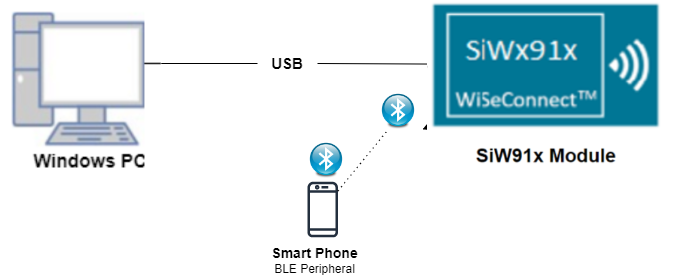
  
**NCP Mode :**  

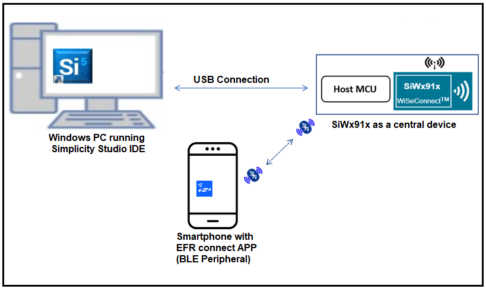	

## 3. Application Build Environment

### 3.1 Project Setup

- **SoC Mode**
  - **Silicon Labs SiWx91x SoC**. Follow the [Getting Started with SiWx91x SoC](https://docs.silabs.com/) to setup the example to work with SiWx91x SoC and Simplicity Studio.
- **NCP Mode**
  - **Silicon Labs EFx32 Host**. Follow the [Getting Started with EFx32](https://docs.silabs.com/rs9116-wiseconnect/latest/wifibt-wc-getting-started-with-efx32/) to setup the example to work with EFx32 and Simplicity Studio.
  
### 3.2 NCP Mode - Host Interface 

* By default, the application is configured to use the SPI bus for interfacing between Host platforms(EFR32MG21) and the SiWx91x EVK.
		
### 3.3 Bare Metal/RTOS Support

This application supports bare metal and RTOS environment. By default, the application project files (Keil and Simplicity Studio) are provided with RTOS configuration. To select a bare metal configuration, see [Selecting bare metal](#selecting-bare-metal).

## 4. Application Configuration Parameters

The application can be configured to suit your requirements and development environment. Read through the following sections and make any changes needed.

**4.1** Open `rsi_ble_central.c` file

**4.1.1** User must update the below parameters 

`RSI_BLE_DEV_ADDR_TYPE` refers address type of the remote device to connect.

	 #define RSI_BLE_DEV_ADDR_TYPE                          LE_PUBLIC_ADDRESS 

Based on address type of remote device, valid configurations are

LE_RANDOM_ADDRESS

LE_PUBLIC_ADDRESS

`RSI_BLE_DEV_ADDR` refers address of the remote device to connect.

	 #define RSI_BLE_DEV_ADDR                               "00:1E:7C:25:E9:4D"  

`RSI_REMOTE_DEVICE_NAME` refers the name of remote device to which Silicon Labs device has to connect.

	 #define RSI_REMOTE_DEVICE_NAME                         "SILABS_DEV" 

**Note:** user can configure either RSI_BLE_DEV_ADDR or RSI_REMOTE_DEVICE_NAME of the remote device.

**Power save configuration**

   By default, The Application is configured without power save.
	 
	 #define ENABLE_POWER_SAVE 0

   If user wants to run the application in power save, modify the below configuration. 
	 
	 #define ENABLE_POWER_SAVE 1 

**4.1.2** The desired parameters are provided below. User can also modify the parameters as per their needs and requirements.

Following are the event numbers for advertising, connection and disconnection events

	 #define RSI_APP_EVENT_ADV_REPORT                       0
	 #define RSI_APP_EVENT_CONNECTED                        1
	 #define RSI_APP_EVENT_DISCONNECTED                     2

Following are the non-configurable macros in the application.

`BT_GLOBAL_BUFF_LEN` refers Number of bytes required by the application and the driver

	 #define BT_GLOBAL_BUFF_LEN                             15000

   

**4.2** Open `rsi_ble_config.h` file and update/modify following macros,

	 #define RSI_BLE_PWR_INX                                30
	 #define RSI_BLE_PWR_SAVE_OPTIONS                       BLE_DISABLE_DUTY_CYCLING
	 
   **Opermode command parameters**

	 #define RSI_FEATURE_BIT_MAP                            FEAT_SECURITY_OPEN
	 #define RSI_TCP_IP_BYPASS                              RSI_DISABLE
	 #define RSI_TCP_IP_FEATURE_BIT_MAP                     TCP_IP_FEAT_DHCPV4_CLIENT
	 #define RSI_CUSTOM_FEATURE_BIT_MAP                     FEAT_CUSTOM_FEAT_EXTENTION_VALID
	 #define RSI_EXT_CUSTOM_FEATURE_BIT_MAP                 0

**Note:** `rsi_ble_config.h` files are already set with desired configuration in respective example folders user need not change for each example. 
   
## 5. Testing the Application

Follow the below steps for the successful execution of the application.

### 5.1 Loading the SiWx91x Firmware

Refer [Getting started with a PC](https://docs.silabs.com/rs9116/latest/wiseconnect-getting-started) to load the firmware into SiWx91x EVK. The firmware file is located in `<SDK>/firmware/`

### 5.2 Creating the Project and builing the Application
  
Refer [Getting started with EFX32](https://docs.silabs.com/rs9116-wiseconnect/latest/wifibt-wc-getting-started-with-efx32/), for setting-up EFR & EFM host platforms

#### 5.2.1 Project Creation - SoC Mode : 

- Connect your board. The Si917 compatible SoC board is **BRD4325A**.
- Studio should detect your board. Your board will be shown here.

#### 5.2.2 Project Creation - NCP Mode : 

- Connect your board. The supported NCP boards are: **BRD4180A,BRD4280B**
- Studio should detect your board. Your board will be shown here.

#### 5.2.3 Selecting an example application and generate project

- Go to the 'EXAMPLE PROJECT & DEMOS' tab and select your desired example application

- Click 'Create'. The "New Project Wizard" window appears. Click 'Finish'
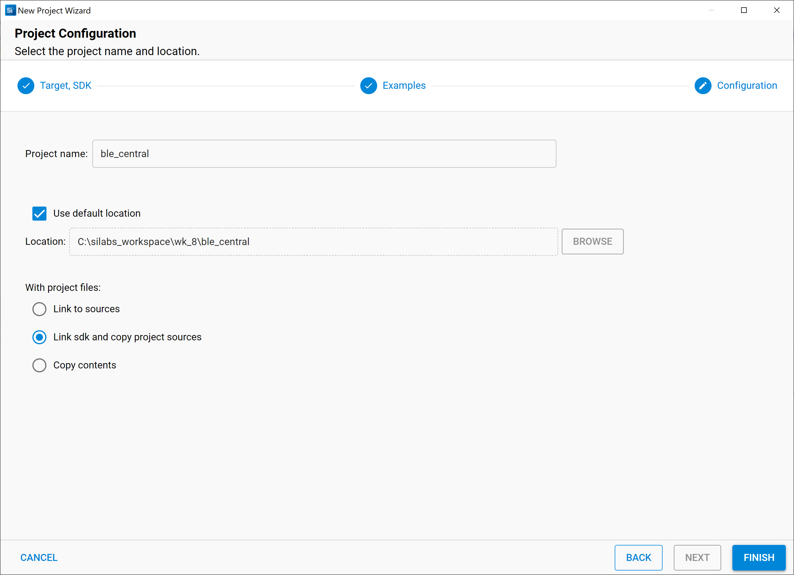

#### 5.2.4 Build Project - SoC Mode

- Once the project is created, right click on project and go to properties -> C/C++ Build -> Settings -> Build Steps
- Add post_build_script_SimplicityStudio.bat file path (SI917_COMBO_SDK.X.X.X.XX\utilities\isp_scripts_common_flash) in build steps settings as shown in below image.
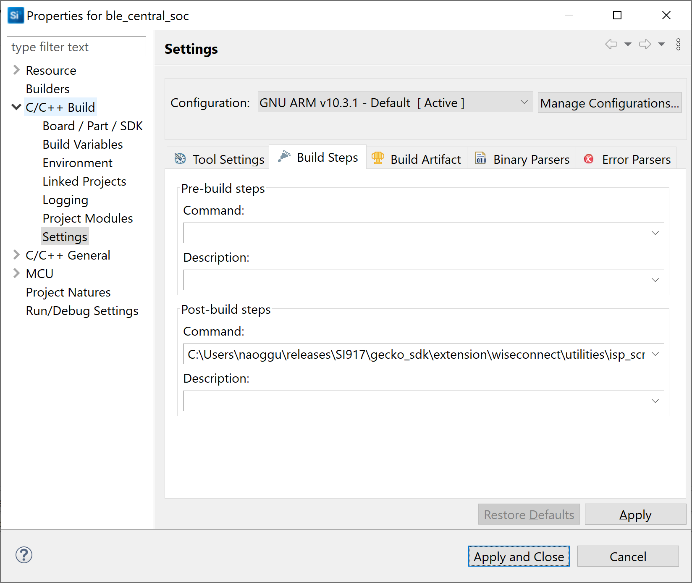
- Check for M4 projects macros in preprocessor settings(RSI_M4_INTERFACE=1)
- Check for 9117 macro in preprocessor settings(CHIP_9117=1).
- Click on the build icon (hammer) to build the project
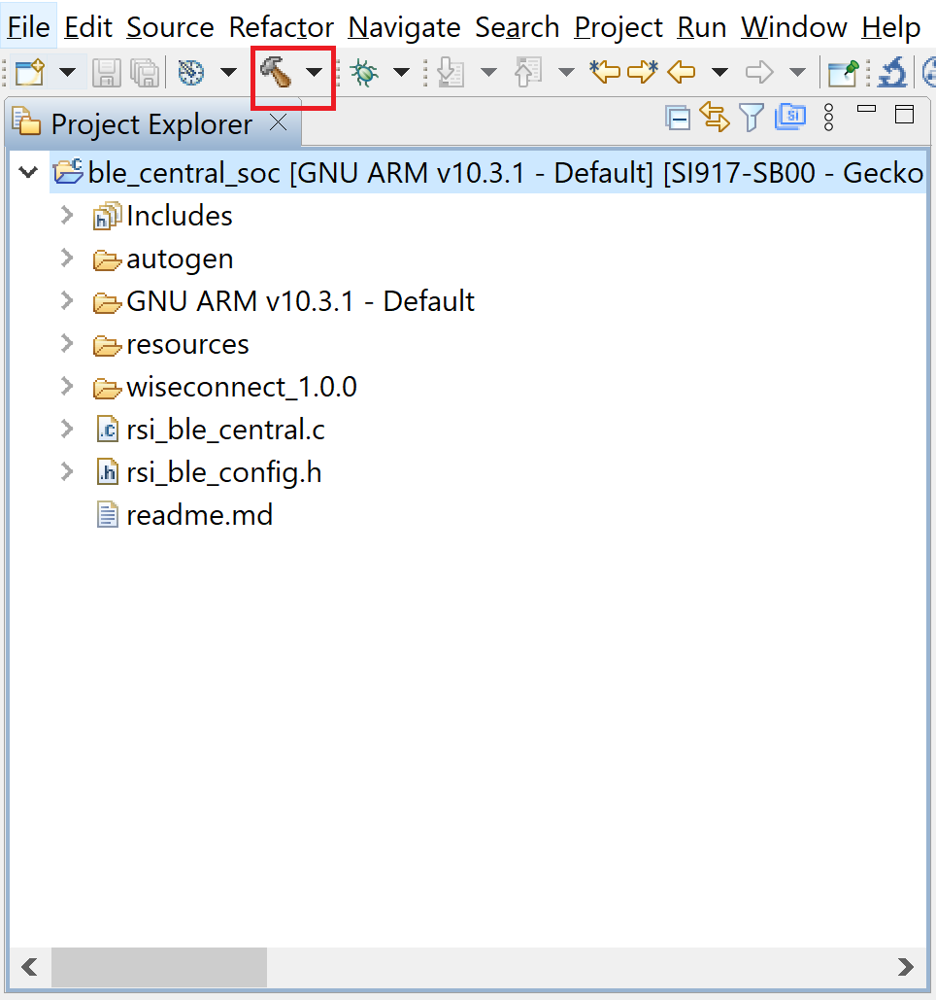
- Successful build output will show as below.
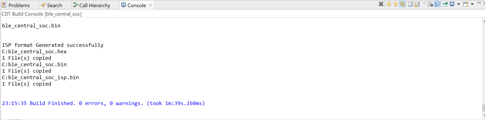

#### 5.2.5 Build Project - NCP Mode :

- Check for 9117 macro in preprocessor settings(CHIP_9117=1).
- Click on the build icon (hammer) to build the project
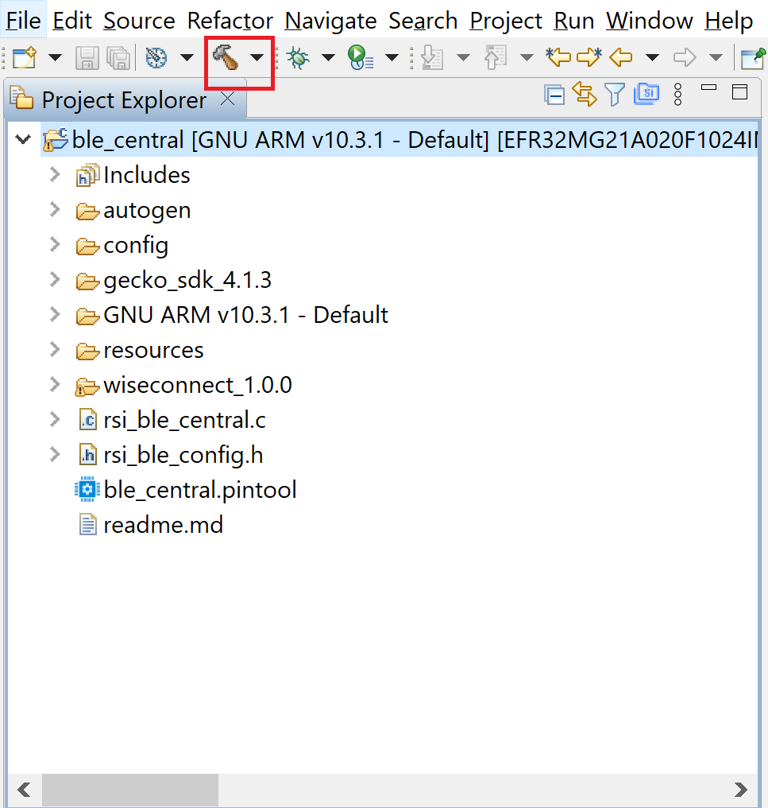
- Successful build output will show as below.
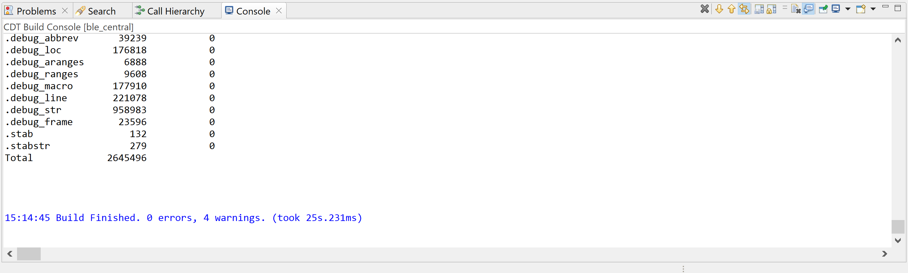

## 6. Program the device

Once the build was successfull, right click on project and click on Debug As->Silicon Labs ARM Program as shown in below image.
### SoC Mode :
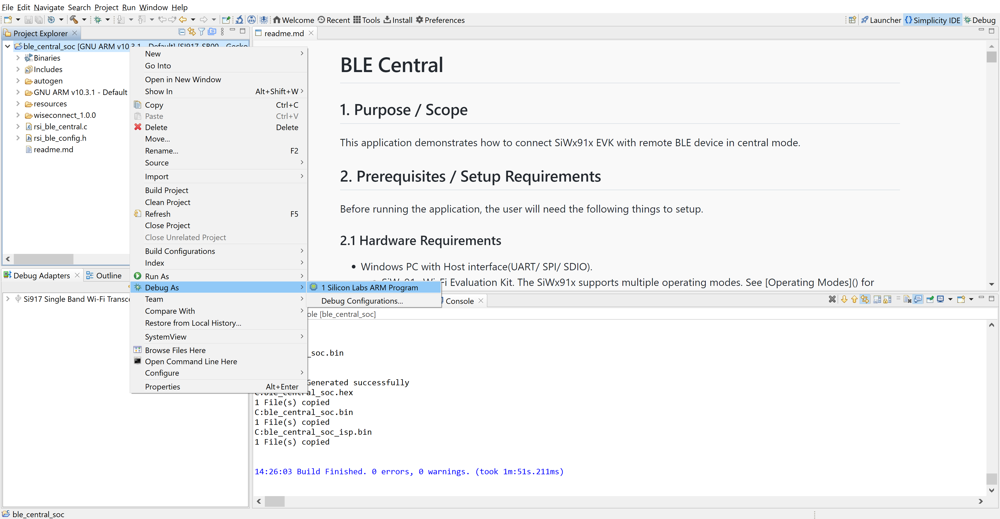
### NCP Mode : 
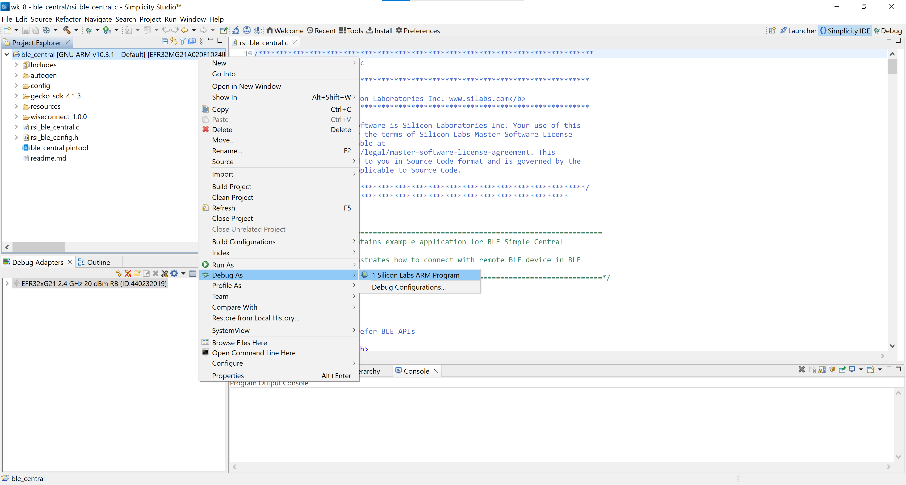

### 6.1 Running the SiWx91x Application
   
1. Configure the remote BLE device in peripheral mode and put it in advertising mode.For remote mobile ensure that the device is named same as the value mentioned in RSI_REMOTE_DEVICE_NAME macro also see to it that Complete local name record is added to advertising data and Scan response data and connectable is ticked in options. 
  

   **Note:** Refer the [Creating New Advertisement Sets](https://docs.silabs.com/bluetooth/5.0/miscellaneous/mobile/efr-connect-mobile-app) for configuring the EFR connect mobile APP as advertiser.
2. After the program gets executed, Silicon Labs device tries to connect with the remote device specified in `RSI_BLE_DEV_ADDR` or `RSI_REMOTE_DEVICE_NAME` macro.

3. Observe that the connection is established between the desired device and SiWx91x EVK. 
 
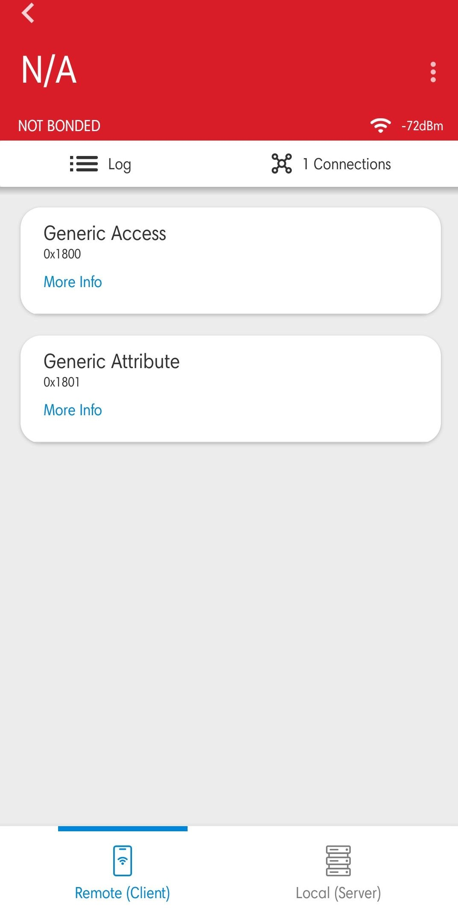 

   **Note:** Examples for BLE peripherals: Bluetooth Dongle, mobile application, TA sensor tag.

4. Refer the below images for console prints
- For SOC the console prints are shown below
    
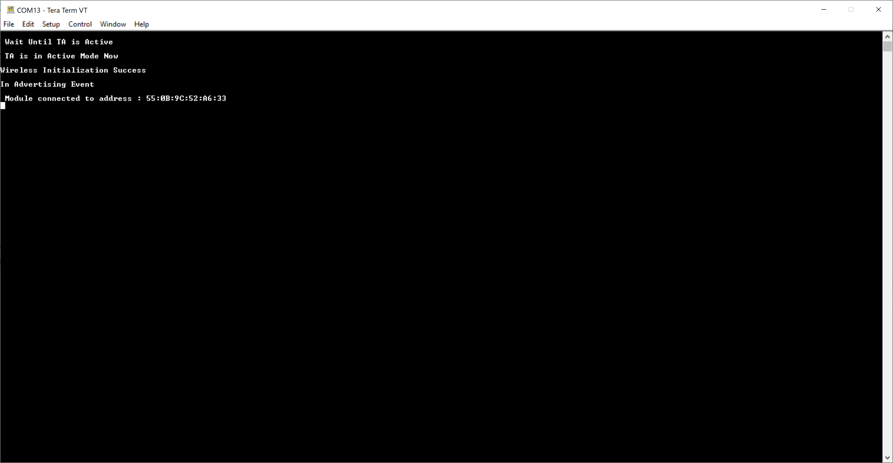 

- For NCP the console prints are shown below
    
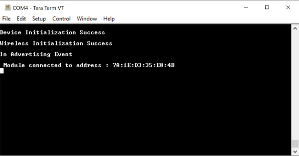 

## 7. Observing the output prints on serial terminal

### 7.1 SoC Mode:
- Connect USB to UART connector Tx and GND pins to WSTK radio board.

   - Connect Tx(Pin-6) to P27 on WSTK
   - Connect GND(Pin 8 or 10) to GND on WSTK

      
- Prints can see as below in any Console terminal
    
 

### 7.2 NCP Mode:
- Prints can see as below in any Console terminal
    
 

## 8. Selecting Bare Metal
The application has been designed to work with FreeRTOS and Bare Metal configurations. By default, the application project files (Simplicity studio) are configured with FreeRTOS enabled. The following steps demonstrate how to configure Simplicity Studio to test the application in a Bare Metal environment.

### 8.1 Bare Metal with Simplicity Studio
- Open the project in Simplicity Studio
- Right click on the project and choose 'Properties'
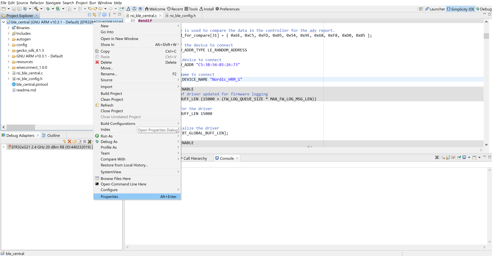 
- Go to 'C/C++ Build' | 'Settings' | 'GNU ARM C Compiler' | 'Symbols' and remove macro 'RSI_WITH_OS=1'
- Select 'Apply' and 'OK' to save the settings
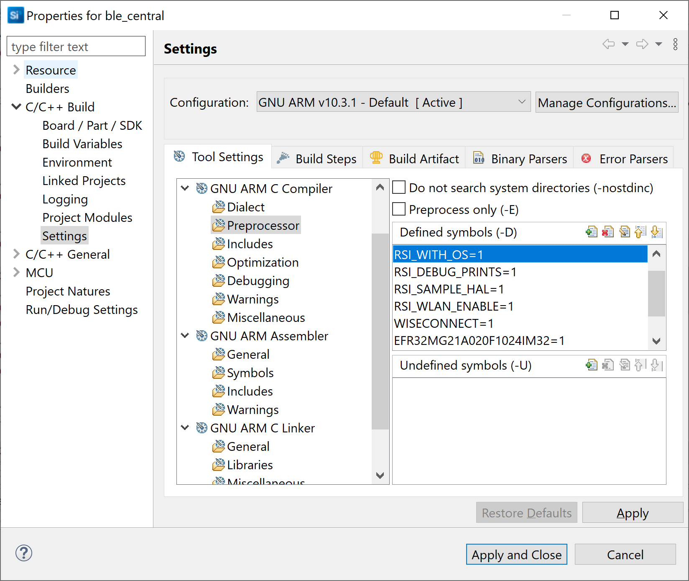

### 8.2 Bare Metal with Keil
- Open project in Keil IDE and click on 'Options for Target'
- Go to 'C/C++' tab and remove 'RSI_WITH_OS' macro present under Preprocessor Symbols
- Click on 'OK' button to save the settings
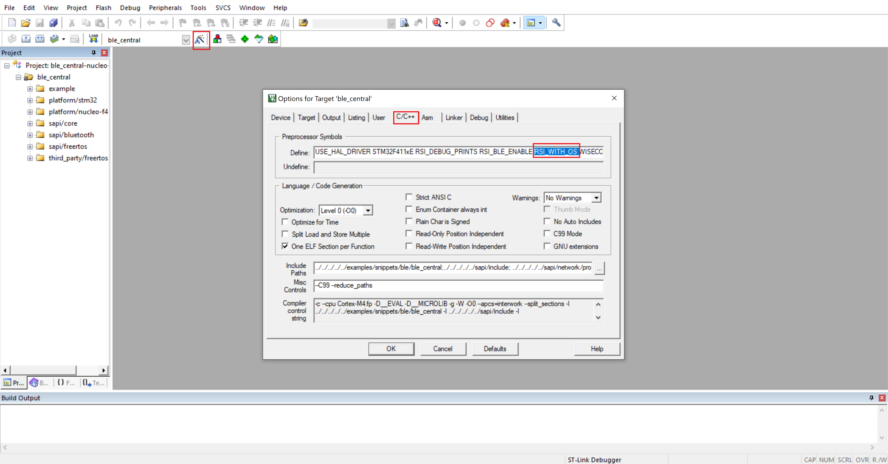