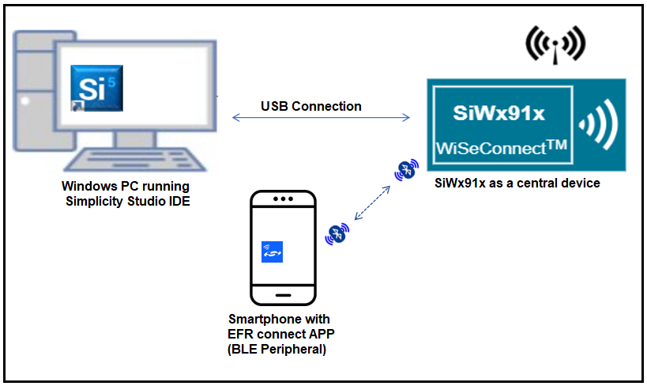
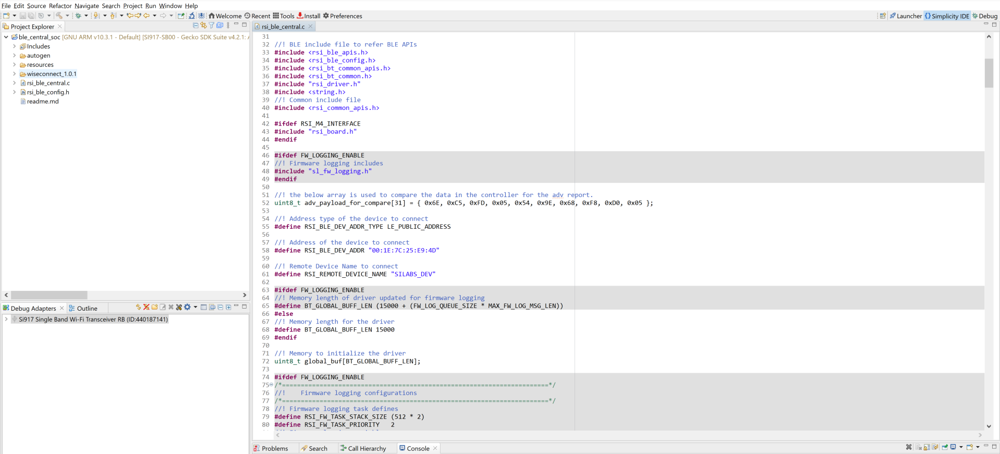
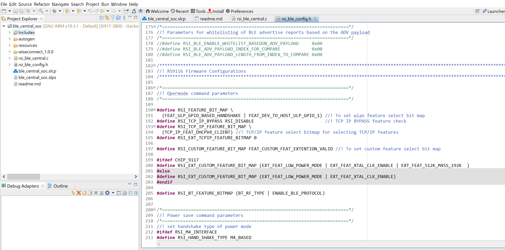
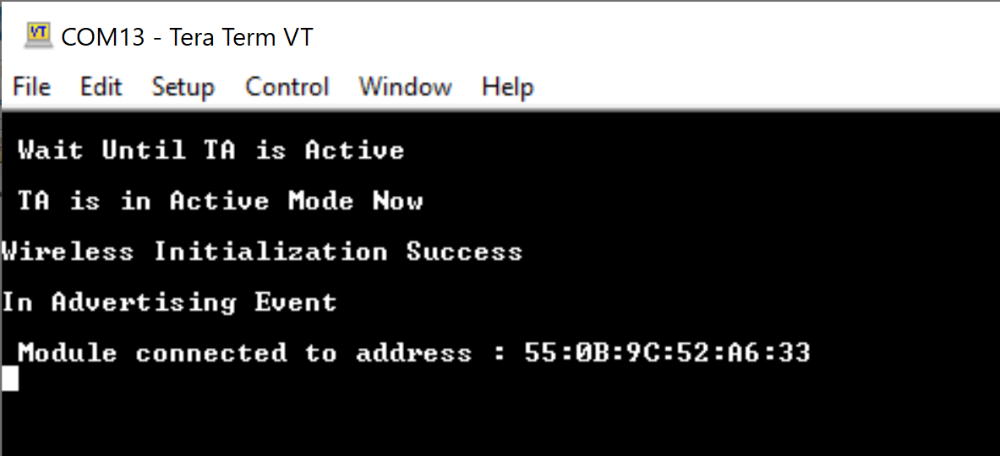
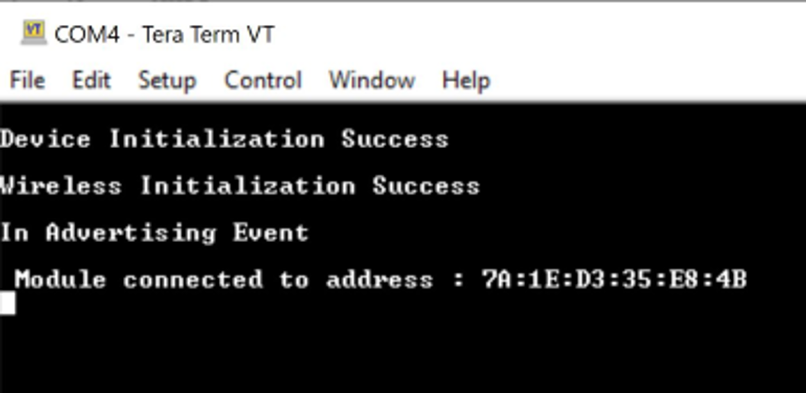

# BLE Central

## **1 Introduction**

This application demonstrates how to connect SiWx91x module with remote BLE device in central mode.

## **2 Prerequisites**

For this application, you will need the following:
### **2.1 Hardware Requirements**

- A Windows PC

#### **2.1.1 SoC** 

   - Silicon Labs SiWx917 PK6030A SoC Kit which includes
      - BRD4001A/BRD4002A Wireless Starter Kit Mainboard
      - BRD4325A Radio Board
   - USB TO UART converter or TTL cable
   
#### **2.1.2 NCP**

   - Silicon Labs BRD8036A Si917 QMS SB Expansion Board
   - [Silicon Labs SLWSTK6006A EFR32xG21 Wireless Starter Kit](https://www.silabs.com/development-tools/wireless/efr32xg21-wireless-starter-kit) which includes
      - BRD4001A/BRD4002A Wireless Starter Kit Mainboard
      - BRD4180A/BRD4180B Radio Board
               
### **2.2 Software Requirements**

- Simplicity Studio IDE
   - To download and install the Simplicity Studio IDE, refer to the **Simplicity Studio IDE Set up** section in ***Getting started with SiWx91x*** guides.

- SiWx917_WiSeConnect_SDK.X.X
  
- [EFR connect Mobile APP](https://www.silabs.com/developers/efr-connect-mobile-app)

- Tera Term software or any other serial terminal software - for viewing application prints


## **3 Setup diagram**

### **3.1 SoC**   
  
### **3.2 NCP** 
   
**NOTE**: 
- The Host MCU platform (EFR32xG21) and the SiWx91x interact with each other through the SPI interface. 

## **4 Setup**

### **4.1 SoC/NCP** 

- Follow the**Hardware connections and Simplicity Studio IDE Set up**  section in the respective ***Getting Started with SiWx91x*** guides to make the hardware connections and add the SiWx91x COMBO SDKs to Simplicity Studio IDE.

### **4.2 Loading the SiWx91x Firmware**

- Load the latest firmware into SiWx91x module, which is located in the `<SDK>/connectivity_firmware/` path as described in the **SiWx91x Firmware Update** section in the respective ***Getting started with SiWx91x*** guides.   

## **5 Project Creation**
To create the BLE central example project in the Simplicity Studio IDE, follow the **Project Creation** section in the respective ***Getting started with SiWx91x*** guides. 
   - For SoC, choose the **Bluetooth - SoC BLE central Mode** example.
   - For NCP, choose the **Bluetooth - NCP BLE central Mode** example.


## **6 Application configuration**

The application can be configured to suit you requirements and development environment. Go through the following sections and make any changes if needed. 

1. In the Project explorer pane of the IDE, expand the **ble\_central** folder and open the **rsi\_ble\_central.c** file. Configure the following parameters based on your requirements.    


- **Remote device configuration parameters**
  ```c
  // RSI_BLE_DEV_ADDR_TYPE refers to the address type of the remote device to connect.
  //! Based on address type of remote device, valid configurations are LE_RANDOM_ADDRESS and LE_PUBLIC_ADDRESS
 
	 #define RSI_BLE_DEV_ADDR_TYPE                          LE_PUBLIC_ADDRESS 
  
  //RSI_BLE_DEV_ADDR refers to the address of the remote device to connect.
  
  #define RSI_BLE_DEV_ADDR                               "00:1E:7C:25:E9:4D" 
  
  //RSI_REMOTE_DEVICE_NAME refers to the name of remote device to which Silicon Labs device has to connect.

	 #define RSI_REMOTE_DEVICE_NAME                         "SILABS_DEV" 
  ```
  **Note:** you required to configure either the `RSI_BLE_DEV_ADDR` or `RSI_REMOTE_DEVICE_NAME` of the remote device.
- **Power Save Configuration**
Configure "ENABLE_POWER_SAVE" parameter to enable power save mode.      
   ```c
      #define ENABLE_POWER_SAVE              1
   ```
   **Note:** If you are using the NCP-EXP-Board, refer the "**Powersave functionality with NCP expansion board**" section  the ***Getting started with SiWx91x NCP*** guide.

2. Open **rsi\_ble\_config.h** file and configure the Opermode command parameters.   
    
   ```c
    #define RSI_FEATURE_BIT_MAP     (FEAT_ULP_GPIO_BASED_HANDSHAKE | FEAT_DEV_TO_HOST_ULP_GPIO_1) 

    #define RSI_TCP_IP_BYPASS         RSI_DISABLE       

    #define RSI_TCP_IP_FEATURE_BIT_MAP     (TCP_IP_FEAT_DHCPV4_CLIENT) 

    #define RSI_EXT_TCPIP_FEATURE_BITMAP 0

    #define RSI_CUSTOM_FEATURE_BIT_MAP    FEAT_CUSTOM_FEAT_EXTENTION_VALID  

    #define RSI_EXT_CUSTOM_FEATURE_BIT_MAP (EXT_FEAT_LOW_POWER_MODE | EXT_FEAT_XTAL_CLK_ENABLE | EXT_FEAT_512K_M4SS_192K)

    #define RSI_BT_FEATURE_BITMAP (BT_RF_TYPE | ENABLE_BLE_PROTOCOL)
   ```
   **Note:** `rsi_ble_config.h` files are already set with desired configuration in respective example folders you need not change for each example. 

## **7 Setup for Serial Prints**
- To Setup the serial prints, follow the **Setup for Serial Prints** section in the respective ***Getting started with SiWx91x*** guides


## **8 Build, Flash, and Run the Application**
- After making any custom configuration changes required, For build, flash, and run the application project, follow the **Build and Flash the Project** section in the respective ***Getting started with SiWx91x*** guides.    


## **9 Application Execution Flow**
   
1. Configure the remote BLE device in peripheral mode, where add the complete local name record,  Enable the Scan response data, and connectable options to the advertising data. And keep it in the Advertising mode. Ensure that the specified the remote device name in the RSI_REMOTE_DEVICE_NAME macro is proper.    
  
**Note:** 
   - Refer the [Creating New Advertisement Sets](https://docs.silabs.com/bluetooth/5.0/miscellaneous/mobile/efr-connect-mobile-app) for configuring the EFR connect mobile APP as advertiser. 
   - The provided mobile screenshots are from the 2.5.2 version of the EFR Connect app, it is recommended to use the latest version. 
2. After the program gets executed, Silicon Labs device tries to connect with the remote device specified in `RSI_BLE_DEV_ADDR` or `RSI_REMOTE_DEVICE_NAME` macro.
3. Observe that the connection is established between the desired device and SiWx91x module.     


   **Note:** Examples for BLE peripherals: Bluetooth Dongle, mobile application, TA sensor tag.
4. Prints can see as below in any serial console terminal
   - **SoC**
	
   - **NCP**   
   

## **Appendix**

- By default, the application runs over FreeRTOS. To run the application with Bare metal configurations, follow the **Bare Metal configuration** section in the ***Getting Started with SiWx91x*** guides.