# BLE Data Length Extensions


## 1. Purpose / Scope


This application demonstrates how to set data length extension with the connected remote device by configuring the SiWx91x EVK in a central role.

Packet length extension refers to increasing the size of the packet data unit (PDU) from 27 to 251 bytes during data transfer during connection events.
After connecting, both the central and peripheral devices can initiate this procedure at any time.


## 2. Prerequisites / Setup Requirements


Before running the application, the user will need the following things to setup.


### 2.1 Hardware Requirements


- Windows PC with Host interface(UART/ SPI/ SDIO).
   - SiWx91x Wi-Fi Evaluation Kit. The SiWx91x supports multiple operating modes. See [Operating Modes]() for details.
  - **SoC Mode**: 
      - Silicon Labs [BRD4325A](https://www.silabs.com/)
  - **NCP Mode**:
      - Silicon Labs [(BRD4180A, BRD4280B)](https://www.silabs.com/);
      - Host MCU Eval Kit. This example has been tested with:
        - Silicon Labs [WSTK + EFR32MG21](https://www.silabs.com/development-tools/wireless/efr32xg21-bluetooth-starter-kit)
        - Silicon Labs [WSTK + EFM32GG11](https://www.silabs.com/development-tools/mcu/32-bit/efm32gg11-starter-kit)
 
- BLE peripheral device which supports data length extension feature.
### 2.2 Software Requirements
   
- Embedded Development Environment
  - For Silicon Labs EFx32, use the latest version of [Simplicity Studio](https://www.silabs.com/developers/simplicity-studio)
   
- Download and install the Silicon Labs [EFR Connect App](https://www.silabs.com/developers/efr-connect-mobile-app) in the android smart phones for testing BLE applications. Users can also use their choice of BLE apps available in Android/iOS smart phones.


### 2.3 Setup Diagram:
   
**SoC Mode :**
<br>
<br>

 
**NCP Mode :**
<br>
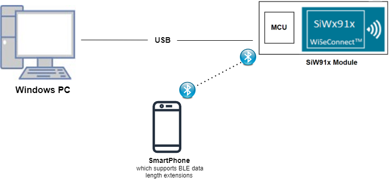<br>

 
### 2.2 Software Requirements  
- Embedded Development Environment
  - For Silicon Labs EFx32, use the latest version of [Simplicity Studio](https://www.silabs.com/developers/simplicity-studio)
   
- Download and install the Silicon Labs [EFR Connect App](https://www.silabs.com/developers/efr-connect-mobile-app) in the android smart phones for testing BLE applications. Users can also use their choice of BLE apps available in Android/iOS smart phones.


## 3. Application Build Environment

### 3.1 Project Setup

- **SoC Mode**
  - **Silicon Labs SiWx91x SoC**. Follow the [Getting Started with SiWx91x SoC](https://docs.silabs.com/) to setup the example to work with SiWx91x SoC and Simplicity Studio.
- **NCP Mode**
  - **Silicon Labs EFx32 Host**. Follow the [Getting Started with EFx32](https://docs.silabs.com/rs9116-wiseconnect/latest/wifibt-wc-getting-started-with-efx32/) to setup the example to work with EFx32 and Simplicity Studio.
  
### 3.2 NCP Mode - Host Interface 

This application supports bare metal and RTOS environment. By default, the application project files (Keil and Simplicity Studio) are provided with RTOS configuration. To select a bare metal configuration, see [Selecting bare metal](#selecting-bare-metal).
		
### 3.3 Bare Metal/RTOS Support

This application supports bare metal and RTOS environment. By default, the application project files (Keil and Simplicity Studio) are provided with RTOS configuration. To select a bare metal configuration, see [Selecting bare metal](#selecting-bare-metal).


     
## 4. Application Configuration Parameters


The application can be configured to suit your requirements and development environment. Read through the following sections and make any changes needed.


**4.1** Open `rsi_ble_datalength.c` file


**4.1.1** User must update the below parameters


-  `RSI_BLE_DEV_ADDR_TYPE` refers address type of the remote device to connect.

```c
    #define RSI_BLE_DEV_ADDR_TYPE                           LE_PUBLIC_ADDRESS
```
- Based on the address of the advertising device, Valid configurations are
    - LE_RANDOM_ADDRESS
    - LE_PUBLIC_ADDRESS


   **Note:** Depends on the remote device, address type will be changed.
-  `RSI_BLE_DEV_ADDR` refers address of the remote device to connect.
```c
    #define RSI_BLE_DEV_ADDR                                "00:23:A7:80:70:B9"
```
- `RSI_REMOTE_DEVICE_NAME` refers the name of remote device to which Silicon Labs device has to connect
```c

    #define RSI_REMOTE_DEVICE_NAME                         "SILABS_DEV"
```
**Note:** Silicon Labs module can connect to remote device by referring either RSI_BLE_DEV_ADDR or RSI_REMOTE_DEVICE_NAME of the remote device.
   ```

 
   **Power save configuration:**


- By default, The Application is configured without power save.
```c   
    #define ENABLE_POWER_SAVE 0
```

- If user wants to run the application in power save, modify the below configuration.
```c   
    #define ENABLE_POWER_SAVE 1
```

**4.1.2** The desired parameters are provided below. User can also modify the parameters as per their needs and requirements.


**Note:** Following are the non-configurable macros in the file.
- `BT_GLOBAL_BUFF_LEN` refers Number of bytes required by the application and the driver

```c
    #define BT_GLOBAL_BUFF_LEN                              15000  
```

- Following are the event numbers for advertising, connection and Disconnection events,
```c
    #define RSI_APP_EVENT_ADV_REPORT                         0
    #define RSI_APP_EVENT_CONNECTED                          1
    #define RSI_APP_EVENT_DISCONNECTED                       2
    #define RSI_APP_EVENT_DATA_LENGTH_CHANGE                 3
    #define RSI_BLE_MTU_EVENT                                4
```
   
- Following are the macros for setting data length(TX length and TX time)

```c
    #define TX_LEN                                          0x001e
    #define TX_TIME                                         0x01f4
```

**4.2** Open `rsi_ble_config.h` file. User can also modify the below parameters as per their needs and requirements. 
```c    
     #define RSI_BLE_PWR_INX                                30
    #define RSI_BLE_PWR_SAVE_OPTIONS                       BLE_DISABLE_DUTY_CYCLING
```


   **Opermode command parameters**
```c

    #define RSI_FEATURE_BIT_MAP                             FEAT_SECURITY_OPEN
    #define RSI_TCP_IP_BYPASS                               RSI_DISABLE
    #define RSI_TCP_IP_FEATURE_BIT_MAP                      TCP_IP_FEAT_DHCPV4_CLIENT
    #define RSI_CUSTOM_FEATURE_BIT_MAP                      FEAT_CUSTOM_FEAT_EXTENTION_VALID
    #define RSI_EXT_CUSTOM_FEATURE_BIT_MAP                  EXT_FEAT_384K_MODE
```
**Note:**
   rsi_ble_config.h files are already set with desired configuration in respective example folders user need not change for each example.

## 5. Testing the Application

Follow the below steps for the successful execution of the application.


### 5.1 Loading the SiWx91x Firmware


Refer [Getting started with a PC](https://docs.silabs.com/rs9116/latest/wiseconnect-getting-started) to load the firmware into SiWx91x EVK. The firmware file is located in `<SDK>/firmware/`


### 5.2 Creating the Project and builing the Application
 
Refer [Getting started with EFX32](https://docs.silabs.com/rs9116-wiseconnect/latest/wifibt-wc-getting-started-with-efx32/), for settin-up EFR & EFM host platforms


#### 5.2.1 Project Creation - SoC Mode :


- Connect your board. The Si917 compatible SoC board is **BRD4325A**.
- Studio should detect your board. Your board will be shown here.


#### 5.2.2 Project Creation - NCP Mode :


- Connect your board. The supported NCP boards are: **BRD4180A,BRD4280B**
- Studio should detect your board. Your board will be shown here.


#### 5.2.3 Selecting an example application and generate project


- Go to the 'EXAMPLE PROJECT & DEMOS' tab and select your desired example application
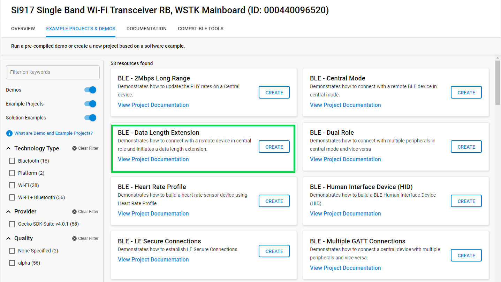
- Click 'Create'. The "New Project Wizard" window appears. Click 'Finish'
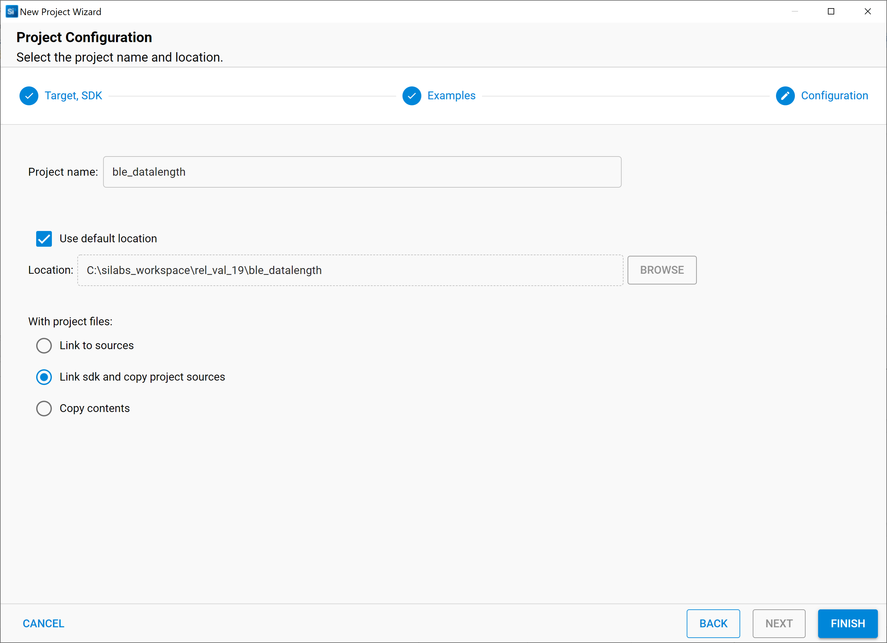


#### 5.2.4 Build Project - SoC Mode


- Once the project is created, right click on project and go to properties → C/C++ Build → Settings → Build Steps

- Add post_build_script_SimplicityStudio.bat file path (SI917_COMBO_SDK.X.X.X.XX\utilities\isp_scripts_common_flash) in build steps settings as shown in below image.
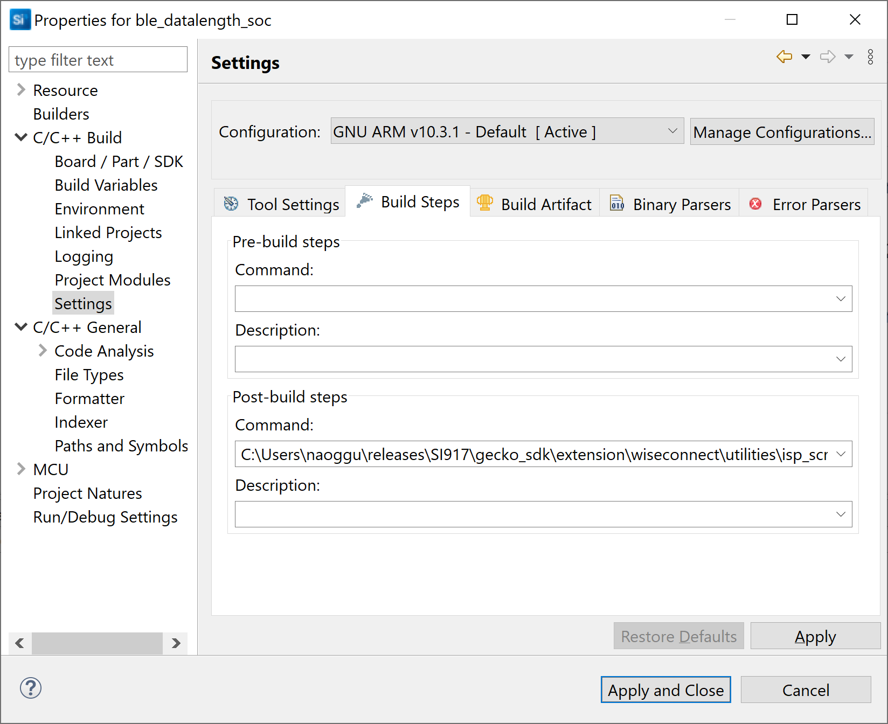
- Check for M4 projects macros in preprocessor settings(RSI_M4_INTERFACE=1)
- Check for 9117 macro in preprocessor settings(CHIP_9117=1).
- Click on the build icon (hammer) to build the project
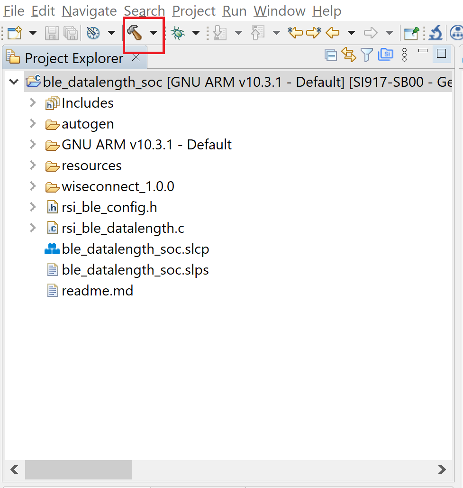
- Successful build output will show as below.
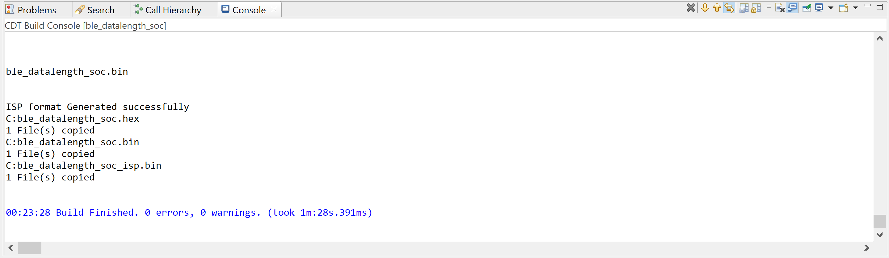


#### 5.2.5 Build Project - NCP Mode :


- Check for 9117 macro in preprocessor settings(CHIP_9117=1).
- Click on the build icon (hammer) to build the project
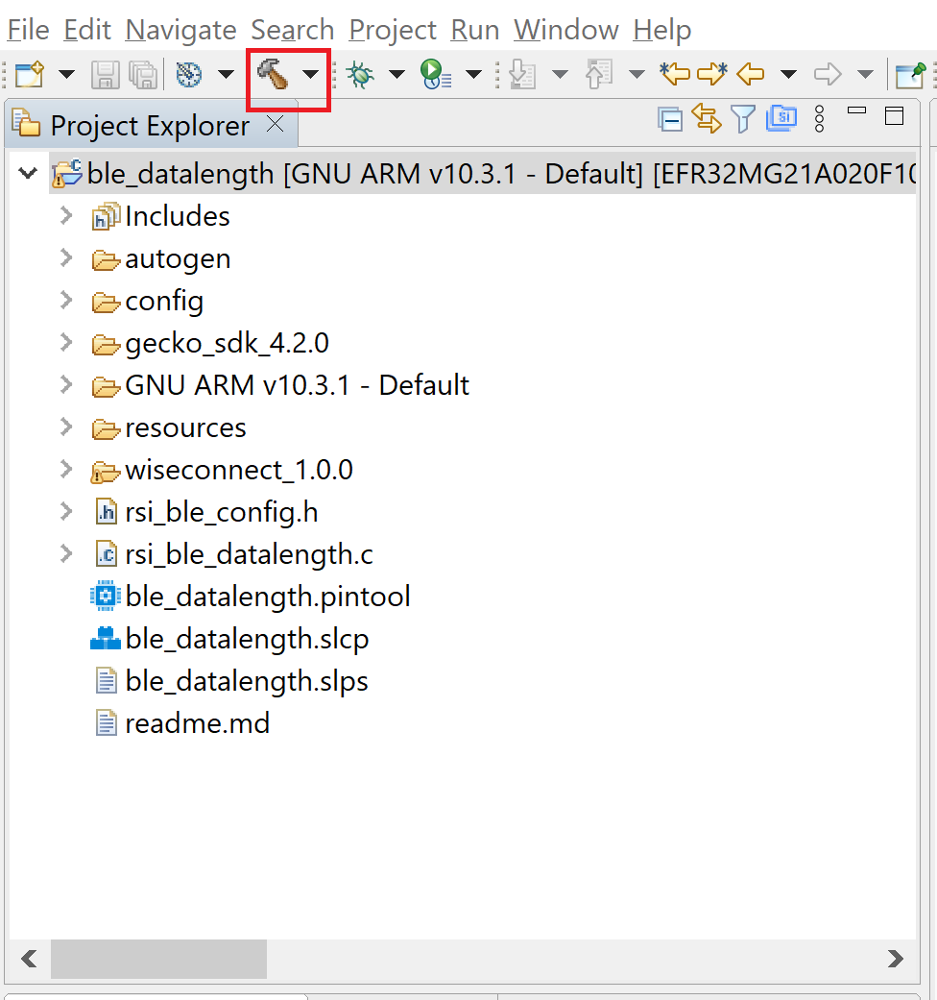
- Successful build output will show as below.
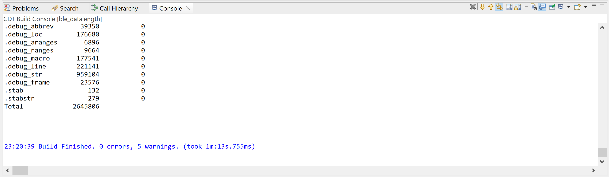


## 6. Program the device


Once the build was successfull, right click on project and click on Debug As->Silicon Labs ARM Program as shown in below image.
### SoC Mode :
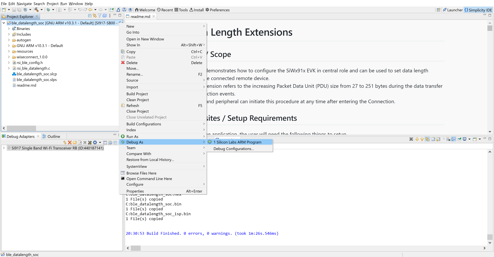
### NCP Mode :
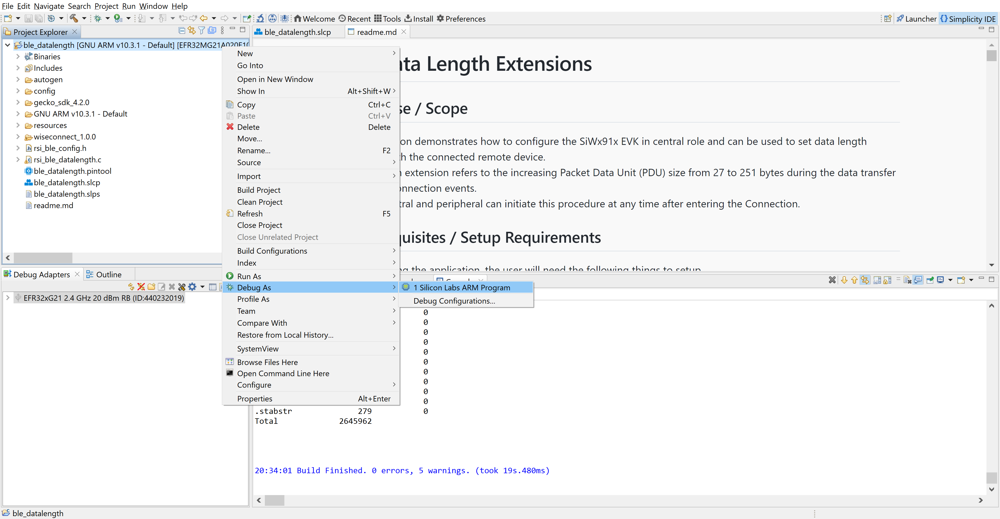


**Note:** Simillary, choose the Debug As option for debuging.


### 6.1 Running the SiWx91x Application

1. Configure the remote device in peripheral mode and put it in advertising mode.
<br>
<br>

2. After the program gets executed, the Silicon Labs device initiates the scanning.
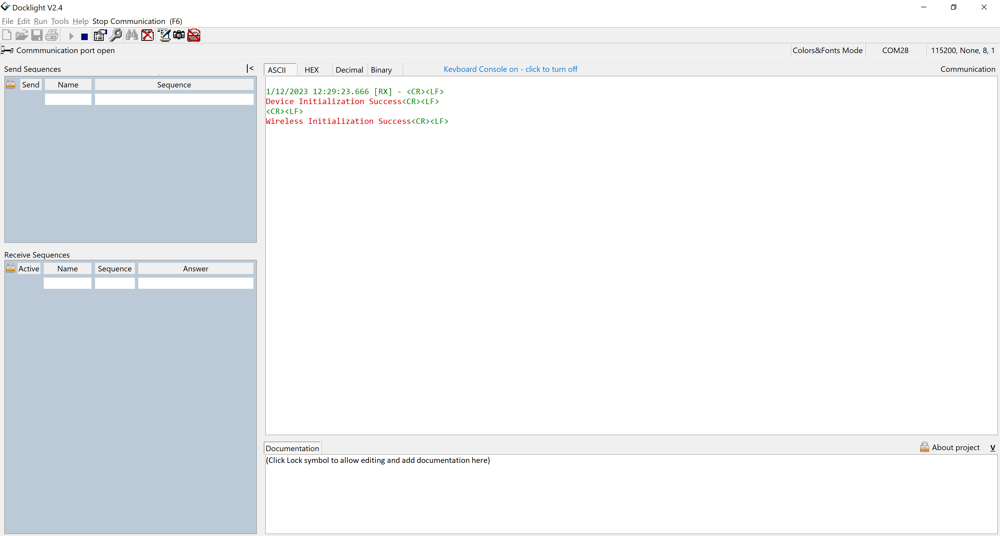


3. When the Silicon Labs device receives the advertising report of the remote device, which is specified in the **RSI_BLE_DEV_ADDR** or **RSI_REMOTE_DEVICE_NAME** macro, it initiates the connection.

4. Observe that the connection is established between the desired device and Silicon Labs device.

5. After connection, the Silicon Labs device will set data length of the remote device.

6. Observe a data length change event after setting the data length.
<br>
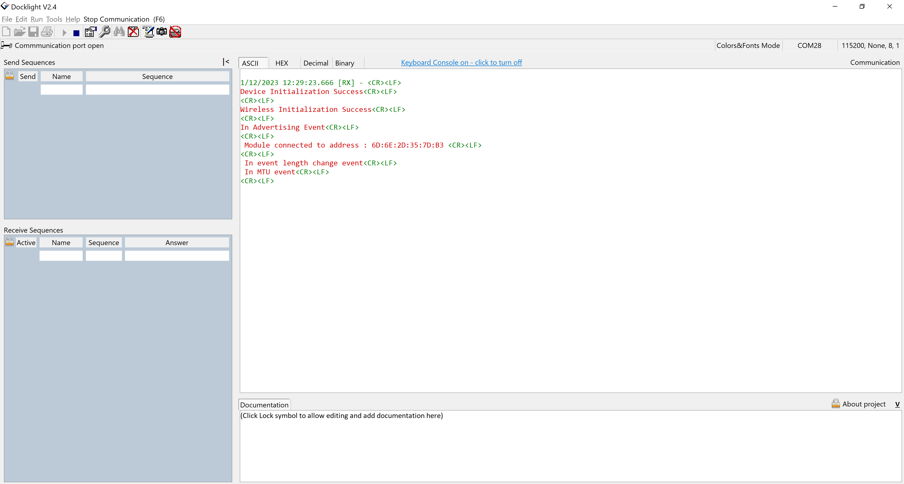<br>

6. After successful program execution, the print in teraterm looks as shown below.    
     
## 7. Observing the output prints on the serial terminal

### 7.1 SoC Mode:
- Connect USB to UART connector Tx and GND pins to WSTK radio board.
   - Connect Tx(Pin-6) to P27 on WSTK
   - Connect GND (Pin 8 or 10) to GND on WSTK.

    
- Prints can be seen in any Console terminal as shown below.

  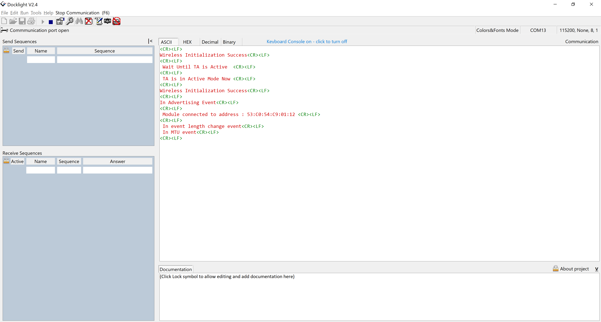


### 7.2 NCP Mode:
- Prints can be seen in any Console terminal as shown below.

  

## 8. Selecting Bare Metal
The application has been designed to work with FreeRTOS and Bare Metal configurations. By default, the application project files (Simplicity studio) are configured with FreeRTOS enabled. The following steps demonstrate how to configure Simplicity Studio to test the application in a Bare Metal environment.

### 8.1 Bare Metal with Simplicity Studio
- Open the project in Simplicity Studio
- Right click on the project and choose 'Properties'
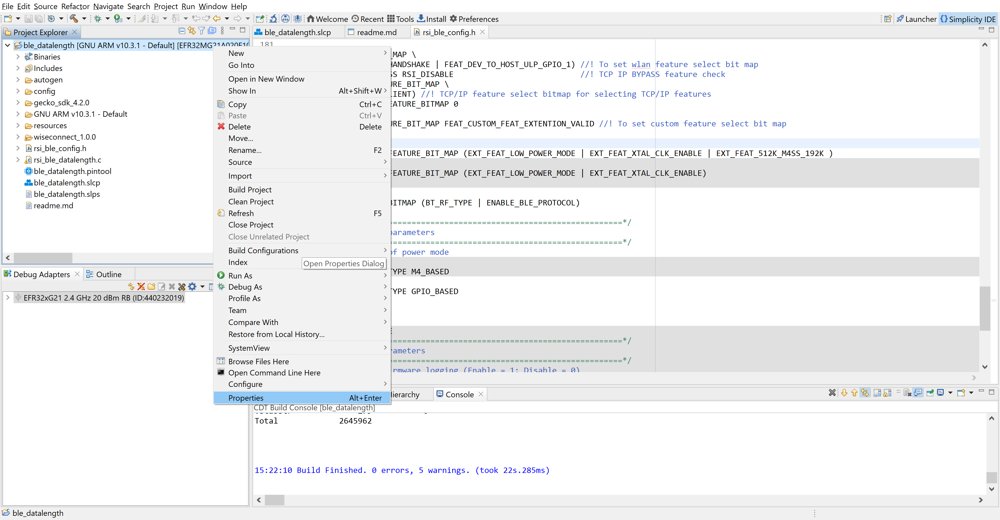 
- Go to 'C/C++ Build' | 'Settings' | 'GNU ARM C Compiler' | 'Symbols' and remove macro 'RSI_WITH_OS=1'
- Select 'Apply' and 'OK' to save the settings
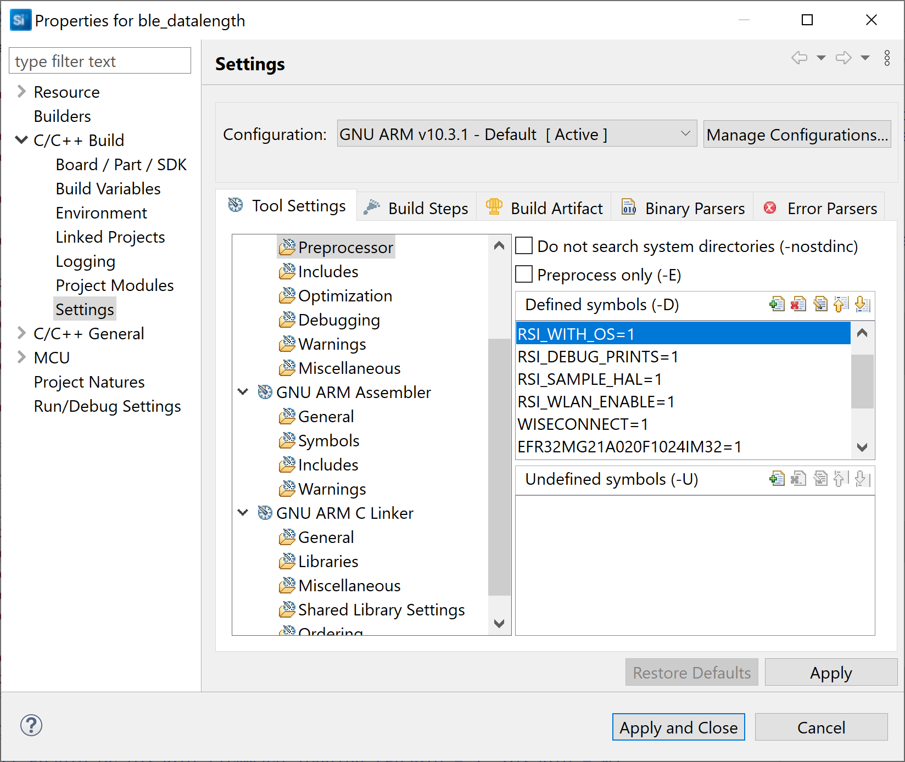

### 8.2 Bare Metal with Keil
- Open project in Keil IDE and click on 'Options for Target'
- Go to 'C/C++' tab and remove 'RSI_WITH_OS' macro present under Preprocessor Symbols
- Click on 'OK' button to save the settings
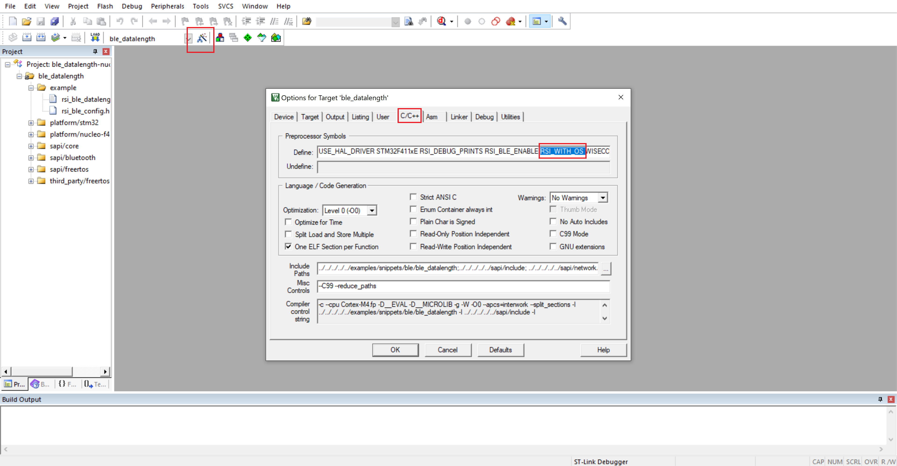