# BLE Heart Rate Profile

## **1 Introduction**

This application demonstrates how to configure SiWx91x module as a GATT Server/GATT Client.
- As a GATT server with Heart Rate Service in BLE Peripheral Mode and explains how to do indicate operations with the GATT server from a connected remote device using the GATT client.
- As a GATT client in BLE central mode and enable indication of operation of the heart rate service of the connected remote GATT server from the GATT client. In the application,Heart rate GATT server is configured with heart rate service and their corresponding characteristic UUIDs.

When the connected remote device writes data to writable characteristic UUID, the WiseConnect device receives the data that is received on writable characteristic UUID and writes the same data to readable characteristic UUID and sends indications to the connected device (or) remote device can read the same data using read characteristic UUID if indication enabled on client side.
## **2 Prerequisites**

For the application, the you will need the following:
### **2.1 Hardware Requirements**

- A Windows PC

#### **2.1.1 SoC** 

   - Silicon Labs SiWx917 PK6030A SoC Kit which includes
      - BRD4001A/BRD4002A Wireless Starter Kit Mainboard
      - BRD4325A Radio Board
   - USB TO UART converter / TTL cable
   
#### **2.1.2 NCP**

   - Silicon Labs BRD8036A Si917 QMS SB Expansion Board
   - [Silicon Labs SLWSTK6006A EFR32xG21 Wireless Starter Kit](https://www.silabs.com/development-tools/wireless/efr32xg21-wireless-starter-kit) which includes
      - BRD4001A/BRD4002A Wireless Starter Kit Mainboard
      - BRD4180A/BRD4180B Radio Board

               
### **2.2 Software Requirements**

- Simplicity Studio IDE
   - To download and install the Simplicity Studio IDE, refer to the "Simplicity Studio IDE Set up" section in ***Getting started with SiWx91x*** guides.

- SiWx917_WiSeConnect_SDK.X.X
  
- [EFR connect Mobile APP](https://www.silabs.com/developers/efr-connect-mobile-app)

- Tera Term software or any other serial terminal software - for viewing application prints

## **3 Setup diagram**

### **3.1 SoC**   
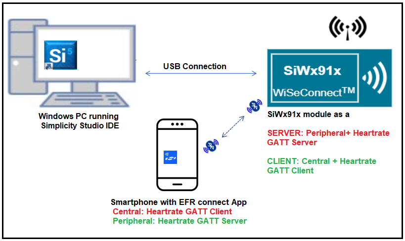  
### **3.2 NCP** 
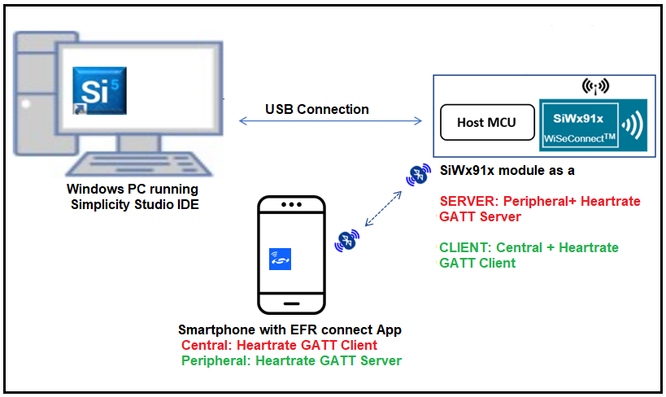   
**NOTE**: 
- The Host MCU platform (EFR32xG21) and the SiWx91x interact with each other through the SPI interface. 

## **4 Setup**

### **4.1 SoC/NCP** 

- Follow the**Hardware connections and Simplicity Studio IDE Set up**  section in the respective ***Getting Started with SiWx91x*** guides to make the hardware connections and add the SiWx91x COMBO SDKs to Simplicity Studio IDE.

### **4.2 Loading the SiWx91x Firmware**

- Load the latest firmware into SiWx91x module, which is located in the `<SDK>/connectivity_firmware/` path as described in the **SiWx91x Firmware Update** section in the respective ***Getting started with SiWx91x*** guides.   

## **5 Project Creation**
To create the BLE Heartrate example project in the Simplicity Studio IDE, follow the **Project Creation** section in the respective ***Getting started with SiWx91x*** guides. 
   - For SoC, choose the **Bluetooth - SoC BLE Heart Rate Profile** example.
   - For NCP, choose the **Bluetooth - NCP BLE Heart Rate Profile** example.

## **6 Application configuration**

The application can be configured to suit you requirements and development environment. Go through the following sections and make any changes if needed.      
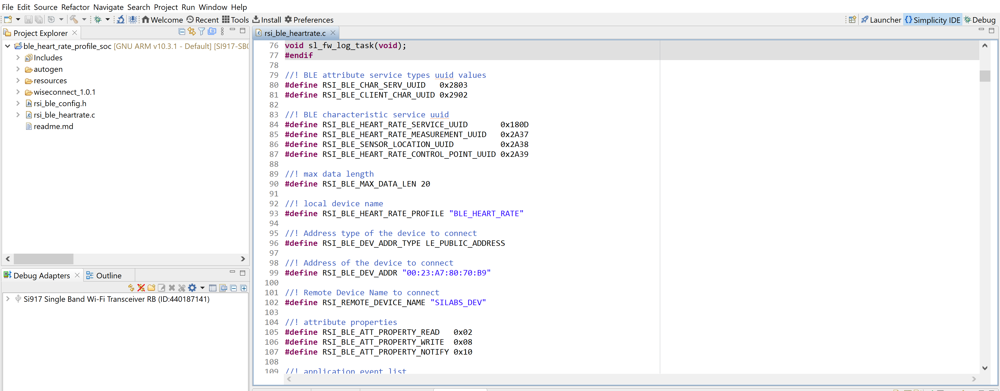
1. In the Project explorer pane of the IDE, expand the **ble\_heart\_rate\_profile** folder and open the **rsi\_ble\_heartrate.c** file. 
- **GATT\_ROLE** refers the role of the Silicon Labs module to be selected.

   - If user configures, **SERVER**, Silicon Labs module will act as GATT SERVER, means will add heart rate profile.

   - If user configures, **CLIENT**, Silicon Labs module will act as GATT CLIENT, means will connect to remote GATT server and get services and enable notify.
  ```c
  #define GATT_ROLE                  SERVER
  ```
- **Power Save Configuration**
Configure "ENABLE_POWER_SAVE" parameter to enable power save mode.    
   ```c
      #define ENABLE_POWER_SAVE              1
   ```
   **Note:** If you are using the NCP-EXP-Board, refer the "**Powersave functionality with NCP expansion board**" section  the ***Getting started with SiWx91x NCP*** guide.

### **6.1 BLE Hear rate profile application as a SERVER**

- The following parameters are required to configure, when the SiWx91x module as a **SERVER**

  ```c
  //! RSI_BLE_HEART_RATE_PROFILE Refer to the SiWx91x module name
  #define RSI_BLE_HEART_RATE_PROFILE "BLE_HEART_RATE"

  //! BLE Heart rate service & characteristic service uuid
  #define RSI_BLE_HEART_RATE_SERVICE_UUID       0x180D
  #define RSI_BLE_HEART_RATE_MEASUREMENT_UUID   0x2A37
  #define RSI_BLE_SENSOR_LOCATION_UUID          0x2A38
  #define RSI_BLE_HEART_RATE_CONTROL_POINT_UUID 0x2A39

  //! BLE attribute service types uuid values
  #define RSI_BLE_CHAR_SERV_UUID   0x2803
  #define RSI_BLE_CLIENT_CHAR_UUID 0x2902

  //! attribute properties
  #define RSI_BLE_ATT_PROPERTY_READ   0x02
  #define RSI_BLE_ATT_PROPERTY_WRITE  0x08
  #define RSI_BLE_ATT_PROPERTY_NOTIFY 0x10

  ```

### **6.2 BLE Hear rate profile application as a CLIENT**

- The following parameters are required to configure, when the SiWx91x module as a **CLIENT**

- **Remote device configuration parameters**
  ```c
  // RSI_BLE_DEV_ADDR_TYPE refers to the address type of the remote device to connect.
  //! Based on address type of remote device, valid configurations are LE_RANDOM_ADDRESS and LE_PUBLIC_ADDRESS
 
	 #define RSI_BLE_DEV_ADDR_TYPE                          LE_PUBLIC_ADDRESS 
  
  //RSI_BLE_DEV_ADDR refers to the address of the remote device to connect.
  
  #define RSI_BLE_DEV_ADDR                               "00:1E:7C:25:E9:4D" 
  
  //RSI_REMOTE_DEVICE_NAME refers to the name of remote device to which Silicon Labs device has to connect.

	 #define RSI_REMOTE_DEVICE_NAME                         "SILABS_DEV" 
  ```
  **Note:** you required to configure either the `RSI_BLE_DEV_ADDR` or `RSI_REMOTE_DEVICE_NAME` of the remote device.

2. Open **rsi\_ble\_config.h** file and configure the Opermode command parameters.   
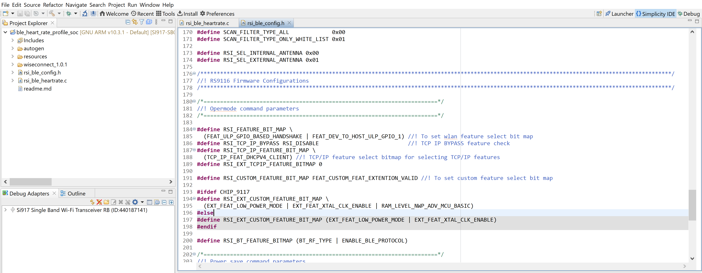  
   ```c
    #define RSI_FEATURE_BIT_MAP     (FEAT_ULP_GPIO_BASED_HANDSHAKE | FEAT_DEV_TO_HOST_ULP_GPIO_1) 

    #define RSI_TCP_IP_BYPASS         RSI_DISABLE       

    #define RSI_TCP_IP_FEATURE_BIT_MAP     (TCP_IP_FEAT_DHCPV4_CLIENT) 

    #define RSI_EXT_TCPIP_FEATURE_BITMAP 0

    #define RSI_CUSTOM_FEATURE_BIT_MAP    FEAT_CUSTOM_FEAT_EXTENTION_VALID  

    #define RSI_EXT_CUSTOM_FEATURE_BIT_MAP (EXT_FEAT_LOW_POWER_MODE | EXT_FEAT_XTAL_CLK_ENABLE | EXT_FEAT_512K_M4SS_192K)

    #define RSI_BT_FEATURE_BITMAP (BT_RF_TYPE | ENABLE_BLE_PROTOCOL)
   ```
   **Note:** `rsi_ble_config.h` files are already set with desired configuration in respective example folders you need not change for each example. 

## **7 Set up for Serial Prints**
- To Setup the serial prints, follow the **Setup for Serial Prints** section in the respective ***Getting started with SiWx91x*** guides


## **8 Build, Flash, and Run the Application**
- After making any custom configuration changes required, For build, flash, and run the application project, follow the **Build and Flash the Project** section in the respective ***Getting started with SiWx91x*** guides.    


## **9 Application Execution Flow**

Application has the feasibility to configure the Heartrate GATT server (or) GATT client.     
**Note:**      
- The provided mobile screenshots are from the 2.5.2 version of the EFR Connect app, it is recommended to use the latest version.
### **9.1 BLE Hear rate profile application as a SERVER**
1. After the program gets executed, If Silicon Labs device is configured as **SERVER** specified in the macro **GATT_ROLE**, Silicon Labs will be in Advertising state.
2. Connect any serial console for prints.
3. Open a EFR Connect App in the Smartphone and do the scan.
4. In the App, Silicon Labs module device will appear with the name configured in the macro `RSI_BLE_HEART_RATE_PROFILE (Ex: "BLE_HEART_RATE")` or sometimes observed as Silicon Labs device as internal name "**SimpleBLEPeripheral**".     

5. Initiate connection from the App.
6. After successful connection, EFR Connect APP displays the supported services of Silicon Labs module.     
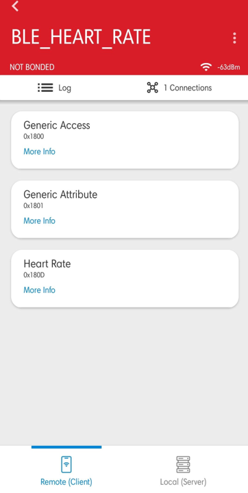
7. Select the attribute service which is added `RSI_BLE_HEART_RATE_SERVICE_UUID`
8. Enable notify for the characteristic `RSI_BLE_HEART_RATE_MEASUREMENT_UUID`. So that GATT server indicates when value updated in that particular attribute.     
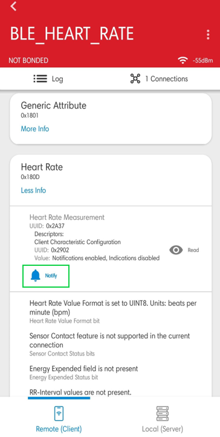
9. Whenever the value is updated at server it will be notified to the client which can be read at Heart_Rate_Measurement attribute.    
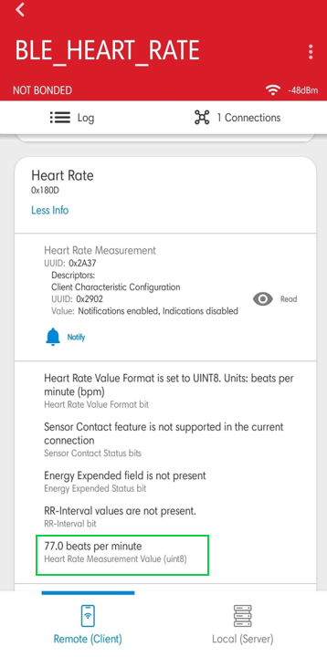
10. Prints can see as below in any Console terminal
   - **SoC**      
   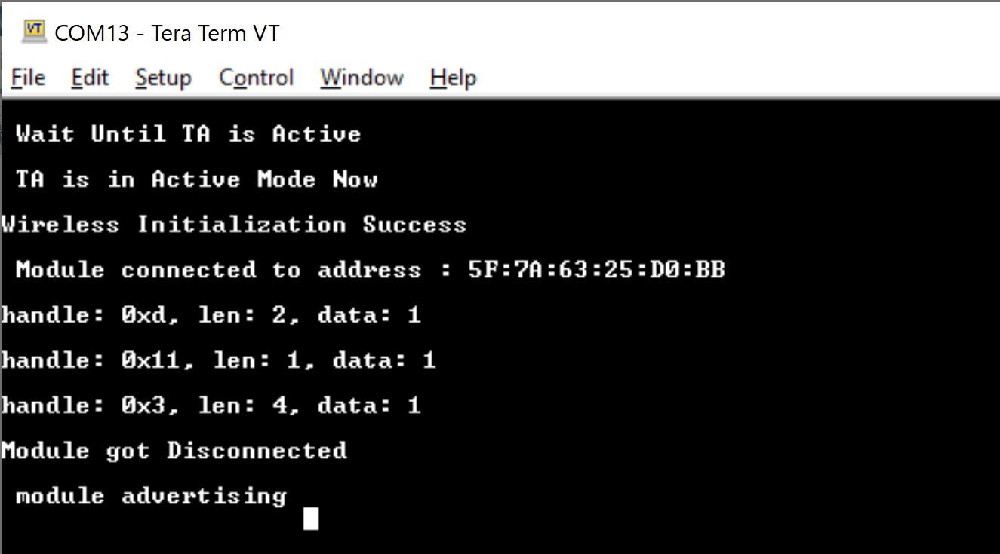
   - **NCP**   
   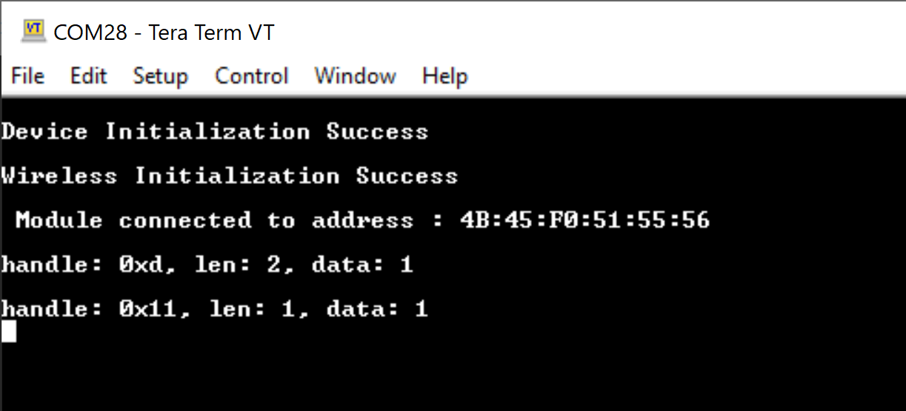 

### **9.2 BLE Hear rate profile application as a CLIENT**

1. Configure the **GATT_ROLE** macro as **CLIENT**

2. Connect any serial console for prints.

3. Open the EFR Connect APP and Create the **Hear rate service** to configure the Remote device as a GATT server.
   - Name: Heart Rate
   - UUID: 0x180D

   **Note:** Refer the [Adding Services](https://docs.silabs.com/bluetooth/5.0/miscellaneous/mobile/efr-connect-mobile-app) for creating the GATT server the EFR connect mobile APP as advertiser.    
   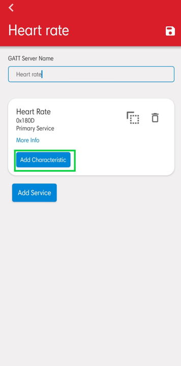
4. Add the characteristic services and their coresponding properties as shown below
   | S.No | Name | UUID | Property |
   |------|------|------|----------|
   |1|Heart Rate Measurement | 0x2A37 | Notify|
   |2|Body sensor Location | 0x2A38 | Read|
   |3|Heart Rate Control Point | 0x2A39 | Write|
   
   **Note:** Refer the [Adding Characteristics and Descriptors](https://docs.silabs.com/bluetooth/5.0/miscellaneous/mobile/efr-connect-mobile-app) for creating the GATT server in the EFR connect mobile APP.    
   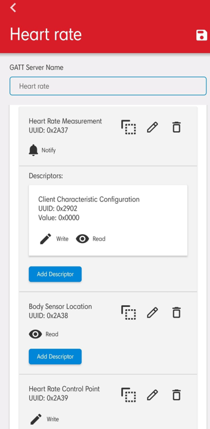
5. Enable the **Heart rate** service.     

6. Configure the advertiser.     
      
**Note:** Refer the [Creating New Advertisement Sets](https://docs.silabs.com/bluetooth/5.0/miscellaneous/mobile/efr-connect-mobile-app) for configuring the EFR connect mobile APP as advertiser.
7. When Silicon Labs device is configured as **CLIENT** specified in the macro **GATT_ROLE**, scans for remote device and tries to connect with the remote device specified in `RSI_BLE_DEV_ADDR or RSI_REMOTE_DEVICE_NAME` macro.
8. Get all GATT profiles of remote device and Search for profile specified in the macro `RSI_BLE_HEART_RATE_SERVICE_UUID`. And get all characteristics of the heartrate service and verify the characteristic `RSI_BLE_HEART_RATE_MEASUREMENT_UUID` which has notify property.
9. Observe notify property is enabled in the GATT server and indicates to the GATT client whenever the value is updated at server.     
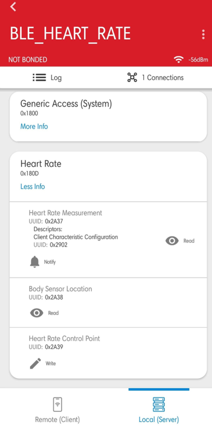
10. Observe the updated heart rate measurement value on the teraterm. Prints can see as below in any Console terminal
   - **SoC**      
   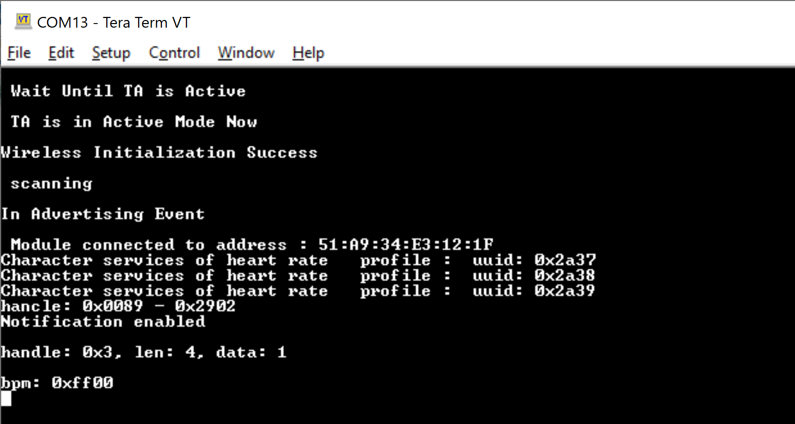
   - **NCP**   
   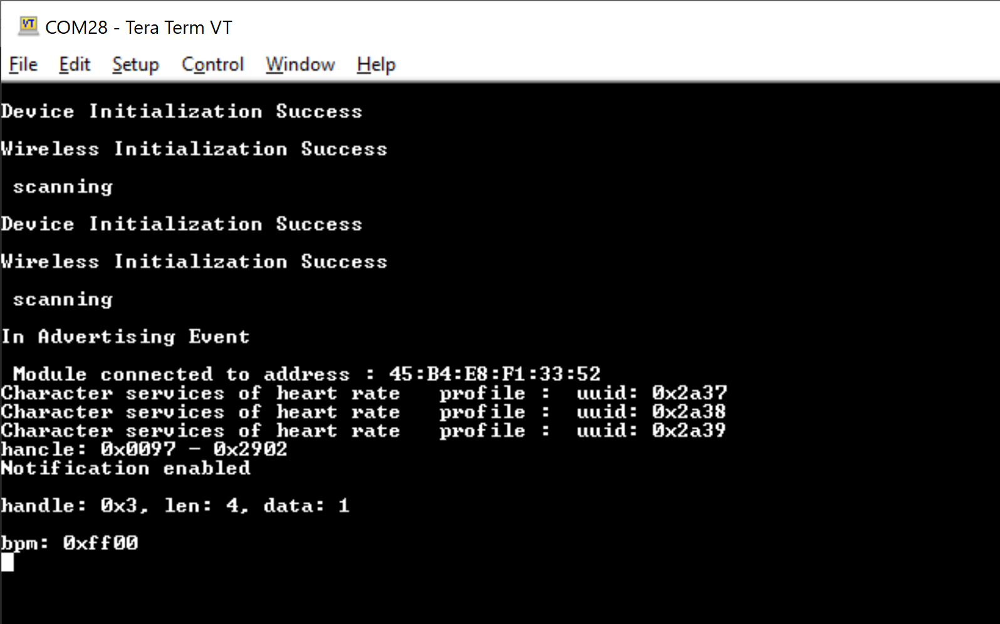 

## **Appendix**

- By default, the application runs over FreeRTOS. To run the application with Bare metal configurations, follow the **Bare Metal configuration** section in the ***Getting Started with SiWx91x*** guides.