# iBeacon 

## 1. Purpose / Scope

This application demonstrates how to set the iBeacon data format in advertising parameters in  BLE peripheral mode.

## 2. Prerequisites / Setup Requirements

Before running the application, the user will need the following things to setup.

### 2.1 Hardware Requirements

- Windows PC with Host interface(UART/ SPI/ SDIO).
   - SiWx91x Wi-Fi Evaluation Kit. The SiWx91x supports multiple operating modes. See [Operating Modes]() for details.
  - **SoC Mode**: 
      - Silicon Labs [BRD4325A](https://www.silabs.com/)
  - **NCP Mode**:
      - Silicon Labs [(BRD4180A, BRD4280B)](https://www.silabs.com/);
      - Host MCU Eval Kit. This example has been tested with:
        - Silicon Labs [WSTK + EFR32MG21](https://www.silabs.com/development-tools/wireless/efr32xg21-bluetooth-starter-kit)
        - Silicon Labs [WSTK + EFM32GG11](https://www.silabs.com/development-tools/mcu/32-bit/efm32gg11-starter-kit) 
- Smart phone with ibeacon detector application
### 2.2 Software Requirements
    
- **SoC Mode**
  - **Silicon Labs SiWx91x SoC**. Follow the [Getting Started with SiWx91x SoC](https://docs.silabs.com/) to setup the example to work with SiWx91x SoC and Simplicity Studio.
- **NCP Mode**
  - **Silicon Labs EFx32 Host**. Follow the [Getting Started with EFx32](https://docs.silabs.com/rs9116-wiseconnect/latest/wifibt-wc-getting-started-with-efx32/) to setup the example to work with EFx32 and Simplicity Studio.

### 2.3 Setup Diagram	

**SoC Mode :** 
   <br>
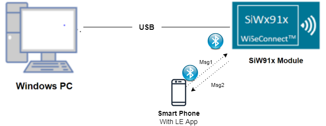<br>

  
**NCP Mode :**  
   <br>
<br>


### 2.4 iBeacon details
**iBeacon Advertise Data Format**

	 iBeacon prefix   UUID        Major Number   Minor Number    TX Power
	 9Bytes           16bytes     2Bytes         2 Bytes         1bytes

   **iBeacon Prefix:**
   Vendor specific fixed value.
   Default iBeacon prefix values setting by application is,
   Prefix = {0x02, 0x01, 0x02, 0x1A, 0xFF, 0x4C, 0x00, 0x02, 0x15}

   **UUID:**
   User generated proximity UUID.
   Remote devices recognize which beacon they approach on the basis of UUID, major and minor numbers.
   Default UUID, Major and Minor values setting by application is,
   UUID = {0xFB , 0x0B , 0x57 , 0xA2 , 0x82 , 0x28 , 0x44 , 0xCD , 0x91 ,
   0x3A , 0x94 , 0xA1 , 0x22 , 0xBA , 0x12 , 0x06}
   major_num = {0x11, 0x22}
   minor_num = {0x33, 0x44}

   **TX Power** is used to calculate distance from iBeacon.
   Default TX power value setting by application is,
   TX Power = 0x33

	 Note:
	 If the user wants to change the prefix, UUID, Major number, Minor number and TX Power values, change the following values in rsi_ble_ibeacon.c_ file.

   For Prefix:
   `<span style="color: #005032">uint8_t</span> adv[31] = {0x02, 0x01, 0x02, 0x1A, 0xFF, 0x4C, 0x00, 0x02, 0x15}; //prefix(9bytes)`

   **For UUID:**

   uint8_t uuid[16] = {0xFB , 0x0B , 0x57 , 0xA2 , 0x82 , 0x28 , 0x44 , 0xCD , 0x91 , 0x3A , 0x94 , 0xA1 , 0x22 , 0xBA , 0x12 , 0x06};
   
- For Major Number:
   - uint8_t major_num[2] = {0x11, 0x22};
   
- For Minor Number:
   - uint8_t minor_num[2] = {0x33, 0x44};
   
- For TX Power:
   - uint8_t tx_power = 0x33;

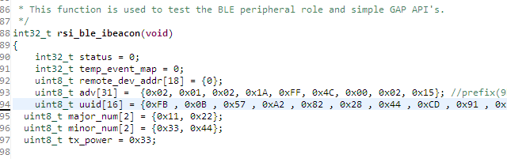

## 3. Application Build Environment

### 3.1 Project Setup

- **SoC Mode**
  - **Silicon Labs SiWx91x SoC**. Follow the [Getting Started with SiWx91x SoC](https://docs.silabs.com/) to setup the example to work with SiWx91x SoC and Simplicity Studio.
- **NCP Mode**
  - **Silicon Labs EFx32 Host**. Follow the [Getting Started with EFx32](https://docs.silabs.com/rs9116-wiseconnect/latest/wifibt-wc-getting-started-with-efx32/) to setup the example to work with EFx32 and Simplicity Studio.
 
User can find the Radio Board version as given below 

### 3.2 NCP Mode - Host Interface 

* By default, the application is configured to use the SPI bus for interfacing between Host platforms(EFR32MG21) and the SiWx91x EVK.
		
### 3.3 Bare Metal/RTOS Support

This application supports bare metal and RTOS environment. By default, the application project files (Keil and Simplicity Studio) are provided with RTOS configuration. To select a bare metal configuration, see [Selecting bare metal](#selecting-bare-metal).

## 4. Application Configuration Parameters

The application can be configured to suit your requirements and development environment. Read through the following sections and make any changes needed.

**4.1** Open `rsi_ble_ibeacon.c` file and update/modify following macros:

- `RSI_BLE_LOCAL_NAME` refers name of the Silicon Labs device to appear during scanning by remote devices.
```c
	 #define RSI_BLE_LOCAL_NAME                     "ibeacon"
```
- Following are the event numbers for connection and Disconnection events,
```c
	 #define RSI_APP_EVENT_CONNECTED                1
	 #define RSI_APP_EVENT_DISCONNECTED             2
```
- Following are the **non-configurable** macros in the application.
   - BT_GLOBAL_BUFF_LEN refers Number of bytes required by the application and the driver
```c
	 #define BT_GLOBAL_BUFF_LEN                     15000
```

**4.2** Open `rsi_ble_config.h` file and update/modify following macros,
```c
	 #define RSI_BLE_PWR_INX                        30
	 #define RSI_BLE_PWR_SAVE_OPTIONS               0
```	 
   **Opermode command parameters** 
```c
	 #define RSI_FEATURE_BIT_MAP                    FEAT_SECURITY_OPEN
	 #define RSI_TCP_IP_BYPASS                      RSI_DISABLE
	 #define RSI_TCP_IP_FEATURE_BIT_MAP             TCP_IP_FEAT_DHCPV4_CLIENT
	 #define RSI_CUSTOM_FEATURE_BIT_MAP             FEAT_CUSTOM_FEAT_EXTENTION_VALID
	 #define RSI_EXT_CUSTOM_FEATURE_BIT_MAP         EXT_FEAT_384K_MODE
```	 
**Note:**
   rsi_ble_config.h files are already set with desired configuration in respective example folders user need not change for each example.
   
## 5. Testing the Application

Follow the below steps for the successful execution of the application.

### 5.1 Loading the SiWx91x Firmware

Refer [Getting started with a PC](https://docs.silabs.com/rs9116/latest/wiseconnect-getting-started) to load the firmware into SiWx91x EVK. The firmware file is located in `<SDK>/firmware/`

### 5.2 Creating the Project and builing the Application
  
Refer [Getting started with EFX32](https://docs.silabs.com/rs9116-wiseconnect/latest/wifibt-wc-getting-started-with-efx32/), for setting-up EFR & EFM host platforms

#### 5.2.1 Project Creation - SoC Mode : 

- Connect your board. The Si917 compatible SoC board is **BRD4325A**.
- Studio should detect your board. Your board will be shown here.


#### 5.2.2 Project Creation - NCP Mode : 

- Connect your board. The supported NCP boards are: **BRD4180A,BRD4280B**
- Studio should detect your board. Your board will be shown here.


#### 5.2.3 Selecting an example application and generate project

- Go to the 'EXAMPLE PROJECT & DEMOS' tab and select your desired example application
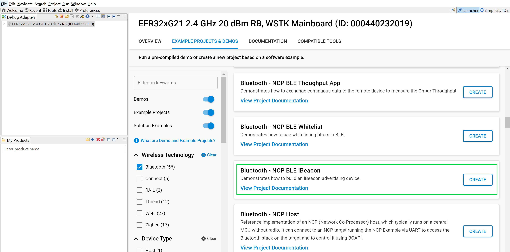
- Click 'Create'. The "New Project Wizard" window appears. Click 'Finish'
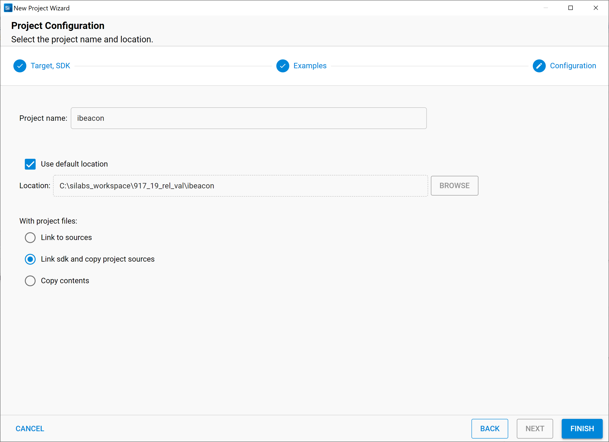

#### 5.2.4 Build Project - SoC Mode

- Once the project is created, right click on project and go to properties -> C/C++ Build -> Settings -> Build Steps
- Add post_build_script_SimplicityStudio.bat file path (SI917_COMBO_SDK.X.X.X.XX\utilities\isp_scripts_common_flash) in build steps settings as shown in below image.
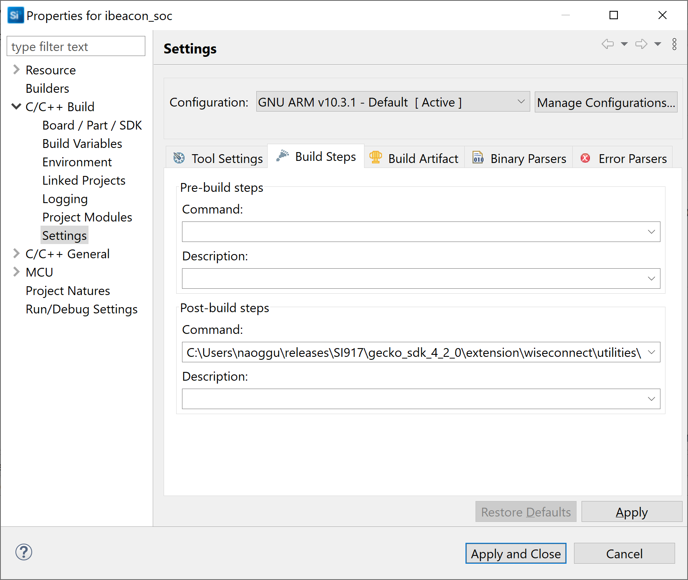
- Check for M4 projects macros in preprocessor settings(RSI_M4_INTERFACE=1)
- Check for 9117 macro in preprocessor settings(CHIP_9117=1).
- Click on the build icon (hammer) to build the project
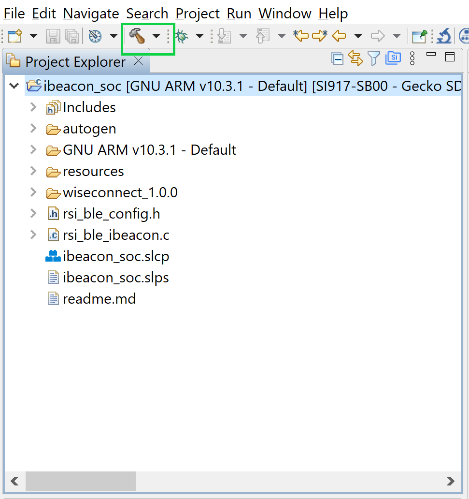
- Successful build output will show as below.
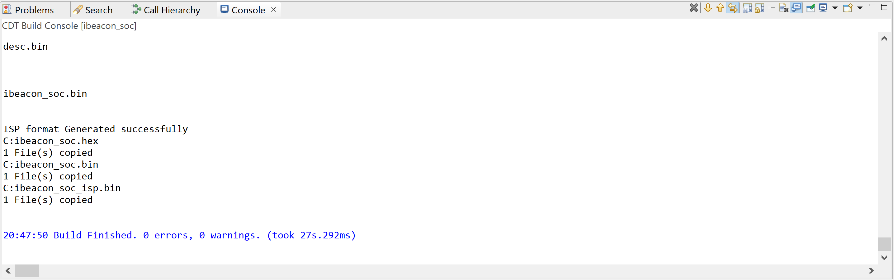

#### 5.2.5 Build Project - NCP Mode :

- Check for 9117 macro in preprocessor settings(CHIP_9117=1).
- Click on the build icon (hammer) to build the project
   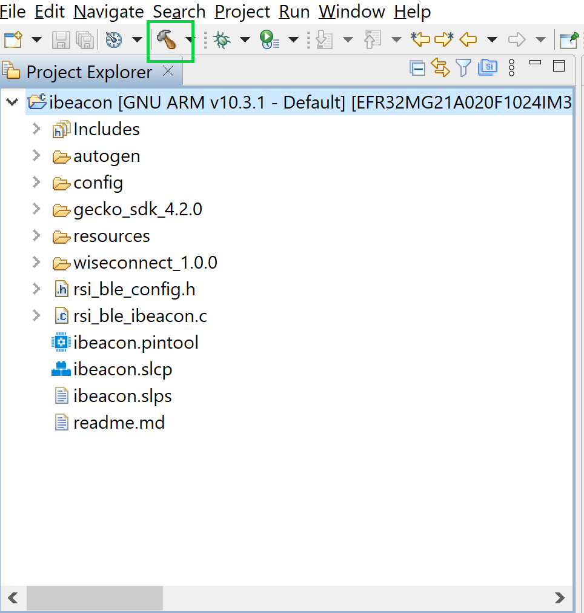
- Successful build output will show as below.
   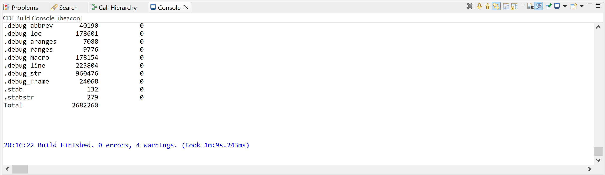

## 6. Program the device

Once the build was successfull, right click on project and click on Debug As->Silicon Labs ARM Program as shown in below image.
### SoC Mode :
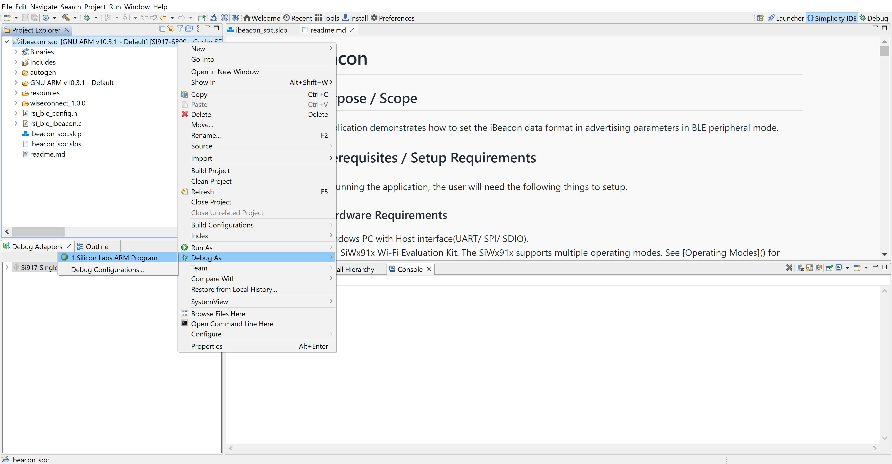
### NCP Mode : 
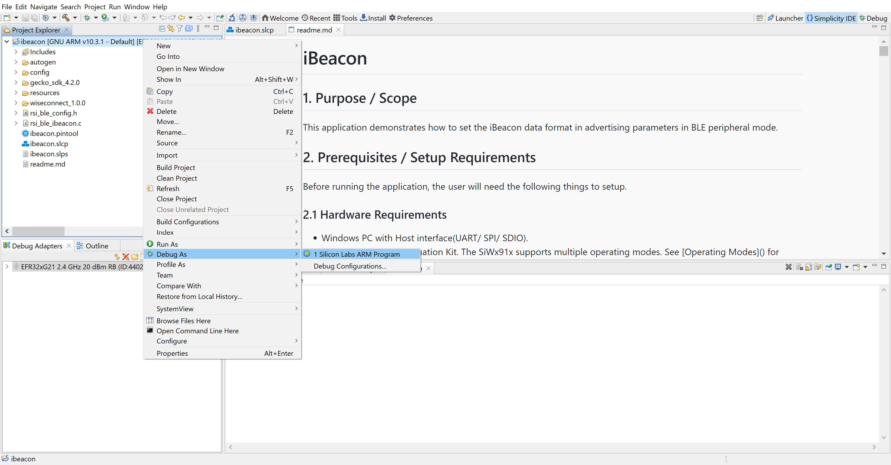
**Note:** Simillarly, Choose the **Run As** option for free-Run.

### 6.1 Running the SiWx91x Application

1. After the program gets executed, Silicon Labs module would be in Advertising state.

2. Connect any serial console for prints.

3. Open iBeaconDetector app in the Smartphone and do Scan.

4. In the App, Silicon Labs module device would appear with the name configured in the macro **RSI\_BLE\_LOCAL\_NAME** (Ex: "ibeacon") or sometimes observed as "SimpleBLEPeripheral".

5. After successful scan, user can see the Silicon Labs device advertised data i.e UUID, Maximum Number, Minimum Number and TX Power in iBeaconDetector application.  
   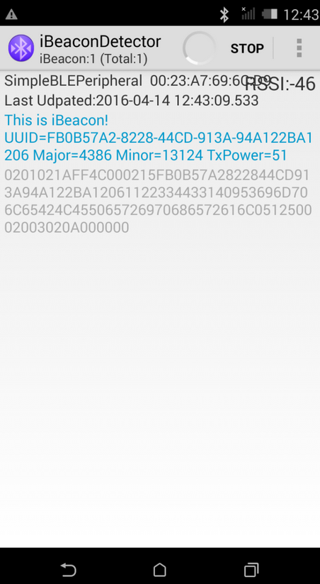

6. Refer the below images for console prints
- For SOC the console prints are shown below
   <br>
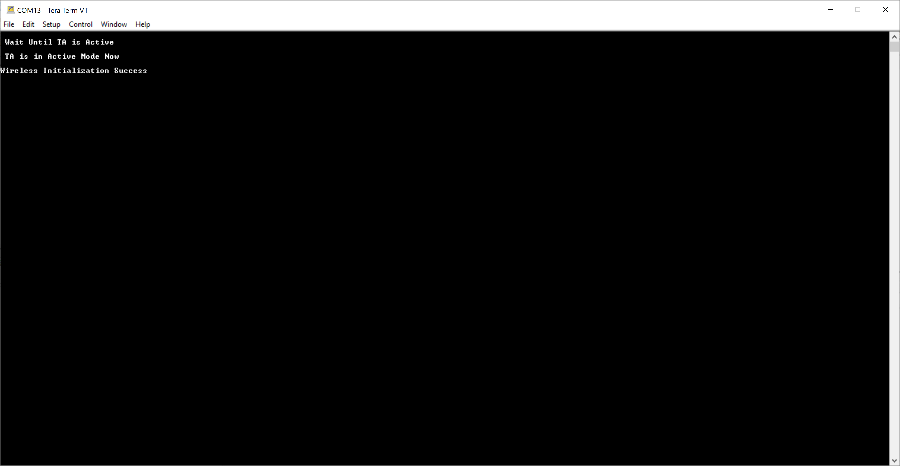<br>
- For NCP the console prints are shown below
   <br>
<br>


## 7. Observing the output prints on serial terminal

### 7.1 SoC Mode:
- Connect USB to UART connector Tx and GND pins to WSTK radio board.

   - Connect Tx(Pin-6) to P27 on WSTK
   - Connect GND(Pin 8 or 10) to GND on WSTK

      
- Prints can see as below in any Console terminal

   

### 7.2 NCP Mode:
- Prints can see as below in any Console terminal

   

## 8. Selecting Bare Metal
The application has been designed to work with FreeRTOS and Bare Metal configurations. By default, the application project files (Simplicity studio) are configured with FreeRTOS enabled. The following steps demonstrate how to configure Simplicity Studio to test the application in a Bare Metal environment.

### 8.1 Bare Metal with Simplicity Studio
- Open project in Simplicity Studio
- Right click on the project and choose 'Properties'
- Go to 'C/C++ Build' | 'Settings' | 'GNU ARM C Compiler' | 'Preprocessor' and remove macro 'RSI_WITH_OS=1'
- Click on 'Apply' and 'OK' to save the settings

   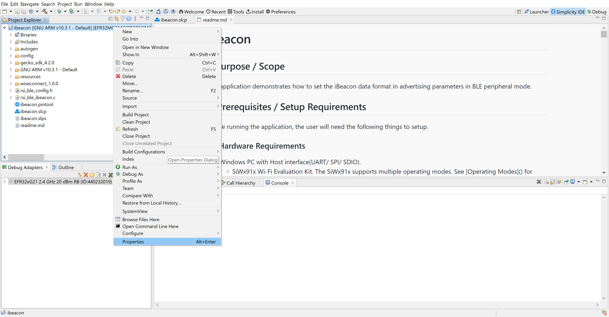

   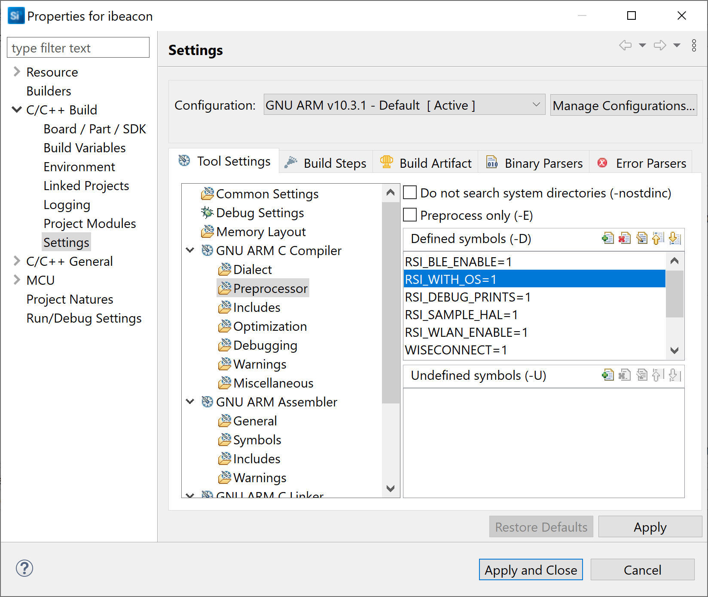

### 8.2 Bare Metal with Keil
- Open project in Keil IDE and click on 'Options for Target'
- Go to 'C/C++' tab and remove 'RSI_WITH_OS' macro present under Preprocessor Symbols
- Click on 'OK' button to save the settings

   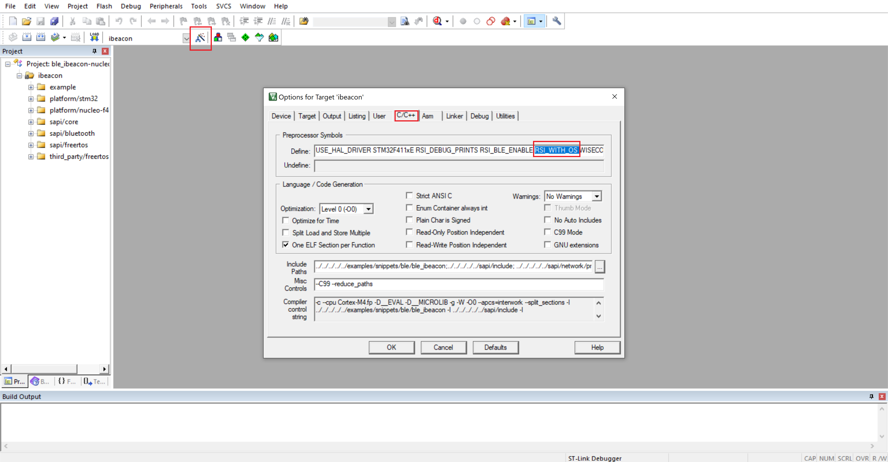