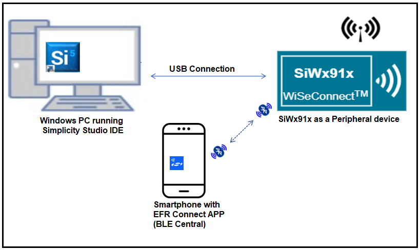
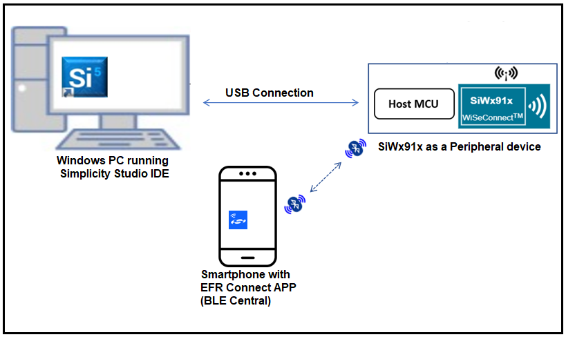
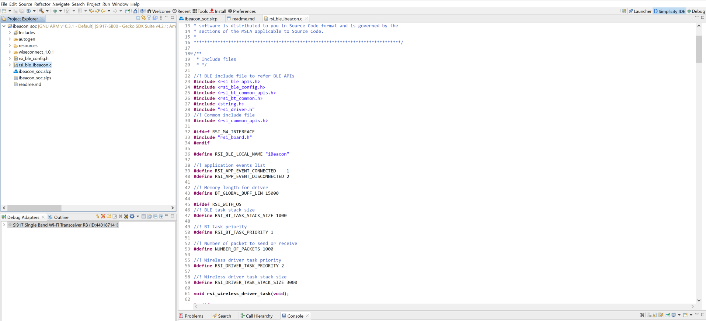
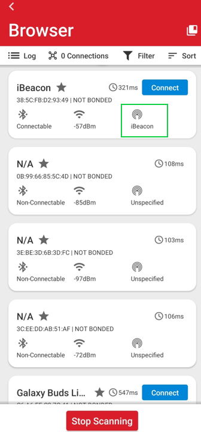
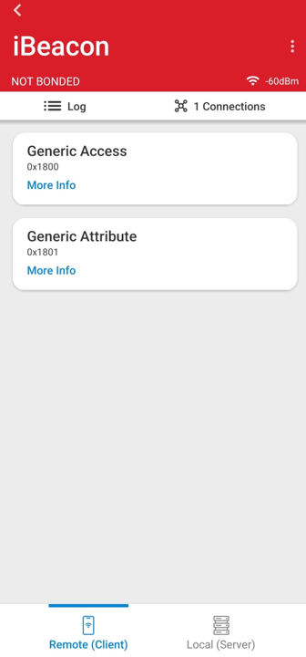
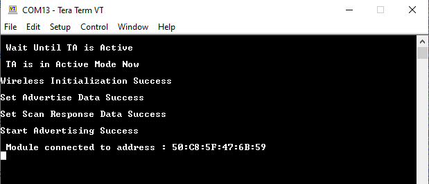

# BLE iBeacon 

## **1. Introduction**

This application demonstrates how to set the iBeacon data format in advertising parameters in  BLE peripheral mode and establishes the connection with remote BLE device.

### **1.1 iBeacon Advertise Data Format**

|iBeacon prefix|   UUID |Major Number|Minor Number|TX Power|
|--------------|--------|------------|------------|--------|
|9Bytes | 16bytes |2Bytes |     2Bytes|   1bytes|

   **iBeacon Prefix:**
   Vendor specific fixed value.
   Default iBeacon prefix values setting by application is,
   Prefix = {0x02, 0x01, 0x02, 0x1A, 0xFF, 0x4C, 0x00, 0x02, 0x15}

   **UUID:**
   User generated proximity UUID.
   Remote devices recognize which beacon they approach on the basis of UUID, major and minor numbers.
   Default UUID, Major and Minor values setting by application is,
   UUID = {0xFB , 0x0B , 0x57 , 0xA2 , 0x82 , 0x28 , 0x44 , 0xCD , 0x91 ,
   0x3A , 0x94 , 0xA1 , 0x22 , 0xBA , 0x12 , 0x06}
   major_num = {0x11, 0x22}
   minor_num = {0x33, 0x44}

   **TX Power** is used to calculate distance from iBeacon.
   Default TX power value setting by application is,
   TX Power = 0x33

	 Note:
	 If the user wants to change the prefix, UUID, Major number, Minor number and TX Power values, change the following values in rsi_ble_ibeacon.c_ file.

   For Prefix:
   `<span style="color: #005032">uint8_t</span> adv[31] = {0x02, 0x01, 0x02, 0x1A, 0xFF, 0x4C, 0x00, 0x02, 0x15}; //prefix(9bytes)`

   **For UUID:**

   uint8_t uuid[16] = {0xFB , 0x0B , 0x57 , 0xA2 , 0x82 , 0x28 , 0x44 , 0xCD , 0x91 , 0x3A , 0x94 , 0xA1 , 0x22 , 0xBA , 0x12 , 0x06};
   
- For Major Number:
   - uint8_t major_num[2] = {0x11, 0x22};
   
- For Minor Number:
   - uint8_t minor_num[2] = {0x33, 0x44};
   
- For TX Power:
   - uint8_t tx_power = 0x33;

## **2 Prerequisites**

For the application, the you will need the following:
### **2.1 Hardware Requirements**

- A Windows PC

#### **2.1.1 SoC** 

   - Silicon Labs SiWx917 PK6030A SoC Kit which includes
      - BRD4001A/BRD4002A Wireless Starter Kit Mainboard
      - BRD4325A Radio Board
   - USB TO UART converter / TTL cable
   
#### **2.1.2 NCP**

   - Silicon Labs BRD8036A Si917 QMS SB Expansion Board
   - [Silicon Labs SLWSTK6006A EFR32xG21 Wireless Starter Kit](https://www.silabs.com/development-tools/wireless/efr32xg21-wireless-starter-kit) which includes
      - BRD4001A/BRD4002A Wireless Starter Kit Mainboard
      - BRD4180A/BRD4180B Radio Board

               
### **2.2 Software Requirements**

- Simplicity Studio IDE
   - To download and install the Simplicity Studio IDE, refer to the "Simplicity Studio IDE Set up" section in ***Getting started with SiWx91x*** guides.

- SiWx917_WiSeConnect_SDK.X.X
  
- [EFR connect Mobile APP](https://www.silabs.com/developers/efr-connect-mobile-app)

- Tera Term software or any other serial terminal software - for viewing application prints

## **3 Setup diagram**

### **3.1 SoC**   
  
### **3.2 NCP** 
   
**NOTE**: 
- The Host MCU platform (EFR32xG21) and the SiWx91x interact with each other through the SPI interface. 

## **4 Setup**

### **4.1 SoC/NCP** 

- Follow the**Hardware connections and Simplicity Studio IDE Set up**  section in the respective ***Getting Started with SiWx91x*** guides to make the hardware connections and add the SiWx91x COMBO SDKs to Simplicity Studio IDE.

### **4.2 Loading the SiWx91x Firmware**

- Load the latest firmware into SiWx91x module, which is located in the `<SDK>/connectivity_firmware/` path as described in the **SiWx91x Firmware Update** section in the respective ***Getting started with SiWx91x*** guides.   

## **5 Project Creation**
To create the BLE iBeacon example project in the Simplicity Studio IDE, follow the **Project Creation** section in the respective ***Getting started with SiWx91x*** guides. 
   - For SoC, choose the **Bluetooth - SoC BLE iBeacon** example.
   - For NCP, choose the **Bluetooth - NCP BLE iBeacon** example.

## **6 Application configuration**

The application can be configured to suit you requirements and development environment. Go through the following sections and make any changes if needed. 

1. In the Project explorer pane of the IDE, expand the **ibeacon** folder and open the **rsi\_ble\_ibeacon.c** file. Configure the following parameters based on your requirements.    


- **SiWx91x device configuration parameters**
   ```c
   //RSI_BLE_LOCAL_NAME refers name of the Silicon Labs device to appear during scanning by remote devices.
   #define RSI_BLE_LOCAL_NAME                     "iBeacon"
   ```
2. Open **rsi\_ble\_config.h** file and configure the Opermode command parameters.   
    
   ```c
    #define RSI_FEATURE_BIT_MAP     (FEAT_ULP_GPIO_BASED_HANDSHAKE | FEAT_DEV_TO_HOST_ULP_GPIO_1) 

    #define RSI_TCP_IP_BYPASS         RSI_DISABLE       

    #define RSI_TCP_IP_FEATURE_BIT_MAP     (TCP_IP_FEAT_DHCPV4_CLIENT) 

    #define RSI_EXT_TCPIP_FEATURE_BITMAP 0

    #define RSI_CUSTOM_FEATURE_BIT_MAP    FEAT_CUSTOM_FEAT_EXTENTION_VALID  

    #define RSI_EXT_CUSTOM_FEATURE_BIT_MAP (EXT_FEAT_LOW_POWER_MODE | EXT_FEAT_XTAL_CLK_ENABLE | EXT_FEAT_512K_M4SS_192K)

    #define RSI_BT_FEATURE_BITMAP (BT_RF_TYPE | ENABLE_BLE_PROTOCOL)
   ```
   **Note:** `rsi_ble_config.h` files are already set with desired configuration in respective example folders you need not change for each example.
   
## **7 Setup for Serial Prints**
- To Setup the serial prints, follow the **Setup for Serial Prints** section in the respective ***Getting started with SiWx91x*** guides


## **8 Build, Flash, and Run the Application**
- After making any custom configuration changes required, For build, flash, and run the application project, follow the **Build and Flash the Project** section in the respective ***Getting started with SiWx91x*** guides.    


## **9 Application Execution Flow**
1. After the program gets executed, Silicon Labs module would be in Advertising state.
2. Connect any serial console for prints.
3. Open EFR Connect APP in the Smartphone and initiate Scanning.
4. In the App, Silicon Labs module device would appear with the name configured in the macro **RSI\_BLE\_LOCAL\_NAME** (Ex: "iBeacon") or sometimes observed as "SimpleBLEPeripheral".
5. After successful scan, user can see the Silicon Labs device advertised data i.e UUID, Maximum Number, Minimum Number and TX Power in iBeaconDetector application.    

6. Initiate the connection from the Smartphone.    

7. Prints can see as below in any Console terminal
   - **SoC**      
   
   - **NCP**   
   