# BLE Longrange 2Mbps

## 1. Purpose / Scope

This application demonstrates how to configure/connects SiWx91x EVK as a Central and can be used to update the PHY rates either coded PHY(long range) or 2Mbps PHY rates. The PHY update Procedure is used to change the Transmit or receive PHYs, or both.

The procedure can be initiated either on a request by the host or autonomously by the Link Layer. Either the central or the peripheral may initiate this procedure at any time after entering the Connection State.

## 2. Prerequisites / Setup Requirements

Before running the application, the user will need the following things to setup.

### 2.1 Hardware Requirements

- Windows PC with Host interface(UART/ SPI/ SDIO).
   - SiWx91x Wi-Fi Evaluation Kit. The SiWx91x supports multiple operating modes. See [Operating Modes]() for details.
  - **SoC Mode**: 
      - Silicon Labs [BRD4325A](https://www.silabs.com/)
  - **NCP Mode**:
      - Silicon Labs [(BRD4180A, BRD4280B)](https://www.silabs.com/);
      - Host MCU Eval Kit. This example has been tested with:
        - Silicon Labs [WSTK + EFR32MG21](https://www.silabs.com/development-tools/wireless/efr32xg21-bluetooth-starter-kit)
        - Silicon Labs [WSTK + EFM32GG11](https://www.silabs.com/development-tools/mcu/32-bit/efm32gg11-starter-kit)
        - [STM32F411 Nucleo](https://st.com/)  
   
### 2.2 Software Requirements

- [WiSeConnect SDK](https://github.com/SiliconLabs/wiseconnect-wifi-bt-sdk/)
    
- Embedded Development Environment

   - For STM32, use licensed [Keil IDE](https://www.keil.com/demo/eval/arm.htm)
   - For Silicon Labs EFx32, use the latest version of [Simplicity Studio](https://www.silabs.com/developers/simplicity-studio)- Download and install the Silicon Labs [EFR Connect App](https://www.silabs.com/developers/efr-connect-mobile-app) in the android smart phones for testing BLE applications. Users can also use their choice of BLE apps available in Android/iOS smart phones.

### 2.3 Setup Diagram:
   
**SoC Mode :** 
   
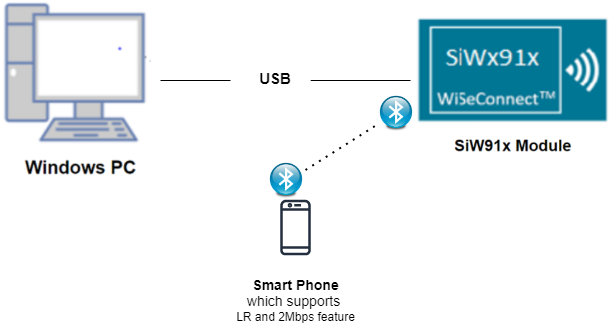
  
**NCP Mode :**   
   
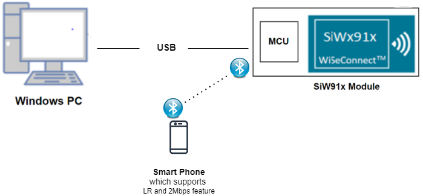
## 3. Application Build Environment

### 3.1 Host Interface

* By default, the application is configured to use the SPI bus for interfacing between Host platforms(STM32F411 Nucleo / EFR32MG21) and the SiWx91x EVK.
* This application is also configured to use the SDIO bus for interfacing between Host platforms(EFM32GG11) and the SiWx91x EVK.

### 3.3 Project Configuration

- **SoC Mode**
  - **Silicon Labs SiWx91x SoC**. Follow the [Getting Started with SiWx91x SoC](https://docs.silabs.com/) to setup the example to work with SiWx91x SoC and Simplicity Studio.
- **NCP Mode**
  - **Silicon Labs EFx32 Host**. Follow the [Getting Started with EFx32](https://docs.silabs.com/rs9116-wiseconnect/latest/wifibt-wc-getting-started-with-efx32/) to setup the example to work with EFx32 and Simplicity Studio.
  - **STM32F411 Host**. Follow the [Getting Started with STM32](https://docs.silabs.com/rs9116-wiseconnect/latest/wifibt-wc-getting-started-with-stm32/) to setup the example to work with STM32 and Keil.
User can find the Radio Board version as given below 
		
### 3.4 Bare Metal/RTOS Support

This application supports bare metal and RTOS environment. By default, the application project files (Keil and Simplicity Studio) are provided with RTOS configuration. To select a bare metal configuration, see [Selecting bare metal](#selecting-bare-metal).

## 4. Application Configuration Parameters

The application can be configured to suit your requirements and development environment. Read through the following sections and make any changes needed.

**4.1** Open `rsi_ble_lr_2mbps.c` file and update/modify following macros,

**4.1.1** User must update the below parameters

- `RSI_DEVICE_DATA_RATE` refers the PHY data rate of the Silicon Labs module to be selected.

- If user configures, **LONG_RANGE**, Silicon Labs module will update PHY data rates to coded PHY data rate. By default it is configured to 500kbps PHY data rate. 

- If user configures, **TWO_MBPS**, Silicon Labs module will update 2Mbps PHY data rates. 
```c
    #define RSI_DEVICE_DATA_RATE                LONG_RANGE```
- `RSI_BLE_DEV_ADDR_TYPE` refers address type of the remote device to connect.
```c
	 #define RSI_BLE_DEV_ADDR_TYPE                         LE_PUBLIC_ADDRESS
``` 
  - Based on the address of the advertising device, Valid configurations are

    - LE_RANDOM_ADDRESS
    - LE_PUBLIC_ADDRESS
    
    **Note:** Depends 
    - LE_PUBLIC_ADDRESS

   **Note:** Depends on the remote device, address type will be changed. 

- `RSI_BLE_DEV_ADDR` refers address of the remote device to connect.
```c
	 #define RSI_BLE_DEV_ADDR                                    "00:23:A7:80:70:B9"
```

- `RSI_REMOTE_DEVICE_NAME` refers the name of remote device to which Silicon Labs device has to connect
```c
	 #define RSI_REMOTE_DEVICE_NAME                              "SILABS"
```

   **Note:**
   Silicon Labs module can connect to remote device by referring either RSI_BLE_DEV_ADDR or RSI_REMOTE_DEVICE_NAME of the remote device. 

   **Power save configuration**

- By default, The Application is configured without power save.
```c	 
	 #define ENABLE_POWER_SAVE 0```
- If user wants to run the application in power save, modify the below configuration. 
```c	 
	 #define ENABLE_POWER_SAVE 1
```

 **4.1.2** The desired parameters are provided below. User can also modify the parameters as per their needs and requirements

- Following are the event numbers for advertising, connection and Disconnection events,
```c
	 #define RSI_APP_EVENT_ADV_REPORT                            0
	 #define RSI_APP_EVENT_CONNECTED                             1
	 #define RSI_APP_EVENT_DISCONNECTED                          2
	 #define RSI_APP_EVENT_PHY_UPDATE_COMPLETE                   3
```

- Following are the non-configurable macros in the application.

- `GLOBAL_BUFF_LEN` refers Number of bytes required by the application and the driver
```c
	 #define GLOBAL_BUFF_LEN                                  15000
```
   

**4.2** Open `rsi_ble_config.h` file and update/modify following macros,
```c
	 #define RSI_BLE_PWR_INX                                   30
	 #define RSI_BLE_PWR_SAVE_OPTIONS                          0 
```	 
   **Opermode command parameters**
```c
	 #define RSI_FEATURE_BIT_MAP                                 FEAT_SECURITY_OPEN
	 #define RSI_TCP_IP_BYPASS                                   RSI_DISABLE
	 #define RSI_TCP_IP_FEATURE_BIT_MAP                          TCP_IP_FEAT_DHCPV4_CLIENT
	 #define RSI_CUSTOM_FEATURE_BIT_MAP                          FEAT_CUSTOM_FEAT_EXTENTION_VALID
	 #define RSI_EXT_CUSTOM_FEATURE_BIT_MAP                      EXT_FEAT_384K_MODE
```	
   **Note:**
   `rsi_ble_config.h` files are already set with desired configuration in 
   respective example folders user need not change for each example. 

## 5. Testing the Application

User has to follow the below steps for the successful execution of the application.

### 5.1 Loading the SiWx91x Firmware

- Refer [Getting started with PC ](https://docs.silabs.com/rs9116/latest/wiseconnect-getting-started) to load the firmware into SiWx91x EVK. The firmware binary is located in `<SDK>/connectivity_firmware/`

### 5.2 Creating the Project and builing the Application
  
- Refer [Getting started with EFX32](https://docs.silabs.com/rs9116-wiseconnect/latest/wifibt-wc-getting-started-with-efx32/), for settin-up EFR & EFM host platforms

#### 5.2.1 Project Creation - SoC Mode : 

- Connect your board. The Si917 compatible SoC board is **BRD4325A**.
- Studio should detect your board. Your board will be shown here.

#### 5.2.2 Project Creation - NCP Mode : 

- Connect your board. The supported NCP boards are: **BRD4180A,BRD4280B**
- Studio should detect your board. Your board will be shown here.

#### 5.2.3 Selecting an example application and generate project

- Go to the 'EXAMPLE PROJECT & DEMOS' tab and select your desired example application
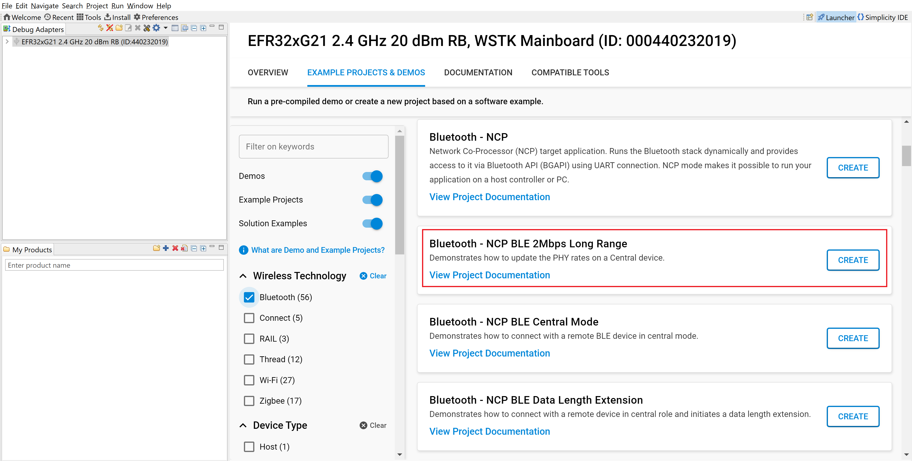
- Click 'Create'. The "New Project Wizard" window appears. Click 'Finish'
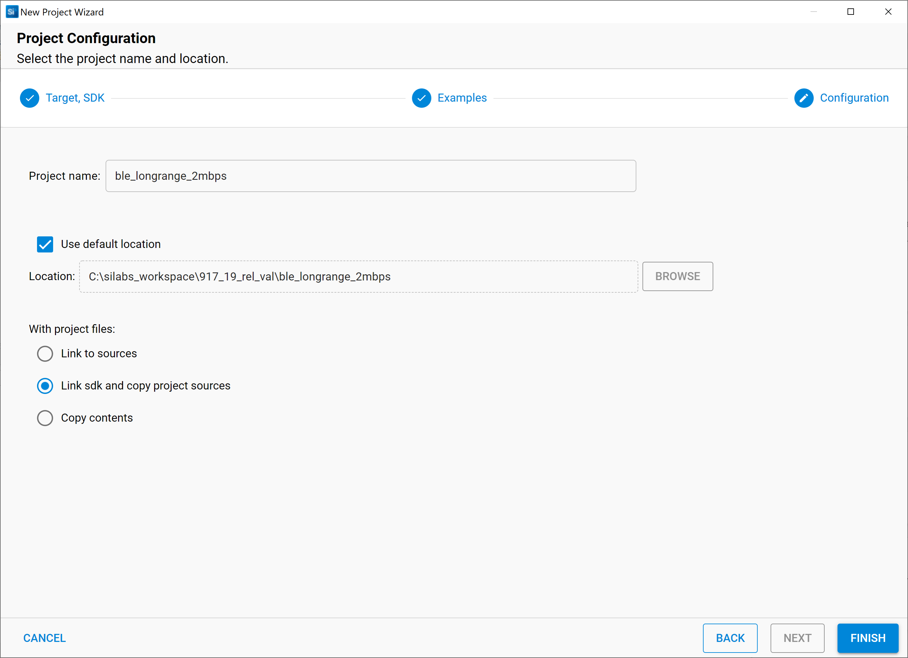
#### 5.2.4 Build Project - SoC Mode

- Once the project is created, right click on project and go to properties → C/C++ Build → Settings → Build Steps
- Add post_build_script_SimplicityStudio.bat file path (SI917_COMBO_SDK.X.X.X.XX\utilities\isp_scripts_common_flash) in build steps settings as shown in below image.
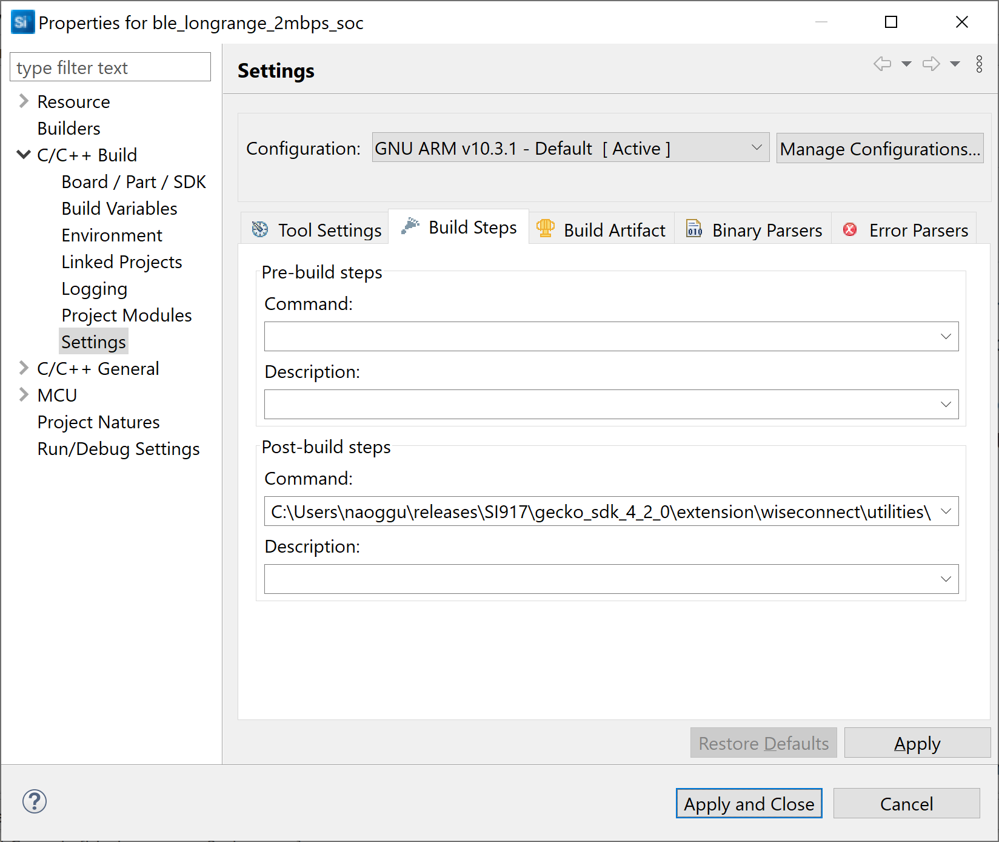
- Check for M4 projects macros in preprocessor settings(RSI_M4_INTERFACE=1)
- Check for 9117 macro in preprocessor settings(CHIP_9117=1).
- Click on the build icon (hammer) to build the project
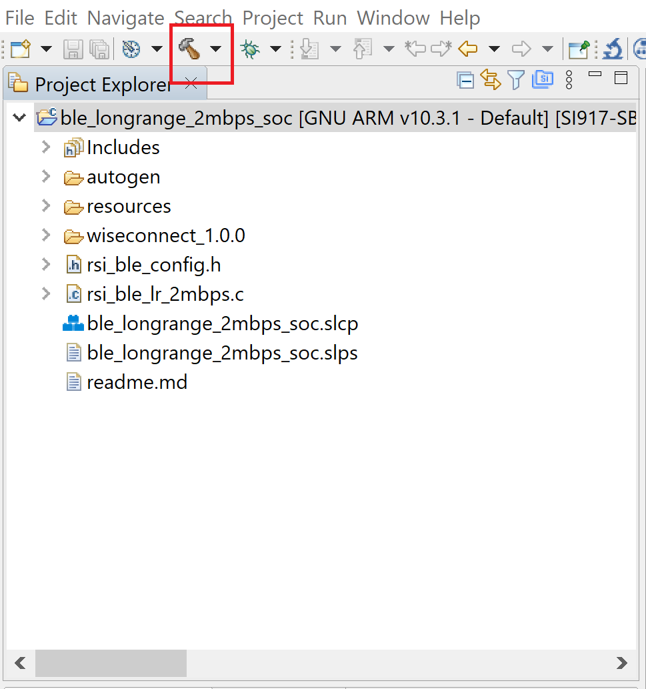
- Successful build output will show as below.
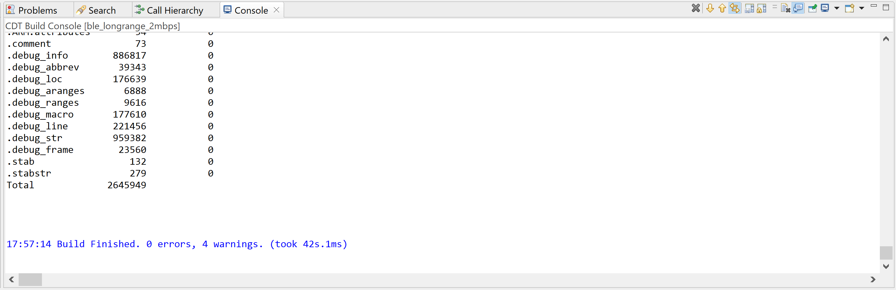
#### 5.2.5 Build Project - NCP Mode :

- Check for 9117 macro in preprocessor settings(CHIP_9117=1).
- Click on the build icon (hammer) to build the project
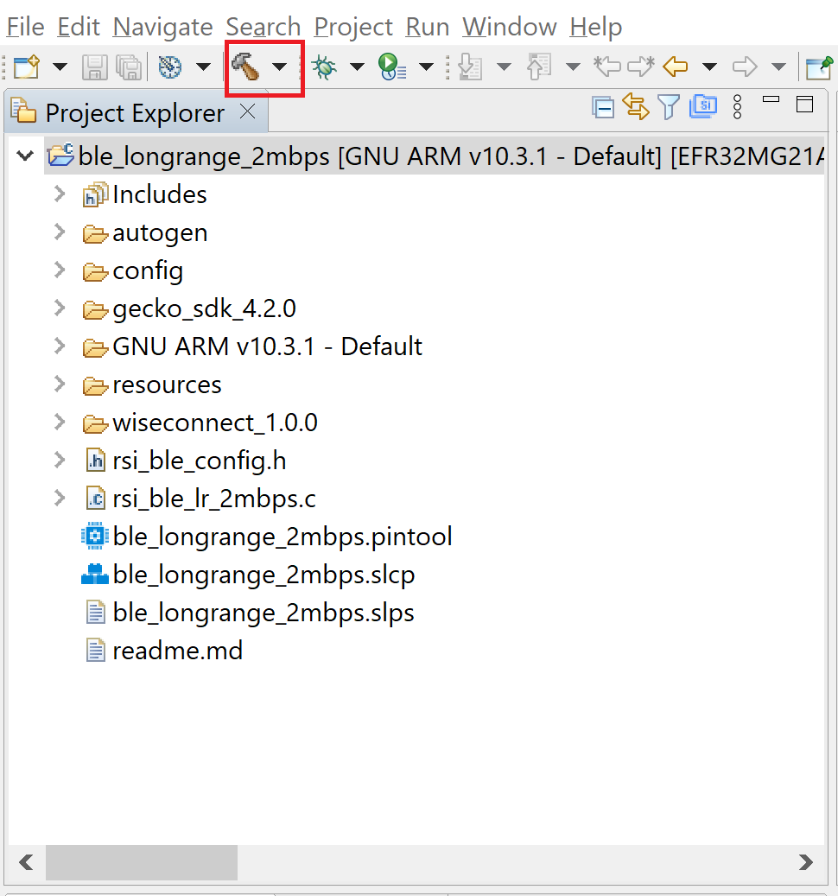
- Successful build output will show as below.

## 6. Program the device

- Once the build was successfull, right click on project and click on Debug As->Silicon Labs ARM Program as shown in below image.
### SoC Mode :
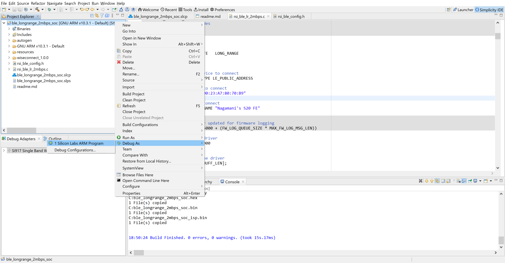
### NCP Mode : 
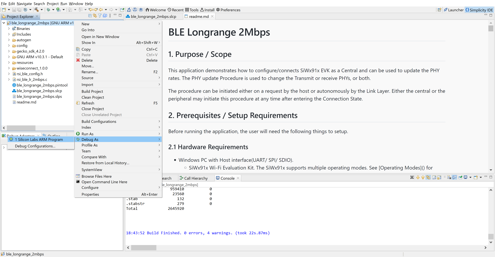
## 6.1 Running the SiWx91x Application

### 6.1.1 Steps to be followed to verify BLE Hear rate profile application as a SERVER

1. Configure the remote BLE device in advertising mode.For remote mobile if connecting using name ensure that the device is named same as the value mentioned in RSI_REMOTE_DEVICE_NAME macro also see to it that Complete local name record is added to advertising data and Scan response data and connectable is ticked in options.
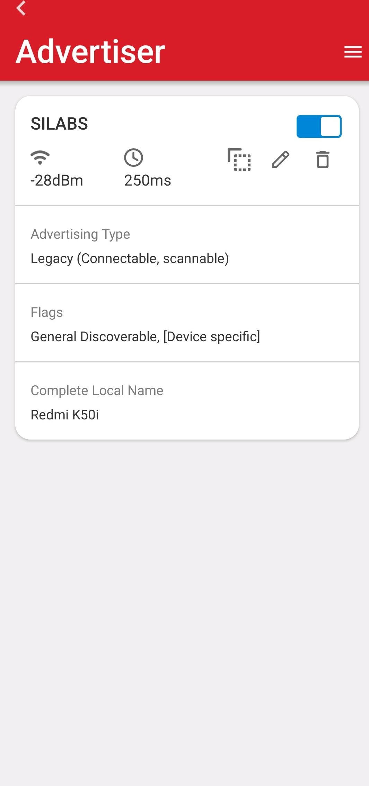
    **Note:** Refer the [Creating New Advertisement Sets](https://docs.silabs.com/bluetooth/5.0/miscellaneous/mobile/efr-connect-mobile-app) for configuring the EFR connect mobile APP as advertiser.

2. Connect any serial console for prints.

3. After the program gets executed, Silicon Labs device tries to connect with the remote device specified in **RSI\_BLE\_DEV\_ADDR** **or RSI\_REMOTE\_DEVICE\_NAME** macro.

4. Clicks on "YES AND OPEN" button and Observe that the connection is established between the desired device and Silicon Labs device.
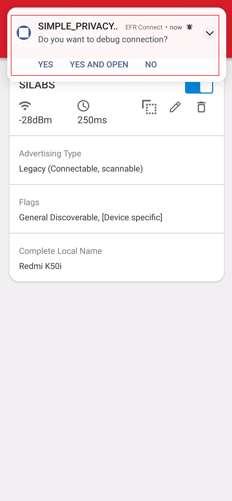 

5. After connection, Silicon Labs device will read PHY rate of the remote device and set PHY rate of the remote device.
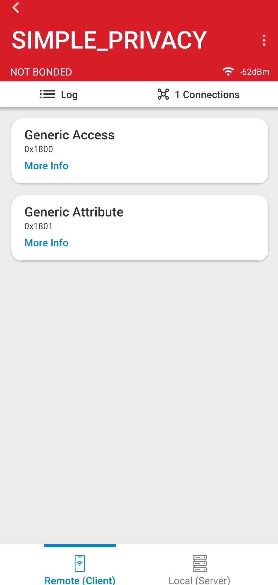
6. Observe PHY update complete event after setting PHY rate.

7. When Silicon Labs module is configured as **LONG_RANGE** PHY data rate, the Slicon Labs module and remote device updates its PHY data rate to 500kbps and prints in teraterm looks as shown below.   
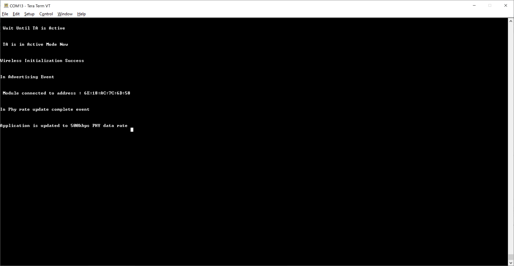
8. When Silicon Labs module is configured as **TWO_MBPS** PHY data rate, the Slicon Labs module and remote device updates its PHY data rate to 1mbps and prints in teraterm looks as shown below.   
    

9. Refer the below images for console prints
- For SOC the console prints are shown below
  - Long Range
   
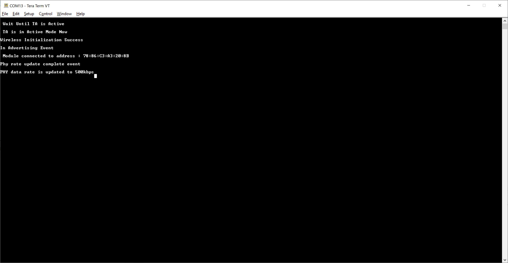
  - 2Mbps
   

- For NCP the console prints are shown below

  - Long Range
   
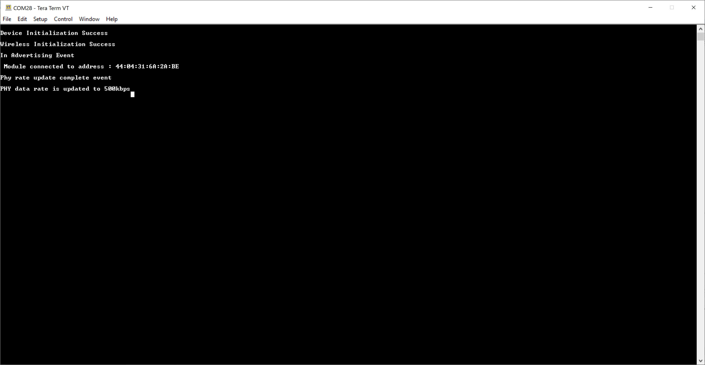
  - 2Mbps
   

## 7. Observing the output prints on serial terminal

### 7.1 SoC Mode:
- Connect USB to UART connector Tx and GND pins to WSTK radio board.

   - Connect Tx(Pin-6) to P27 on WSTK
   - Connect GND(Pin 8 or 10) to GND on WSTK
      
      
- Prints can see as below in any Console terminal

   
### 7.2 NCP Mode:
- Prints can see as below in any Console terminal

   
## 8. Selecting Bare Metal
- The application has been designed to work with FreeRTOS and Bare Metal configurations. By default, the application project files (Simplicity studio) are configured with FreeRTOS enabled. The following steps demonstrate how to configure Simplicity Studio to test the application in a Bare Metal environment.

### 8.1 Bare Metal with Simplicity Studio
- Open project in Simplicity Studio
- Right click on the project and choose 'Properties'
- GO to 'C/C++ Build' | 'Settings' | 'GNU ARM C Compiler' | 'Preprocessor' and remove macro 'RSI_WITH_OS=1'
- Click on 'Apply' and 'OK' to save the settings
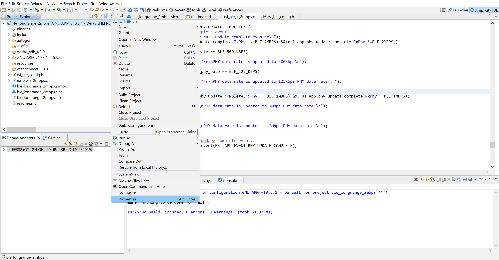
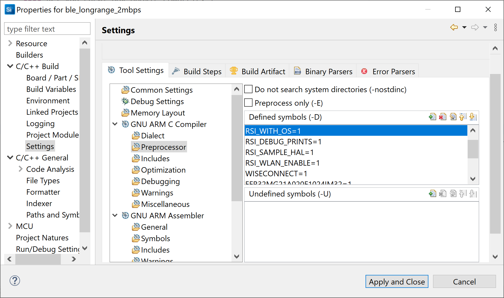
### 8.2 Bare Metal with Keil
- Open project in Keil IDE and click on 'Options for Target'
- Go to 'C/C++' tab and remove 'RSI_WITH_OS' macro present under Preprocessor Symbols
- Click on 'OK' button to save the settings
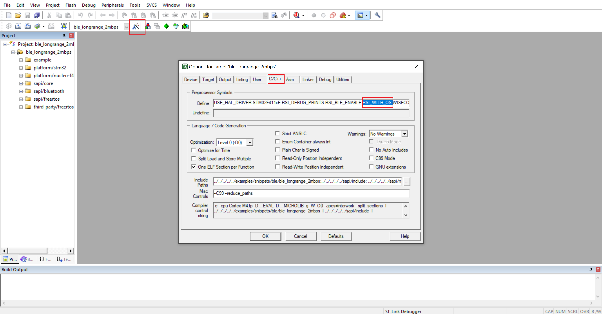