# BLE Multiconnection GATT Test

## 1. Purpose / Scope

The Application demonstrates how to configure SiWx91x EVK in central/peripheral modes and then connect with multiple peripherals/centrals.

It provides user to configure secure connection with central and peripheral remote devices and support data transfers. 

This also displays all the remote GATT profiles and service characteristics logs of connected remote device.

## 2. Prerequisites / Setup Requirements

Before running the application, the user will need the following things to setup.

### 2.1 Hardware Requirements

- Windows PC.
- SiWx91x Wi-Fi Evaluation Kit. The SiWx91x supports multiple operating modes. See [Operating Modes]() for details.
  - **SoC Mode**: 
      - Silicon Labs [BRD4325A](https://www.silabs.com/)
  - **NCP Mode**:
      - Silicon Labs [(BRD4180A, BRD4280B)](https://www.silabs.com/); **AND**
      - Host MCU Eval Kit. This example has been tested with:
        - Silicon Labs [WSTK + EFR32MG21](https://www.silabs.com/development-tools/wireless/efr32xg21-bluetooth-starter-kit)
        - Silicon Labs [WSTK + EFM32GG11](https://www.silabs.com/development-tools/mcu/32-bit/efm32gg11-starter-kit)
- Smart phone/tablet with BLE Application
- BLE peripheral device
- BLE central device

### 2.2 Software Requirements
    
- Embedded Development Environment

   - For Silicon Labs EFx32, use the latest version of [Simplicity Studio](https://www.silabs.com/developers/simplicity-studio)
   
- Download and install the Silicon Labs [EFR Connect App](https://www.silabs.com/developers/efr-connect-mobile-app) in the android smart phones for testing BLE applications. Users can also use their choice of BLE apps available in Android/iOS smart phones.

### 2.3 Setup Diagram:
   
**SoC Mode :**   
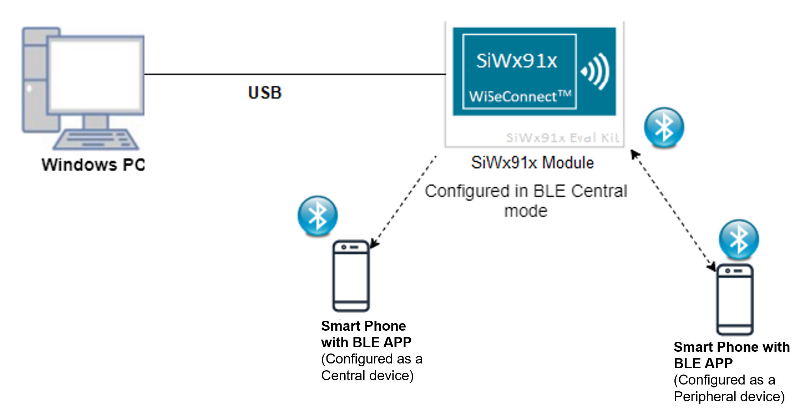
  
**NCP Mode :**  
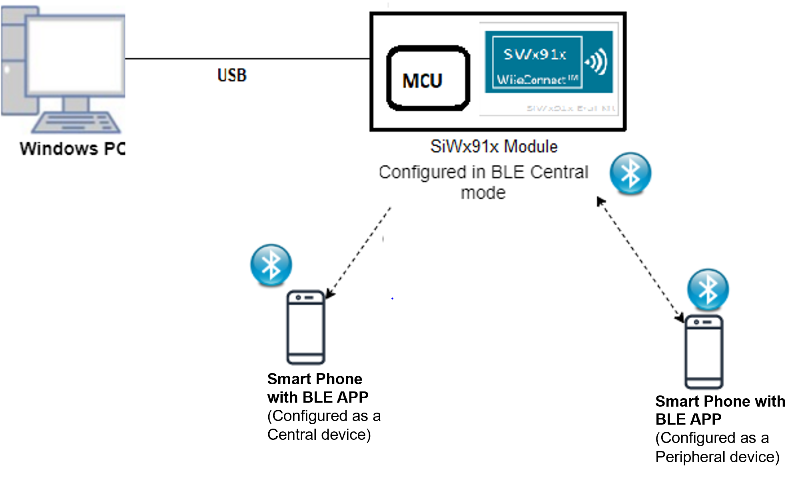
## 3. Application Build environment

### 3.1 Project Configuration

- **SoC Mode**
  - **Silicon Labs SiWx91x SoC**. Follow the [Getting Started with SiWx91x SoC](https://docs.silabs.com/) to setup the example to work with SiWx91x SoC and Simplicity Studio.
- **NCP Mode**
  - **Silicon Labs EFx32 Host**. Follow the [Getting Started with EFx32](https://docs.silabs.com/rs9116-wiseconnect/latest/wifibt-wc-getting-started-with-efx32/) to setup the example to work with EFx32 and Simplicity Studio.
  
### 3.2 NCP Mode - Host Interface 

By default, the application is configured to use the SPI bus for interfacing between Host platforms(EFR32MG21) and the SiWx91x EVK.

### 3.3 Bare Metal/RTOS Support

This application supports bare metal and RTOS environment. By default, the application project files (Keil and Simplicity Studio) are provided with RTOS configuration. To select a bare metal configuration, see [Selecting bare metal](#selecting-bare-metal).
	

## 4. Application Configuration Parameters

The application can be configured to suit your requirements and development environment. Read through the following sections and make any changes needed.

**4.1** open `rsi_ble_config.h` file provided in the SDK at `examples/snippets/ble/ble_multiconnection_gatt_test` update/modify following macros.

**4.1.1** User must update the below parameters

   To select number of BLE connections, configure below macros.

   Set below macro to required peripheral connections.

	 #define RSI_BLE_MAX_NBR_SLAVES   1

   Set below macro to required master connections.

	 #define RSI_BLE_MAX_NBR_MASTERS   1
 

   ` Note: Maximum no. of  RSI_BLE_MAX_NBR_MASTERS and RSI_BLE_MAX_NBR_SLAVES can be configured to max '1'.`

   If CONNECT_OPTION is set to CONN_BY_NAME, configure below macros.

	 #define CONNECT_OPTION CONN_BY_NAME //CONN_BY_NAME or CONN_BY_ADDR

   To identify remote device with BD Address/device name.

   Add the remote BLE device name to connect

	 #define RSI_REMOTE_DEVICE_NAME1                       "SILABS_DEV"
	 #define RSI_REMOTE_DEVICE_NAME2                       "slave22"
	 #define RSI_REMOTE_DEVICE_NAME3                       "slave3"

   If CONNECT_OPTION is set to CONN_BY_ADDR, configure the below macros.

   Configure the address type of remote device as either Public Address or Random Address

	 #define RSI_BLE_DEV_ADDR_TYPE LE_PUBLIC_ADDRESS //!LE_PUBLIC_ADDRESS or LE_RANDOM_ADDRESS

   Add the BD Address of remote BLE device to connect

	 #define RSI_BLE_DEV_1_ADDR "00:1A:7D:DA:71:16"
	 #define RSI_BLE_DEV_2_ADDR "00:1A:7D:DA:71:74"
     #define RSI_BLE_DEV_3_ADDR "00:1A:7D:DA:73:13"

**4.1.2** The desired parameters are provided below. User can also modify the parameters as per their needs and requirements.

   Configure below macros to select each connection configurations,

   **Master1 configurations: (where XX=M1)**

   Set below macro to enable secure connection between Silicon Labs device(peripheral) and remote ble device(central)
	 #define SMP_ENABLE_XX         0

   //By default this macro is set to '0'

   Set below macro to add remote device to whitelist

	 #define ADD_TO_WHITELIST_XX     0

   //By default this macro is set to '0'

   Set below macro to discover remote profiles.

	 #define PROFILE_QUERY_XX     1

   //By default this macro is set to '1'

   Set below macro to enable data transfer between devices

 	 #define DATA_TRANSFER_XX     1

   //By default this macro is set to '1'

   To select the type of data transfer configure below macros

   Set below macro to receive 'gatt notifications' from remote device.

	 #define RX_NOTIFICATIONS_FROM_XX     0

   //By default this macro is set to '1'

     Note: Make sure to set below macros to 0 #define  RX_INDICATIONS_FROM_XX  0 //Set this to 0 |
  

   Set below macro to receive 'gatt indications' from remote device.

	 #define RX_INDICATIONS_FROM_XX     0

   //By default this macro is set to '0'

   Set below macro to Transmit 'gatt notifications' to remote device.

	 #define TX_NOTIFICATIONS_TO_XX     1

   //By default this macro is set to '1'

   **Note:**
   Make sure to set below macros to 0
   
	 #define  TX_WRITES_TO_XX        0 //Set this to 0
	 #define  TX_WRITES_NO_RESP_TO_XX    0 //Set this to 0
	 #define  TX_INDICATIONS_TO_XX    0 //Set this to 0 

   Set below macro to Transmit 'gatt write with response' to remote device.

	 #define TX_WRITES_TO_XX     0

   //By default this macro is set to '0'

   Set below macro to Transmit 'gatt write without response' to remote device.

	 #define TX_WRITES_NO_RESP_TO_XX     0

   //By default this macro is set to '0'

   Set below macro to Transmit 'gatt indications to remote device.

	 #define TX_INDICATIONS_TO_XX       0

   //By default this macro is set to '0'

   To select data length extension for each connection configure below macro

   Set below macro to enable data length extension

	 #define DLE_ON_XX             0

   //By default this macro is set to '0'

## 5. Testing the Application

- Follow the below steps for the successful execution of the application.

### 5.1 Loading the SiWx91x Firmware

- Refer [Getting started with a PC](https://docs.silabs.com/rs9116/latest/wiseconnect-getting-started) to load the firmware into SiWx91x EVK. The firmware file is located in `<SDK>/connectivity_firmware/`

### 5.2 Creating the Project and builing the Application
  
- Refer [Getting started with EFX32](https://docs.silabs.com/rs9116-wiseconnect/latest/wifibt-wc-getting-started-with-efx32/), for settin-up EFR & EFM host platforms

#### 5.2.1 Project Creation - SoC Mode : 

- Connect your board. The Si917 compatible SoC board is **BRD4325A**.
- Studio should detect your board. Your board will be shown here.

#### 5.2.2 Project Creation - NCP Mode : 

- Connect your board. The supported NCP boards are: **BRD4180A,BRD4280B**
- Studio should detect your board. Your board will be shown here.

#### 5.2.3 Selecting an example application and generate project

- Go to the 'EXAMPLE PROJECT & DEMOS' tab and select your desired example application
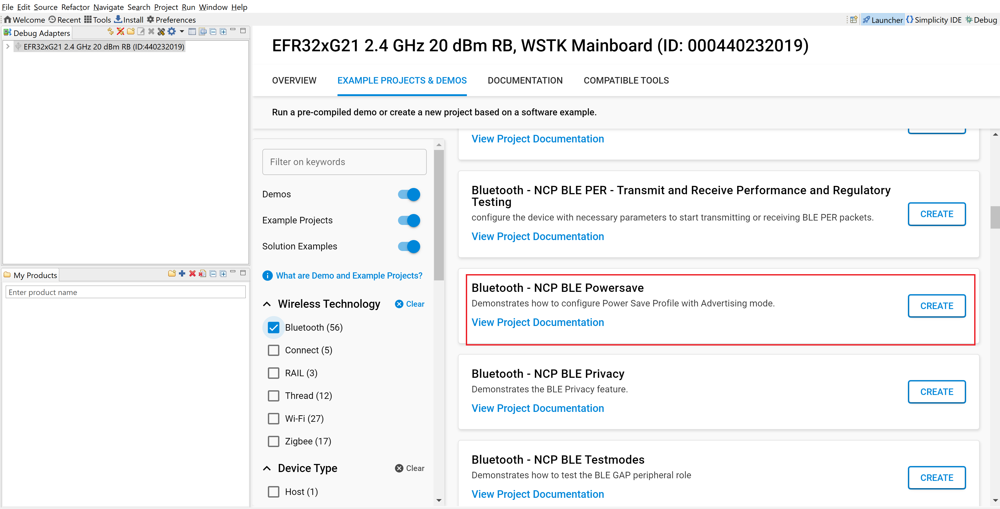
- Click 'Create'. The "New Project Wizard" window appears. Click 'Finish'
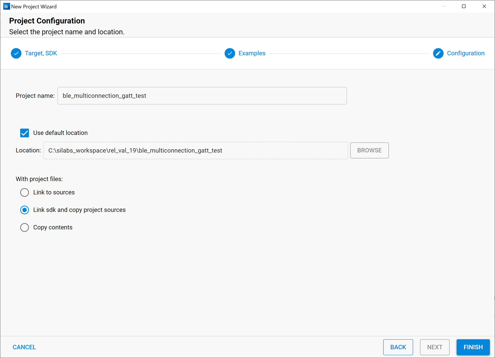
#### 5.2.4 Build Project - SoC Mode

- Once the project is created, right click on project and go to properties → C/C++ Build → Settings → Build Steps
- Add post_build_script_SimplicityStudio.bat file path (SI917_COMBO_SDK.X.X.X.XX\utilities\isp_scripts_common_flash) in build steps settings as shown in below image.
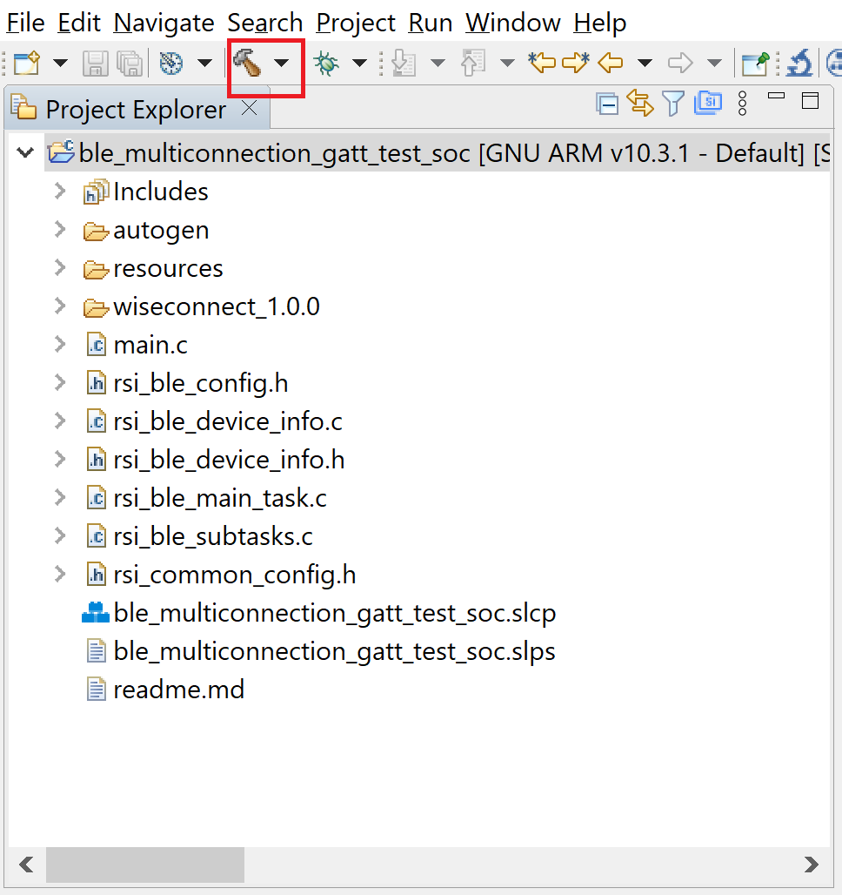
- Check for M4 projects macros in preprocessor settings(RSI_M4_INTERFACE=1)
- Check for 9117 macro in preprocessor settings(CHIP_9117=1).
- Click on the build icon (hammer) to build the project

- Successful build output will show as below.
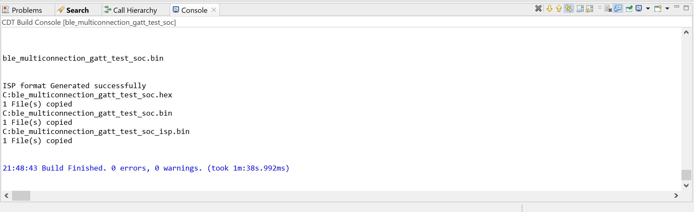
#### 5.2.5 Build Project - NCP Mode :

- Check for 9117 macro in preprocessor settings(CHIP_9117=1).
- Click on the build icon (hammer) to build the project
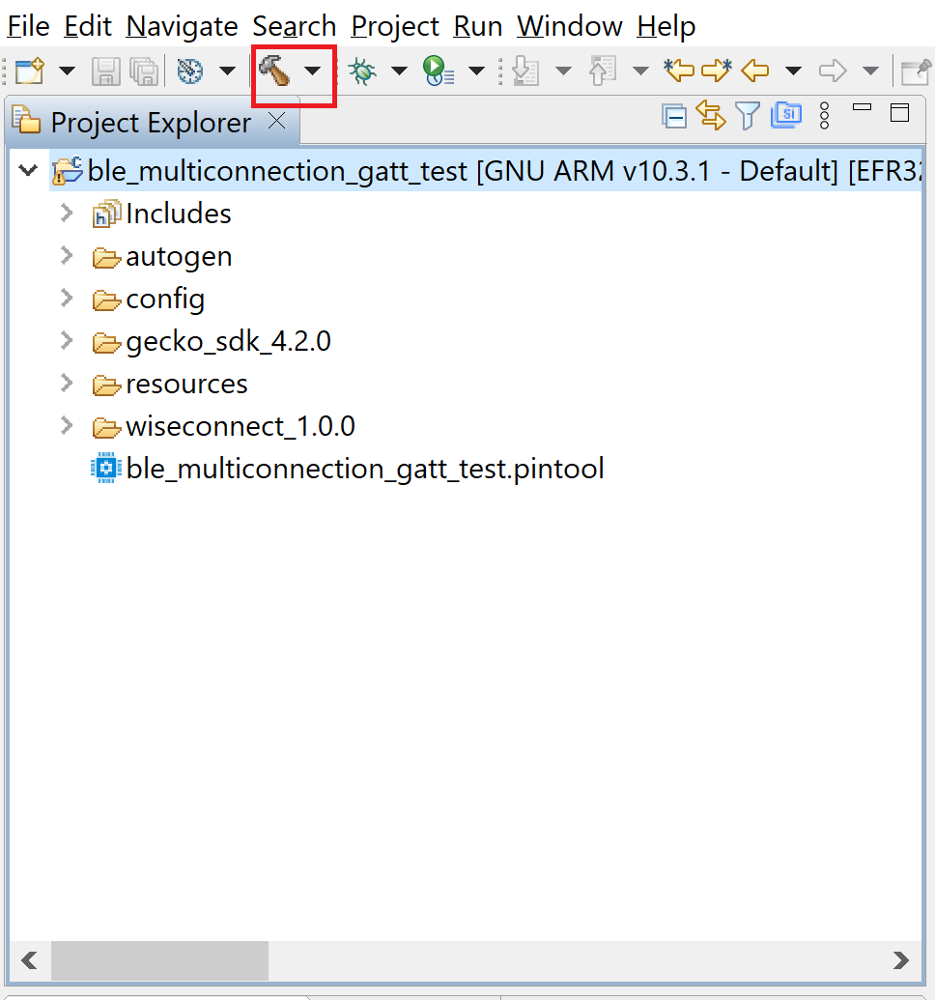
- Successful build output will show as below.
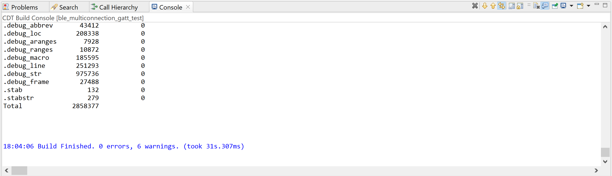
## 6. Program the device

- Once the build was successfull, right click on project and click on Debug As->Silicon Labs ARM Program as shown in below image.
### SoC Mode :
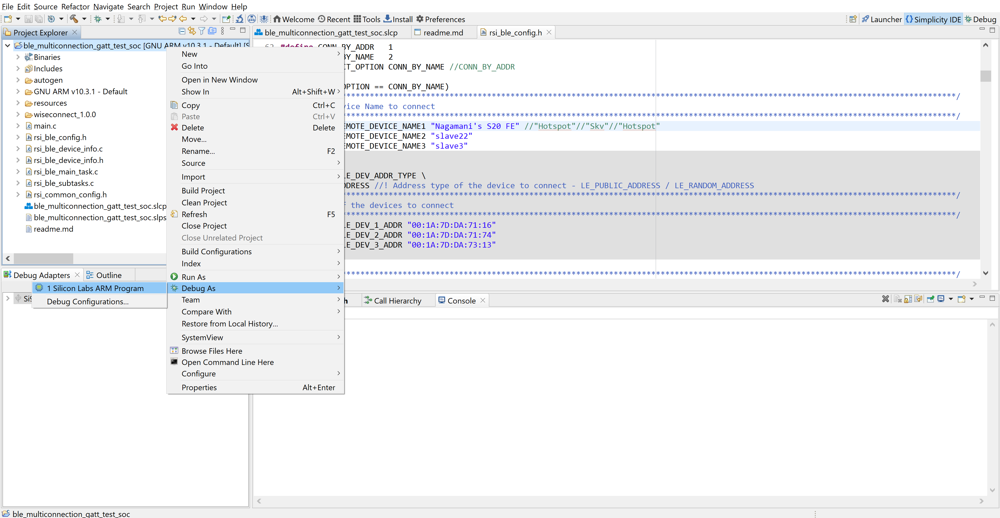
### NCP Mode : 
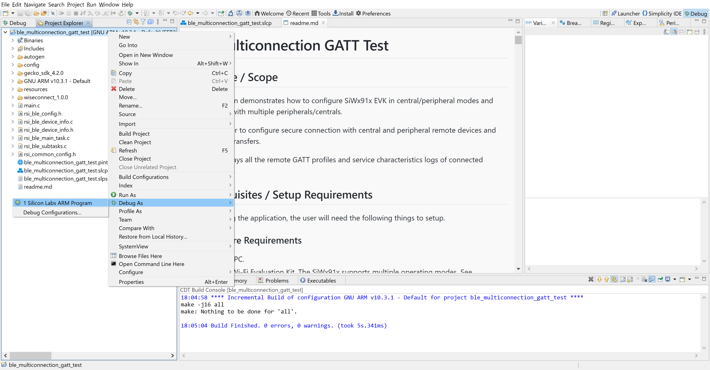
### 6.1 Running the SiWx91x Application
 
1. Configure the remote ble devices in peripheral and put it in advertising mode and/or in central and put in scanning mode.

   **Note:** Refer the [Creating New Advertisement Sets](https://docs.silabs.com/bluetooth/5.0/miscellaneous/mobile/efr-connect-mobile-app) for configuring the EFR connect mobile APP as advertiser.
2. Connect any serial console for prints.

3. Silicon Labs device is configured as GATT server with the below user-defined services.

   | S.No |UUID size |Primary service UUID | Characteristic service UUID | Property|
   |------|---|------|------|-----|
   |1|16-bit|0xAABB | 0x1AA1 | Read, Write & Notify|
   |2|128-bit|0x6A4E3304-667B-11E3-949A-0800200C9A66 | 0x6A4E3304-667B-11E3-949A-0800200C9A66 | Write with no response|
   |3|16-bit| 0x1AA1|0x1BB1 | Read & indicate|

4. Silicon Labs device is in scanning and advertising mode.

5. After the program gets executed, Silicon Labs device tries to connect with the remote device name specified in
   the macro **RSI_REMOTE_DEVICE_NAME1**or **RSI_BLE_DEV_1_ADDR**. 

6. Observe that the connection is established between the desired device and Silicon Labs device. 

7. When the connection is established with the remote device, the Silicon Labs device fetch the GATT profiles and characteristics and also prints the same on the serial teriminal.

8. If user configures SMP pairing in the specified macro **SMP_ENABLE_XX**, after successful connection between Silicon Labs device and remote device flow of commands are as below:

   a. Central device will initiate SMP pairing
		
   b. Peripheral device gives SMP response.

   c. Based on the configured IO capability, the Silicon Labs device tries to establish the SMP connection.

9. When the SMP connection is established successfully, the host receives an SMP encrypt enabled event. If not, Silicon Labs Device sends an SMP failure event to the host.

10. After successful program execution, if the Silicon Labs device connects to a **remote BLE peripheral device**, prints in teraterm looks as shown below.
   
   
11. After successful program execution, if the Silicon Labs device connects to **remote BLE central device**, prints in teraterm looks as shown below.   

   
   
12. To check data transfer, enable Gatt notifications of Module on service characteristic having UUID 0x1AA1, where the Silicon Lab device as a peripheral device.

13. If enabled, module continuously transmits notifications which can be seen on remote device
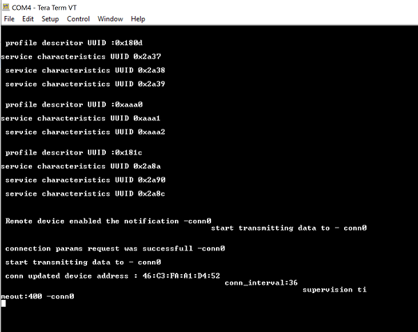
## 7. Observing the output prints on serial terminal

### 7.1 SoC Mode:
- Connect USB to UART connector Tx and GND pins to WSTK radio board.

   - Connect Tx(Pin-6) to P27 on WSTK
   - Connect GND(Pin 8 or 10) to GND on WSTK

      
- Prints can see as below in any Console terminal
      
### 7.2 NCP Mode:
- Prints can see as below in any Console terminal
   
## 8. Selecting Bare Metal
- The application has been designed to work with FreeRTOS and Bare Metal configurations. By default, the application project files (Simplicity studio) are configured with FreeRTOS enabled. The following steps demonstrate how to configure Simplicity Studio to test the application in a Bare Metal environment.

### 8.1 Bare Metal with Simplicity Studio
- Open the project in Simplicity Studio
- Right click on the project and choose 'Properties'
- Go to 'C/C++ Build' | 'Settings' | 'GNU ARM C Compiler' | 'Symbols' and remove macro 'RSI_WITH_OS=1'
- Select 'Apply' and 'OK' to save the settings
   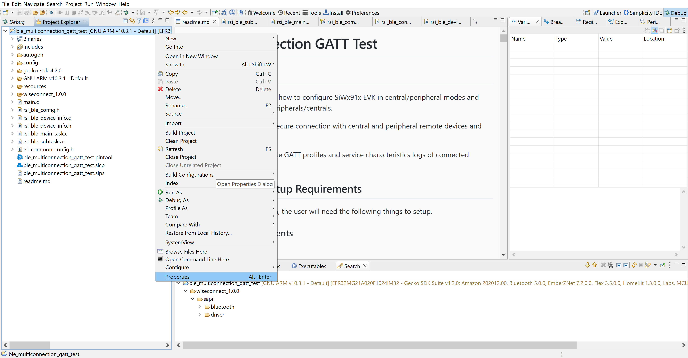 

   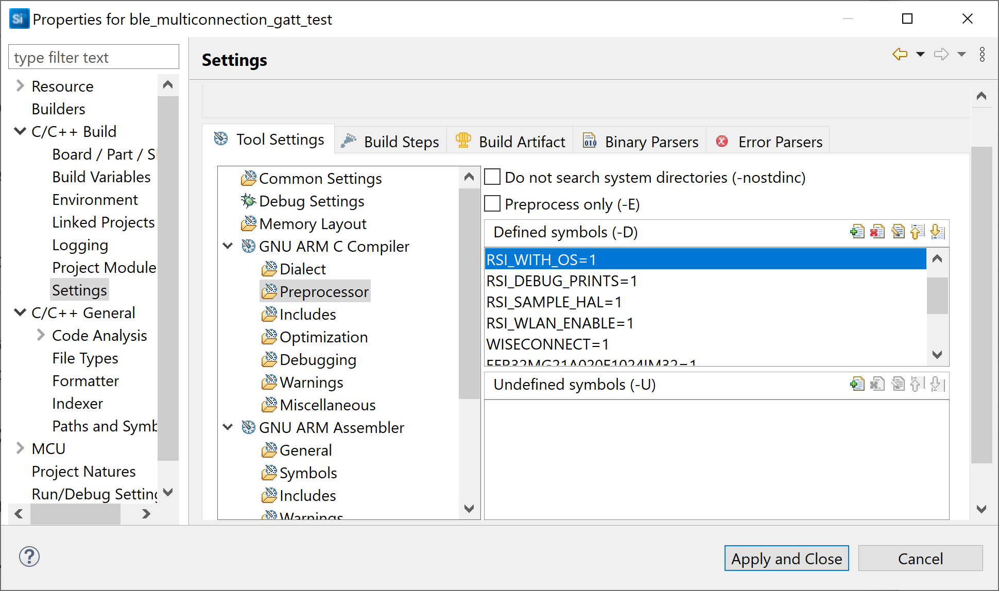
### 8.2 Bare Metal with Keil
- Open project in Keil IDE and click on 'Options for Target'
- Go to 'C/C++' tab and remove 'RSI_WITH_OS' macro present under Preprocessor Symbols
- Click on 'OK' button to save the settings
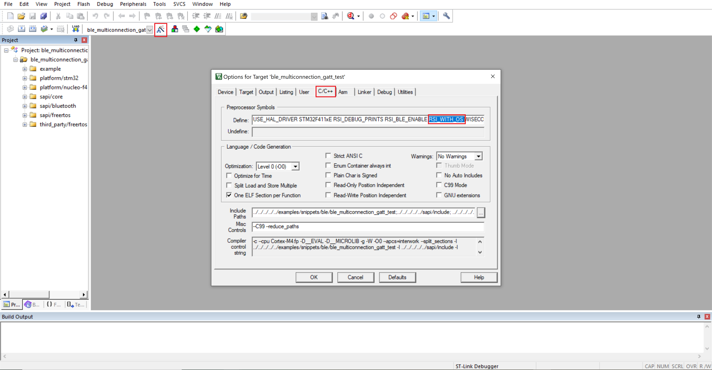