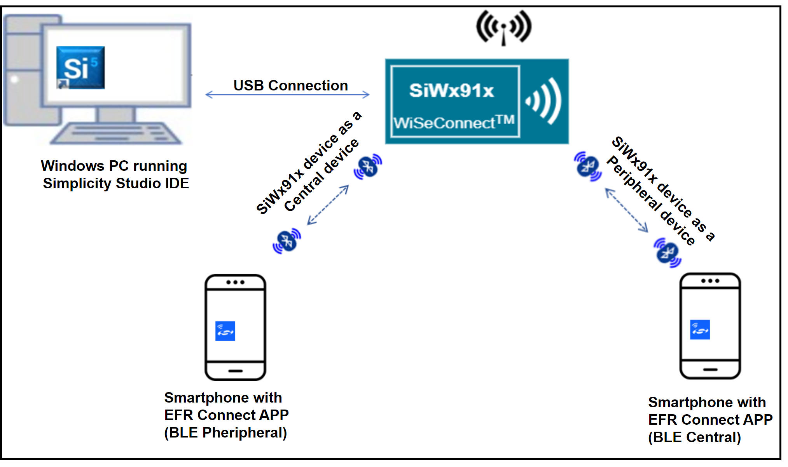
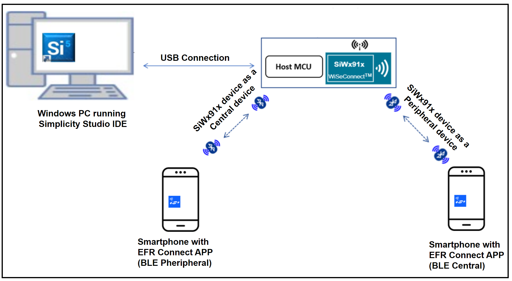
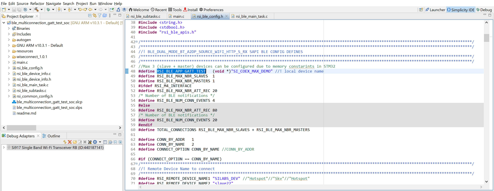
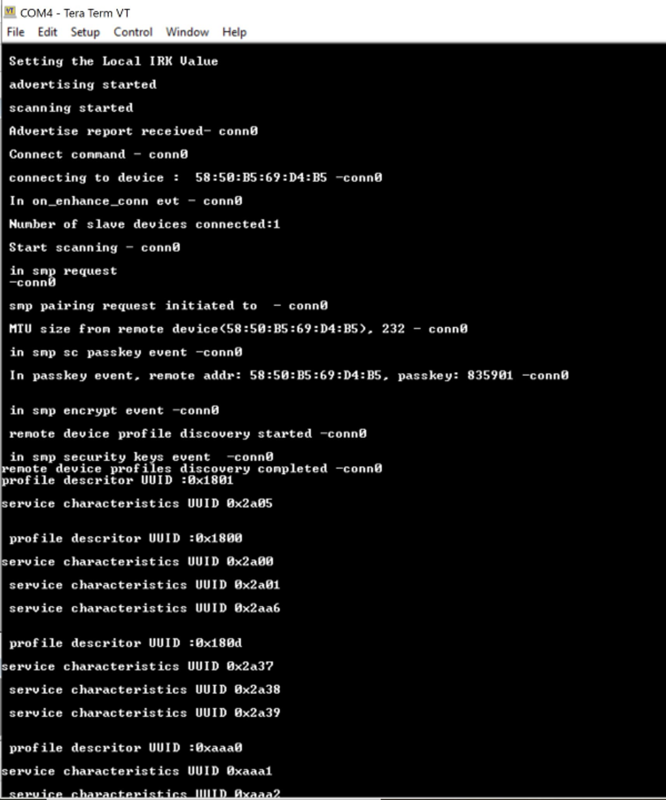
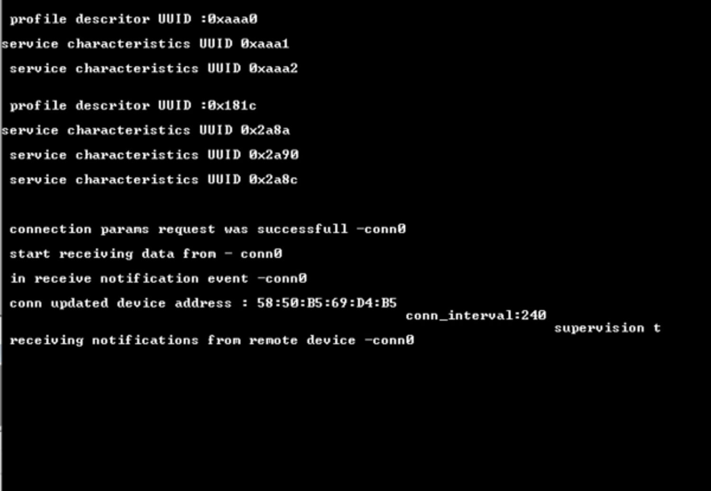
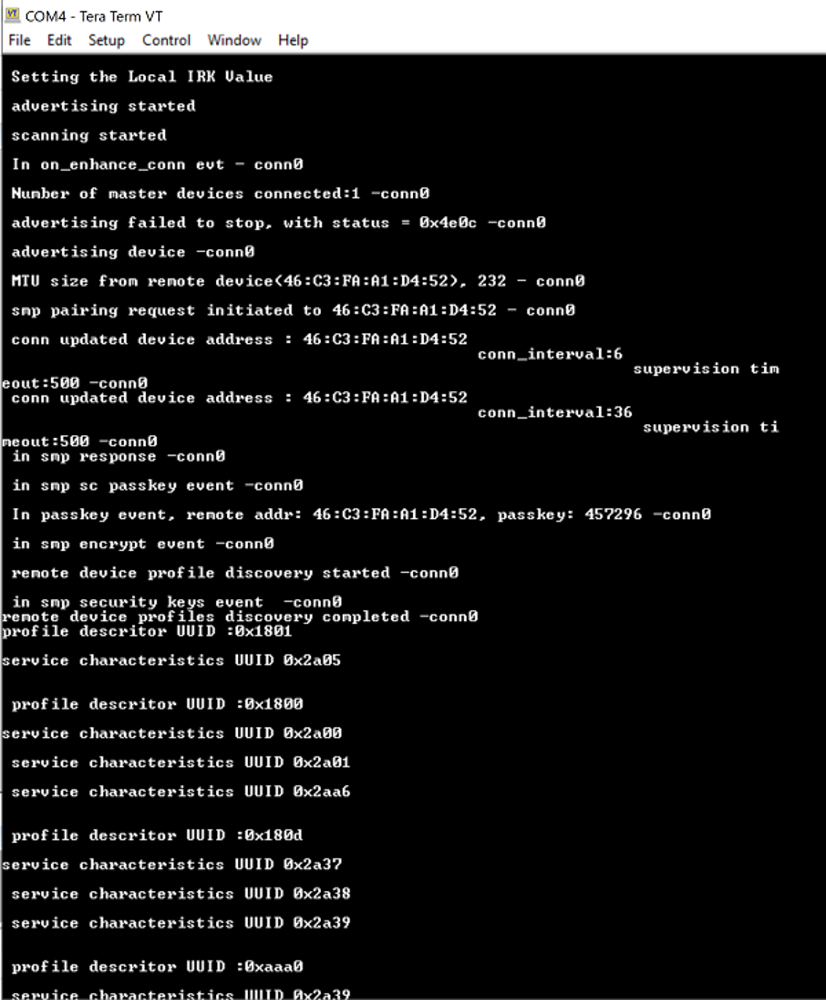

# BLE Multiconnection GATT Test

## **1 Introduction**

The Application demonstrates how to configure SiWx91x EVK in central/peripheral modes and then connect with multiple peripherals/centrals.

It provides user to configure secure connection with central and peripheral remote devices and support data transfers. 

This also displays all the remote GATT profiles and service characteristics logs of connected remote device.

## **2 Prerequisites**

For this application, you will need the following:
### **2.1 Hardware Requirements**

- A Windows PC

#### **2.1.1 SoC** 

   - Silicon Labs SiWx917 PK6030A SoC Kit which includes
      - BRD4001A/BRD4002A Wireless Starter Kit Mainboard
      - BRD4325A Radio Board
   - USB TO UART converter or TTL cable
   
#### **2.1.2 NCP**

   - Silicon Labs BRD8036A Si917 QMS SB Expansion Board
   - [Silicon Labs SLWSTK6006A EFR32xG21 Wireless Starter Kit](https://www.silabs.com/development-tools/wireless/efr32xg21-wireless-starter-kit) which includes
      - BRD4001A/BRD4002A Wireless Starter Kit Mainboard
      - BRD4180A/BRD4180B Radio Board
               
### **2.2 Software Requirements**

- Simplicity Studio IDE
   - To download and install the Simplicity Studio IDE, refer to the **Simplicity Studio IDE Set up** section in ***Getting started with SiWx91x*** guides.

- SiWx917_WiSeConnect_SDK.X.X
  
- [EFR connect Mobile APP](https://www.silabs.com/developers/efr-connect-mobile-app)

- Tera Term software or any other serial terminal software - for viewing application prints

## **3 Setup diagram**

### **3.1 SoC**   
  
### **3.2 NCP** 
   
**NOTE**: 
- The Host MCU platform (EFR32xG21) and the SiWx91x interact with each other through the SPI interface.

## **4 Setup**

### **4.1 SoC/NCP** 

- Follow the**Hardware connections and Simplicity Studio IDE Set up**  section in the respective ***Getting Started with SiWx91x*** guides to make the hardware connections and add the SiWx91x COMBO SDKs to Simplicity Studio IDE.

### **4.2 Loading the SiWx91x Firmware**

- Load the latest firmware into SiWx91x module, which is located in the `<SDK>/connectivity_firmware/` path as described in the **SiWx91x Firmware Update** section in the respective ***Getting started with SiWx91x*** guides.   

## **5 Project Creation**
To create the BLE central example project in the Simplicity Studio IDE, follow the **Project Creation** section in the respective ***Getting started with SiWx91x*** guides. 
   - For SoC, choose the **Bluetooth - SoC BLE central Mode** example.
   - For NCP, choose the **Bluetooth - NCP BLE central Mode** example.


## **6 Application configuration**

The application can be configured to suit you requirements and development environment. Go through the following sections and make any changes if needed. 

1. In the Project explorer pane of the IDE, expand the **ble\_multiconnection\_gatt\_test** folder and open the **rsi\_ble\_config.h** file. Configure the following parameters based on your requirements.    


- **Multi device connection parameters**
   ```c
   // RSI_BLE_APP_GATT_TEST refers to the Silicon Labs device name
   #define RSI_BLE_APP_GATT_TEST   (void *)"SI_COEX_MAX_DEMO"

   //RSI_BLE_MAX_NBR_SECONDARY_DEVICES refers to the number of Secondary device connections
   #define RSI_BLE_MAX_NBR_SECONDARY_DEVICES  1

   //RSI_BLE_MAX_NBR_MAIN_DEVICES refers to the number of main device connections
   #define RSI_BLE_MAX_NBR_MAIN_DEVICES   1
   ```      
   **Note:** Maximum no. of  RSI_BLE_MAX_NBR_MAIN_DEVICES and RSI_BLE_MAX_NBR_SECONDARY_DEVICES can be configured to max '1'.
- **Remote Peripheral device parameters**
   ```c
   //CONNECT_OPTION refers to the type of connection, valid configurations are CONN_BY_ADDR and CONN_BY_NAME
   #define CONNECT_OPTION CONN_BY_NAME 

   //RSI_REMOTE_DEVICE_NAMEX refers to the remote Peripheral device name
   #define RSI_REMOTE_DEVICE_NAME1 "SILABS_DEV"
   #define RSI_REMOTE_DEVICE_NAME2 "slave22"
   #define RSI_REMOTE_DEVICE_NAME3 "slave3"

   //RSI_BLE_DEV_ADDR_TYPE refers to the remote Peripheral device address type
   #define RSI_BLE_DEV_ADDR_TYPE LE_PUBLIC_ADDRESS

   //RSI_BLE_DEV_X_ADDR refers to the remote Peripheral device address
   #define RSI_BLE_DEV_1_ADDR "00:1A:7D:DA:71:16"
   #define RSI_BLE_DEV_2_ADDR "00:1A:7D:DA:71:74"
   #define RSI_BLE_DEV_3_ADDR "00:1A:7D:DA:73:13"

   ```

- **Specific Remote Periperal device configuration paramters**    
**Note:** Where XX refers to M1 (or) M2
   ```c
   //set below macro to enable secure connection
   #define SMP_ENABLE_XX 0

   // Add remote device to whitelist
   #define ADD_TO_WHITELIST_XX 0
   
   // set below macro to discover remote profiles
	#define PROFILE_QUERY_XX 1
	
	// set below macro to perform data transfer
	#define DATA_TRANSFER_XX 1
	
	//configure below macros to select type of data transfer
	// set below macro to receive 'gatt notifications' from remote device
	#define RX_NOTIFICATIONS_FROM_XX 0
	
	// set below macro to receive 'gatt indications' from remote device
	#define RX_INDICATIONS_FROM_XX 0
	
	// set below macro to Transmit 'gatt notifications' to remote device
	#define TX_NOTIFICATIONS_TO_XX 1
	
	// set below macro to Transmit 'gatt write with response' to remote device
	#define TX_WRITES_TO_XX 0
	
	// set below macro to Transmit 'gatt write without response' to remote device
	#define TX_WRITES_NO_RESP_TO_XX 0
	
	// set below macro to Transmit 'gatt indications' to remote device
	#define TX_INDICATIONS_TO_XX 0
	
	// Configure below macro to select data length extension ON/OFF
	#define DLE_ON_XX 0

   // Configure below macros to select connection paramaters while data transfer
	#define CONN_INTERVAL_XX            36 //! for conn interval of 45ms
	#define CONN_LATENCY_XX             0
	#define CONN_SUPERVISION_TIMEOUT_XX 400
   ```

- **Specific Remote Central device configuration paramters**      
**Note:** Where YY refers to S1 (or) S2 (or) S3
   ```c
   // configure below macro to enable secure connection
	#define SMP_ENABLE_YY 0

	// Add remote device to whitelist
	#define ADD_TO_WHITELIST_YY 0

	// configure below macro to discover remote profiles
	#define PROFILE_QUERY_YY 1

	// configure below macro to perform data transfer
	#define DATA_TRANSFER_YY 1

	//configure below macros to select type of data transfer
	// set below macro to receive 'gatt notifications' from remote device
	#define RX_NOTIFICATIONS_FROM_YY 1

	// set below macro to receive 'gatt indications' from remote device
	#define RX_INDICATIONS_FROM_YY 0

	// set below macro to Transmit 'gatt notifications' to remote device
	#define TX_NOTIFICATIONS_TO_YY 0

	// set below macro to Transmit 'gatt write with response' to remote device
	#define TX_WRITES_TO_YY 0

	// set below macro to Transmit 'gatt write without response' to remote device
	#define TX_WRITES_NO_RESP_TO_YY 0

	// set below macro to Transmit 'gatt indications' to remote device
	#define TX_INDICATIONS_TO_YY 0

	// Configure below macros to select connection paramaters while data transfer
	#define CONN_INTERVAL_YY            240 // for conn interval of 300ms
	#define CONN_LATENCY_YY             0
	#define CONN_SUPERVISION_TIMEOUT_YY 400
   ```
- **Power Save Configuration**
Configure "ENABLE_POWER_SAVE" parameter to enable power save mode.      
   ```c
      #define ENABLE_POWER_SAVE              1
   ```
   **Note:** If you are using the NCP-EXP-Board, refer the "**Powersave functionality with NCP expansion board**" section  the ***Getting started with SiWx91x NCP*** guide.

-  **Opermode command parameters**   
   ```c
    #define RSI_FEATURE_BIT_MAP     (FEAT_ULP_GPIO_BASED_HANDSHAKE | FEAT_DEV_TO_HOST_ULP_GPIO_1) 

    #define RSI_TCP_IP_BYPASS         RSI_DISABLE       

    #define RSI_TCP_IP_FEATURE_BIT_MAP     (TCP_IP_FEAT_DHCPV4_CLIENT) 

    #define RSI_EXT_TCPIP_FEATURE_BITMAP 0

    #define RSI_CUSTOM_FEATURE_BIT_MAP    FEAT_CUSTOM_FEAT_EXTENTION_VALID  

    #define RSI_EXT_CUSTOM_FEATURE_BIT_MAP (EXT_FEAT_LOW_POWER_MODE | EXT_FEAT_XTAL_CLK_ENABLE | EXT_FEAT_512K_M4SS_192K)

    #define RSI_BT_FEATURE_BITMAP (BT_RF_TYPE | ENABLE_BLE_PROTOCOL)
   ```
   **Note:** "Opermode command parameters" are already set with desired configuration.

## **7 Setup for Serial Prints**
- To Setup the serial prints, follow the **Setup for Serial Prints** section in the respective ***Getting started with SiWx91x*** guides


## **8 Build, Flash, and Run the Application**
- After making any custom configuration changes required, For build, flash, and run the application project, follow the **Build and Flash the Project** section in the respective ***Getting started with SiWx91x*** guides.    


## **9 Application Execution Flow** 

1. Configure the remote ble devices in peripheral and put it in advertising mode and/or in central and put in scanning mode.     

   **Note:** Refer the [Creating New Advertisement Sets](https://docs.silabs.com/bluetooth/5.0/miscellaneous/mobile/efr-connect-mobile-app) for configuring the EFR connect mobile APP as advertiser.
2. Connect any serial console for prints.
3. Silicon Labs device is configured as GATT server with the below user-defined services.

   | S.No |UUID size |main service UUID | Characteristic service UUID | Property|
   |------|---|------|------|-----|
   |1|16-bit|0xAABB | 0x1AA1 | Read, Write & Notify|
   |2|128-bit|0x6A4E3304-667B-11E3-949A-0800200C9A66 | 0x6A4E3304-667B-11E3-949A-0800200C9A66 | Write with no response|
   |3|16-bit| 0x1AA1|0x1BB1 | Read & indicate|
4. Silicon Labs device is in scanning and advertising mode.
5. After the program gets executed, Silicon Labs device tries to connect with the remote device name specified in
   the macro **RSI_REMOTE_DEVICE_NAME1**or **RSI_BLE_DEV_1_ADDR**. 
6. Observe that the connection is established between the desired device and Silicon Labs device. 
7. When the connection is established with the remote device, the Silicon Labs device fetch the GATT profiles and characteristics and also prints the same on the serial teriminal.
8. If user configures SMP pairing in the specified macro **SMP_ENABLE_XX**, after successful connection between Silicon Labs device and remote device flow of commands are as below:

   a. Central device will initiate SMP pairing
		
   b. Peripheral device gives SMP response.

   c. Based on the configured IO capability, the Silicon Labs device tries to establish the SMP connection.
9. When the SMP connection is established successfully, the host receives an SMP encrypt enabled event. If not, Silicon Labs Device sends an SMP failure event to the host.
10. When the Silicon Labs device as a central device, it initiates the scanning and tries to connects to a **remote BLE peripheral device**, which are specified in the `RSI_BLE_DEV_X_ADDR` or `RSI_REMOTE_DEVICE_NAMEX` macros. After the successful connection, the Silicon Labs device initiates the SMP connection too.
- prints in teraterm looks as shown below.      
    

11. When the Silicon Labs device as a Peripheral device, it initiates the advertising. The **remote BLE peripheral device** requires to do a scan and initiates the connection. Once the connection is successful, the Silicon Labs device initiates the SMP pairing. And the corresponding prints as shown below in the serial terminal.    

12. To check data transfer, enable Gatt notifications of Silicon Labs device on service characteristic having UUID 0x1AA1, where the Silicon Lab device as a peripheral device.
13. If enabled, Silicon Labs device continuously transmits notifications which can be seen on remote device.     


## **Appendix**

- By default, the application runs over FreeRTOS. To run the application with Bare metal configurations, follow the **Bare Metal configuration** section in the ***Getting Started with SiWx91x*** guides.

**Note:** we are replacing the words "master/slave" and "blacklist/"whitelist" with "main/secondary" and "deny list/allow list" in our corporate lexicon.