# BLE PER

## 1. Purpose / Scope

This application demonstrates how to configure the necessary parameters to start transmitting or receiving BLE PER packets.

## 2. Prerequisites / Setup Requirements

Before running the application, the user will need the following things to setup.

### 2.1 Hardware Requirements

- A Windows PC.
- SiWx91x Wi-Fi Evaluation Kit. The SiWx91x supports multiple operating modes. See [Operating Modes]() for details.
  - **SoC Mode**: 
      - Silicon Labs [BRD4325A](https://www.silabs.com/)
  - **NCP Mode**:
      - Silicon Labs [(BRD4180A, BRD4280B)](https://www.silabs.com/); 
      - Host MCU Eval Kit. This example has been tested with:
        - Silicon Labs [WSTK + EFR32MG21](https://www.silabs.com/development-tools/wireless/efr32xg21-bluetooth-starter-kit)
        - Silicon Labs [WSTK + EFM32GG11](https://www.silabs.com/development-tools/mcu/32-bit/efm32gg11-starter-kit)
- Spectrum Analyzer and/or Power Analyzer

### 2.2 Software Requirements
   
- Embedded Development Environment
	- For Silicon Labs EFx32, use the latest version of [Simplicity Studio](https://www.silabs.com/developers/simplicity-studio)

### 2.3 Setup Diagram:
   
**SoC Mode :**	
<br>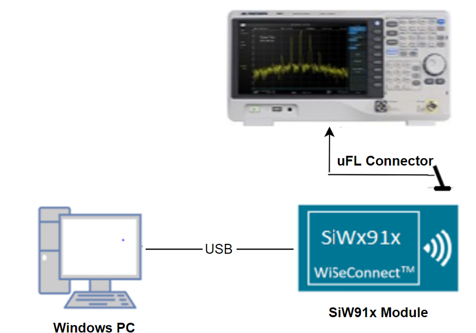<br>
  
**NCP Mode :** 
<br>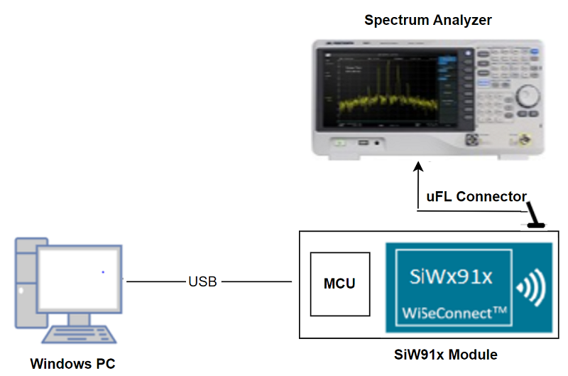<br>
   			
## 3. Application Build Environment

### 3.1 Project Setup
- **SoC Mode**
  - **Silicon Labs SiWx91x SoC**. Follow the [Getting Started with SiWx91x SoC](https://docs.silabs.com/) to setup the example to work with SiWx91x SoC and Simplicity Studio.
- **NCP Mode**
  - **Silicon Labs EFx32 Host**. Follow the [Getting Started with EFx32](https://docs.silabs.com/rs9116-wiseconnect/latest/wifibt-wc-getting-started-with-efx32/) to setup the example to work with EFx32 and Simplicity Studio.

### 3.2 NCP Mode - Platform

The Application can be built and executed on below Host platforms
*	[WSTK + EFR32MG21](https://www.silabs.com/development-tools/wireless/efr32xg21-bluetooth-starter-kit) 
*   [WSTK + EFM32GG11](https://www.silabs.com/development-tools/mcu/32-bit/efm32gg11-starter-kit)

### 3.3 NCP Mode - Host Interface

* By default, the application is configured to use the SPI bus for interfacing between Host platforms(STM32F411 Nucleo / EFR32MG21) and the SiWx91x EVK.
* This application is also configured to use the SDIO bus for interfacing between Host platforms(EFM32GG11) and the SiWx91x EVK.

### 3.4 Bare Metal/RTOS Support

This application supports bare metal and RTOS environment. By default, the application project files (Keil and Simplicity Studio) are provided with RTOS configuration. To select a bare metal configuration, see [Selecting bare metal](#selecting-bare-metal).
		
## 4. Application Configuration Parameters

The application can be configured to suit your requirements and development environment. Read through the following sections and make any changes needed.

**4.1** Open `rsi_ble_per.c` file

**4.1.1** Update or modify following macros 

- `RSI_CONFIG_PER_MODE` refers configuration mode BT PER TX or RX
```c
	 #define RSI_CONFIG_PER_MODE	RSI_BLE_PER_TRANSMIT_MODE
                                 OR
	 #define RSI_CONFIG_PER_MODE	RSI_BLE_PER_RECEIVE_MODE
```
- `CMD_ID` refers the command id for transmit or receive
```c
	 #define BLE_TRANSMIT_CMD_ID	0x13
	 #define BLE_RECEIVE_CMD_ID 	0x14
```
- `PAYLOAD_TYPE` refers type of payload to be transmitted
```c
	 #define DATA_PRBS9	                0x00
	 #define DATA_FOUR_ONES_FOUR_ZEROES	0x01
	 #define DATA_ALT_ONES_AND_ZEROES	0x02
	 #define DATA_PRSB15	                0x03
	 #define DATA_ALL_ONES	                0x04
	 #define DATA_ALL_ZEROES	        0x05
	 #define DATA_FOUR_ZEROES_FOUR_ONES	0x06
	 #define DATA_ALT_ZEROES_AND_ONES	0x07
```
- `LE_CHNL_TYPE`: advertising channel - 0	data channel - 1
```c
	 #define LE_ADV_CHNL_TYPE	0
	 #define LE_DATA_CHNL_TYPE	1
```
- `PACKET_LEN`: Length of the packet, in bytes, to be transmitted. Packet length range 0 to 255.
```c
	 #define BLE_TX_PKT_LEN	               32
```
- `BLE_RX_CHNL_NUM`- Receive channel index, as per the Bluetooth standard.i.e, 0 to 39
- `BLE_TX_CHNL_NUM` - Transmit channel index, as per the Bluetooth standard. i.e, 0 to 39
```c
	 #define BLE_RX_CHNL_NUM	10
	 #define BLE_TX_CHNL_NUM	10
```
- `BLE_PHY_RATE`: ,2Mbps - 2 , 125Kbps - 4, 500Kbps - 8
```c
	 #define LE_ONE_MBPS	        1
	 #define LE_TWO_MBPS	        2
	 #define LE_125_KBPS_CODED  	4
	 #define LE_500_KBPS_CODED  	8
	 #define BLE_PHY_RATE	LE_ONE_MBPS
```
- `SCRAMBLER_SEED`: Initial seed to be used for whitening. It should be set to '0' in order to disable whitening.
```c
	 #define SCRAMBLER_SEED	0
```
- `TX_MODE`: Burst mode - 0	Continuous mode - 1
```c
	 #define BURST_MODE	        0
	 #define CONTINUOUS_MODE	1
```
- `HOPPING TYPE` : no hopping -0	fixed hopping - 1	random hopping - 2
```c
	 #define NO_HOPPING	0
	 #define FIXED_HOPPING	1
	 #define RANDOM_HOPPING	2
```
- `ANT_SEL` : onchip antenna - 2	u.f.l - 3
```c
	 #define ONBOARD_ANT_SEL	2
	 #define EXT_ANT_SEL    	3
```
- `RF_TYPE` : External RF – 0	Internal RF – 1
```c
	 #define BLE_EXTERNAL_RF	0
	 #define BLE_INTERNAL_RF	1
```
- `RF CHAIN`: Select the required RF chain
```c
     #define NO_CHAIN_SEL	0
     #define WLAN_HP_CHAIN_BIT	0
	 #define WLAN_LP_CHAIN_BIT	1
	 #define BT_HP_CHAIN_BIT	2
	 #define BT_LP_CHAIN_BIT	3
```
- `PLL MODE` : PLL_MODE0 – 0	PLL_MODE1 – 1
```c
     #define PLL_MODE_0	0
	 #define PLL_MODE_1	1
``` 

- `LOOP_BACK_MODE` : enable 1 or disable 0 #define LOOP_BACK_MODE_DISABLE 0
```c
     #define LOOP_BACK_MODE_ENABLE	1
```

- Following are the non-configurable macros in the application.

- `BT_GLOBAL_BUFF_LEN` refers Number of bytes required by the application and the driver
```c
	 #define BT_GLOBAL_BUFF_LEN                             15000
```
   

**4.2** Open `rsi_ble_config.h` file and update/modify following macros,
```c
	 #define RSI_BLE_PWR_INX                                30
	 #define RSI_BLE_PWR_SAVE_OPTIONS                       BLE_DISABLE_DUTY_CYCLING
```	 
   **Opermode command parameters**
```c
	 #define RSI_FEATURE_BIT_MAP                            FEAT_SECURITY_OPEN
	 #define RSI_TCP_IP_BYPASS                              RSI_DISABLE
	 #define RSI_TCP_IP_FEATURE_BIT_MAP                     TCP_IP_FEAT_DHCPV4_CLIENT
	 #define RSI_CUSTOM_FEATURE_BIT_MAP                     FEAT_CUSTOM_FEAT_EXTENTION_VALID
	 #define RSI_EXT_CUSTOM_FEATURE_BIT_MAP                 0
```
**Note:** `rsi_ble_config.h` files are already set with desired configuration in respective example folders user need not change for each example. 
   

## 5. Testing the Application

Follow the below steps for the successful execution of the application.

### 5.1 Loading the SiWx91x Firmware

Refer [Getting started with a PC](https://docs.silabs.com/rs9116/latest/wiseconnect-getting-started) to load the firmware into SiWx91x EVK. The firmware file is located in `<SDK>/firmware/`

### 5.2 Creating the Project and builing the Application
  
Refer [Getting started with EFX32](https://docs.silabs.com/rs9116-wiseconnect/latest/wifibt-wc-getting-started-with-efx32/), for settin-up EFR & EFM host platforms

#### 5.2.1 Project Creation - SoC Mode : 

- Connect your board. The Si917 compatible SoC board is **BRD4325A**.
- Studio should detect your board. Your board will be shown here.


#### 5.2.2 Project Creation - NCP Mode : 

- Connect your board. The supported NCP boards are: **BRD4180A,BRD4280B**
- Studio should detect your board. Your board will be shown here.


#### 5.2.3 Selecting an example application and generate project

- Go to the 'EXAMPLE PROJECT & DEMOS' tab and select your desired example application
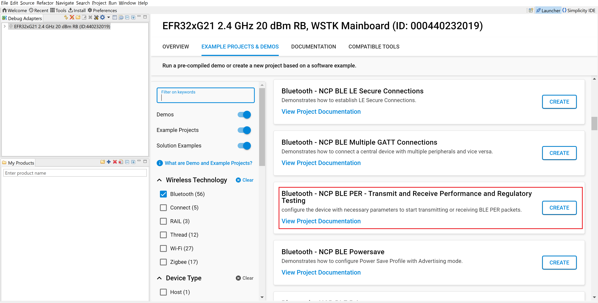
- Click 'Create'. The "New Project Wizard" window appears. Click 'Finish'
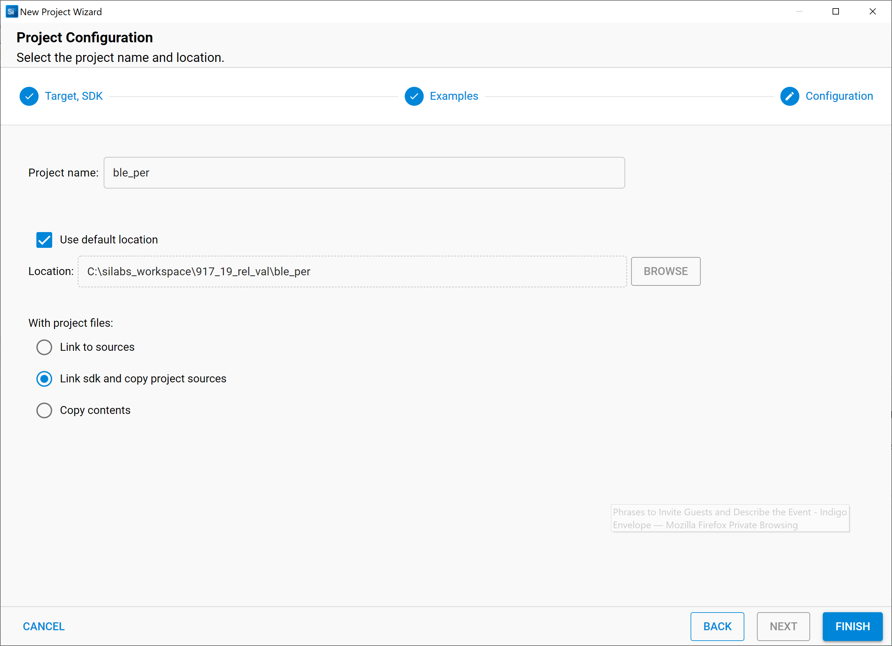

#### 5.2.4 Build Project - SoC Mode

- Once the project is created, right click on project and go to properties → C/C++ Build → Settings → Build Steps
- Add post_build_script_SimplicityStudio.bat file path (SI917_COMBO_SDK.X.X.X.XX\utilities\isp_scripts_common_flash) in build steps settings as shown in below image.
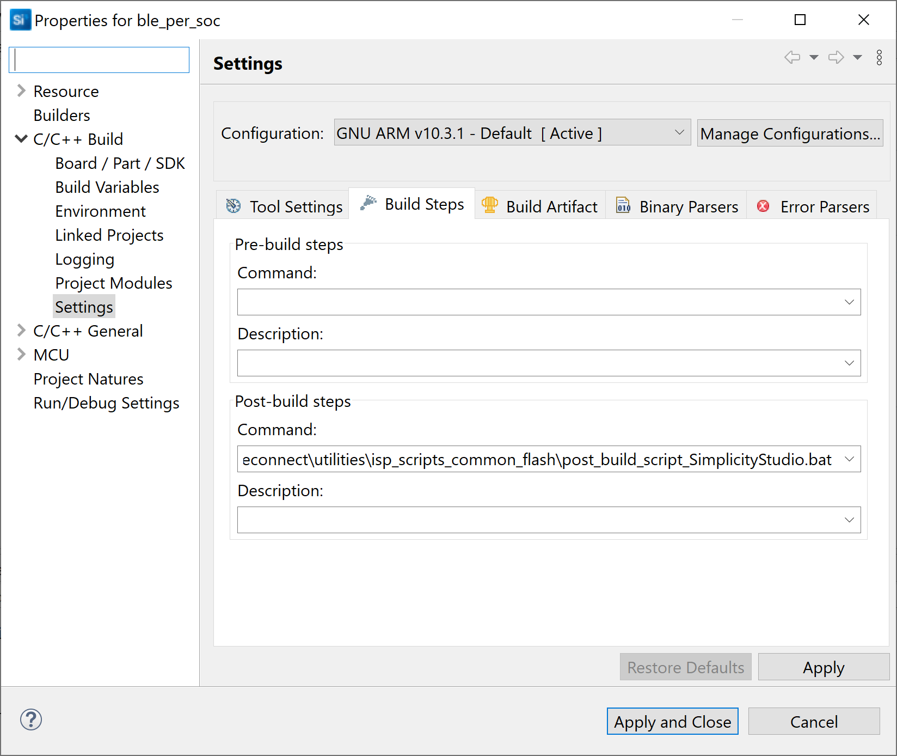
- Check for M4 projects macros in preprocessor settings(RSI_M4_INTERFACE=1)
- Check for 9117 macro in preprocessor settings(CHIP_9117=1).
- Click on the build icon (hammer) to build the project
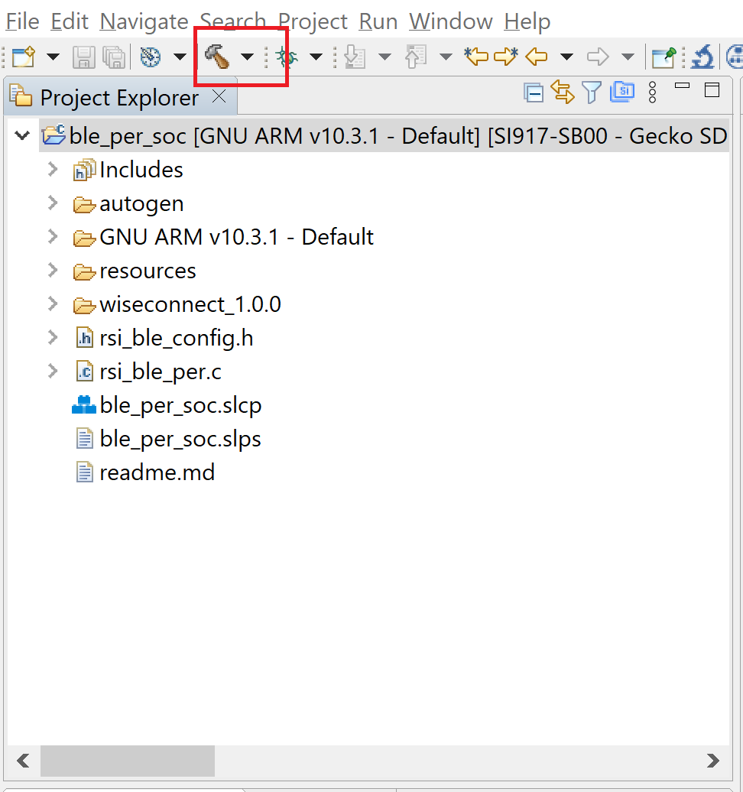
- Successful build output will show as below.
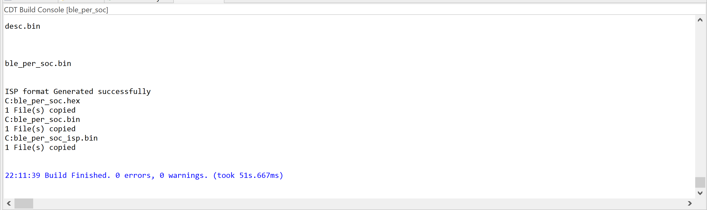

#### 5.2.5 Build Project - NCP Mode :

- Check for 9117 macro in preprocessor settings(CHIP_9117=1).
- Click on the build icon (hammer) to build the project
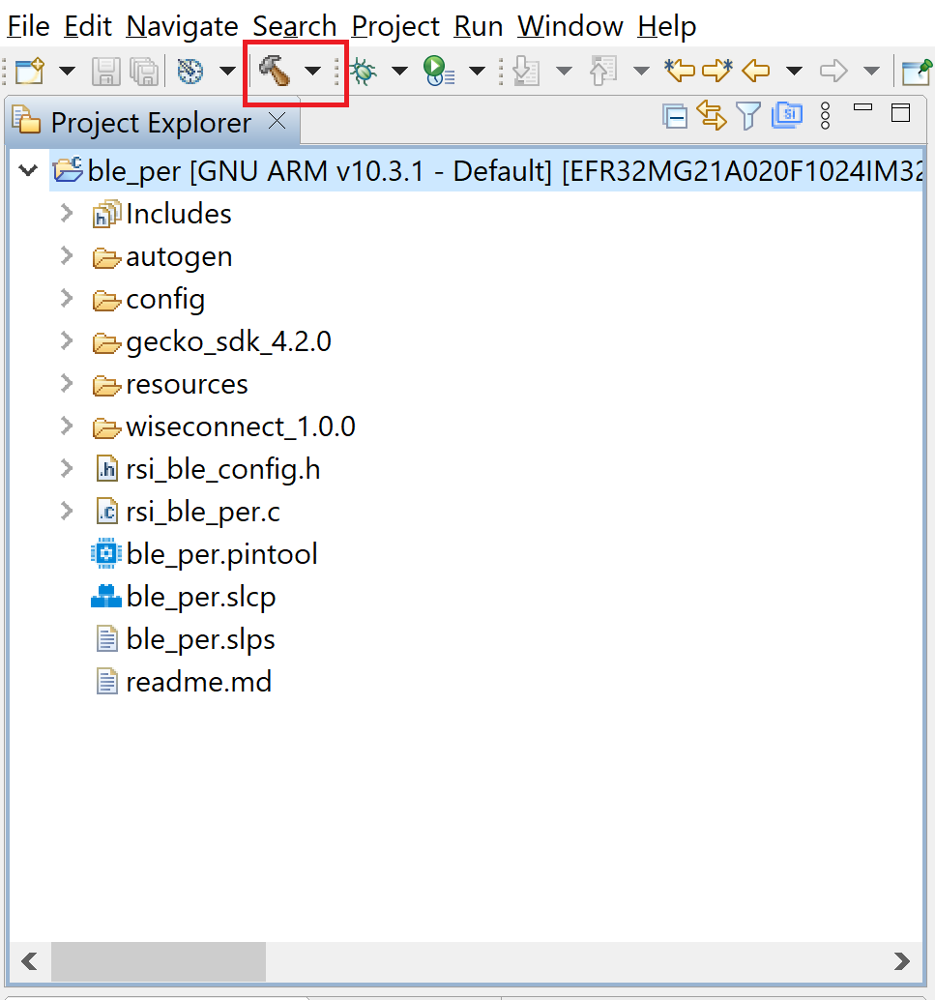
- Successful build output will show as below.
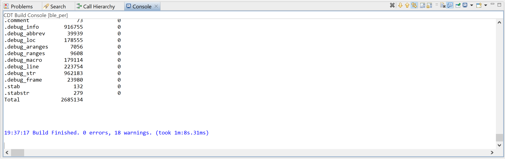

## 6. Program the device

Once the build was successfull, right click on project and click on Debug As->Silicon Labs ARM Program as shown in below image.
### SoC Mode :
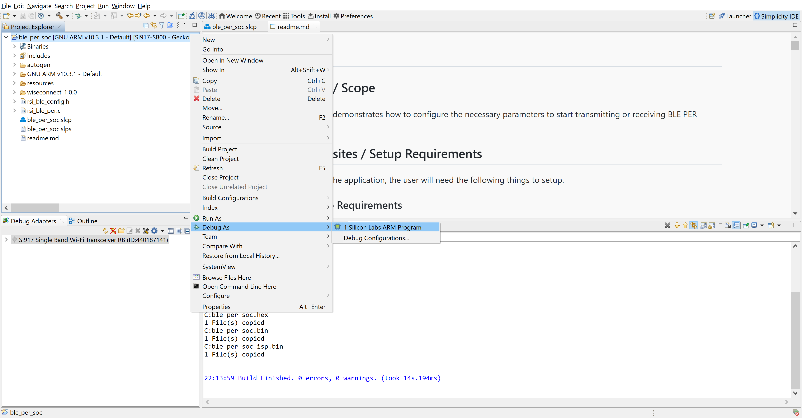
### NCP Mode : 
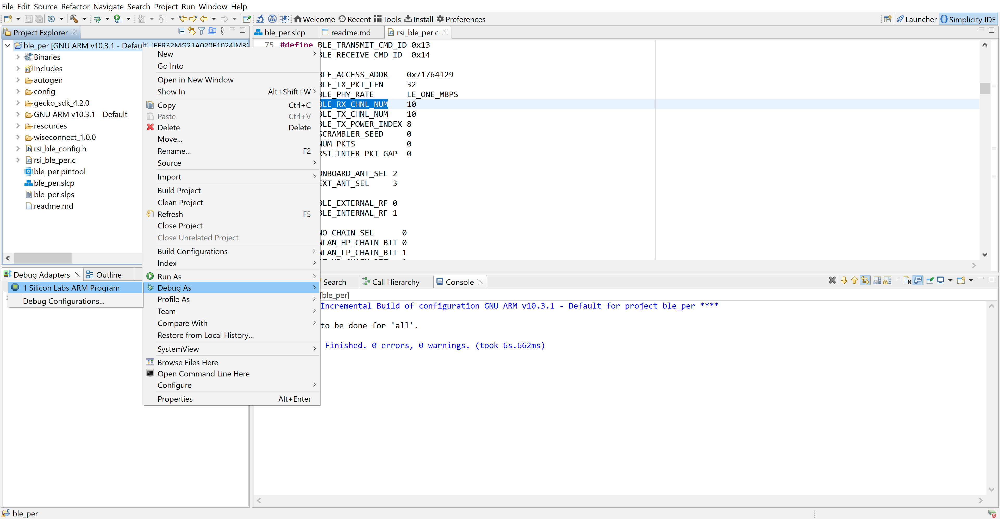

### 6.1 Running the SiWx91x Application

Follow the steps below for the successful execution of the application.

1. Compile and flash the project in to Host MCU

2. Debug the project

3. Free run the project
   
4. After the program gets executed, Silicon Labs module starts BLE PER transmit or BLE PER receive. 

5. For receiving purpose use BT dongle and keep it in BLE PER RX mode.

6. Check for BLE PER stats whatever configured values are affecting or not.

7. After successful program execution of BLE PER Transmit the waveform on the spectrum looks as shown below.  
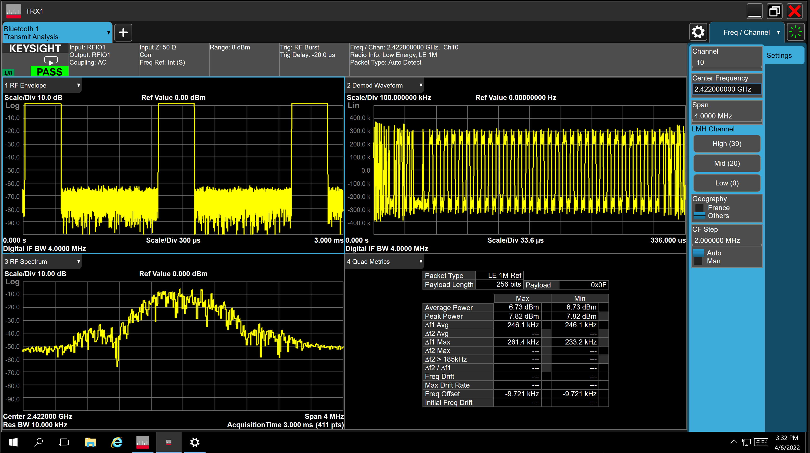
8. After successful program execution the prints in coolterm looks as shown below.
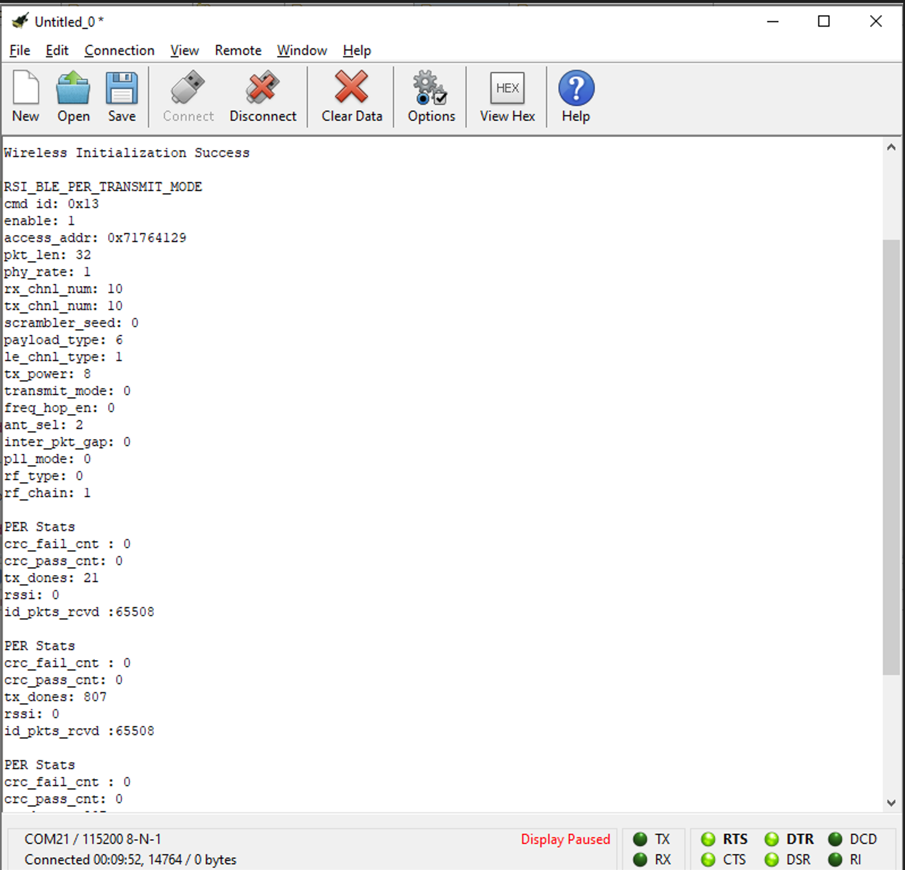 
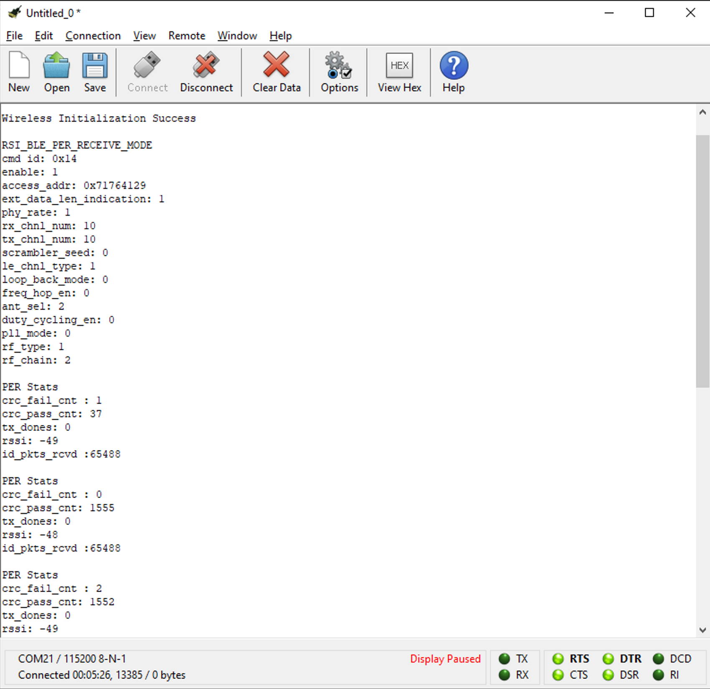

## 7. Observing the output prints on serial terminal

### 7.1 SoC Mode:
- Connect USB to UART connector Tx and GND pins to WSTK radio board.

   - Connect Tx(Pin-6) to P27 on WSTK
   - Connect GND(Pin 8 or 10) to GND on WSTK
   
- Prints can see as below in any Console terminal
	

### 7.2 NCP Mode:
- Prints can see as below in any Console terminal


## 8. Selecting Bare Metal
The application has been designed to work with FreeRTOS and Bare Metal configurations. By default, the application project files (Simplicity studio) are configured with FreeRTOS enabled. The following steps demonstrate how to configure Simplicity Studio to test the application in a Bare Metal environment.

### 8.1 Bare Metal with Simplicity Studio
- Open the project in Simplicity Studio
- Right click on the project and choose 'Properties'
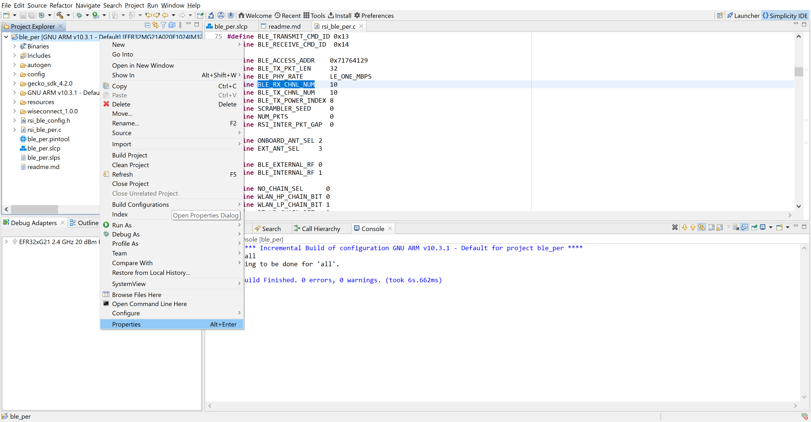 
- Go to 'C/C++ Build' | 'Settings' | 'GNU ARM C Compiler' | 'Symbols' and remove macro 'RSI_WITH_OS=1'
- Select 'Apply' and 'OK' to save the settings
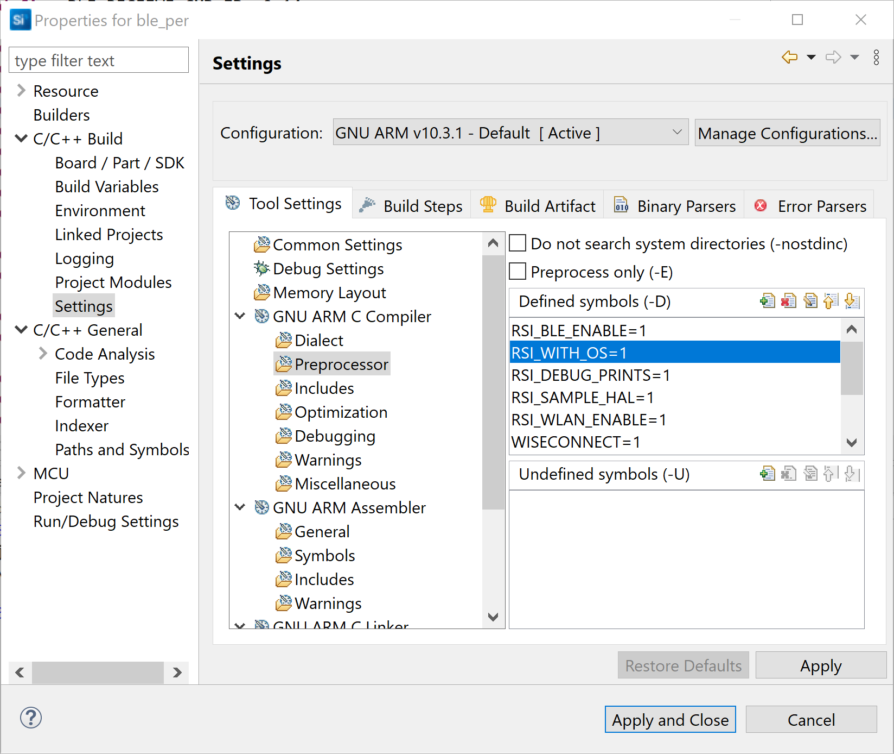

### 8.2 Bare Metal with Keil
- Open project in Keil IDE and click on 'Options for Target'
- Go to 'C/C++' tab and remove 'RSI_WITH_OS' macro present under Preprocessor Symbols
- Click on 'OK' button to save the settings
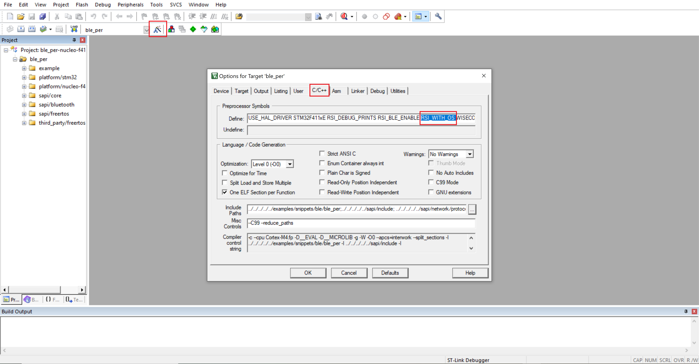