# BLE Powersave

## 1. Purpose / Scope

This application demonstrates how to configure SiWx91x EVK in power save profile in Advertising mode & Connected mode.

## 2. Prerequisites / Setup Requirements

Before running the application, the user will need the following things to setup.

### 2.1 Hardware Requirements

- Windows PC.
- SiWx91x Wi-Fi Evaluation Kit. The SiWx91x supports multiple operating modes. See [Operating Modes]() for details.
  - **SoC Mode**: 
      - Silicon Labs [BRD4325A](https://www.silabs.com/)
  - **NCP Mode**:
      - Silicon Labs [(BRD4180A, BRD4280B)](https://www.silabs.com/); **AND**
      - Host MCU Eval Kit. This example has been tested with:
        - Silicon Labs [WSTK + EFR32MG21](https://www.silabs.com/development-tools/wireless/efr32xg21-bluetooth-starter-kit)
        - Silicon Labs [WSTK + EFM32GG11](https://www.silabs.com/development-tools/mcu/32-bit/efm32gg11-starter-kit)
        - [STM32F411 Nucleo](https://st.com/)
- Agilent power analyzer

### 2.2 Software Requirements
    
- Embedded Development Environment

   - For Silicon Labs EFx32, use the latest version of [Simplicity Studio](https://www.silabs.com/developers/simplicity-studio)
   
- Download and install the Silicon Labs [EFR Connect App](https://www.silabs.com/developers/efr-connect-mobile-app) in the android smart phones for testing BLE applications. Users can also use their choice of BLE apps available in Android/iOS smart phones.

### 2.3 Setup Diagram:
   
**SoC Mode :**   
 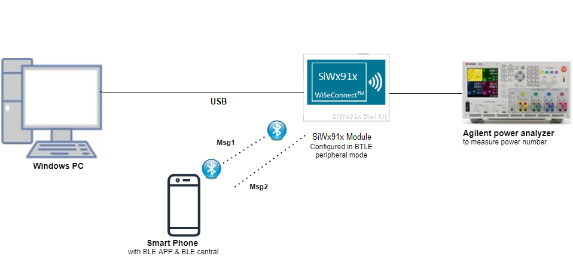 

  
**NCP Mode :**  
 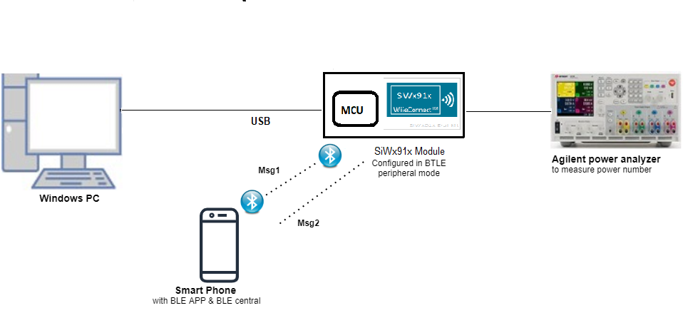 

   			  
## 3. Application Build Environment
### 3.1 Project Configuration

- **SoC Mode**
  - **Silicon Labs SiWx91x SoC**. Follow the [Getting Started with SiWx91x SoC](https://docs.silabs.com/) to setup the example to work with SiWx91x SoC and Simplicity Studio.
- **NCP Mode**
  - **Silicon Labs EFx32 Host**. Follow the [Getting Started with EFx32](https://docs.silabs.com/rs9116-Silicon Labs device/latest/wifibt-wc-getting-started-with-efx32/) to setup the example to work with EFx32 and Simplicity Studio.
  
### 3.2 NCP Mode - Host Interface 

By default, the application is configured to use the SPI bus for interfacing between Host platforms(STM32F411 Nucleo / EFR32MG21) and the SiWx91x EVK.
* This application is also configured to use the SDIO bus for interfacing between Host platforms(EFM32GG11) and the SiWx91x EVK.
* While using the expansion board, the `EXP_BOARD=1` preprocessor symbol should be added to the list of defined symbols from the preprocessor menu of project settings.
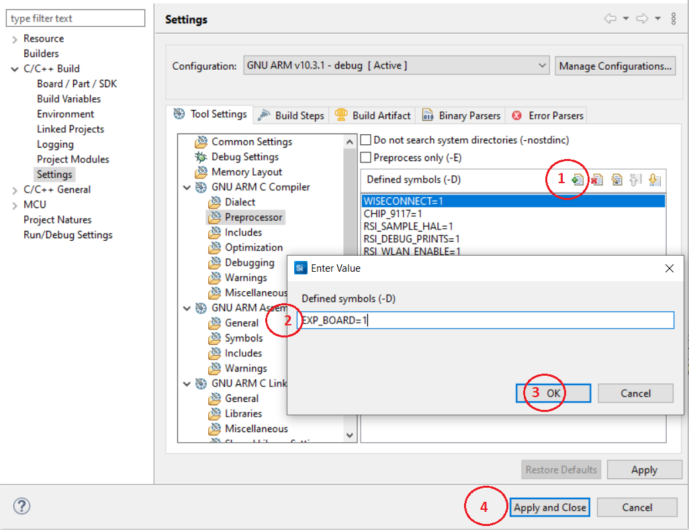
### 3.3 Bare Metal/RTOS Support

This application supports bare metal and RTOS environment. By default, the application project files (Keil and Simplicity Studio) are provided with Bare metal configuration.
 
## 4. Application Configuration Parameters

The application can be configured to suit your requirements and development environment. Read through the following sections and make any changes needed.

**4.1** Open `rsi_ble_config.h` file and update/modify following macros

**4.1.1** User must update the below parameters

   `RSI_BLE_LOCAL_NAME` refers the name of the Silicon Labs device to appear during scanning by remote devices.

	 #define RSI_BLE_LOCAL_NAME			"SILABS_DEVICE"

   Address of the device to connect
     
	 #define RSI_BLE_DEV_ADDR "11:11:11:11:11:11"

   Remote Device Name to connect
     
	 #define RSI_REMOTE_DEVICE_NAME "SLAVE"

     #define SLAVE_MODE  0
     #define MASTER_MODE 1
     #define DUAL_MODE   2
	 
   Configure the required mode using the above three macros 
   
     #define BLE_ROLE    SLAVE_MODE
   
   **To Enable Power Save**
   
   **PSP\_MODE** refers power save profile mode. The Silicon Labs device device supports following power modes in BTLE,
   
   **RSI_ACTIVE (0):** In this mode, the Silicon Labs device is active and power save is disabled.
   
   **RSI_SLEEP_MODE_2 (1):** This mode is applicable when the Silicon Labs device is in Advertising state as well as in connected state. In this sleep mode, SoC will go to sleep based on GPIO handshake or Message exchange, therefore handshake is required before sending data to the Silicon Labs device.
   
   **RSI_SLEEP_MODE_8 (8):** In this power mode, the Silicon Labs device goes to power save when it is in the unassociated state with the remote device. In this sleep mode, SoC will go to sleep based on GPIO handshake or Message exchange, therefore handshake is required before sending the command to the Silicon Labs device.

	 #define PSP_MODE					RSI_SLEEP_MODE_2
	
   **Note:**
    For `RSI_SLEEP_MODE_2` and `RSI_SLEEP_MODE_8` modes, GPIO or Message based handshake can be selected using `RSI_HAND_SHAKE_TYPE` macro 
	which is defined in `rsi_wlan_config.h`                                                                                                   
		
   **Note:**                                                                                                                               
	In this example,user can verify `RSI_SLEEP_MODE_2` with Message based handshake. If the user wants to verify other power modes,   
	the user has to change the application as well as GPIO handshake signals                                                              
		
   **PSP\_TYPE** refers power save profile type. The Silicon Labs device device supports following power save profile types in BTLE mode,
   **RSI\_MAX\_PSP (0):** In this mode, the Silicon Labs device device will be in Maximum power save mode. i.e Device will wake up for every DTIM beacon and do data Tx and Rx.
   
	 #define PSP_TYPE                                      RSI_MAX_PSP                    `
  
   **Following are the non-configurable macros in the application.**
  
   Following are the event numbers for advertising, connection and Disconnection events:
     
	 #define RSI_APP_EVENT_ADV_REPORT         			   0
	 #define RSI_APP_EVENT_CONNECTED                       1
	 #define RSI_APP_EVENT_DISCONNECTED                    2

   `BT_GLOBAL_BUFF_LEN` refers Number of bytes required by the application and the driver
		
	 #define BT_GLOBAL_BUFF_LEN                            15000 `

   **Opermode command parameters**

	 #define RSI_FEATURE_BIT_MAP                           FEAT_SECURITY_OPEN
	 #define RSI_TCP_IP_BYPASS                             RSI_DISABLE
	 #define RSI_TCP_IP_FEATURE_BIT_MAP                    TCP_IP_FEAT_DHCPV4_CLIENT
	 #define RSI_CUSTOM_FEATURE_BIT_MAP                    FEAT_CUSTOM_FEAT_EXTENTION_VALID
	 #define RSI_EXT_CUSTOM_FEATURE_BIT_MAP                (EXT_FEAT_XTAL_CLK_ENABLE | EXT_FEAT_LOW_POWER_MODE)
   **Note:**
	If no memory configuration is specified, it will take EXT_FEAT_384K_MODE by default.

   `RSI_HAND_SHAKE_TYPE` is used to select GPIO or Message based handshake in RSI_SLEEP_MODE_2 and RSI_SLEEP_MODE_8 modes.
   
	 #define RSI_HAND_SHAKE_TYPE                           GPIO_BASED

   `RSI_SELECT_LP_OR_ULP_MODE` is used to select low power mode or ultra low power mode. Valid configurations are, RSI_LP_MODE or RSI_ULP_WITH_RAM_RET or RSI_ULP_WITHOUT_RAM_RET
   
   `RSI_LP_MODE `
   
   In this, the Silicon Labs device will be in Low power mode.
   
   `RSI_ULP_WITH_RAM_RET `
   
   In this, the Silicon Labs device will be in Ultra low power mode and it will remember the previous state after issuing power save mode command.

   `RSI_ULP_WITHOUT_RAM_RET `

   In this, the Silicon Labs device will be in Ultra low power mode and it will not remember the previous state after issuing power save mode command. After wakeup, the Silicon Labs device will give CARD READY indication and the user has to issue commands from wireless initialization.
  
	 #define RSI_SELECT_LP_OR_ULP_MODE                     RSI_ULP_WITH_RAM_RET
## 5. Testing the Application

- Follow the below steps for the successful execution of the application.

### 5.1 Loading the SiWx91x Firmware

- Refer [Getting started with a PC](https://docs.silabs.com/rs9116/latest/wiseconnect-getting-started) to load the firmware into SiWx91x EVK. The firmware file is located in `<SDK>/connectivity_firmware/`

### 5.2 Creating the Project and builing the Application
  
- Refer [Getting started with EFX32](https://docs.silabs.com/rs9116-wiseconnect/latest/wifibt-wc-getting-started-with-efx32/), for settin-up EFR & EFM host platforms

#### 5.2.1 Project Creation - SoC Mode : 

- Connect your board. The Si917 compatible SoC board is **BRD4325A**.
- Studio should detect your board. Your board will be shown here.

#### 5.2.2 Project Creation - NCP Mode : 

- Connect your board. The supported NCP boards are: **BRD4180A,BRD4280B**
- Studio should detect your board. Your board will be shown here.

#### 5.2.3 Selecting an example application and generate project

- Go to the 'EXAMPLE PROJECT & DEMOS' tab and select your desired example application
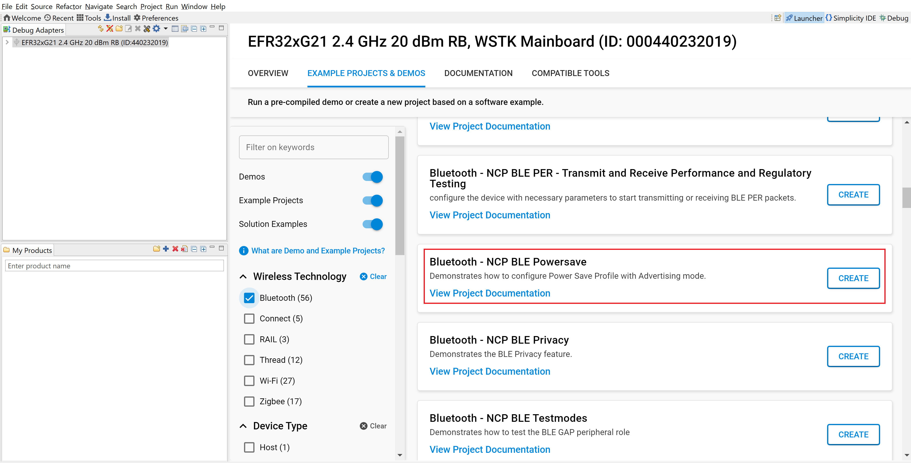
- Click 'Create'. The "New Project Wizard" window appears. Click 'Finish'
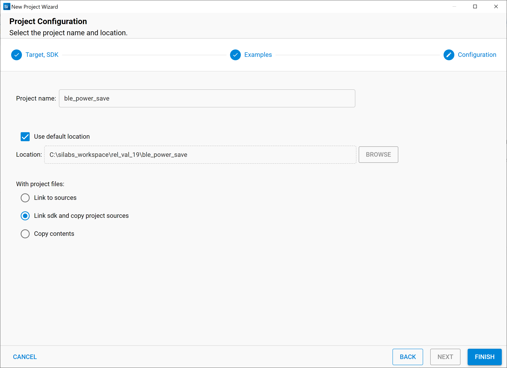
#### 5.2.4 Build Project - SoC Mode

- Once the project is created, right click on project and go to properties → C/C++ Build → Settings → Build Steps
- Add post_build_script_SimplicityStudio.bat file path (SI917_COMBO_SDK.X.X.X.XX\utilities\isp_scripts_common_flash) in build steps settings as shown in below image.
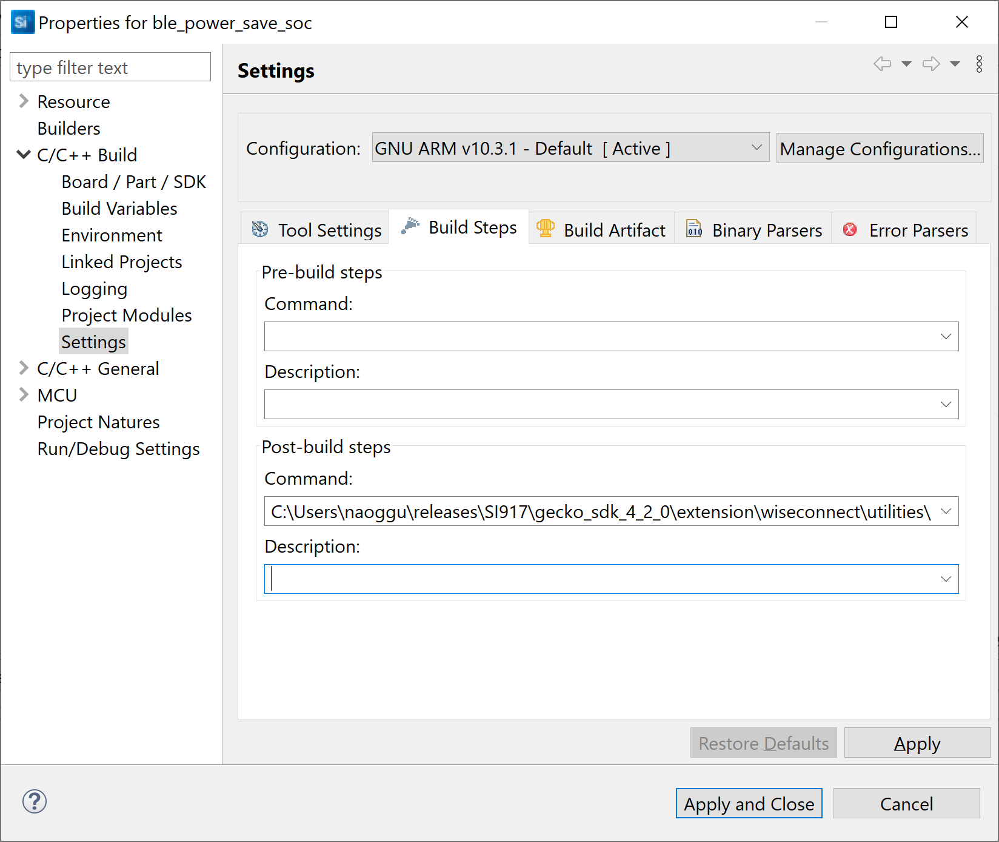
- Check for M4 projects macros in preprocessor settings(RSI_M4_INTERFACE=1)
- Check for 9117 macro in preprocessor settings(CHIP_9117=1).
- Click on the build icon (hammer) to build the project
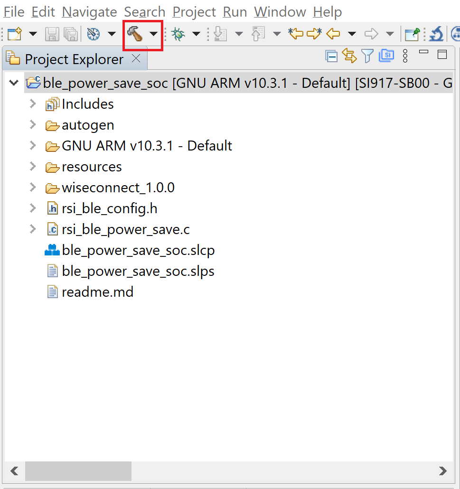
- Successful build output will show as below.
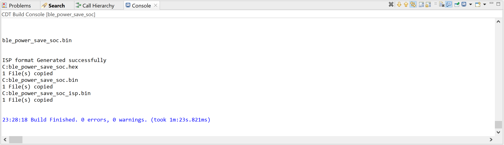
#### 5.2.5 Build Project - NCP Mode :

- Check for 9117 macro in preprocessor settings(CHIP_9117=1).
- Click on the build icon (hammer) to build the project
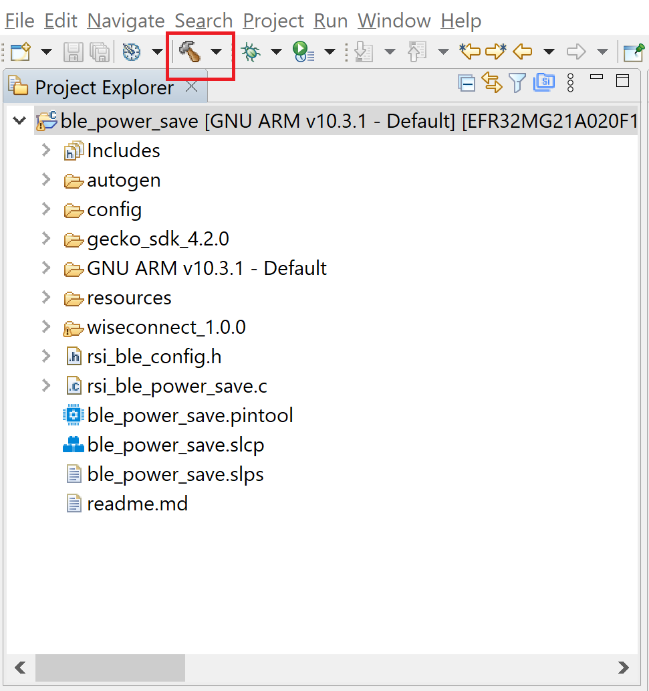
- Successful build output will show as below.
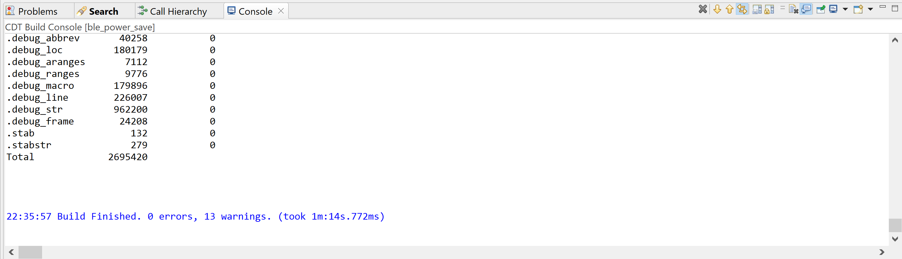
## 6. Program the device

- Once the build was successfull, right click on project and click on Debug As->Silicon Labs ARM Program as shown in below image.
### SoC Mode :
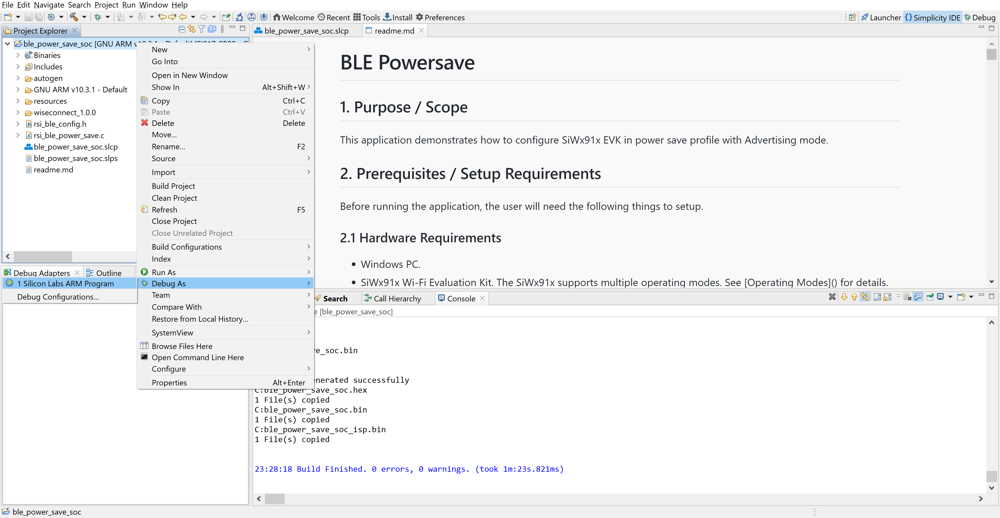
### NCP Mode : 
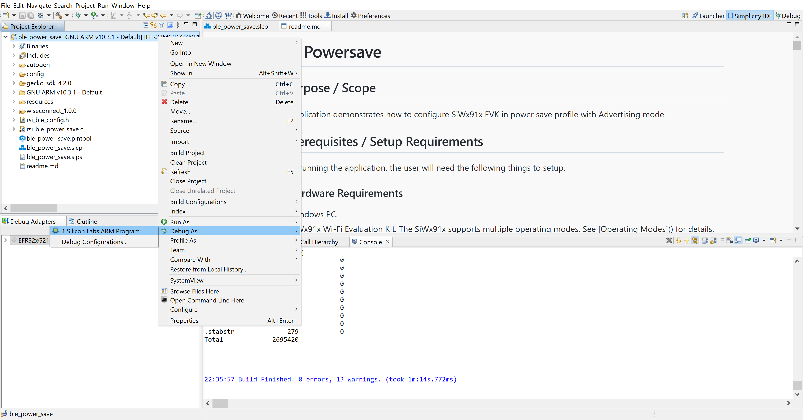
### 6.1 Running the SiWx91x Application

1. After the program gets executed, the Silicon Labs device  would be in Advertising state with configured power save the profile.

2. Connect any serial console for prints.

3. The Silicon Labs device will go to sleep and wakes up for every advertising interval and goes back to sleep after advertising. Refer the given below image for power save cycle in advertising mode.    
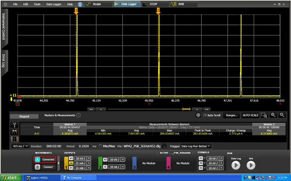
   
4. Open an EFR Connect App in the Smartphone and do Scan
   
5. In the App, Silicon Labs device will appear with the name configured in the macro **RSI\_BLE\_LOCAL\_NAME (Ex: "WLAN\_BLE\_SIMPLE")** or sometimes observed as the 
   Silicon Labs device as the internal name **"SILABS_DEVICE".** 
   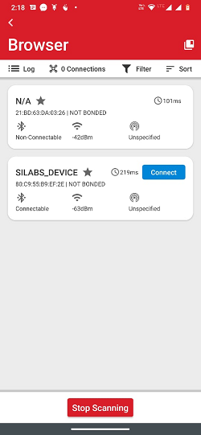
   
6. Initiate connection from the mobile App.
   
7. After successful connection, user can see the connected state in EFR connect app and also check the supported services by the Silicon Labs device.  
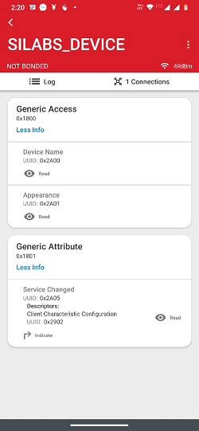
   
7. After successful connection, Silicon Labs device goes to sleep and wakes up for every connection interval. Check the below image for power save cycle after connection.
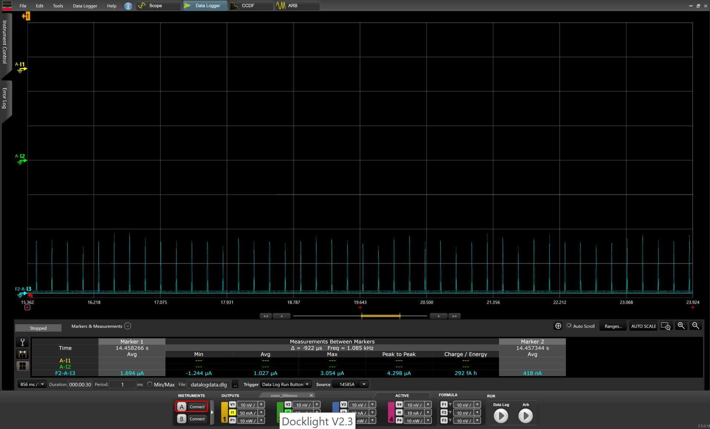 
   
9. After successful program execution, if the Silicon Labs device is configured in SLAVE_MODE , the prints in teraterm looks as shown below.     
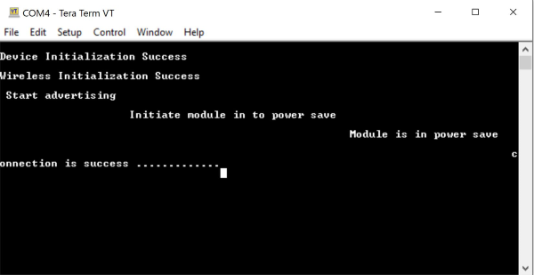    
   
   
 **Note:** 
- Default configuration of connection interval of Central device (smartphone) is 18 ms. So, the Silicon Labs device  will wake up for every 18ms sec and goes back to sleep after advertise.                                                                                                                              
- Above power save profile image capture when it is in the idle state after successful connection. So, the user may not get same profile as shown above image.
	  It will vary based on the traffic.                                                     
## 7. Observing the output prints on serial terminal

### 7.1 SoC Mode:
- Connect USB to UART connector Tx and GND pins to WSTK radio board.

   - Connect Tx(Pin-6) to P27 on WSTK
   - Connect GND(Pin 8 or 10) to GND on WSTK
      
- Prints can see as below in any Console terminal
   
### 7.2 NCP Mode:
- Prints can see as below in any Console terminal
   
## 8. Selecting Bare Metal
- The application has been designed to work with FreeRTOS and Bare Metal configurations. By default, the application project files (Simplicity studio) are configured with FreeRTOS enabled. The following steps demonstrate how to configure Simplicity Studio to test the application in a Bare Metal environment.

### 8.1 Bare Metal with Simplicity Studio
- Open the project in Simplicity Studio
- Right click on the project and choose 'Properties'
- Go to 'C/C++ Build' | 'Settings' | 'GNU ARM C Compiler' | 'Symbols' and remove macro 'RSI_WITH_OS=1'
- Select 'Apply' and 'OK' to save the settings
   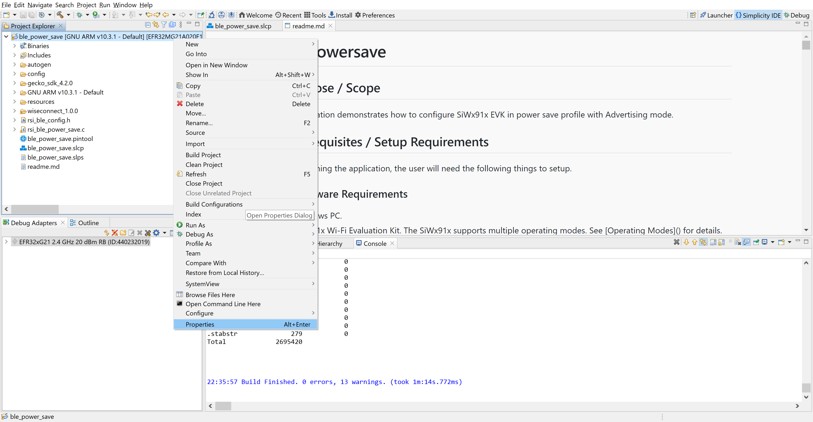 

   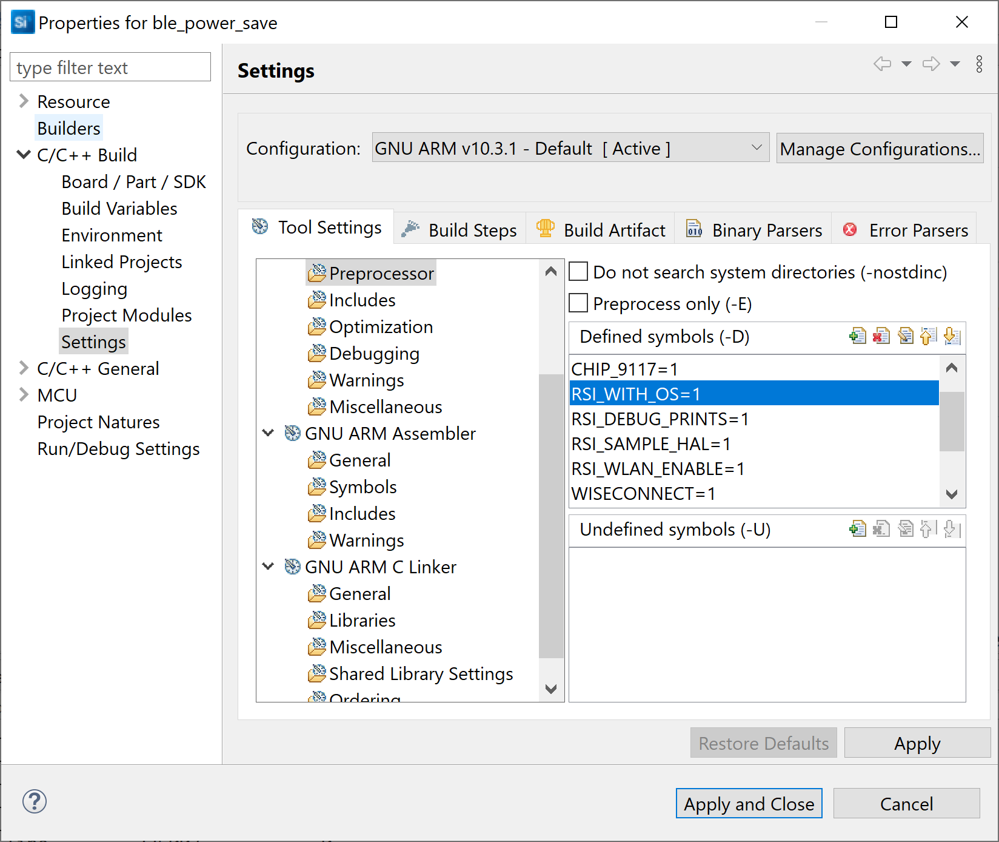
### 8.2 Bare Metal with Keil
- Open project in Keil IDE and click on 'Options for Target'
- Go to 'C/C++' tab and remove 'RSI_WITH_OS' macro present under Preprocessor Symbols
- Click on 'OK' button to save the settings
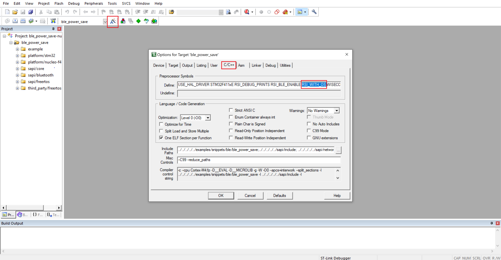                                                               