# BLE Privacy

## 1. Purpose / Scope

Bluetooth LE supports a feature that reduces the ability to track an LE device over a period of time by changing the Bluetooth device address on a frequent basis, called Privacy of that particular device.

The device address of the remote device referred to as the private address will be resolved by local device in order to connect to that device. The private address is generated by using Identity Resolving Key (IRK) exchange in between devices during SMP bonding procedure. Our local device will add the remote devices in one Resolving list(to maintain remote device identity addresses) along with that IRK's and enable the Resolution, sets privacy mode and connect to the remote device with remote identity address.

## 2. Prerequisites / Setup Requirements

Before running the application, the user will need the following things to setup.

### 2.1 Hardware Requirements

- Windows PC with Host interface(UART/ SPI/ SDIO).
   - SiWx91x Wi-Fi Evaluation Kit. The SiWx91x supports multiple operating modes. See [Operating Modes]() for details.
  - **SoC Mode**: 
      - Silicon Labs [BRD4325A](https://www.silabs.com/)
  - **NCP Mode**:
      - Silicon Labs [(BRD4180A, BRD4280B)](https://www.silabs.com/);
      - Host MCU Eval Kit. This example has been tested with:
        - Silicon Labs [WSTK + EFR32MG21](https://www.silabs.com/development-tools/wireless/efr32xg21-bluetooth-starter-kit)
        - Silicon Labs [WSTK + EFM32GG11](https://www.silabs.com/development-tools/mcu/32-bit/efm32gg11-starter-kit)
- BLE peripheral device which supports privacy feature

### 2.2 Software Requirements
   
- Embedded Development Environment
   - For Silicon Labs EFx32, use the latest version of [Simplicity Studio](https://www.silabs.com/developers/simplicity-studio)
   
- Download and install the Silicon Labs [EFR Connect App](https://www.silabs.com/developers/efr-connect-mobile-app) in the android smart phones for testing BLE applications. Users can also use their choice of BLE apps available in Android/iOS smart phones.

### 2.3 Setup Diagram:
   
- **SoC Mode :**
 <br>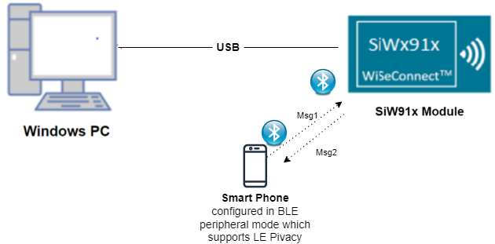<br> 

  
- **NCP Mode :**  
   <br>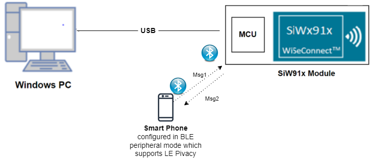<br>


## 3. Application Build Environment

### 3.1 Project Setup

- **SoC Mode**
  - **Silicon Labs SiWx91x SoC**: Follow the [Getting Started with SiWx91x SoC](https://docs.silabs.com/) to setup the example to work with SiWx91x SoC and Simplicity Studio.
- **NCP Mode**
  - **Silicon Labs EFx32 Host** Follow the [Getting Started with EFx32](https://docs.silabs.com/rs9116-wiseconnect/latest/wifibt-wc-getting-started-with-efx32/) to setup the example to work with EFx32 and Simplicity Studio.
  
### 3.2 NCP Mode - Host Interface 

* By default, the application is configured to use the SPI bus for interfacing between Host platforms(EFR32MG21) and the SiWx91x EVK.
		
### 3.3 Bare Metal/RTOS Support

This application supports bare metal and RTOS environment. By default, the application project files (Keil and Simplicity Studio) are provided with RTOS configuration. To select a bare metal configuration, see [Selecting bare metal](#selecting-bare-metal).

## 4. Application Configuration Parameters

The application can be configured to suit your requirements and development environment. Read through the following sections and make any changes needed.

**4.1** Open `rsi_ble_privacy.c` file

**4.1.1** User must update the below parameters 

   `RSI_BLE_DEVICE_NAME` refers the name of the Silicon Labs device to appear during scanning by remote devices.
```c
	 #define RSI_BLE_DEVICE_NAME                              "SIMPLE_PRIVACY"
```

   RSI_DEVICE_ROLE refers the role of the Silicon Labs device.
```c
	 #define RSI_DEVICE_ROLE                                  RSI_SLAVE
```

   `Note: RSI_DEVICE_ROLE should be RSI_MASTER`
   
   RSI_BLE_DEV_ADDR_TYPE` refers the address type of the remote device.
```c
	 #define RSI_BLE_REMOTE_ADDR_TYPE                         LE_PUBLIC_ADDRESS
```

   `RSI_BLE_DEV_ADDR_1` refers remote device address which has to connect.
```c
	 #define RSI_BLE_REMOTE_ADDR                              "00:23:A7:56:77:77"
```

   `RSI_REMOTE_DEVICE_NAME` refers the name of the Remote device to which Silicon Labs device initiate connection.
```c
	 #define RSI_REMOTE_DEVICE_NAME                           "BLE_SIMPLE_PRIVACY"
```
  
   `RSI_BLE_SMP_IO_CAPABILITY` refers the IO capability of Silicon Labs device for SMP, `RSI_BLE_SMP_PASSKEY` is smp passkey key from Silicon Labs device
```c
	 #define RSI_BLE_SMP_IO_CAPABILITY                        0x00
	 #define RSI_BLE_SMP_PASSKEY                              0
```
   **Power save configuration**

   By default, The Application is configured without power save.
```c	 
	 #define ENABLE_POWER_SAVE 0
```
   If user wants to run the application in power save, modify the below configuration. 
```c	 
	 #define ENABLE_POWER_SAVE 1 
```
**4.1.2** The desired parameters are provided below. User can also modify the parameters as per their needs and requirements.

   Following are the **non-configurable** macros in the application.

   Following are the event numbers for connection, Disconnection, and enhanced connection events.
```c
	 #define RSI_APP_EVENT_ADV_REPORT                         0x00
	 #define  RSI_BLE_CONN_EVENT                              0x01
	 #define  RSI_BLE_DISCONN_EVENT                           0x02
	 #define  RSI_BLE_SMP_REQ_EVENT                           0x03
	 #define  RSI_BLE_SMP_RESP_EVENT                          0x04
	 #define  RSI_BLE_SMP_PASSKEY_EVENT                       0x05
	 #define  RSI_BLE_SMP_FAILED_EVENT                        0x06
	 #define  RSI_BLE_ENCRYPT_STARTED_EVENT                   0x07
	 #define  RSI_BLE_SMP_PASSKEY_DISPLAY_EVENT               0x08
	 #define  RSI_BLE_SC_PASSKEY_EVENT                        0x09
	 #define  RSI_BLE_LTK_REQ_EVENT                           0x0A
	 #define  RSI_BLE_SECURITY_KEYS_EVENT                     0x0B
	 #define  RSI_BLE_ENHANCE_CONNECTED_EVENT                 0x0C
```

   `BT_GLOBAL_BUFF_LEN` refers Number of bytes required by the application and the driver.
```c
	 #define BT_GLOBAL_BUFF_LEN                               15000
```

   `RSI_BLE_SET_RESOLVABLE_PRIV_ADDR_TOUT` refers resolution timeout , that is the length of time the Controller uses a Resolvable Private Address before a new resolvable private address is generated and starts being used.
```c
	 #define RSI_BLE_SET_RESOLVABLE_PRIV_ADDR_TOUT           120
```

   Process type refers the operation to be performed on the resolving list. valid configurations for the process type are
```c
	 #define RSI_BLE_ADD_TO_RESOLVE_LIST                      1
	 #define RSI_BLE_REMOVE_FROM_RESOLVE_LIST                 2
	 #define RSI_BLE_CLEAR_RESOLVE_LIST                       3
```

   `RSI_BLE_PRIVACY_MODE` refers the privacy mode of local device
```c
	 #define RSI_BLE_PRIVACY_MODE                             RSI_BLE_DEVICE_PRIVACY_MODE
```

   `RSI_BLE_RESOLVING_LIST_SIZE` refers the resolving list size of Silicon Labs device.
```c
	 #define RSI_BLE_RESOLVING_LIST_SIZE                      5
```

**4.2** Open `rsi_ble_config.h` file and update/modify following macros,

   `RSI_BLE_DEV_ADDR_RESOLUTION_ENABLE` refers address resolution is enable or not. It should be 1 to enable privacy feature.
```c
	 #define RSI_BLE_DEV_ADDR_RESOLUTION_ENABLE               1
```

   `RSI_BLE_ADV_DIR_ADDR_TYPE` refers the address type of remote device which use while advertising.
```c
	 #define RSI_BLE_ADV_DIR_ADDR_TYPE                        LE_PUBLIC_ADDRESS
```

   `RSI_BLE_ADV_DIR_ADDR` refers to which device the local device will advertise with private address, it should be one of the device in resolve list.
```c
	 #define RSI_BLE_ADV_DIR_ADDR                             "00:15:83:6A:64:17"
```
```c
    #define RSI_BLE_PWR_INX                                  30
	#define RSI_BLE_PWR_SAVE_OPTIONS                         BLE_DISABLE_DUTY_CYCLING 
``` 
   **Opermode command parameters**
```c

	 #define RSI_FEATURE_BIT_MAP                              FEAT_SECURITY_OPEN
	 #define RSI_TCP_IP_BYPASS                                RSI_DISABLE
	 #define RSI_TCP_IP_FEATURE_BIT_MAP                       TCP_IP_FEAT_DHCPV4_CLIENT
	 #define RSI_CUSTOM_FEATURE_BIT_MAP                       FEAT_CUSTOM_FEAT_EXTENTION_VALID
	 #define RSI_EXT_CUSTOM_FEATURE_BIT_MAP                   0

```
   **Note:**
   `rsi_ble_config.h` files are already set with desired configuration in respective example folders user 
   need not change for each example.
   
## 5. Testing the Application

Follow the below steps for the successful execution of the application.

### 5.1 Loading the SiWx91x Firmware

Refer [Getting started with a PC](https://docs.silabs.com/rs9116/latest/wiseconnect-getting-started) to load the firmware into SiWx91x EVK. The firmware file is located in `<SDK>/firmware/`

### 5.2 Creating the Project and builing the Application
  
Refer [Getting started with EFX32](https://docs.silabs.com/rs9116-wiseconnect/latest/wifibt-wc-getting-started-with-efx32/), for settin-up EFR & EFM host platforms

#### 5.2.1 Project Creation - SoC Mode : 

- Connect your board. The Si917 compatible SoC board is **BRD4325A**.
- Studio should detect your board. Your board will be shown here.


#### 5.2.2 Project Creation - NCP Mode : 

- Connect your board. The supported NCP boards are: **BRD4180A,BRD4280B**
- Studio should detect your board. Your board will be shown here.


#### 5.2.3 Selecting an example application and generate project

- Go to the 'EXAMPLE PROJECT & DEMOS' tab and select your desired example application
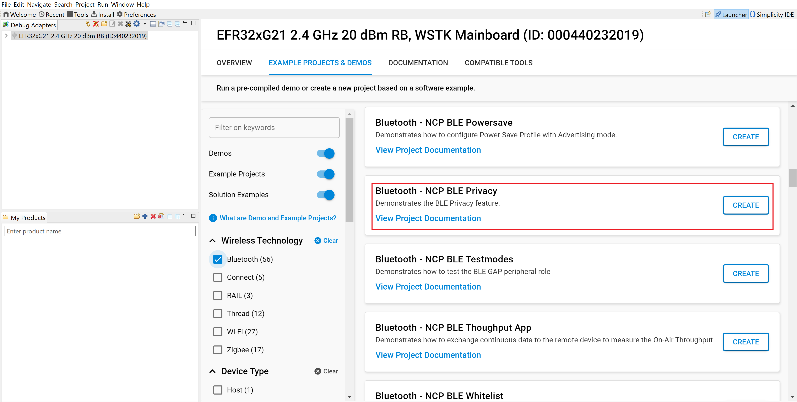

- Click 'Create'. The "New Project Wizard" window appears. Click 'Finish'
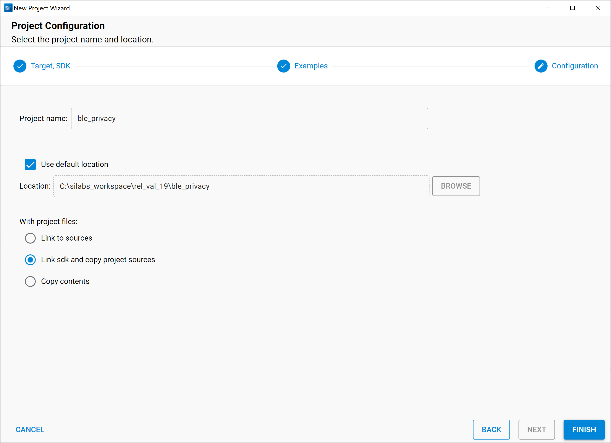

#### 5.2.4 Build Project - SoC Mode

- Once the project is created, right click on project and go to properties → C/C++ Build → Settings → Build Steps
- Add post_build_script_SimplicityStudio.bat file path (SI917_COMBO_SDK.X.X.X.XX\utilities\isp_scripts_common_flash) in build steps settings as shown in below image.
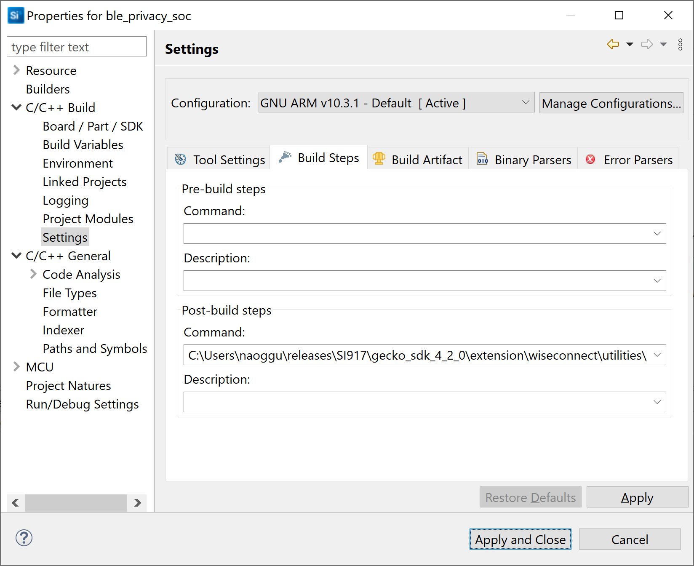
- Check for M4 projects macros in preprocessor settings(RSI_M4_INTERFACE=1)
- Check for 9117 macro in preprocessor settings(CHIP_9117=1).
- Click on the build icon (hammer) to build the project
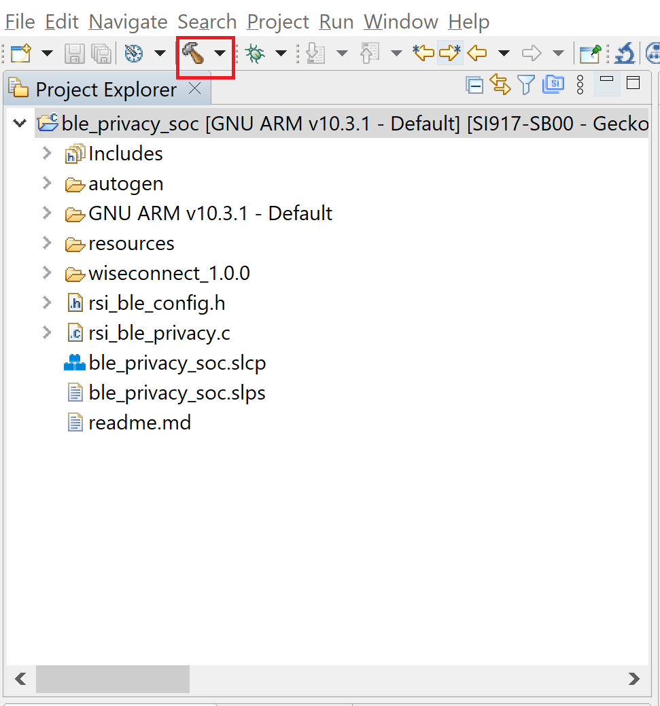
- Successful build output will show as below.
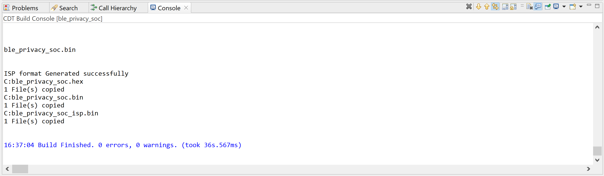

#### 5.2.5 Build Project - NCP Mode :

- Check for 9117 macro in preprocessor settings(CHIP_9117=1).
- Click on the build icon (hammer) to build the project
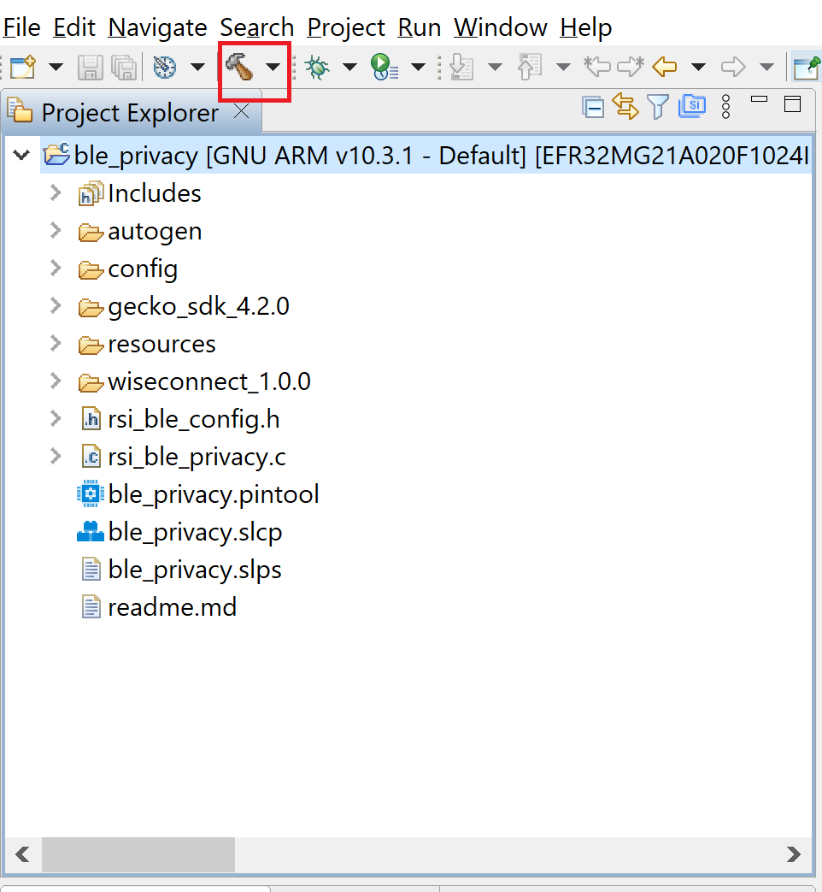
- Successful build output will show as below.
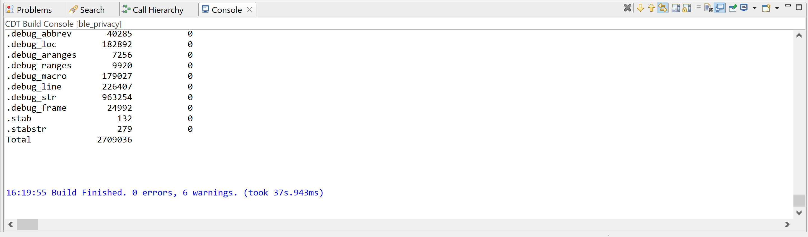

## 6. Program the device

Once the build was successfull, right click on project and click on Debug As->Silicon Labs ARM Program as shown in below image.
### SoC Mode :
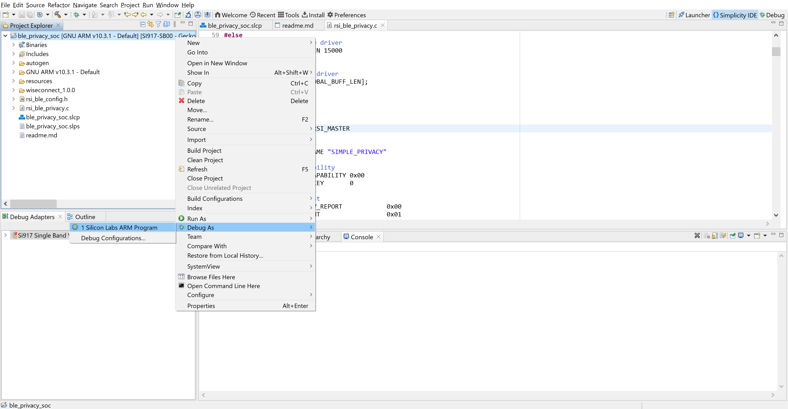
### NCP Mode : 
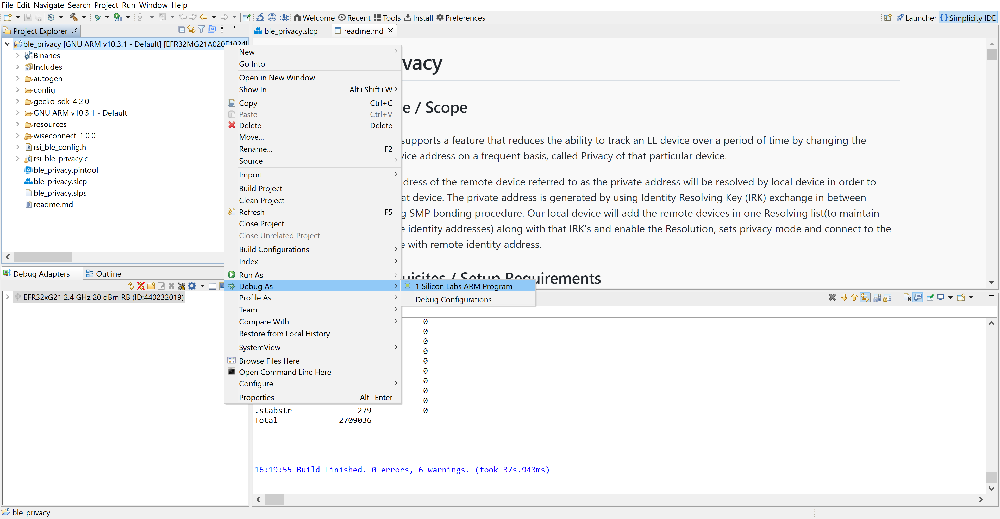

### 6.1 Running the SiWx91x Application

### 6.1.1 Steps to be followed to verify BLE Privacy application as a SLAVE

1. If Silicon Labs device is configured as "RSI_SLAVE" specified in the macro RSI_DEVICE_ROLE, Silicon Labs device will be in the Advertising state.

2. Connect any serial console for prints.

3. Open a LE App in the Smartphone and do the scan.

4. In the App, Silicon Labs device device will appear with the name configured in the macro `RSI_BLE_DEVICE_NAME`. 
 <br>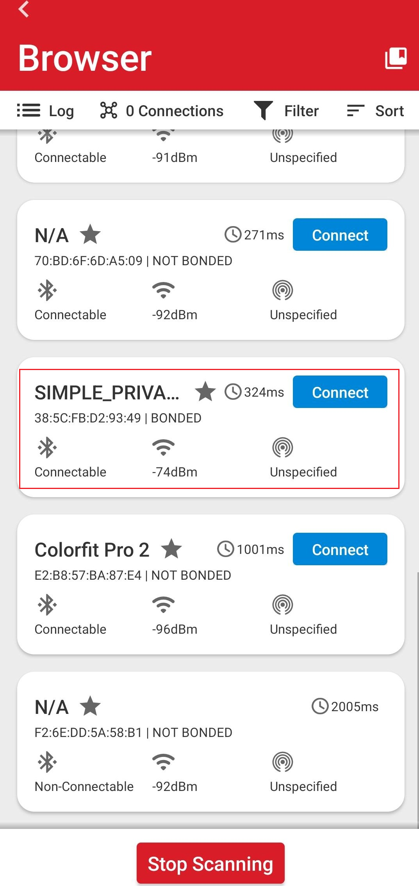<br>

5.  Initiate a connection from the App by clicks on the **Connect** button

6. After a successful connection, the Silicon labs device initiates the **SMP** request.
<br>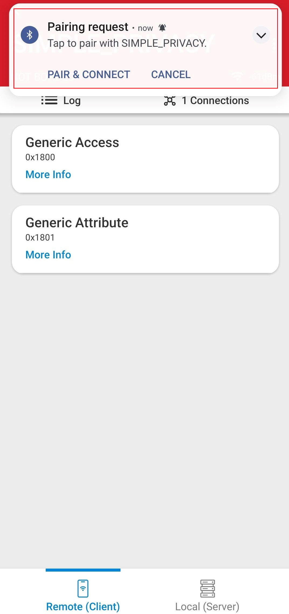 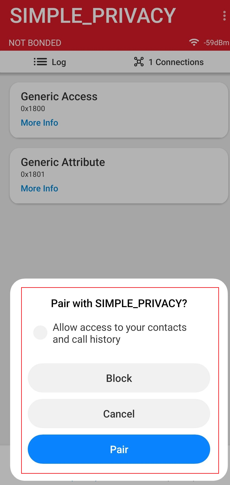<br>

7. The remote device receives the **pair** pop-up window, Once the user clicks on the **pair** button the Silicon Labs device receives the passkey.
<br>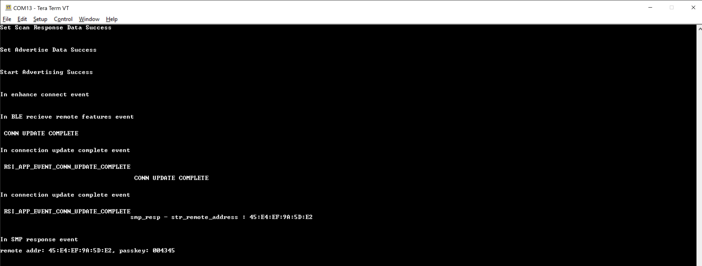<br>

8. Again the remote device receives the **pair** pop-up window, and click on the **pair**  button. Enter the received passkey as shown below.
<br> 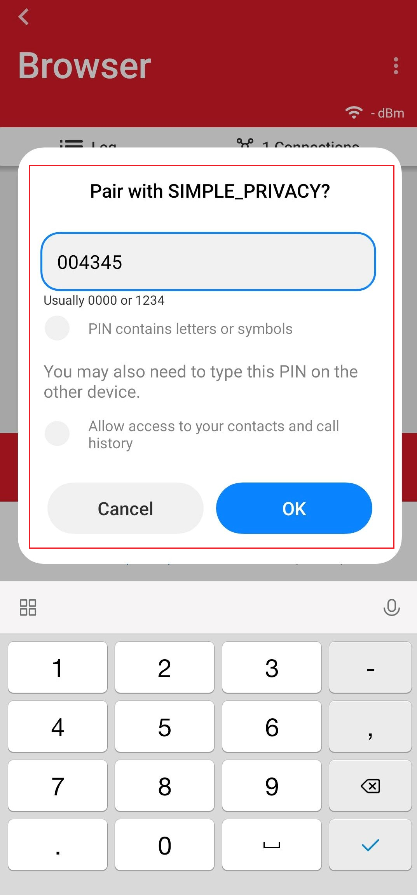<br>

9. After successful SMP connection security keys will exchange  between the Remote device and Silicon Labs device.

10. Silicon Labs device will add the remote device's IRK's and local IRK's in to resolve list and enable resolution

11. Give disconnect from remote device and the Silicon labs device starts advertising
<br>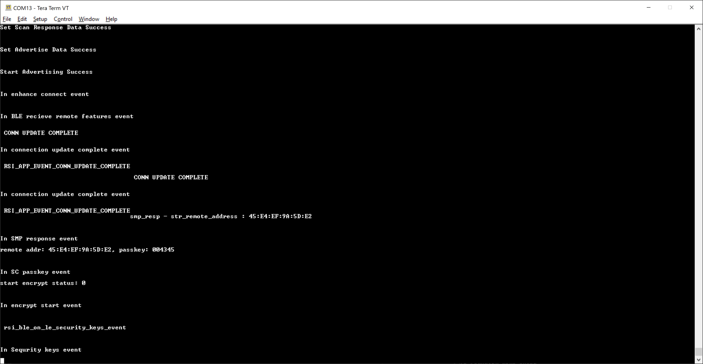<br>

### 6.1.2 Steps to be followed to verify BLE Privacy application as a MASTER

1. If Silicon Labs device is configured as **RSI_MASTER** specified in the macro **RSI_DEVICE_ROLE**, Silicon Labs device will be in Scanning state.

2. Connect any serial console for prints.

3. Advertise the remote device.
<br><br>
**Note:** Refer the [Creating New Advertisement Sets](https://docs.silabs.com/bluetooth/5.0/miscellaneous/mobile/efr-connect-mobile-app) for configuring the EFR connect mobile APP as advertiser.

4. If Silicon Labs device get device with name configured `RSI_REMOTE_DEVICE_NAME` or bd address with address configured in RSI_BLE_REMOTE_ADDR in results ,local device will try to connect with remote device.

5. After connection Silicon Labs device which is in central mode will initiate an SMP request.  

6. Give a response from Remote device and passkey

7. After a successful SMP connection security keys will exchanged between Remote device and Silicon Labs device and the Silicon Labs device will add remote device's IRK's and local IRK's in to resolve list and enable resolution

8. Give disconnect from remote device and keep in advertise mode.
 
9. Now Silicon Labs device will try to connect to remote device with identity address.

10. After successful connection, Silicon Labs device will give start encryption instead of SMP repairing.

11. Encryption will be enabled on both sides.
<br>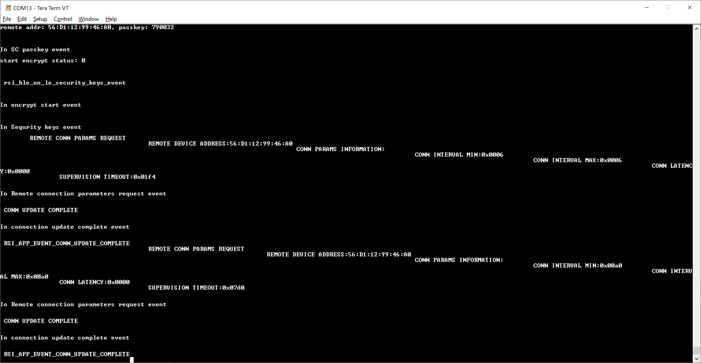<br>


## 7. Observing the output prints on serial terminal

### 7.1 SoC Mode:
- Connect USB to UART connector Tx and GND pins to WSTK radio board.

   - Connect Tx(Pin-6) to P27 on WSTK
   - Connect GND(Pin 8 or 10) to GND on WSTK

   
- Prints can see as below in any Console terminal

   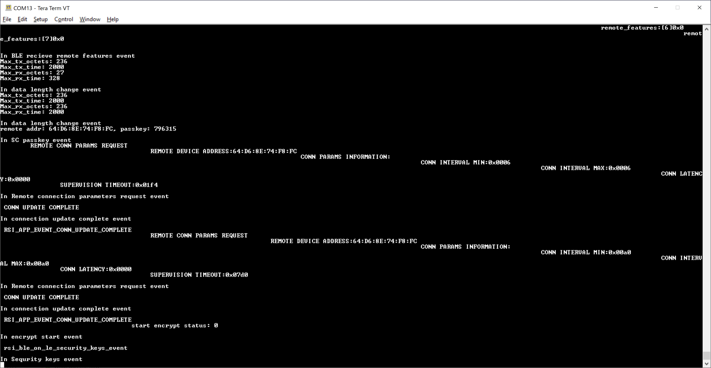

### 7.2 NCP Mode:
- Prints can see as below in any Console terminal
<br><br>

## 8. Selecting Bare Metal
The application has been designed to work with FreeRTOS and Bare Metal configurations. By default, the application project files (Simplicity studio) are configured with FreeRTOS enabled. The following steps demonstrate how to configure Simplicity Studio to test the application in a Bare Metal environment.

### 8.1 Bare Metal with Simplicity Studio
- Open the project in Simplicity Studio
- Right click on the project and choose 'Properties'
- Go to 'C/C++ Build' | 'Settings' | 'GNU ARM C Compiler' | 'Symbols' and remove macro 'RSI_WITH_OS=1'
- Select 'Apply' and 'OK' to save the settings

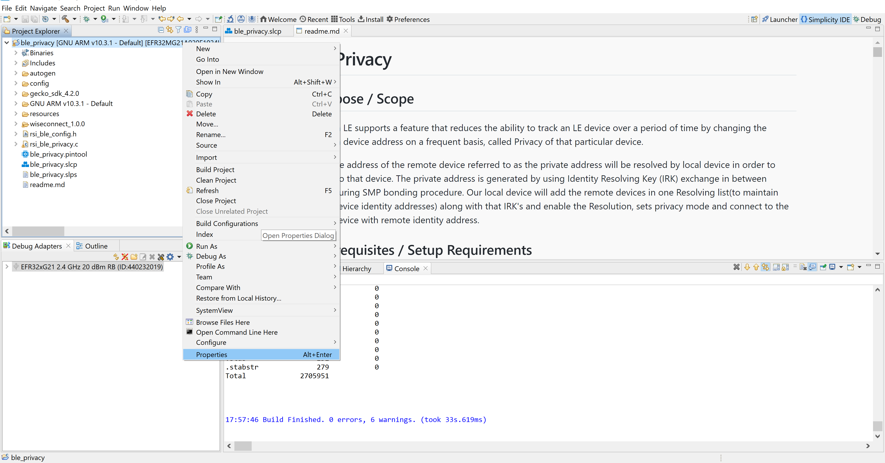 

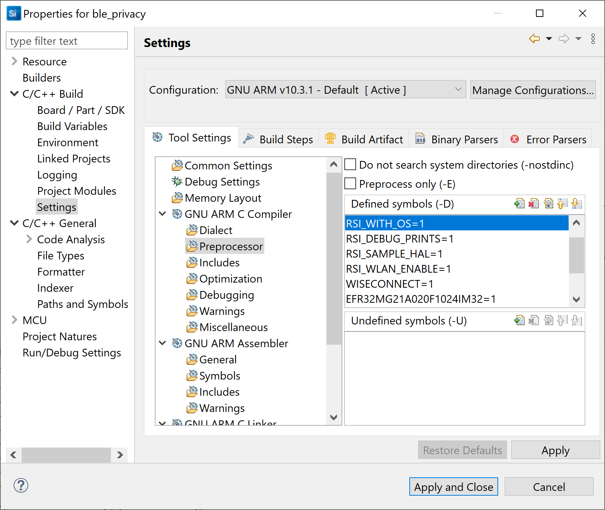

### 8.2 Bare Metal with Keil
- Open project in Keil IDE and click on 'Options for Target'
- Go to 'C/C++' tab and remove 'RSI_WITH_OS' macro present under Preprocessor Symbols
- Click on 'OK' button to save the settings
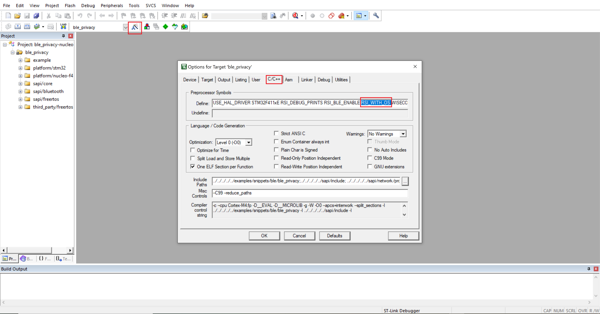