# BLE Test Modes

## 1. Purpose / Scope

This application demonstrates how to test the BLE GAP peripheral role.

## 2. Prerequisites / Setup Requirements

Before running the application, the user will need the following things to setup.

### 2.1 Hardware Requirements

- Windows PC with Host interface(UART/ SPI/ SDIO).
   - SiWx91x Wi-Fi Evaluation Kit. The SiWx91x supports multiple operating modes. See [Operating Modes]() for details.
  - **SoC Mode**: 
      - Silicon Labs [BRD4325A](https://www.silabs.com/)
  - **NCP Mode**:
      - Silicon Labs [(BRD4180A, BRD4280B)](https://www.silabs.com/);
      - Host MCU Eval Kit. This example has been tested with:
        - Silicon Labs [WSTK + EFR32MG21](https://www.silabs.com/development-tools/wireless/efr32xg21-bluetooth-starter-kit)
        - Silicon Labs [WSTK + EFM32GG11](https://www.silabs.com/development-tools/mcu/32-bit/efm32gg11-starter-kit)
- BLE peripheral device
   			
### 2.2 Software Requirements
    
- Embedded Development Environment

   - For Silicon Labs EFx32, use the latest version of [Simplicity Studio](https://www.silabs.com/developers/simplicity-studio)
   
- Download and install the Silicon Labs [EFR Connect App](https://www.silabs.com/developers/efr-connect-mobile-app) in the android smart phones for testing BLE applications. Users can also use their choice of BLE apps available in Android/iOS smart phones.

### 2.3 Setup Diagram:
   
**SoC Mode :** 
 <br>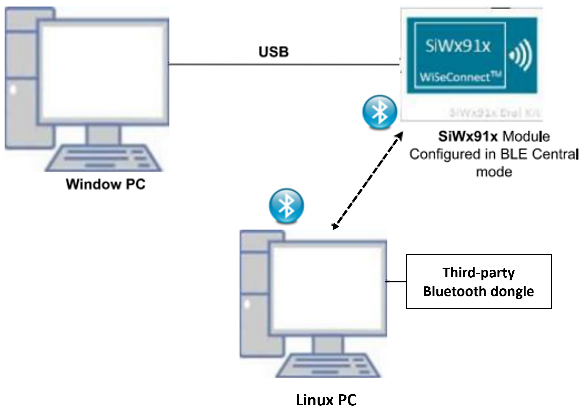<br> 

  
**NCP Mode :** 
 <br>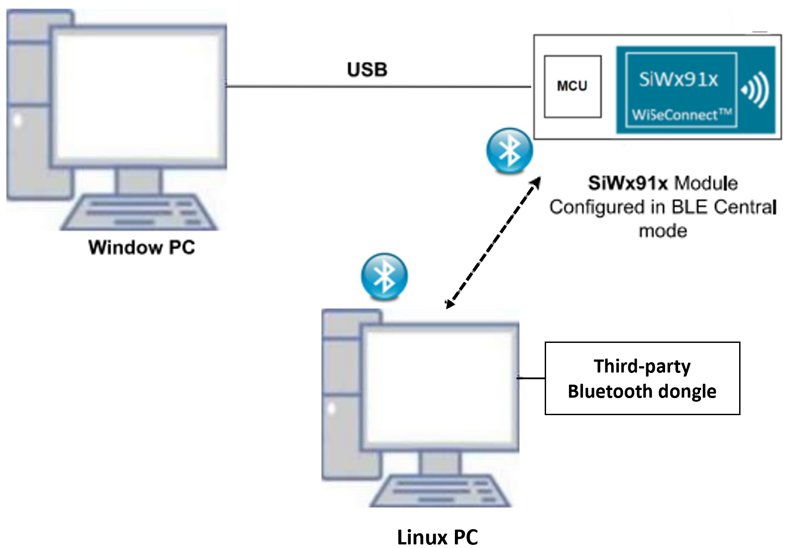<br> 
	

## 3. Application Build Environment

### 3.1 Project Setup

- **SoC Mode**
  - **Silicon Labs SiWx91x SoC**. Follow the [Getting Started with SiWx91x SoC](https://docs.silabs.com/) to setup the example to work with SiWx91x SoC and Simplicity Studio.
- **NCP Mode**
  - **Silicon Labs EFx32 Host**. Follow the [Getting Started with EFx32](https://docs.silabs.com/rs9116-wiseconnect/latest/wifibt-wc-getting-started-with-efx32/) to setup the example to work with EFx32 and Simplicity Studio.
  
### 3.2 NCP Mode - Host Interface 

* By default, the application is configured to use the SPI bus for interfacing between Host platforms(EFR32MG21) and the SiWx91x EVK.
		
### 3.3 Bare Metal/RTOS Support

This application supports bare metal and RTOS environment. By default, the application project files (Keil and Simplicity Studio) are provided with RTOS configuration. To select a bare metal configuration, see [Selecting bare metal](#selecting-bare-metal).

## 4. Application Configuration Parameters

The application can be configured to suit your requirements and development environment. Read through the following sections and make any changes needed.

**4.1** Configuring the Application for Tx:

**4.1.1** Open `rsi_ble_testmodes.c` file

1. User must update the below parameters 
-  `RSI_CONFIG_TEST_MODE` refers the Transmit Mode of the Silicon Labs module to be selected.
```c
	 #define RSI_CONFIG_TEST_MODE                          RSI_BLE_TESTMODE_TRANSMIT
```

-  `RSI_BLE_TX_PAYLOAD_LEN` refers the Transmit packet length.
```c
	 #define RSI_BLE_TX_PAYLOAD_LEN                        0x20
```
- `RSI_BLE_TX_PAYLOAD_TYPE` referes the Transmit packet payload type
```c
	 #define RSI_BLE_TX_PAYLOAD_TYPE                       PRBS9_SEQ
```

- **RSI_SEL_ANTENNA** refers the antenna which is to be used by Silicon Labs module. 
> If the user using internal antenna then set,
```c
	 #define RSI_SEL_ANTENNA                               RSI_SEL_INTERNAL_ANTENNA
```
> If the user using an external antenna (U.FL connector).
   ```c
	 #define RSI_SEL_ANTENNA                               RSI_SEL_EXTERNAL_ANTENNA
```
2. Open `rsi_ble_config.h` file and update/modify following macros,
```c
	 #define RSI_BLE_PWR_INX                               30
	 #define RSI_BLE_PWR_SAVE_OPTIONS                      0
```
   
   **Note:**
   rsi_bt_config.h, rsi_wlan_config.h and rsi_ble_config.h files are already set with the desired configuration in respective example folders user need not change for each example.

**4.2** Configuring the Application for Rx:

**4.2.1** Open `rsi_ble_testmodes.c` file

1. User must update the below parameters 
-  `RSI_CONFIG_TEST_MODE` refers the Receive Mode of the Silicon Labs module to be selected.
```c
	 #define RSI_CONFIG_TEST_MODE                    RSI_BLE_TESTMODE_RECEIVE
```
- `RSI_SEL_ANTENNA` refers to the antenna which is to be used by Silicon Labs module. 
> If the user using internal antenna then set,
```c
	 #define RSI_SEL_ANTENNA                         RSI_SEL_INTERNAL_ANTENNA
``` 
  > If the user using an external antenna (U.FL connector) 
   ```c
	 #define RSI_SEL_ANTENNA                         RSI_SEL_EXTERNAL_ANTENNA
``` 

   
## 5. Testing the Application

Follow the below steps for the successful execution of the application.

### 5.1 Loading the SiWx91x Firmware

Refer [Getting started with a PC](https://docs.silabs.com/rs9116/latest/wiseconnect-getting-started) to load the firmware into SiWx91x EVK. The firmware file is located in `<SDK>/firmware/`

### 5.2 Creating the Project and builing the Application
  
Refer [Getting started with EFX32](https://docs.silabs.com/rs9116-wiseconnect/latest/wifibt-wc-getting-started-with-efx32/), for settin-up EFR & EFM host platforms

#### 5.2.1 Project Creation - SoC Mode : 

- Connect your board. The Si917 compatible SoC board is **BRD4325A**.
- Studio should detect your board. Your board will be shown here.


#### 5.2.2 Project Creation - NCP Mode : 

- Connect your board. The supported NCP boards are: **BRD4180A,BRD4280B**
- Studio should detect your board. Your board will be shown here.


#### 5.2.3 Selecting an example application and generate project

- Go to the 'EXAMPLE PROJECT & DEMOS' tab and select your desired example application
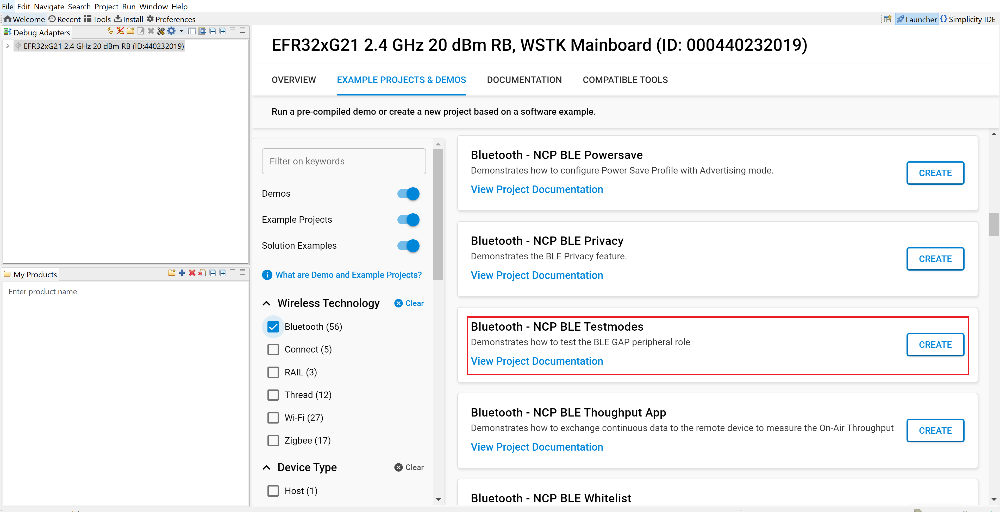
- Click 'Create'. The "New Project Wizard" window appears. Click 'Finish'
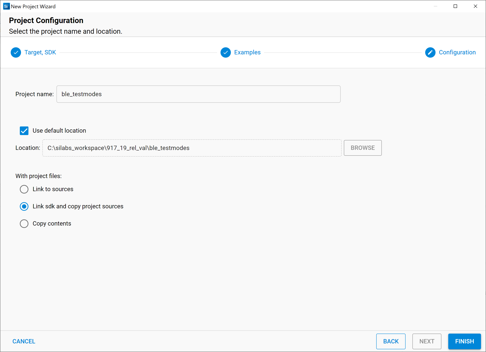

#### 5.2.4 Build Project - SoC Mode

- Once the project is created, right click on project and go to properties → C/C++ Build → Settings → Build Steps
- Add post_build_script_SimplicityStudio.bat file path (SI917_COMBO_SDK.X.X.X.XX\utilities\isp_scripts_common_flash) in build steps settings as shown in below image.
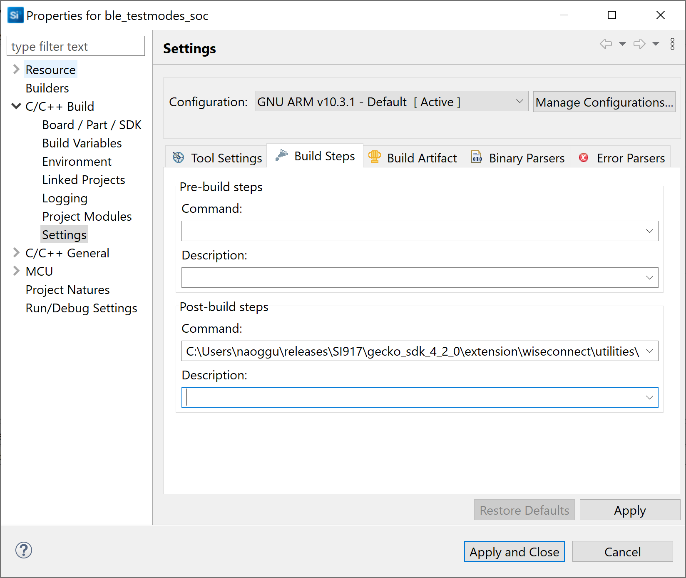
- Check for M4 projects macros in preprocessor settings(RSI_M4_INTERFACE=1)
- Check for 9117 macro in preprocessor settings(CHIP_9117=1).
- Click on the build icon (hammer) to build the project
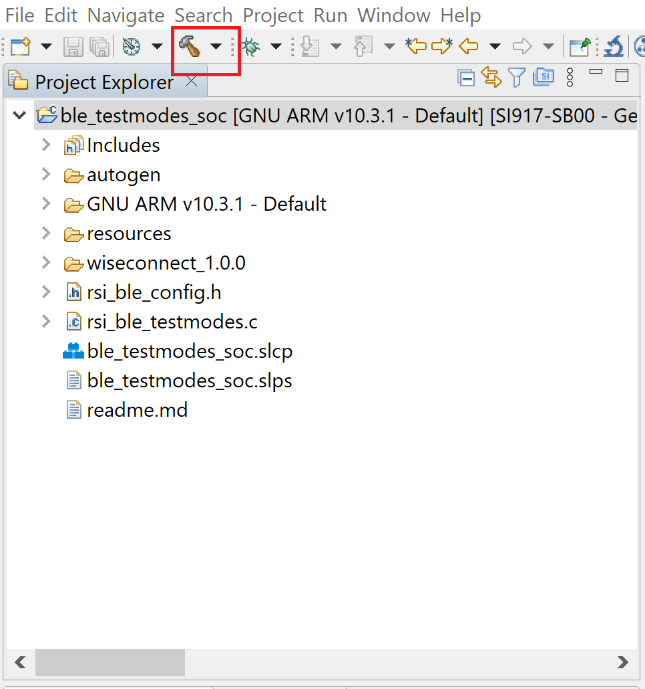
- Successful build output will show as below.
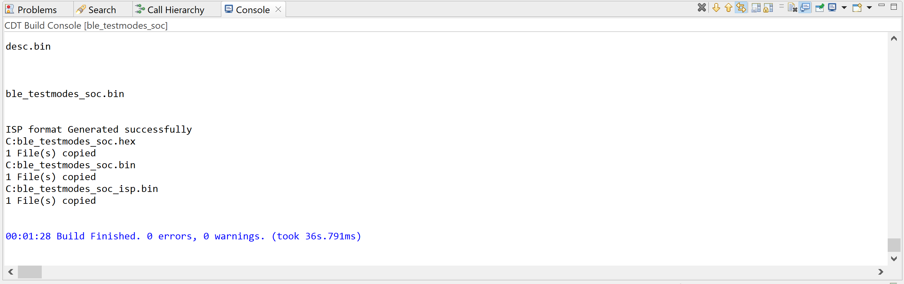

#### 5.2.5 Build Project - NCP Mode :

- Check for 9117 macro in preprocessor settings(CHIP_9117=1).
- Click on the build icon (hammer) to build the project
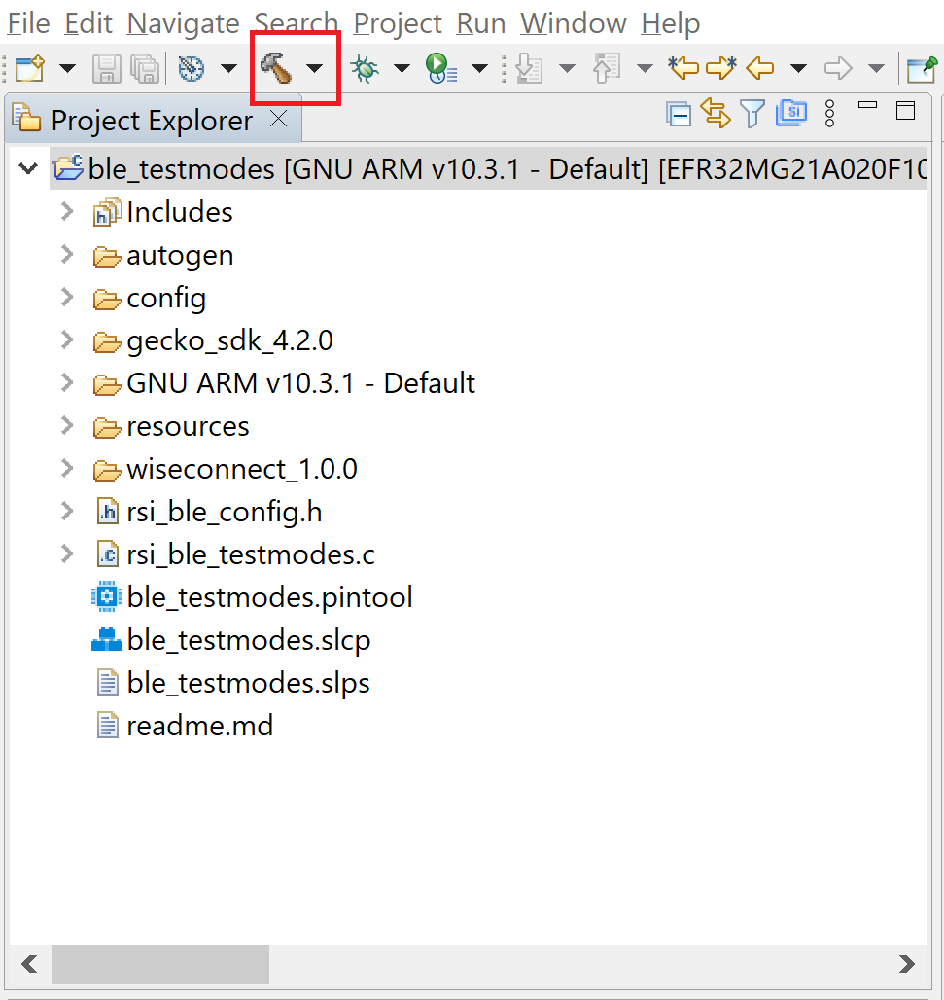
- Successful build output will show as below.
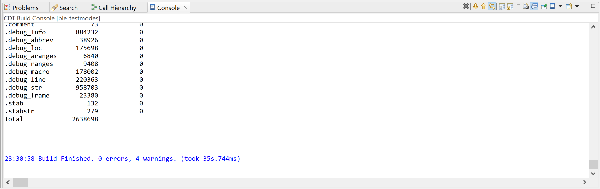

## 6. Program the device

Once the build was successfull, right click on project and click on Debug As->Silicon Labs ARM Program as shown in below image.
### SoC Mode :
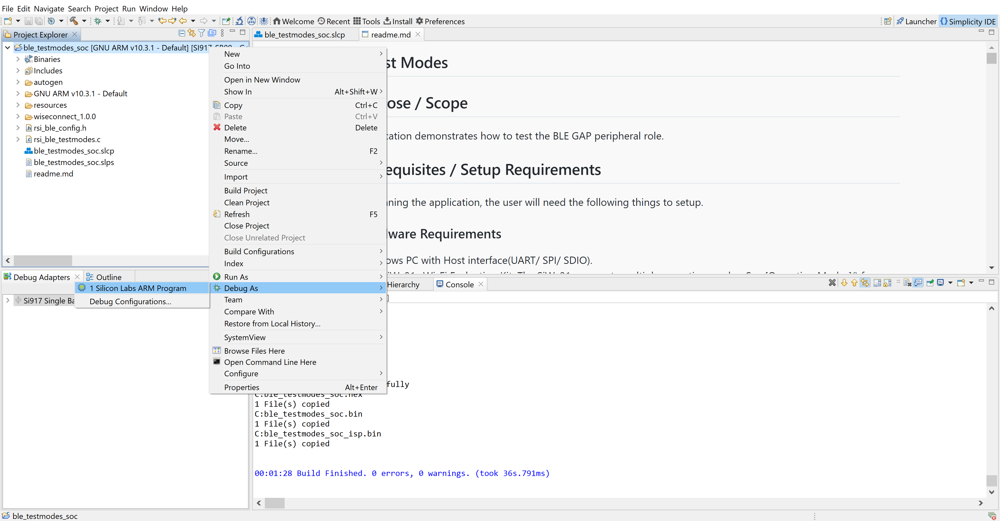
### NCP Mode : 
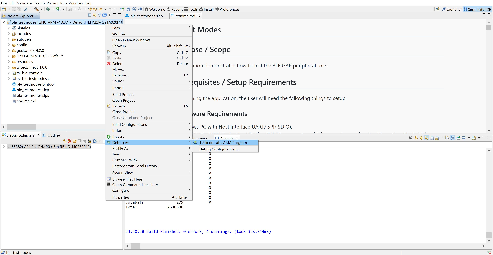

### 6.1 Running the SiWx91x Application
   
### Configuring the Application for Tx:
1. After the program gets executed, Silicon Labs module will Transmit the packets with desired length.
2. Run the below command using Third party dongle to verify whether the packets are transmitted or not from the Silicon Labs module.
3. hcitool -i hcix cmd 0x08 0x001D 0x10 → (hcix – Interface of third party dongle, 0x10 – Received  channel)
4. Received channel of third party dongle should be same as transmit channel of Silicon Labs module. 
5. Run the below command using Third party dongle to stop receiving.
6. hcitool -i hcix cmd 0x08 0x001F (hcix – Interface of third party dongle)
7. Verify the status parameters whether the packets are received or not after receiving stop command.
8. Refer the below images for Third party dongle prints
   - commands log
   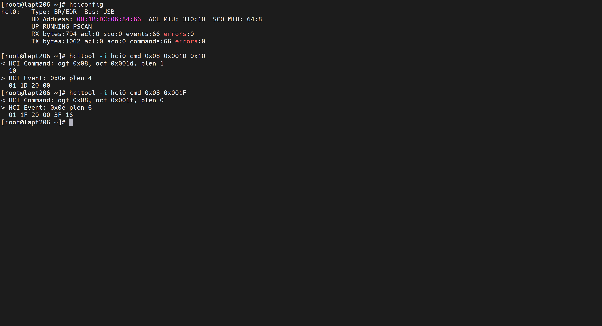
   - bt mon log
   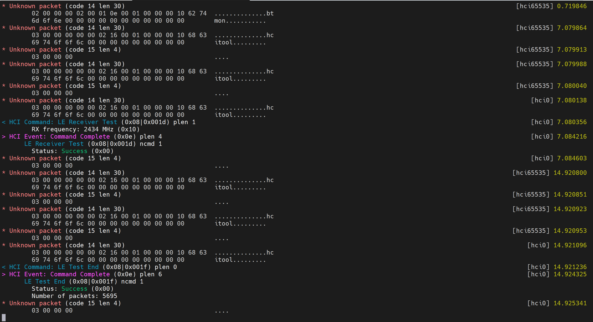

### Configuring the Application for Rx:
1. After the program gets executed, Silicon Labs module will Receive the packets.
2. Run the below command using Third party dongle to transmit the packets to Silicon Labs module.
3. hcitool -i hcix cmd 0x08 0x001E 0x10 0x20 0x01 → (hcix – Interface of third party dongle, 0x10 – Received  channel , 0x20 – Payload length, 0x01 – Payload Type)
4. Received channel of Silicon Labs module should be same as transmit channel of Third party dongle.
5. Refer the below images for Third party dongle prints
   - Command log:
   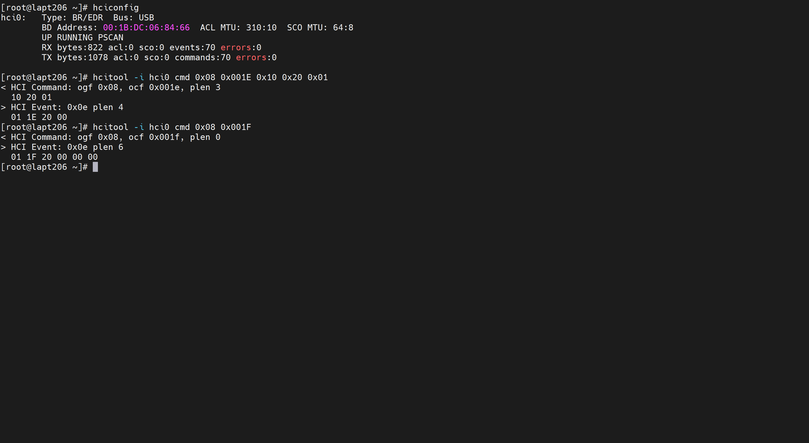
   - btmon log:
   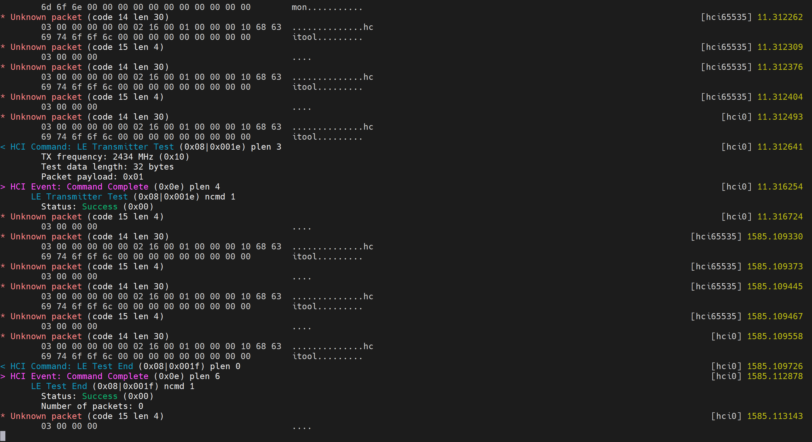


## 7. Observing the output prints on serial terminal

### 7.1 SoC Mode:
- Connect USB to UART connector Tx and GND pins to WSTK radio board.

   - Connect Tx(Pin-6) to P27 on WSTK
   - Connect GND(Pin 8 or 10) to GND on WSTK

      
- Prints can see as below in any Console terminal

   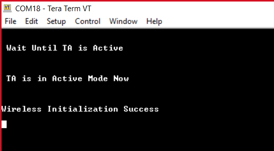

### 7.2 NCP Mode:
- Prints can see as below in any Console terminal
<br>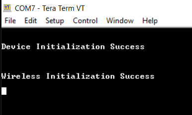<br>

## 8. Selecting Bare Metal
The application has been designed to work with FreeRTOS and Bare Metal configurations. By default, the application project files (Simplicity studio) are configured with FreeRTOS enabled. The following steps demonstrate how to configure Simplicity Studio to test the application in a Bare Metal environment.

### 8.1 Bare Metal with Simplicity Studio
- Open project in Simplicity Studio
- Right click on the project and choose 'Properties'
- GO to 'C/C++ Build' | 'Settings' | 'GNU ARM C Compiler' | 'Preprocessor' and remove macro 'RSI_WITH_OS=1'
- Click on 'Apply' and 'OK' to save the settings
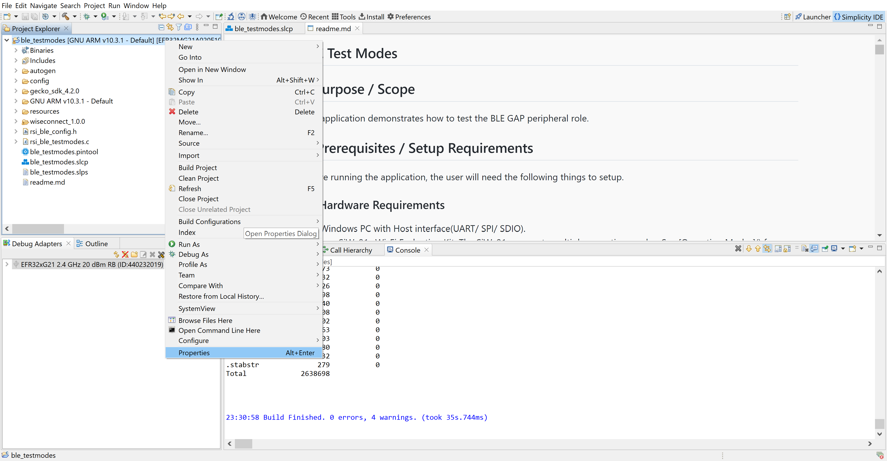
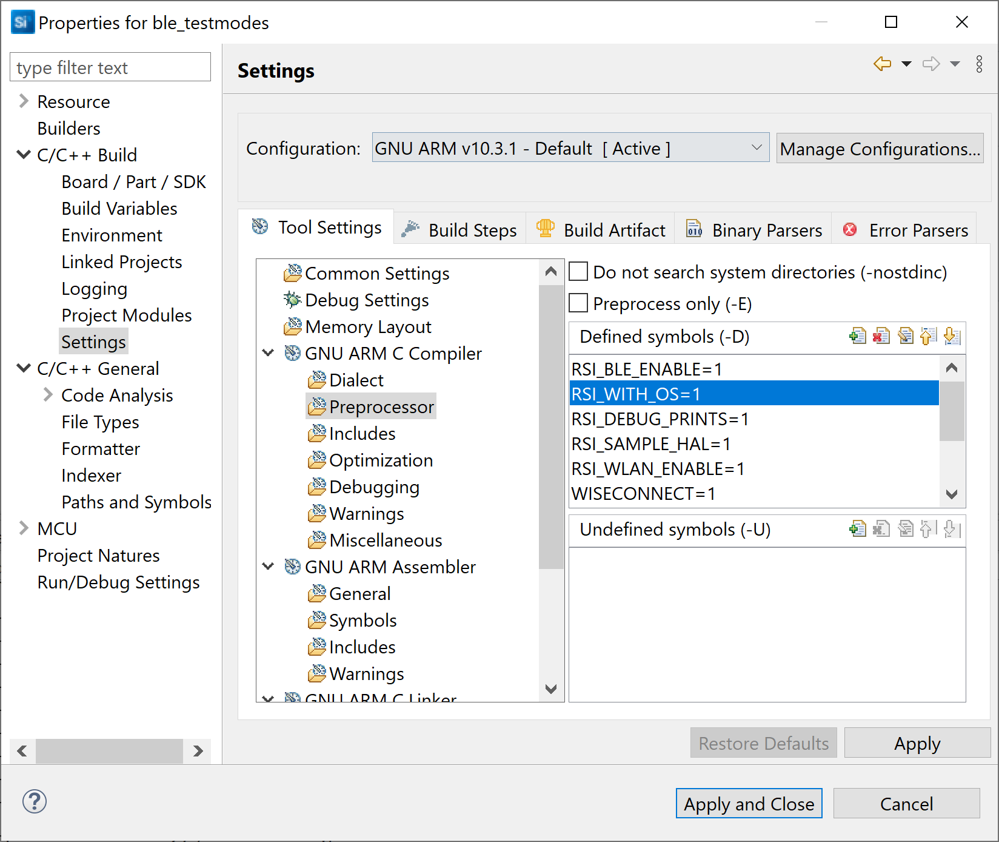

### 8.2 Bare Metal with Keil
- Open project in Keil IDE and click on 'Options for Target'
- Go to 'C/C++' tab and remove 'RSI_WITH_OS' macro present under Preprocessor Symbols
- Click on 'OK' button to save the settings
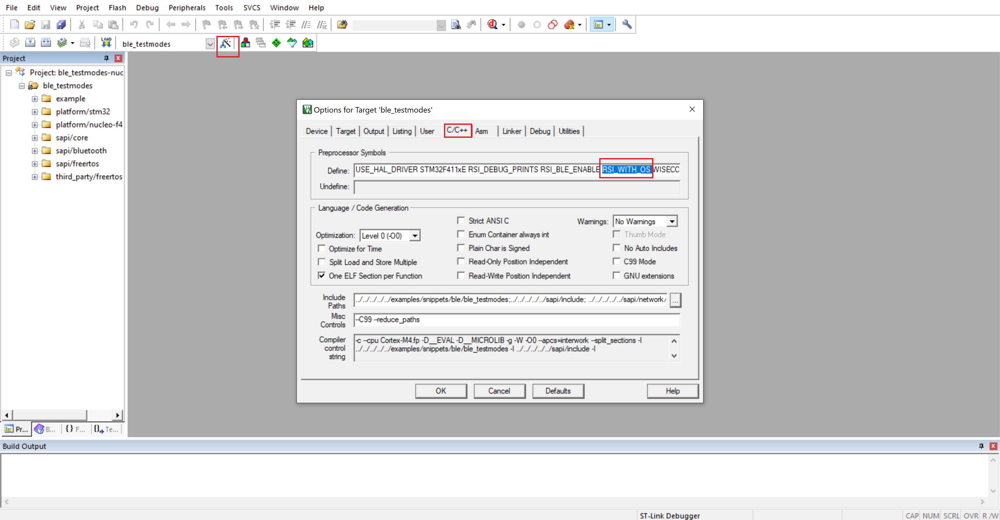
