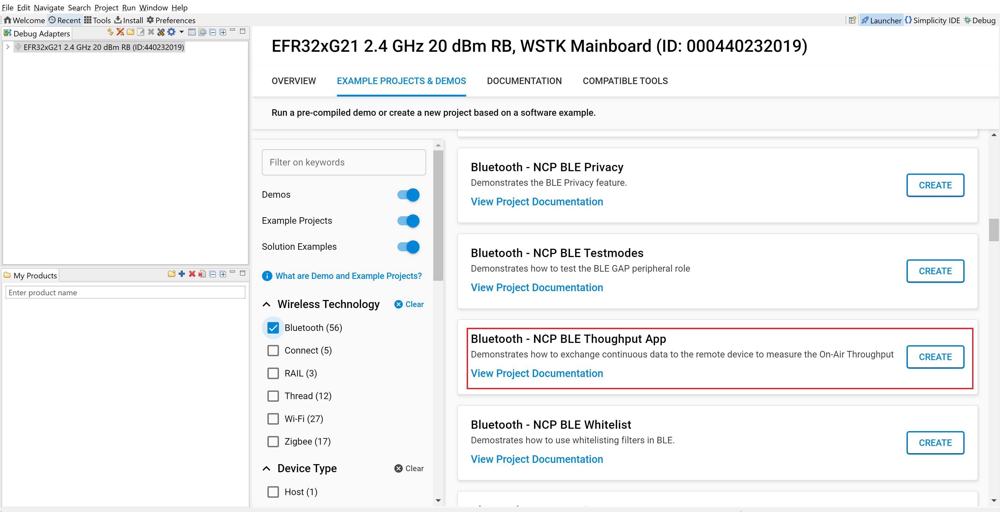
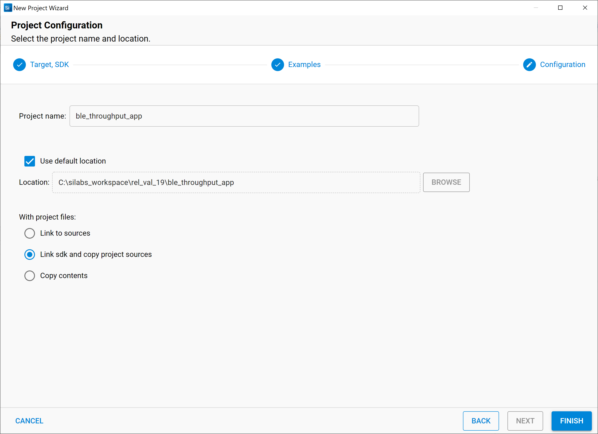
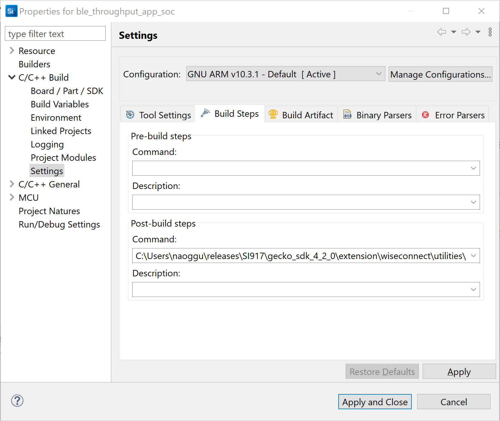
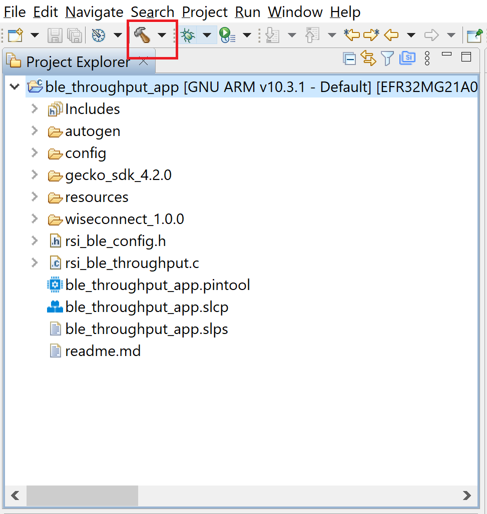
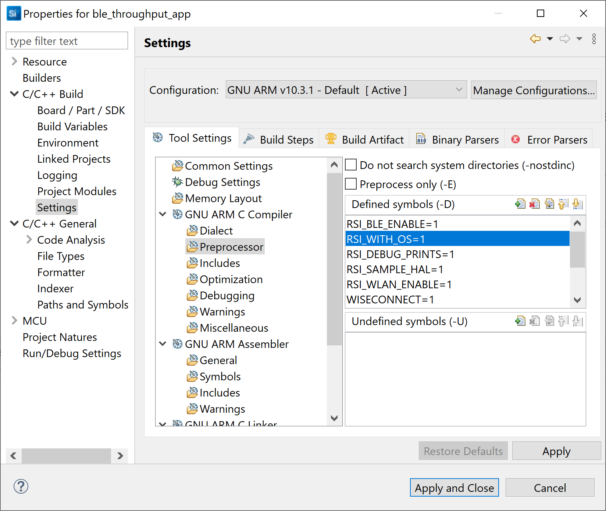

## BLE Throughput App

## 1. Purpose / Scope

This application demonstrates how to exchange continuous data to the remote device to measure the On-Air Throughput using a BLE Sniffer.
- In this Application, the GATT server configures with Custom service with write, read, and notification characteristic UUIDs.
- When connected remote device enables the notification on UUID, Silicon Labs device sends the continuous notifications to the connected device.
- This is data can be captured with Sniffer to measure the throughputs.

**Sequence of Events**

This Application explains to the user how to:

- Create a Simple chat service
- Make the device advertise / scannable
- Connect from remote BLE device/ Connect to remote BLE device
- Initiate the Security
- Excite the Data length and Phy rate features
- Sends the notification messages to the connected peer/Smartphone when the notification is enabled

## 2. Prerequisites / Setup Requirements

Before running the application, the user will need the following things to setup.

### 2.1 Hardware Requirements

- Windows PC with Host interface(UART/ SPI/ SDIO).
   - SiWx91x Wi-Fi Evaluation Kit. The SiWx91x supports multiple operating modes. See [Operating Modes]() for details.
  - **SoC Mode**: 
      - Silicon Labs [BRD4325A](https://www.silabs.com/)
  - **NCP Mode**:
      - Silicon Labs [(BRD4180A, BRD4280B)](https://www.silabs.com/);
      - Host MCU Eval Kit. This example has been tested with:
        - Silicon Labs [WSTK + EFR32MG21](https://www.silabs.com/development-tools/wireless/efr32xg21-bluetooth-starter-kit)
        - Silicon Labs [WSTK + EFM32GG11](https://www.silabs.com/development-tools/mcu/32-bit/efm32gg11-starter-kit)
- BLE peripheral device in case of Silicon Labs module as master.
- BLE central device in case of Silicon Labs module as slave.

   			
### 2.2 Software Requirements
    
- Embedded Development Environment

   - For Silicon Labs EFx32, use the latest version of [Simplicity Studio](https://www.silabs.com/developers/simplicity-studio)
   
- Download and install the Silicon Labs [EFR Connect App](https://www.silabs.com/developers/efr-connect-mobile-app) in the android smart phones for testing BLE applications. Users can also use their choice of BLE apps available in Android/iOS smart phones.

### 2.3 Setup Diagram:
   
**SoC Mode :**
 <br><br> 

  
**NCP Mode :**  
 <br><br>


## 3. Application Build Environment

### 3.1 Project Setup

- **SoC Mode**
  - **Silicon Labs SiWx91x SoC**. Follow the [Getting Started with SiWx91x SoC](https://docs.silabs.com/) to setup the example to work with SiWx91x SoC and Simplicity Studio.
- **NCP Mode**
  - **Silicon Labs EFx32 Host**. Follow the [Getting Started with EFx32](https://docs.silabs.com/rs9116-wiseconnect/latest/wifibt-wc-getting-started-with-efx32/) to setup the example to work with EFx32 and Simplicity Studio.
  
### 3.2 NCP Mode - Host Interface 

* By default, the application is configured to use the SPI bus for interfacing between Host platforms(EFR32MG21) and the SiWx91x EVK.
		
### 3.3 Bare Metal/RTOS Support

This application supports bare metal and RTOS environment. By default, the application project files (Keil and Simplicity Studio) are provided with RTOS configuration. To select a bare metal configuration, see [Selecting bare metal](#selecting-bare-metal).

## 4. Application Configuration Parameters

The application can be configured to suit your requirements and development environment. Read through the following sections and make any changes needed.

**4.1** Open `rsi_ble_common_config.h` file

**4.1.1** User must update the below parameters 

 - **RSI_BLE_NEW_SERVICE_UUID** refers to the attribute value of the newly created service.
 ```c
	 #define RSI_BLE_NEW_SERVICE_UUID                                0xAABB
```

 -   **RSI_BLE_ATTRIBUTE_1_UUID** refers to the attribute type of the first attribute under this service **(RSI_BLE_NEW_SERVICE_UUID)**.
 ```c
     #define RSI_BLE_ATTRIBUTE_1_UUID                                0x1AA1
```	
   **BLE_THROUGHPUT** refers the name of the Silicon Labs device to appear during scanning by remote devices.
 ```c    
	 #define RSI_BLE_DEVICE_NAME                                  "BLE_THROUGHPUT"
```	 
**Note:**   Following are the **Non-configurable** macros in the application.

- **RSI_BLE_CHAR_SERV_UUID** refers to the attribute type of the characteristics to be added in a service.
```c
 #define RSI_BLE_CHAR_SERV_UUID                                    0x2803
 ```
- **RSI_BLE_CLIENT_CHAR_UUID** refers to the attribute type of the client characteristics descriptor to be added in a service.
	
```c	
     #define RSI_BLE_CLIENT_CHAR_UUID                                  0x2902
```	 
**Note:**  Following are the properties:
	
- **RSI_BLE_ATT_PROPERTY_READ** is used to set the READ property to an attribute value.
```c
#define RSI_BLE_ATT_PROPERTY_READ                                 0x02
```
- **RSI_BLE_ATT_PROPERTY_WRITE** is used to set the WRITE property to an attribute value.
```c
 #define RSI_BLE_ATT_PROPERTY_WRITE                                0x08
 ```
- **RSI_BLE_ATT_PROPERTY_NOTIFY** is used to set the NOTIFY property to an attribute value.
```c   
     #define RSI_BLE_ATT_PROPERTY_NOTIFY                               0x10
```
	 
   BT_GLOBAL_BUFF_LEN refers Number of bytes required by the application and the driver.
```c    
	 #define BT_GLOBAL_BUFF_LEN                                        15000
```

**4.2** Open `rsi_ble_config.h` file and update/modify following macros,
```c 
	 #define RSI_BLE_PWR_INX                                             30
     #define RSI_BLE_PWR_SAVE_OPTIONS                                    0
 
     #define RSI_BLE_REMOTE_DEV_ADDR                                     "00:12:45:AB:1D:32"
     #define RSI_REMOTE_DEVICE_NAME                                      "Note10"
 
     #define CONN_BY_ADDR                                                1
     #define CONN_BY_NAME                                                2
 
     #define CONNECT_OPTION                                              CONN_BY_NAME
 
     #define CENTERAL_ROLE                                               1
     #define PERIPHERAL_ROLE                                             2
     #define CONNECTION_ROLE                                             PERIPHERAL_ROLE
 
     #define CONN_INTERVAL_MIN                                           45
     #define CONN_INTERVAL_MAX                                           45
     #define CONN_LATENCY                                                0
     #define SUPERVISION_TIMEOUT                                         800
 
     #define SMP_ENABLE                                                  1
 
     #define TX_LEN                                                      0xFB
     #define TX_TIME                                                     0x0148
 
     #define TX_PHY_RATE                                                 0x02
     #define RX_PHY_RATE                                                 0x02
     #define CODDED_PHY_RATE                                             0x00
 
     #define NOTIFY_DISABLE                                              0x00
     #define NOTIFY_ENABLE                                               0x01
 
     #define DLE_ON                                                      1
 
     #define DLE_BUFFER_MODE                                             1
     #define DLE_BUFFER_COUNT                                            25
     #define RSI_BLE_MAX_DATA_LEN                                        232
 ```
**Note:**
	 rsi_ble_config.h file is already set with the desired configuration in respective example folders user need not change for each example.
	 ``` 

## 5. Testing the Application

Follow the below steps for the successful execution of the application.

### 5.1 Loading the SiWx91x Firmware

Refer [Getting started with a PC](https://docs.silabs.com/rs9116/latest/wiseconnect-getting-started) to load the firmware into SiWx91x EVK. The firmware file is located in `<SDK>/firmware/`

### 5.2 Creating the Project and builing the Application
  
Refer [Getting started with EFX32](https://docs.silabs.com/rs9116-wiseconnect/latest/wifibt-wc-getting-started-with-efx32/), for settin-up EFR & EFM host platforms

#### 5.2.1 Project Creation - SoC Mode : 

- Connect your board. The Si917 compatible SoC board is **BRD4325A**.
- Studio should detect your board. Your board will be shown here.


#### 5.2.2 Project Creation - NCP Mode : 

- Connect your board. The supported NCP boards are: **BRD4180A,BRD4280B**
- Studio should detect your board. Your board will be shown here.


#### 5.2.3 Selecting an example application and generate project

- Go to the 'EXAMPLE PROJECT & DEMOS' tab and select your desired example application

- Click 'Create'. The "New Project Wizard" window appears. Click 'Finish'


#### 5.2.4 Build Project - SoC Mode

- Once the project is created, right click on project and go to properties → C/C++ Build → Settings → Build Steps
- Add post_build_script_SimplicityStudio.bat file path (SI917_COMBO_SDK.X.X.X.XX\utilities\isp_scripts_common_flash) in build steps settings as shown in below image.

- Check for M4 projects macros in preprocessor settings(RSI_M4_INTERFACE=1)
- Check for 9117 macro in preprocessor settings(CHIP_9117=1).
- Click on the build icon (hammer) to build the project

- Successful build output will show as below.


#### 5.2.5 Build Project - NCP Mode :

- Check for 9117 macro in preprocessor settings(CHIP_9117=1).
- Click on the build icon (hammer) to build the project

- Successful build output will show as below.


## 6. Program the device

Once the build was successfull, right click on project and click on Debug As->Silicon Labs ARM Program as shown in below image.
### SoC Mode :

### NCP Mode : 


### 6.1 Running the SiWx91x Application
   
1. After the program gets executed, the Silicon Labs module will be in an Advertising state by default.

2. Connect any serial console for prints.

3. Open a EFR Connect App on the Smartphone and do the scan.

4. In the App, the Silicon Labs module device will appear with the name configured in the macro **RSI_BLE_DEVICE_NAME (Ex: "BLE_THROUGHPUT")**
<br><br>

5. Initiate a connection from the App.

6. After successful connection, EFR connect APP displays the supported services of Silicon Labs module
<br><br>

7. Select the attribute service which is added **RSI_BLE_NEW_SERVICE_UUID**
   **(Ex: 0xAABB)**
8. After Enable notifications for the read attribute **RSI_BLE_ATTRIBUTE_2_UUID**
   **(Example: 0x1BB1) So that the GATT server notifies when value updated in that particular attribute.**
   <br><br>
9. Please refer to the given below images for continuous notification received on the mobile.
<br><br>

10. The serial teriminal are displayed as below.
<br><br>


## 7. Observing the output prints on serial terminal

### 7.1 SoC Mode:
- Connect USB to UART connector Tx and GND pins to WSTK radio board.

   - Connect Tx(Pin-6) to P27 on WSTK
   - Connect GND(Pin 8 or 10) to GND on WSTK

      

- Prints can see as below in any Console terminal
   <br><br>

### 7.2 NCP Mode:

- Prints can see as below in any Console terminal
   <br><br>

### 8.1 Bare Metal with Simplicity Studio
- Open the project in Simplicity Studio
- Right click on the project and choose 'Properties'
- Go to 'C/C++ Build' | 'Settings' | 'GNU ARM C Compiler' | 'Symbols' and remove macro 'RSI_WITH_OS=1'
- Select 'Apply' and 'OK' to save the settings

 



### 8.2 Bare Metal with Keil
- Open project in Keil IDE and click on 'Options for Target'
- Go to 'C/C++' tab and remove 'RSI_WITH_OS' macro present under Preprocessor Symbols
- Click on 'OK' button to save the settings

