# GATT Long Read

## 1. Purpose / Scope

This application demonstrates how a GATT client device accesses a GATT server device for long read, means when user wants to read more than MTU(minimum of local and remote devices MTU's) size of data.
- Silicon Labs module acts as a GATT client/server(based on user configuration) and explains reads/writes.
- Client role is initialized with Battery Service. 
- Server role is initialized with a custom service.

**Sequence of Events**

This Application explains to the user how to:

 - Advertising in SLAVE role
 - Connects with remote device in MASTER role.
 - Loop back the data came from the remote device
 - Read request to the remote device

## 2. Prerequisites / Setup Requirements

Before running the application, the user will need the following things to setup.

### 2.1 Hardware Requirements

- Windows PC with Host interface(UART/ SPI/ SDIO).
   - SiWx91x Wi-Fi Evaluation Kit. The SiWx91x supports multiple operating modes. See [Operating Modes]() for details.
  - **SoC Mode**: 
      - Silicon Labs [BRD4325A](https://www.silabs.com/)
  - **NCP Mode**:
      - Silicon Labs [(BRD4180A, BRD4280B)](https://www.silabs.com/);
      - Host MCU Eval Kit. This example has been tested with:
        - Silicon Labs [WSTK + EFR32MG21](https://www.silabs.com/development-tools/wireless/efr32xg21-bluetooth-starter-kit)
        - Silicon Labs [WSTK + EFM32GG11](https://www.silabs.com/development-tools/mcu/32-bit/efm32gg11-starter-kit)
- BLE peripheral device in case of Silicon Labs module as master.
- BLE central device in case of Silicon Labs module as slave.
   			
### 2.2 Software Requirements
    
- Embedded Development Environment

   - For Silicon Labs EFx32, use the latest version of [Simplicity Studio](https://www.silabs.com/developers/simplicity-studio)
   
- Download and install the Silicon Labs [EFR Connect App](https://www.silabs.com/developers/efr-connect-mobile-app) in the android smart phones for testing BLE applications. Users can also use their choice of BLE apps available in Android/iOS smart phones.

### 2.3 Setup Diagram:
   
**SoC Mode :** 

  
**NCP Mode :**  
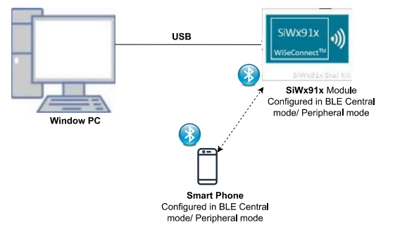
## 3. Application Build Environment

### 3.1 Project Setup

- **SoC Mode**
  - **Silicon Labs SiWx91x SoC**. Follow the [Getting Started with SiWx91x SoC](https://docs.silabs.com/) to setup the example to work with SiWx91x SoC and Simplicity Studio.
- **NCP Mode**
  - **Silicon Labs EFx32 Host**. Follow the [Getting Started with EFx32](https://docs.silabs.com/rs9116-wiseconnect/latest/wifibt-wc-getting-started-with-efx32/) to setup the example to work with EFx32 and Simplicity Studio.
  
### 3.2 NCP Mode - Host Interface 

By default, the application is configured to use the SPI bus for interfacing between Host platforms(EFR32MG21) and the SiWx91x EVK.
		
### 3.3 Bare Metal/RTOS Support

This application supports bare metal and RTOS environment. By default, the application project files (Keil and Simplicity Studio) are provided with RTOS configuration. To select a bare metal configuration, see [Selecting bare metal](#selecting-bare-metal).

## 4. Application Configuration Parameters

The application can be configured to suit your requirements and development environment. Read through the following sections and make any changes needed.

**4.1** Open **rsi_ble_long_read.c** file.

**4.1.1** User must update the below parameters 

- **RSI_BLE_DEV_ADDR_TYPE** refers address type of the remote device to connect.
```c
	 #define RSI_BLE_DEV_ADDR_TYPE                         LE_PUBLIC_ADDRESS
```	 
  - Based on the address of the advertising device, Valid configurations are

    - LE_RANDOM_ADDRESS
    - LE_PUBLIC_ADDRESS
    
    **Note:** Depends 
    - LE_PUBLIC_ADDRESS
   
   Note:
     Depends on the remote device, address type will be changed.
-  **RSI_BLE_DEV_ADDR** refers address of the remote device to connect.
```c
	 #define RSI_BLE_DEV_ADDR                              "00:1A:7D:DA:71:13"```
- **RSI_REMOTE_DEVICE_NAME** refers the name of remote device to which Silicon Labs device has to connect
```c
	 #define RSI_REMOTE_DEVICE_NAME                        "SILABS_DEV"  
   ```

   Note:
   Silicon Labs module can connect to remote device by referring either RSI_BLE_DEV_ADDR or RSI_REMOTE_DEVICE_NAME of the remote device.
   
   
-  **GATT_ROLE** refers the GATT role of the Silicon Labs device
```c
	 #define SERVER                                        0
	 #define CLIENT                                        1
	 #define GATT_ROLE                                     SERVER
```	 
   valid configurations of GATT_ROLE are:
   - SERVER
   - CLIENT

- **BT_GLOBAL_BUFF_LEN**  refers the Number of bytes required for the Application and the Driver.
```c
	 #define BT_GLOBAL_BUFF_LEN                            15000
``` 
- **RSI_BLE_CHAR_SERV_UUID** refers standard attribute type of characteristic service
```c
	 #define RSI_BLE_CHAR_SERV_UUID                       0x2803
```

- **RSI_BLE_CLIENT_CHAR_UUID**  refers standard attribute type of client characteristic configuration descriptor.
```c
	 #define RSI_BLE_CLIENT_CHAR_UUID                     0x2902```
- **RSI_BLE_NEW_SERVICE_UUID** refers service uuid when module acts as server
```c
#define RSI_BLE_NEW_SERVICE_UUID                      0xAABB
```

- **RSI_BLE_ATTRIBUTE_1_UUID** refers characteristic uuid when module acts as server
```c	 
	 #define RSI_BLE_ATTRIBUTE_1_UUID                      0x1AA1```
- **RSI_BLE_NEW_CLIENT_SERVICE_UUID** refers service present in GATT server LE device.
```c
	 #define RSI_BLE_NEW_CLIENT_SERVICE_UUID               0x180F
```

- **RSI_BLE_CLIENT_ATTRIBUTE_1_UUID** refers characteristic present under above service in GATT server LE device.
```c
	 #define RSI_BLE_CLIENT_ATTRIBUTE_1_UUID               0x2A19```
- **RSI_BLE_MAX_DATA_LEN** refers the maximum attribute value length.
```c 
 	 #define RSI_BLE_MAX_DATA_LEN                          20```
- Following are event numbers for specific events
```c
	 #define RSI_BLE_CONNN_EVENT                           1
	 #define RSI_BLE_DISCONN_EVENT                         2
	 #define RSI_BLE_GATT_WRITE_EVENT                      3
	 #define RSI_BLE_READ_REQ_EVENT                        4
	 #define RSI_BLE_MTU_EVENT                             5
	 #define RSI_BLE_GATT_PROFILE_RESP_EVENT               6
	 #define RSI_BLE_GATT_CHAR_SERVICES_RESP_EVENT         7```
- Following are the non-configurable macros in the application.
```c
	 #define RSI_BLE_ATT_PROPERTY_READ                     0x02
	 #define RSI_BLE_ATT_PROPERTY_WRITE                    0x08
	 #define RSI_BLE_ATT_PROPERTY_NOTIFY                   0x10
```

**4.2** Open rsi_wlan_config.h file and update/modify following macros,
```c
	 #define CONCURRENT_MODE                               RSI_DISABLE
```	 
   **Opermode command parameters**
```c
	 #define RSI_FEATURE_BIT_MAP                           FEAT_SECURITY_OPEN
	 #define RSI_TCP_IP_BYPASS                             RSI_DISABLE
	 #define RSI_TCP_IP_FEATURE_BIT_MAP                    TCP_IP_FEAT_DHCPV4_CLIENT
	 #define RSI_CUSTOM_FEATURE_BIT_MAP                    FEAT_CUSTOM_FEAT_EXTENTION_VALID
	 #define RSI_EXT_CUSTOM_FEATURE_BIT_MAP                EXT_FEAT_384K_MODE
	 #define RSI_BAND                                      RSI_BAND_2P4GHZ
```	 

**4.3** Open rsi_ble_config.h file and update/modify following macros,
```c
	#define RSI_BLE_PWR_INX                               30
	#define RSI_BLE_PWR_SAVE_OPTIONS                      0
```

**Note:** `rsi_ble_config.h` files are already set with desired configuration in respective example folders user need not change for each example. 
   
## 5. Testing the Application

- Follow the below steps for the successful execution of the application.

### 5.1 Loading the SiWx91x Firmware

- Refer [Getting started with a PC](https://docs.silabs.com/rs9116/latest/wiseconnect-getting-started) to load the firmware into SiWx91x EVK. The firmware file is located in `<SDK>/connectivity_firmware/`

### 5.2 Creating the Project and builing the Application
  
- Refer [Getting started with EFX32](https://docs.silabs.com/rs9116-wiseconnect/latest/wifibt-wc-getting-started-with-efx32/), for settin-up EFR & EFM host platforms

#### 5.2.1 Project Creation - SoC Mode : 

- Connect your board. The Si917 compatible SoC board is **BRD4325A**.
- Studio should detect your board. Your board will be shown here.
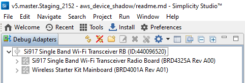
#### 5.2.2 Project Creation - NCP Mode : 

- Connect your board. The supported NCP boards are: **BRD4180A,BRD4280B**
- Studio should detect your board. Your board will be shown here.

#### 5.2.3 Selecting an example application and generate project

- Go to the 'EXAMPLE PROJECT & DEMOS' tab and select your desired example application
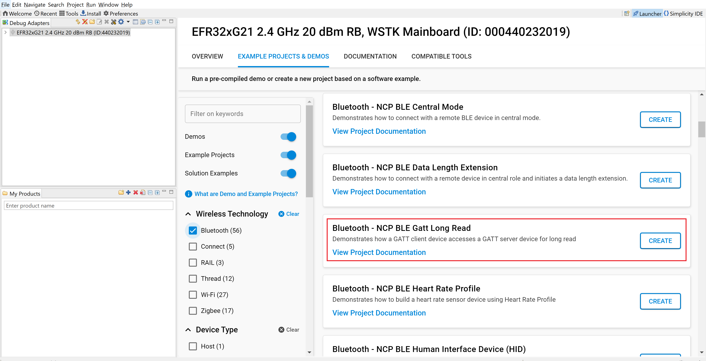
- Click 'Create'. The "New Project Wizard" window appears. Click 'Finish'
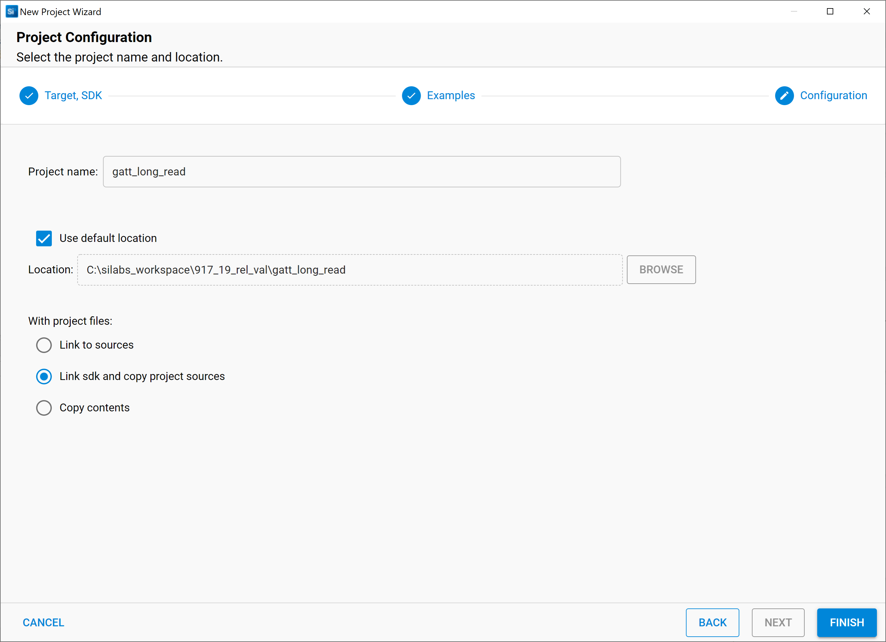
#### 5.2.4 Build Project - SoC Mode

- Once the project is created, right click on project and go to properties → C/C++ Build → Settings → Build Steps
- Add post_build_script_SimplicityStudio.bat file path (SI917_COMBO_SDK.X.X.X.XX\utilities\isp_scripts_common_flash) in build steps settings as shown in below image.
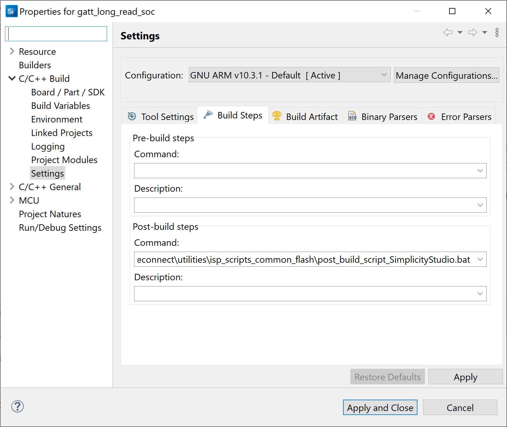
- Check for M4 projects macros in preprocessor settings(RSI_M4_INTERFACE=1)
- Check for 9117 macro in preprocessor settings(CHIP_9117=1).
- Click on the build icon (hammer) to build the project
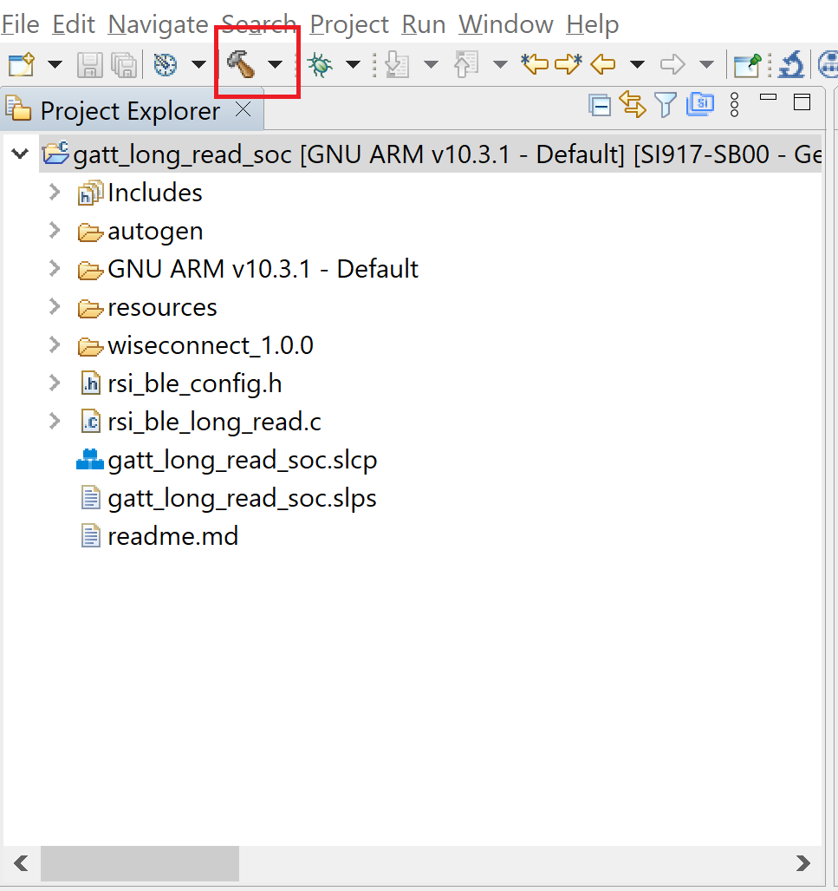
- Successful build output will show as below.
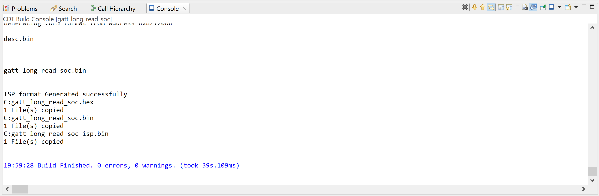
#### 5.2.5 Build Project - NCP Mode :

- Check for 9117 macro in preprocessor settings(CHIP_9117=1).
- Click on the build icon (hammer) to build the project
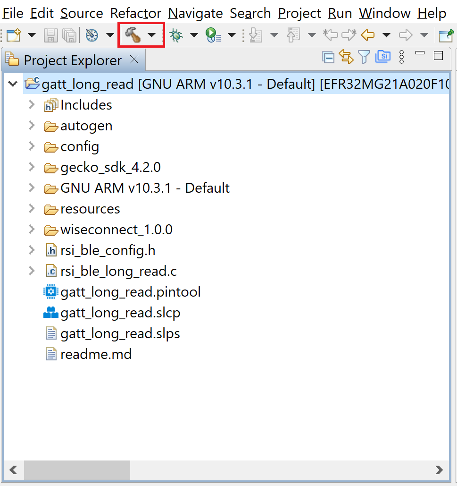
- Successful build output will show as below.
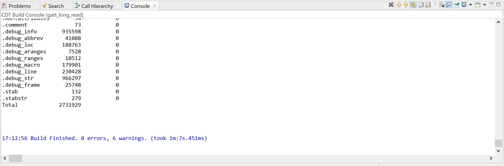
## 6. Program the device

- Once the build was successfull, right click on project and click on Debug As->Silicon Labs ARM Program as shown in below image.
### SoC Mode :
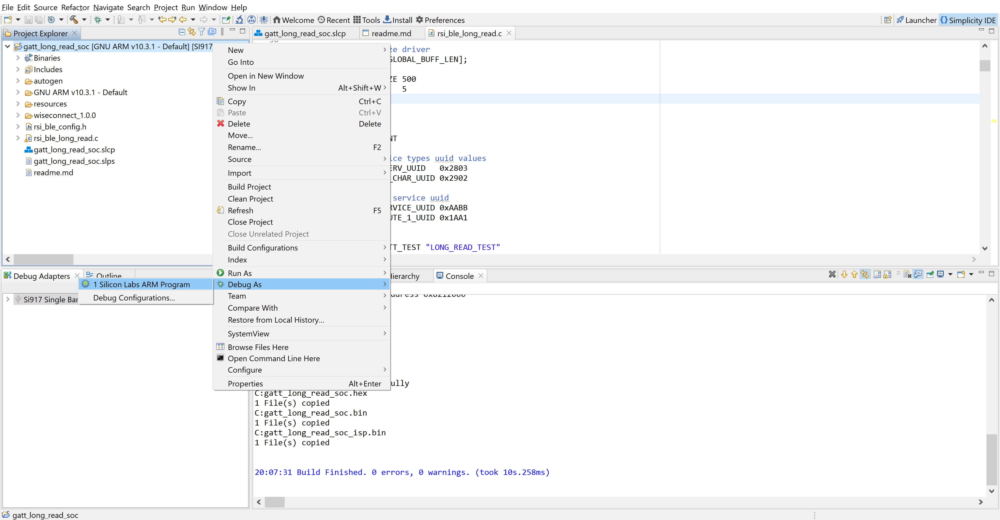
### NCP Mode : 
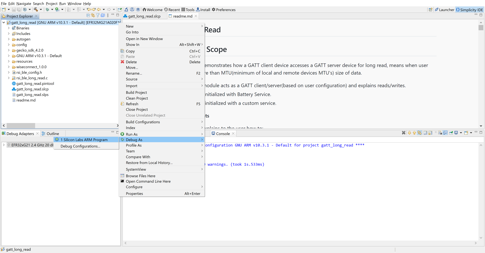
### 6.1 Running the SiWx91x Application

### 6.1.1 Steps to be followed to verify BLE GATT Long Read application as a SERVER

1. After the program gets executed, If Silicon Labs device is configured as **SERVER** specified in the macro **GATT_ROLE**, Silicon Labs will be in Advertising state.

2. Connect any serial console for prints.

3. Open the EFR Connect App in the Smartphone and do the scan.

4. In the App, Silicon Labs module device will appear with the name configured in the macro `RSI_BLE_APP_GATT_TEST (Ex: "LONG_READ_TEST")` or sometimes observed as Silicon Labs device as internal name "**SimpleBLEPeripheral**".
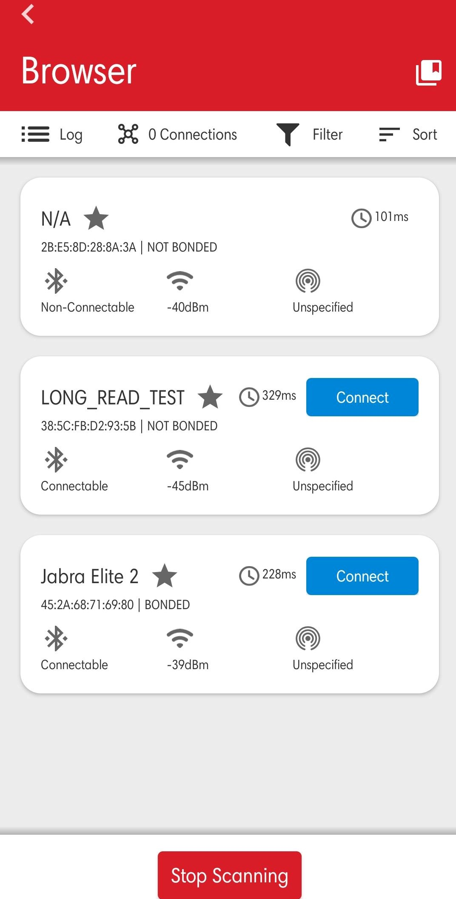
5. Initiate connection from the App.

6. After successful connection, EFR Connect APP displays the supported services of Silicon Labs module.
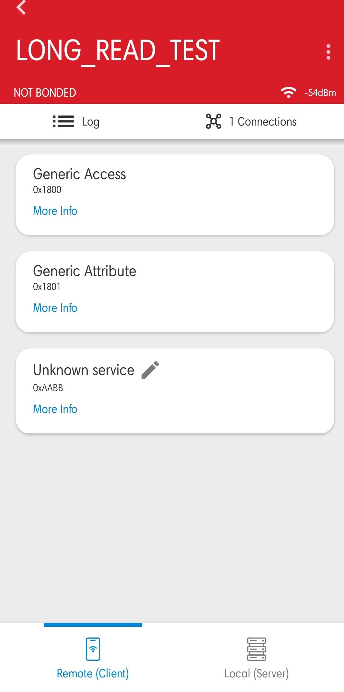
7. After connecting, mtu size will be updated. As per mtu size, write will be happen from Silicon Labs device

8. If mtu size is of 100 bytes, module can read upto 98 bytes, write upto 97 bytes

9. For the data more than 20 bytes, application has to store value and send using gatt_read_response function whenever remote device reads some handle's data.
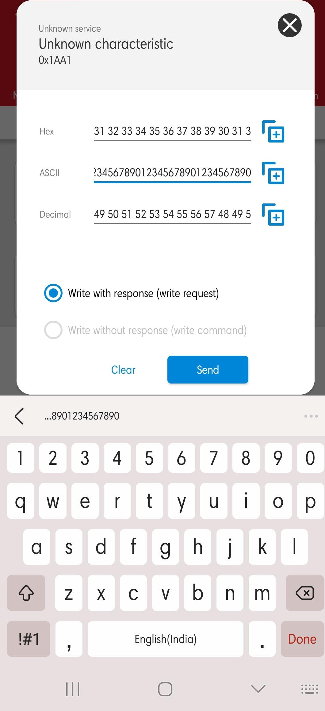
    ```
	 For read request event to be raised auth_read flag in rsi_ble_add_char_val_att function need to be set.
	 Based on GATT_ROLE configurable macro, this application will be act as a GATT server or GATT client device.
    ```

10. Refer the below images for console prints
- For SOC the console prints are shown below
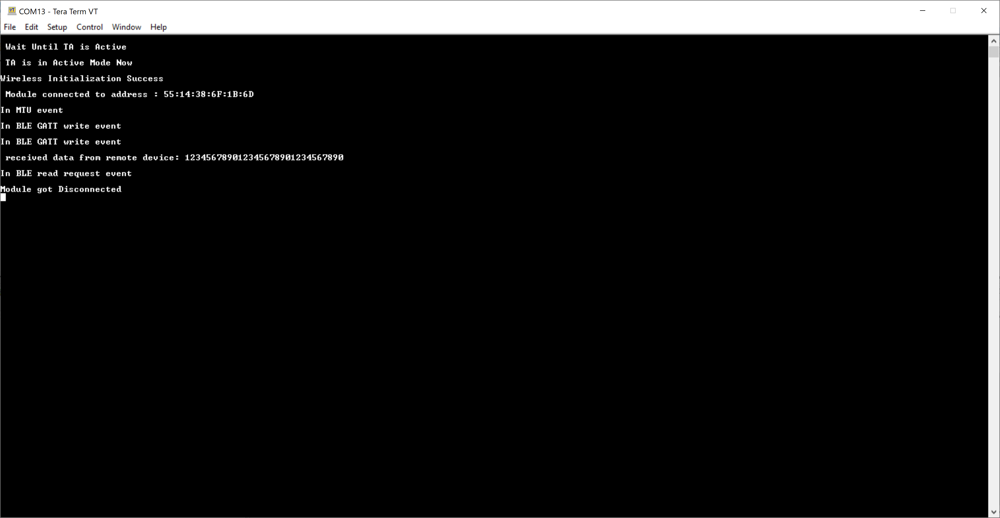
- For NCP the console prints are shown below
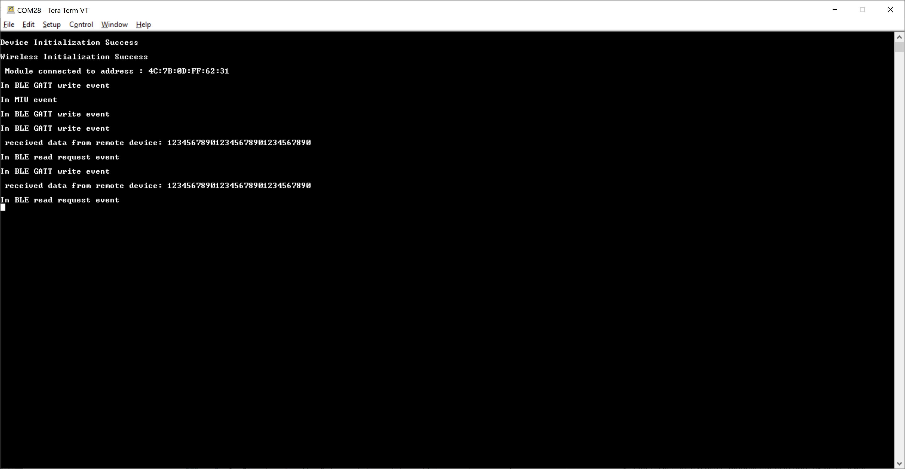
### 6.1.2 Steps to be followed to verify BLE GATT Long Read application as a CLIENT 

1. After the program gets executed, If Silicon Labs device is configured as **CLIENT** specified in the macro **GATT_ROLE**, Silicon Labs will be in Advertising state.

2. Connect any serial console for prints.
 

3. Open the EFR Connect APP and Create the **Battery service** to configure the Remote device as a GATT server.
   - Name: Battery service
   - UUID: 0x180F

   **Note:** Refer the [Adding Services](https://docs.silabs.com/bluetooth/5.0/miscellaneous/mobile/efr-connect-mobile-app) for creating the GATT server the EFR connect mobile APP as advertiser.

4. Add the characteristic services and their coresponding properties as shown below
   - Name: Battey level
   - UUID: 0x2A19
   - Property: Read & Write
   
   **Note:** Refer the [Adding Characteristics and Descriptors](https://docs.silabs.com/bluetooth/5.0/miscellaneous/mobile/efr-connect-mobile-app) for creating the GATT server in the EFR connect mobile APP.
   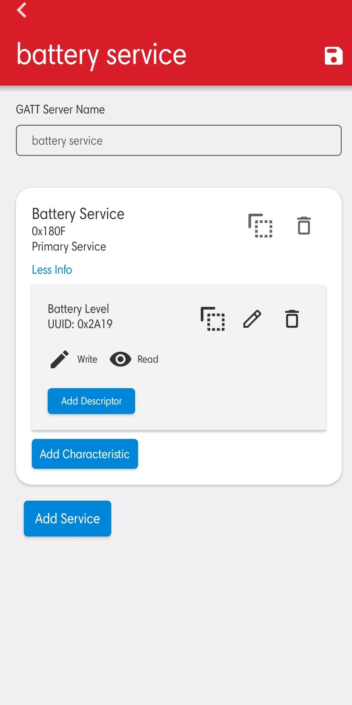
5. Configure the advertiser.

   **Note:** Refer the [Creating New Advertisement Sets](https://docs.silabs.com/bluetooth/5.0/miscellaneous/mobile/efr-connect-mobile-app) for configuring the EFR connect mobile APP as advertiser.

6. In Client mode, the Silicon Labs module will trying to connect with remote device as specified by `RSI_BLE_DEV_ADDR` or `RSI_REMOTE_DEVICE_NAME`.

7. Get all GATT profiles of remote device and Search for profile specified in the macro `RSI_BLE_NEW_CLIENT_SERVICE_UUID`. And get all characteristics of the battery service.

8. After connecting, mtu size will be updated. As per mtu(maximum transmit unit) size, read requests will be happen from Silicon Labs device
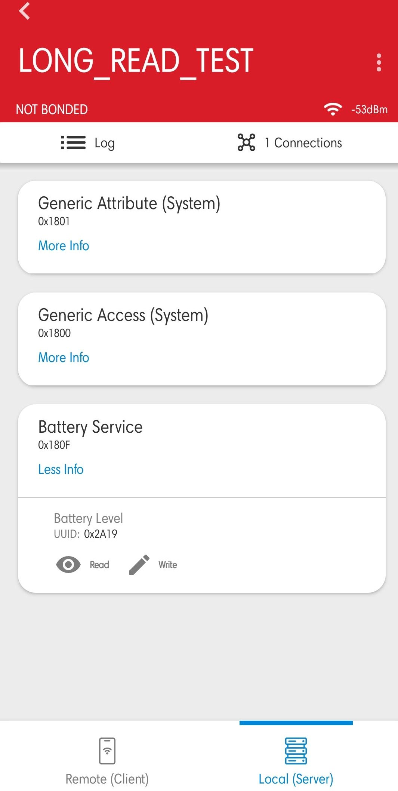
9. Refer the below images for console prints

- For SOC the console prints are shown below
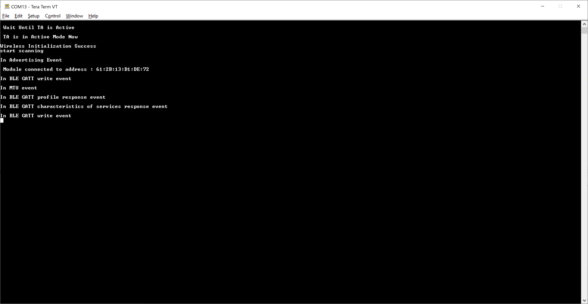
- For NCP the console prints are shown below
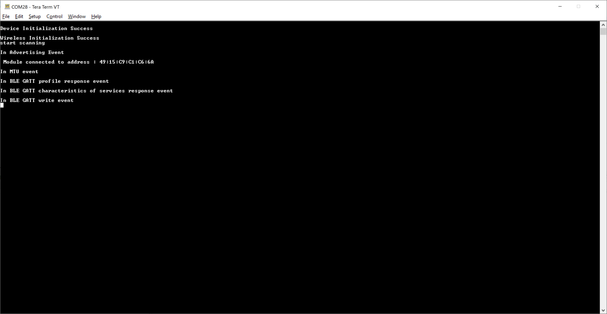
## 7. Observing the output prints on serial terminal

### 7.1 SoC Mode:
- Connect USB to UART connector Tx and GND pins to WSTK radio board.

   - Connect Tx(Pin-6) to P27 on WSTK
   - Connect GND(Pin 8 or 10) to GND on WSTK

      
- Prints can see as below in any Console terminal

### 7.2 NCP Mode:
- Prints can see as below in any Console terminal

## 8. Selecting Bare Metal
- The application has been designed to work with FreeRTOS and Bare Metal configurations. By default, the application project files (Simplicity studio) are configured with FreeRTOS enabled. The following steps demonstrate how to configure Simplicity Studio to test the application in a Bare Metal environment.

### 8.1 Bare Metal with Simplicity Studio
- Open project in Simplicity Studio
- Right click on the project and choose 'Properties'
- GO to 'C/C++ Build' | 'Settings' | 'GNU ARM C Compiler' | 'Preprocessor' and remove macro 'RSI_WITH_OS=1'
- Click on 'Apply' and 'OK' to save the settings

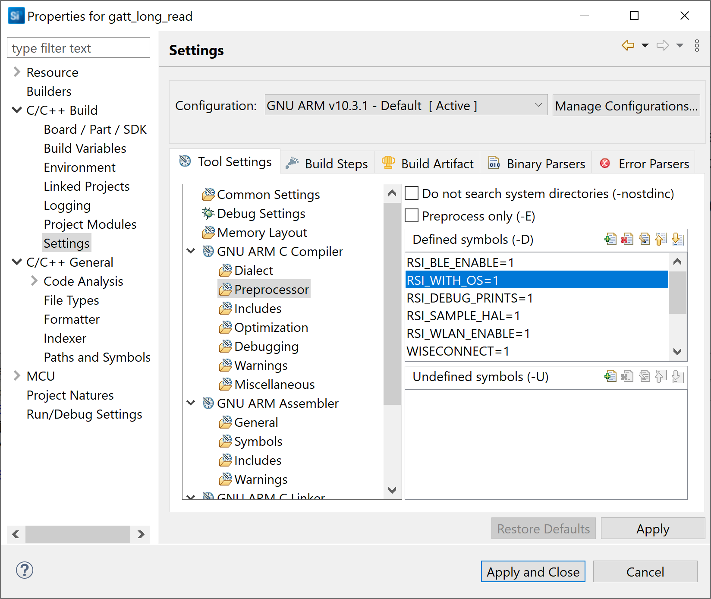
### 8.2 Bare Metal with Keil
- Open project in Keil IDE and click on 'Options for Target'
- Go to 'C/C++' tab and remove 'RSI_WITH_OS' macro present under Preprocessor Symbols
- Click on 'OK' button to save the settings
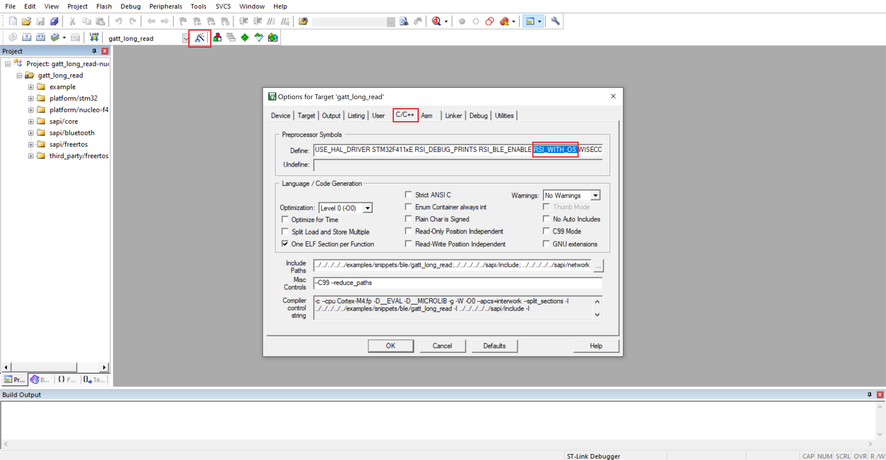