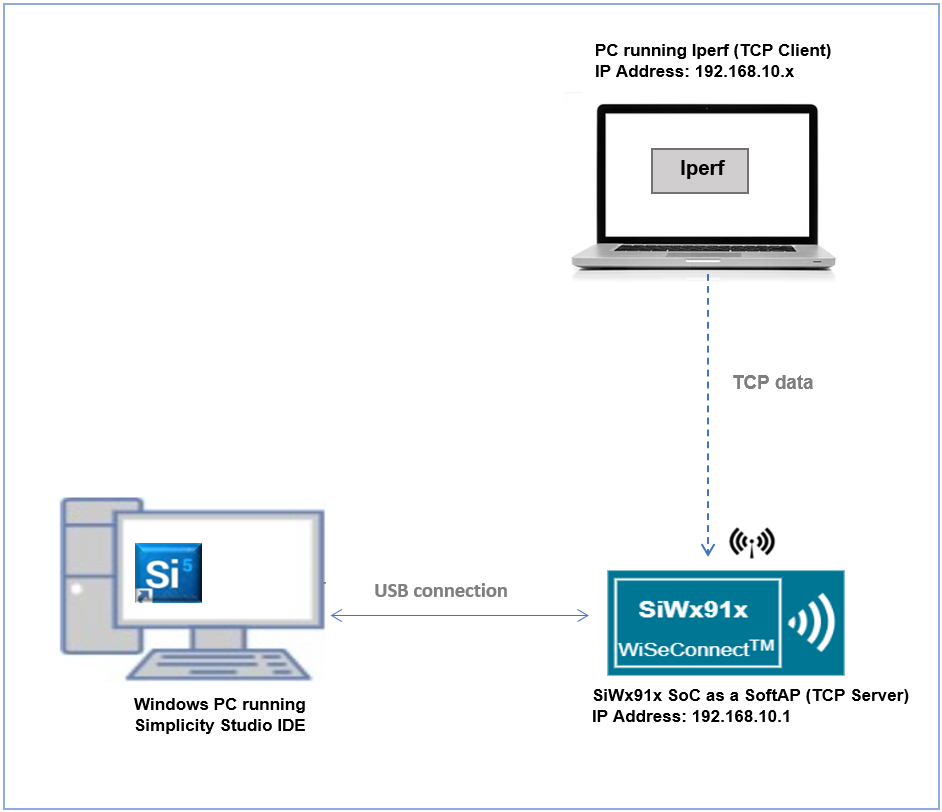
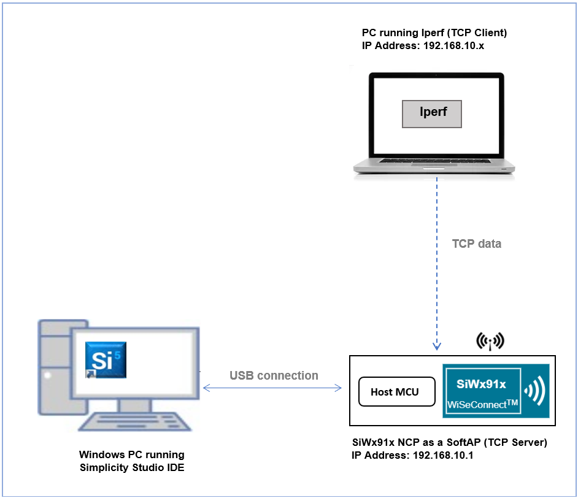
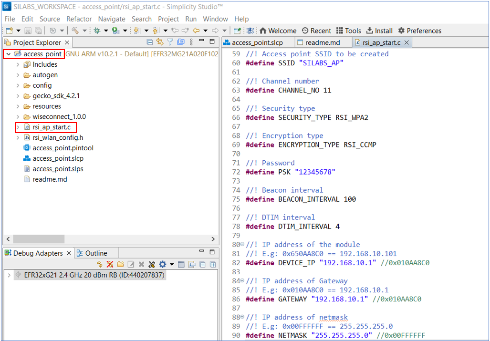
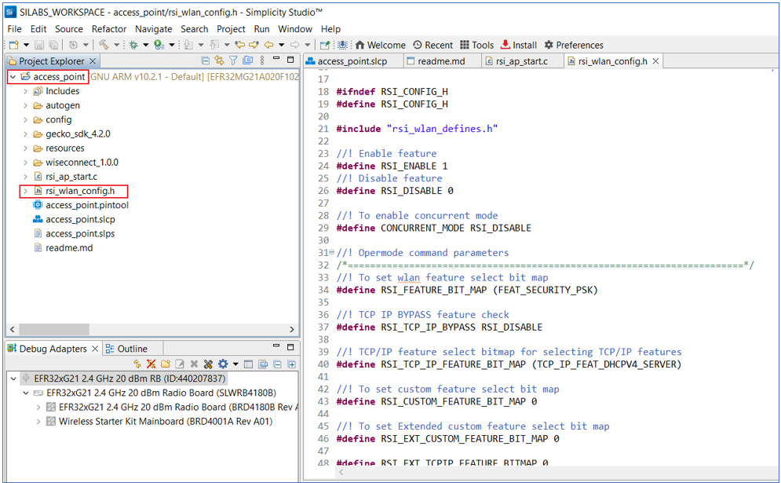
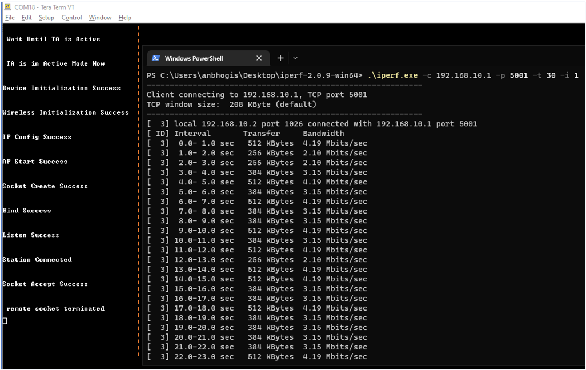
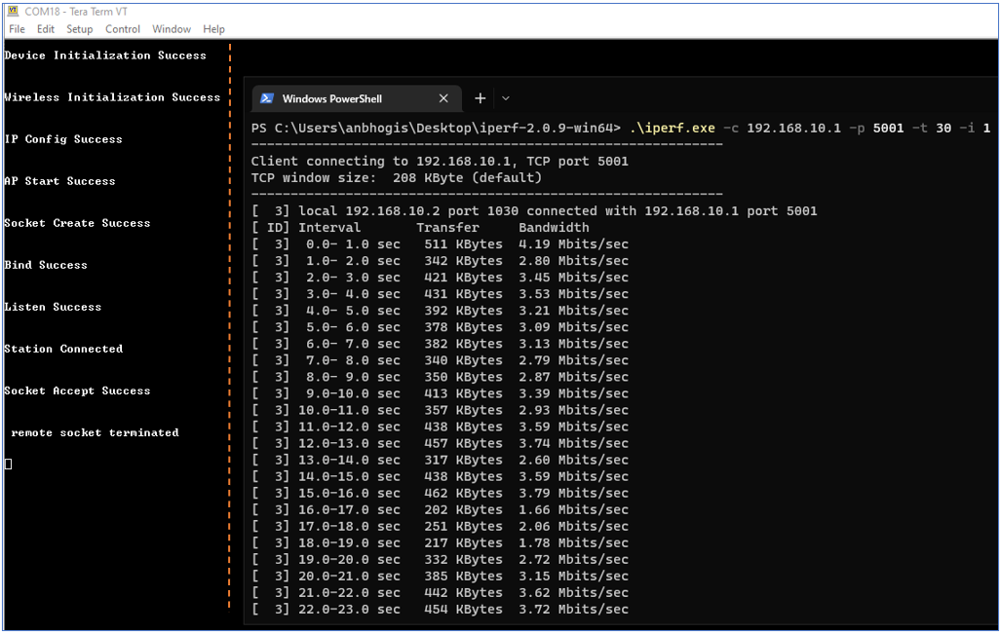

# **Access Point**

## **1 Introduction**

Software-enabled Access Point (SoftAP) allows two or more stations to communicate with each other securely without the need for physical access point routing their traffic.

This example application demonstrates how to configure the SiWx91x module as a SoftAP, connect a station to the SoftAP, and send TCP data from the connected station (TCP client) to the SiWx91x SoftAP (TCP server).

## **2 Prerequisites**

For this application, you will need the following:

### **2.1 Hardware Requirements**

- A Windows PC

#### **2.1.1 SoC** 

   - Silicon Labs SiWx917 PK6030A SoC Kit which includes
      - BRD4001A/BRD4002A Wireless Starter Kit Mainboard
      - BRD4325A Radio Board
   - USB TO UART converter or TTL cable
   
#### **2.1.2 NCP**

   - Silicon Labs BRD8036A Si917 QMS SB Expansion Board
   - [Silicon Labs SLWSTK6006A EFR32xG21 Wireless Starter Kit](https://www.silabs.com/development-tools/wireless/efr32xg21-wireless-starter-kit) which includes
      - BRD4001A/BRD4002A Wireless Starter Kit Mainboard
      - BRD4180A/BRD4180B Radio Board
               
### **2.2 Software Requirements**

- Simplicity Studio IDE
   - To download and install the Simplicity Studio IDE, refer to the [Simplicity Studio IDE Set up](https://docs.silabs.com/) section in ***Getting started with SiWx91x*** guides.

- SiWx917_WiSeConnect_SDK.x.x.x.x

- [Iperf application](https://iperf.fr/iperf-download.php) - to run TCP client

- Tera Term software or any other serial terminal software - for viewing application prints

## **3 Setup diagram**

### **3.1 SoC** 



### **3.2 NCP** 



**NOTE**: 
- The Host MCU platform (EFR32xG21) and the SiWx91x interact with each other through the SPI interface. 

## **4 Setup**

### **4.1 SoC/NCP** 

- Follow the [Hardware connections and Simplicity Studio IDE Set up](https://docs.silabs.com/) section in the respective ***Getting Started with SiWx91x*** guides to make the hardware connections and add the Gecko and SiWx91x COMBO SDKs to Simplicity Studio IDE.

### **4.2 SiWx91x module's Firmware Update**

- Ensure the SiWx91x module is loaded with the latest firmware following the [SiWx91x Firmware Update](https://docs.silabs.com/rs9116/latest/wiseconnect-getting-started) section in the respective ***Getting started with SiWx91x*** guides.

## **5 Project Creation**

- To create the Access Point example project in the Simplicity Studio IDE, follow the [Creation of Project](https://docs.silabs.com/) section in the respective ***Getting started with SiWx91x*** guides. 
   - For SoC, choose the **Wi-Fi - SoC Access Point** example.
   - For NCP, choose the **Wi-Fi - NCP Access Point** example.

## **6 Application Configuration**

Go through the following parameters and make configurations as per your requirements.

1. In the Project explorer pane of the IDE, expand the **access_point** folder and open the **rsi_ap_start.c** file. Configure the following parameters based on your requirements.

   

   - SoftAP configuration parameters

     ```c
     //! SSID refers to the name with which the SiWx91x SoftAP's Wi-Fi network shall be advertised.
     #define SSID                          "SILABS_AP"

     //! SECURITY_TYPE refers to the security mode of the SoftAP. 
     //! Supported security types are OPEN, WPA, and WPA2.
     #define SECURITY_TYPE                  RSI_WPA2      
    
     //! PSK refers to the secret key if the Access point is configured in WPA-PSK/WPA2-PSK security modes.
     #define PSK                           "12345678"      
    
     //! ENCRYPTION_TYPE refers to the encryption method of the SoftAP. 
     //! The supported encryption methods are OPEN, TKIP, and CCMP.
     #define ENCRYPTION_TYPE                RSI_CCMP  

     //! CHANNEL_NO refers to the channel in which the SoftAP is to be configured.
     #define CHANNEL_NO                       11           
    
     //! BEACON_INTERVAL refers to the time interval between two beacons transmission of the SoftAP. 
     //! Allowed values are integers from 100 to 1000 in multiples of 100.
     #define BEACON_INTERVAL                  100 

     //! DTIM_INTERVAL refers to how often the SoftAP informs its connected stations about the buffered data on it. 
     //! According to the below value, the DTIM is sent once in every 4 beacons. Allowed values are from 1 to 255.
     #define DTIM_INTERVAL                     4  

     //! GATEWAY refers to IP address of the SoftAP.
     #define DEVICE_IP                    "192.168.10.1"  
    
     //! GATEWAY refers to gateway address of the SoftAP.
     #define GATEWAY                      "192.168.10.1"  
   
     //! NETMASK refers to subnet mask of the SoftAP. 
     #define NETMASK                      "255.255.255.0" 
     ```
   - TCP Server configuration

     ```c
     //! DEVICE_PORT refers to the port number on which TCP Server is opened on SiWx91x module. 
     #define DEVICE_PORT                     5001        
    
     //! NUMBER_OF_PACKETS refers to the number of packets to be received on TCP Server socket opened on SiWx917 from the TCP client.
     #define NUMBER_OF_PACKETS               1000

     //! RECV_BUFFER_SIZE is the buffer to store the incoming data on TCP Server socket.
     #define RECV_BUFFER_SIZE                1000        
     ```
2. Open **rsi\_wlan\_config.h** file and configure the following features as per your requirements.

   

   - Opermode parameters

     ```c  
     #define RSI_FEATURE_BIT_MAP           (FEAT_SECURITY_PSK )

     #define RSI_TCP_IP_BYPASS              RSI_DISABLE

     #define RSI_TCP_IP_FEATURE_BIT_MAP    (TCP_IP_FEAT_DHCPV4_SERVER)

     #define RSI_CUSTOM_FEATURE_BIT_MAP         0
     ```
   - AP Region configurations. In this example, the region configurations are disabled by default.

     ```c 
     #define RSI_SET_REGION_AP_SUPPORT       RSI_DISABLE

     #define RSI_SET_REGION_AP_FROM_USER     RSI_DISABLE
     
     //! Supported regions are US, EU, and JP
     #define RSI_COUNTRY_CODE                  "US"        
     ```
## **7 Setup for Serial Prints**

### **7.1 SoC** 

1. The USB to UART converter/TTL cable is required for getting application prints in case of SoC. To connect USB TO UART converter/TTL cable to EFx32, refer to the [application prints set up for SoC](https://docs.silabs.com/) section in the ***Getting Started with SiWx91x SoC*** guide.

2. Once done with the connections, refer to the [Tera Term Set up](https://docs.silabs.com/) section in the ***Getting Started with SiWx91x SoC*** guide.

### **7.2 NCP**

To view the application prints, refer to the [Tera Term Set up](https://docs.silabs.com/) section in the ***Getting Started with SiWx91x NCP*** guide.
 
## **8 Build, Flash, and Run the Application**

### **8.1 SoC**

To build, flash, and run the application project refer to the [Build and Flash the Project](https://docs.silabs.com/) section in the ***Getting Started with SiWx91x SoC*** guide.

### **8.2 NCP**

Build, flash, and run the application project. Refer to the [Build and Flash the Project](https://docs.silabs.com/) section in the ***Getting Started with SiWx91x NCP*** guide.

## **9 Application Execution Flow**

1. After the application gets executed, the SiWx91x module starts advertizing its SoftAP Wi-Fi network with the specified SSID (in this example, ***SILABS_AP***), opens a TCP server socket, and listens for TCP connections on specified DEVICE_PORT (in this example, ***5001***) and DEVICE_IP (in this example, ***192.168.10.1***).
   
2. Using an external PC (you can make use of same PC on which Simplicity Studio IDE is running) scan for the SiWx91x SoftAP using a PC and connect to it. After successful connection, run Iperf application on the PC using the command prompt.

3. Connect the PC(TCP Client) to the TCP Server running on the SiWx91x module using below command:

    `iperf.exe -c <DEVICE_IP> -p <DEVICE_PORT> -t 30 -i 1`

4. Observe the application prints appear on the Tera Term Terminal and TCP communication log on iperf.

   **SoC**:
  
   

   **NCP**:

   

## **Appendix**

1. By default, the application runs over FreeRTOS. To run the application with Bare Metal configurations, follow the Bare Metal configuration section in the ***Getting Started with SiWx91x*** guides.
  