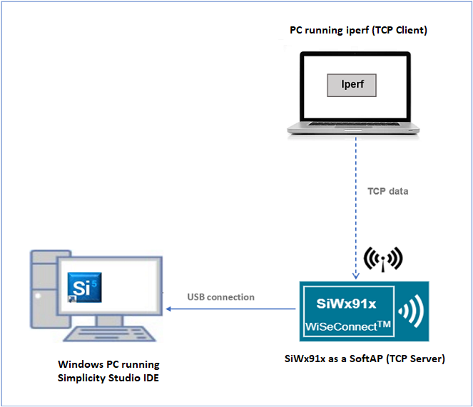
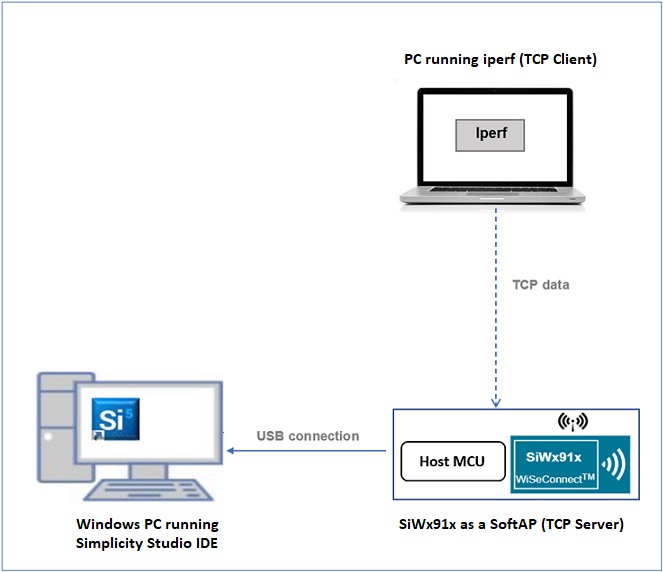
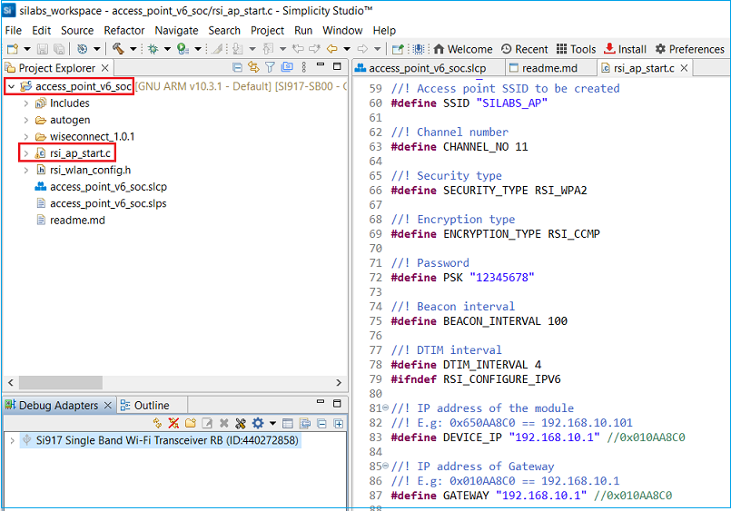
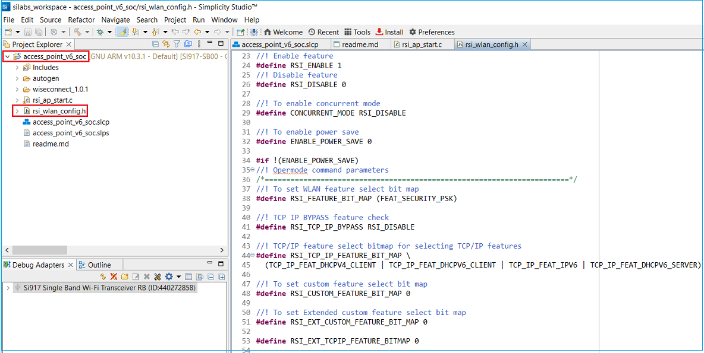
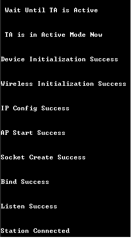
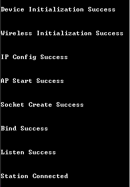

# **Access Point (IPv6)**

## **1 Introduction**
This example application demonstrates how to configure the SiWx91x as a SoftAP, connect a station to the SoftAP, and transfer TCP data from the connected station (TCP client) to the SiWx91x SoftAP (TCP server). The TCP data transfer happens over IPv6 addressing. 

## **2 Prerequisites**
For running the application, you will need the following:
### **2.1 Hardware Requirements**
- A Windows PC
#### **2.1.1 SoC** 
   - Silicon Labs SiWx917 PK6030A SoC Kit which includes
      - BRD4001A/BRD4002A Wireless Starter Kit Mainboard
      - BRD4325A Radio Board
   - USB TO UART converter or TTL cable
#### **2.1.2 NCP**
   - Silicon Labs BRD8036A Si917 QMS SB Expansion Board
   - [Silicon Labs SLWSTK6006A EFR32xG21 Wireless Starter Kit](https://www.silabs.com/development-tools/wireless/efr32xg21-wireless-starter-kit) which includes
      - BRD4001A/BRD4002A Wireless Starter Kit Mainboard
      - BRD4180A/BRD4180B Radio Board
### **2.2 Software Requirements**
- Simplicity Studio IDE
   - To download and install the Simplicity Studio IDE, refer to the [Simplicity Studio IDE Set up]() section in ***Getting started with SiWx91x*** guides.
- SiWx917_WiSeConnect_SDK.x.x.x.x
- [Iperf application](https://iperf.fr/iperf-download.php) - to run TCP client
- Tera Term software or any other serial terminal software - for viewing application prints

## **3 Set up diagram**
### **3.1 SoC** 


### **3.2 NCP** 



**NOTE**: 
- The Host MCU platform (EFR32xG21) and the SiWx91x interact with each other through the SPI interface. 

## **4 Set up**
### **4.1 SoC/NCP** 
- Follow the [Hardware connections and Simplicity Studio IDE Set up]()  section in the respective ***Getting Started with SiWx91x*** guides to make the hardware connections and add the Gecko and SiWx91x COMBO SDKs to Simplicity Studio IDE.
### **4.2 SiWx91x module's Firmware Update**
- Ensure the SiWx91x module is loaded with the latest firmware following the [SiWx91x Firmware Update]() section in the respective ***Getting started with SiWx91x*** guides.

## **5 Creation of Project**
  
To create the Access Point IPv6 example project in the Simplicity Studio IDE, follow the [Creation of Project]() section in the respective ***Getting started with SiWx91x*** guides. 
   - For SoC, choose the **Wi-Fi - SoC Wi-Fi Access Point v6** example.
   - For NCP, choose the **Wi-Fi - NCP Wi-Fi Access Point v6** example.


## **6 Application configuration**
Read through the following sections and make any changes needed. 
  
1. In the Project explorer pane of the IDE, expand the **access_point_v6** folder and open the **rsi_ap_start.c** file. Configure the following parameters based on your requirements.

   

   - **SoftAP configuration parameters**
     ```c
     //! The name with which the SiWx91x SoftAP's Wi-Fi network would be advertised
     #define SSID               "SILABS_AP"

     //! The mode of the SoftAP. Supported security types are OPEN, WPA, and WPA2.        
     #define SECURITY_TYPE      RSI_WPA2           
     
     //! The secret key if the Access point is configured in WPA-PSK/WPA2-PSK security modes
     #define PSK                "12345678"         
     
     //! The encryption method of SoftAP. Supported encryption methods are OPEN, TKIP, CCMP
     #define ENCRYPTION_TYPE    RSI_CCMP     

     //! The channel in which the SoftAP is to be configured
     #define CHANNEL_NO         11                 
     
     //! Time interval between transmission of two beacons. Allowed values are integers from 100 to 1000 in multiples of 100
     #define BEACON_INTERVAL    100               
     
     //! DTIM_INTERVAL refers to how often the SoftAP informs its connected stations about the buffered data on it. DTIM_INTERVAL = 4 implies that the DTIM is sent once in every 4 beacons. Allowed values are from 1 to 255.
     #define DTIM_INTERVAL      4
     
     //! IP address of the SoftAP
     #define DEVICE_IP6         "2001:db8:0:1::121" 
     
     //! Gateway address of the SoftAP
     #define GATEWAY6           "2001:db8:0:1::121" 
     ```
   - **TCP Server configuration**
     ```c
     //! The port number on which TCP Server is opened on SiWx91x
     #define DEVICE_PORT        5001  

     //! The number of packets to be received on TCP Server socket opened on SiWx917 from the TCP client
     #define NUMBER_OF_PACKETS  1000  
     
     //! The buffer to store the incoming data on TCP Server socket
     #define RECV_BUFFER_SIZE   1000  
     ```

2. **Enable** the **IPv6** macro
   
   > - Right click on the project and choose 'Properties'
   >
   > - Go to 'C/C++ Build' | 'Settings' | 'GNU ARM C Compiler' | 'Preprocessor' and add the macro `RSI_CONFIGURE_IPV6=1`
   >
   > - Select 'Apply' and 'OK' to save the settings

3. Open **rsi\_wlan\_config.h** file and configure the following features as per your requirements.

   

   - **Opermode parameters**

     ```c  
     #define RSI_FEATURE_BIT_MAP           (FEAT_SECURITY_PSK)
     #define RSI_TCP_IP_BYPASS             RSI_DISABLE
     #define RSI_TCP_IP_FEATURE_BIT_MAP    (TCP_IP_FEAT_DHCPV4_SERVER | TCP_IP_FEAT_IPV6 | TCP_IP_FEAT_DHCPV6_SERVER)
     #define RSI_CUSTOM_FEATURE_BIT_MAP    0
     ```
   - **Band setting parameters. The Access Point mode supports only 2.4 GHz band.**

     ```c 
     #define RSI_BAND                      RSI_BAND_2P4GHZ
     ``` 
   - **AP Region configurations. In this example application, the region configurations are disabled by default.**

     ```c 
     #define RSI_SET_REGION_AP_SUPPORT     RSI_DISABLE
     #define RSI_SET_REGION_AP_FROM_USER   RSI_DISABLE
     #define RSI_COUNTRY_CODE              "US"
     ```
   - **AP configuration command parameters. The SiWx91x SoftAP supports a maximum of 16 stations.**
     ```c
     #define RSI_AP_KEEP_ALIVE_ENABLE      RSI_ENABLE
     #define RSI_AP_KEEP_ALIVE_TYPE        RSI_NULL_BASED_KEEP_ALIVE
     #define RSI_AP_KEEP_ALIVE_PERIOD      100
     #define RSI_MAX_STATIONS_SUPPORT      4
     ```
 
## **7 Setup for Serial Prints**

To Setup the serial prints, follow the [Setup for Serial Prints]() section in the respective ***Getting started with SiWx91x*** guides.
 
## **8 Build, Flash, and Run the Application**

To build, flash, and run the application project refer to the [Build and Flash the Project]() section in the respective ***Getting Started with SiWx91x*** guide.

## **9 Application Execution Flow**

1. After the application gets executed, SiWx91x starts advertizing its SoftAP Wi-Fi network with the specified SSID (in this example, **SILABS_AP**) and listens for TCP connections on the specified DEVICE_PORT (in this example, **5001**) and DEVICE_IP6 (in this example, **2001:db8:0:1::121**).
   
2. Now scan for the SiWx91x SoftAP using a PC (you can make use of same PC on which Simplicity Studio IDE is running) and connect to it. After successful connection, run Iperf application on the PC using command prompt (Starting the TCP server).

    `iperf.exe -c <DEVICE_IP6> -V -p <DEVICE_PORT> -t 30 -i 1 `

4. If SOCKET_ASYNC_FEATURE is disabled, the SiWx91x accepts connection request and receives data on the TCP server port and exits after receiving configured NUMBER_OF_PACKETS (in this example, **1000**). Else, the application keeps polling for data asynchronously from the connected client.
  
5. Application prints can be observed as follows:

      **SoC**

      

      **NCP**

      


## **Appendix**

By default, the application runs over FreeRTOS. To run the application with Bare metal configuration, follow the Bare Metal configuration section in the ***Getting Started with SiWx91x*** guides.
